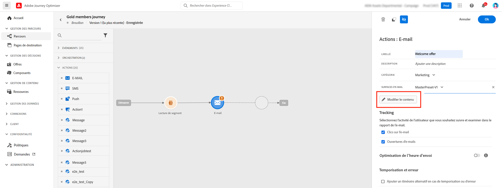
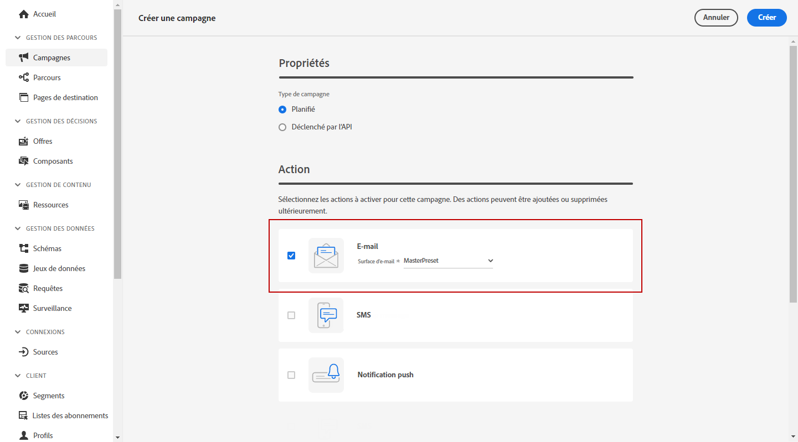

# Création d&#39;un e-mail {#configure-email}

>[!CONTEXTUALHELP]
>id="ajo_message_email"
>title="Création d&#39;un e-mail"
>abstract="Définissez vos paramètres d&#39;e-mail en trois étapes simples."

Les e-mails peuvent être créés :

* Dans un **parcours** : une fois que vous avez ajouté une activité d’e-mail dans votre parcours, et défini les paramètres de base, utilisez le panneau de droite **[!UICONTROL Actions : e-mail]** pour créer le contenu des notifications push.

   Pour plus d’informations sur la configuration de votre parcours, consultez cette [page](../building-journeys/journey-gs.md).

   

* Dans une **campagne** : une fois une campagne créée, sélectionnez E-mail comme action et définissez les paramètres de base.

   Pour plus d’informations sur la configuration de vos campagnes, consultez cette [page](../campaigns/create-campaign.md#configure).

   

## Définition du contenu de l’e-mail{#email-content}

Utilisez le Concepteur d’e-mail [!DNL Journey Optimizer] pour [concevoir votre e-mail à partir de zéro](../design/create-email-content.md). Si vous disposez d’un contenu existant, vous pouvez [l’importer dans le Concepteur d’e-mail](../design/existing-content.md), ou [coder votre propre contenu](../design/code-content.md) dans [!DNL Journey Optimizer].

[!DNL Journey Optimizer] est fourni avec un ensemble de [modèles intégrés](../design/email-templates.md) pour vous aider à commencer. Tout e-mail peut également être enregistré comme modèle.

Utilisez l’Éditeur d’expression [!DNL Journey Optimizer] pour personnaliser vos messages avec les données des profils. Pour plus d&#39;informations sur la personnalisation, consultez [cette section](../personalization/personalize.md).

Adaptez le contenu de vos messages aux profils ciblés en utilisant [!DNL Journey Optimizer] fonctionnalités de contenu dynamique. [Prise en main du contenu dynamique](../personalization/get-started-dynamic-content.md)

## Tracking d’e-mail{#email-tracking}

Si vous souhaitez suivre le comportement de vos destinataires par le biais des ouvertures et/ou des clics sur les liens, activez les options suivantes : **[!UICONTROL Ouvertures d’e-mails]** et **[!UICONTROL Clic sur l’e-mail]**.

En savoir plus sur le tracking dans [cette section](../design/message-tracking.md).

## Validation du contenu de l’e-mail{#email-content-validate}

Contrôlez le rendu de vos e-mails et vérifiez les paramètres de personnalisation avec les profils de test, à l’aide de la section de prévisualisation sur le côté gauche. Voir à ce propos [cette section](../design/preview.md).

Vous devez également vérifier les alertes dans la section supérieure de l’éditeur.  Certaines d’entre elles sont de simples avertissements, mais d’autres peuvent vous empêcher d’utiliser le message. En savoir plus dans [cette section](alerts.md).

>[!NOTE]
>
>L’**[!UICONTROL e-mail de l’expéditeur]** et le **[!UICONTROL nom de l’expéditeur]** sont déterminés par la **[!UICONTROL surface]** qui a été sélectionnée lors de la [création du message](get-started-content.md).

