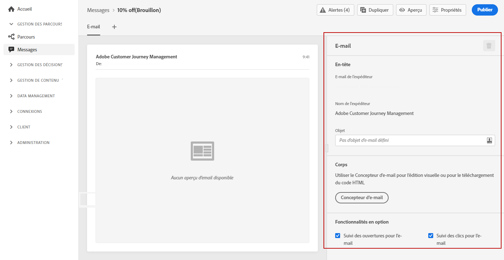

# Création d&#39;un e-mail {#configure-email}

>[!CONTEXTUALHELP]
>id="ajo_message_email"
>title="Création d&#39;un e-mail"
>abstract="Définissez vos paramètres d&#39;e-mail en trois étapes simples."

Une fois que vous avez [créé un message](get-started-content.md), utilisez l&#39;onglet **[!UICONTROL E-mail]** pour définir les paramètres et le contenu du canal e-mail.

>[!NOTE]
>
>L&#39;**[!UICONTROL email de l&#39;expéditeur]** et le **[!UICONTROL nom de l&#39;expéditeur]** sont en lecture seule et déterminés par le **[!UICONTROL préréglage]** qui a été sélectionné lors de la [création du message](get-started-content.md).

Les étapes pour configurer un email sont les suivantes :

1. Indiquez l’objet de l’e-mail dans le champ **[!UICONTROL Ligne d’objet]**. Pour ce faire, cliquez sur le bouton à droite pour ouvrir l&#39;éditeur d&#39;expression et composer l&#39;objet de l&#39;email. Découvrez comment ajouter la personnalisation dans [cette section](../personalization/personalize.md)

1. Cliquez sur le bouton **[!UICONTROL Concepteur d&#39;email]** pour concevoir votre email. Découvrez comment concevoir des e-mails dans [cette section](../design/design-emails.md).

1. Si vous souhaitez suivre le comportement de vos destinataires par le biais d&#39;ouvertures et/ou de clics sur des liens, assurez-vous que les options **[!UICONTROL Suivi des ouvertures des emails]** et **[!UICONTROL Suivi des clics des emails]** sont activées. En savoir plus sur les suivi dans [cette section](../design/message-tracking.md).

>[!NOTE]
>
>Les messages électroniques de type marketing doivent inclure une [lien d’exclusion](consent.md#opt-out-management), qui n’est pas nécessaire pour les messages transactionnels. La catégorie du message (**[!UICONTROL Marketing]** ou **[!UICONTROL Transactionnel]**) est définie au [niveau du préréglage de message](../configuration/message-presets.md#email-type) et lors de la [création du message](get-started-content.md#create-new-message).
