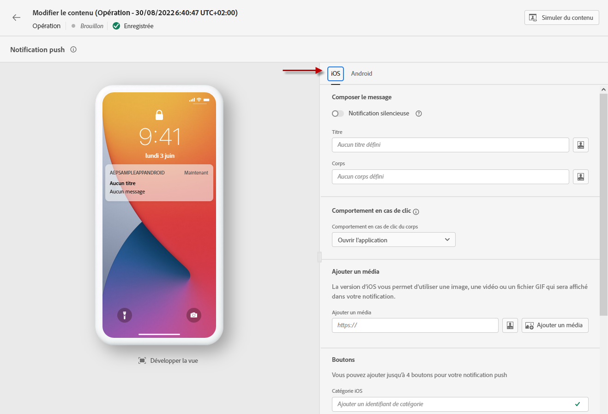
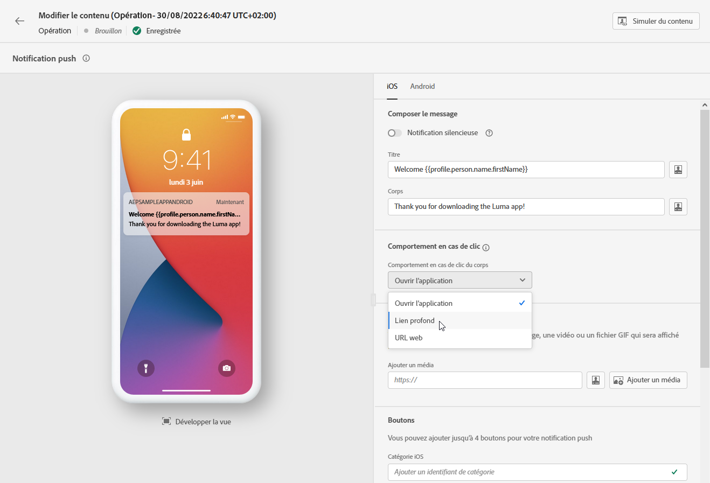
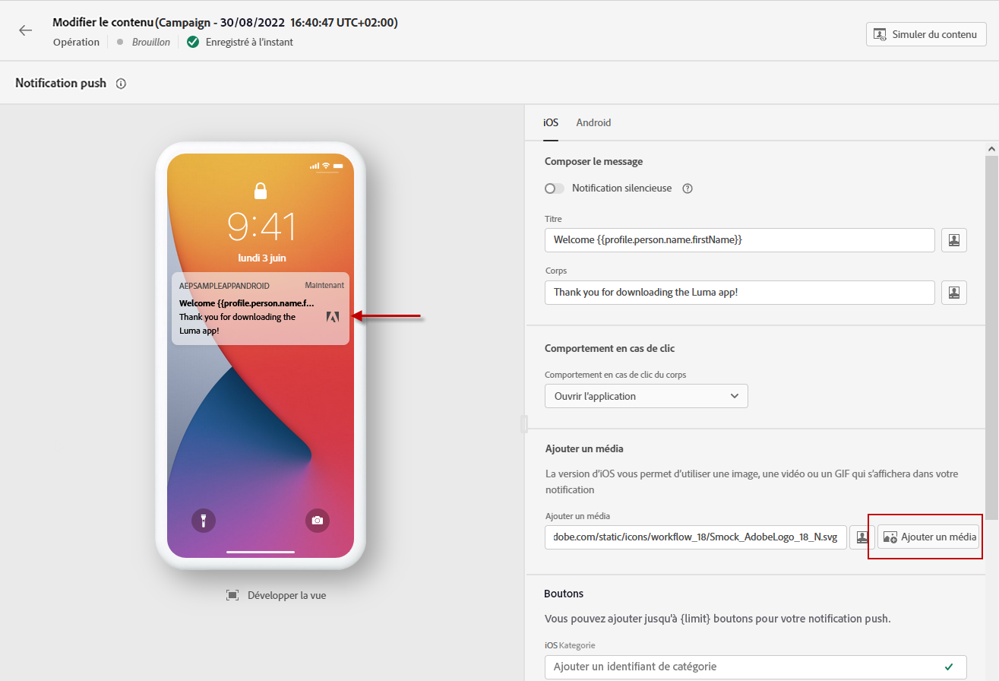
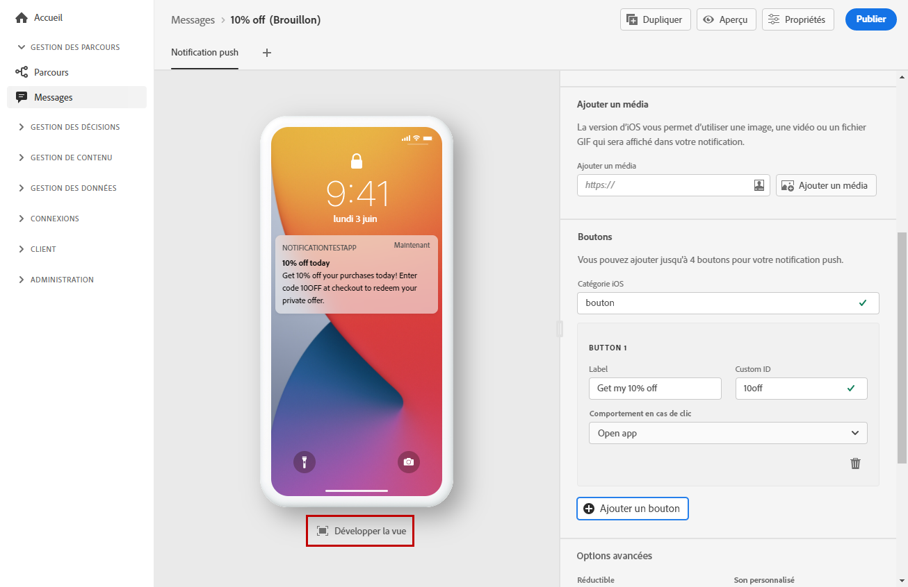
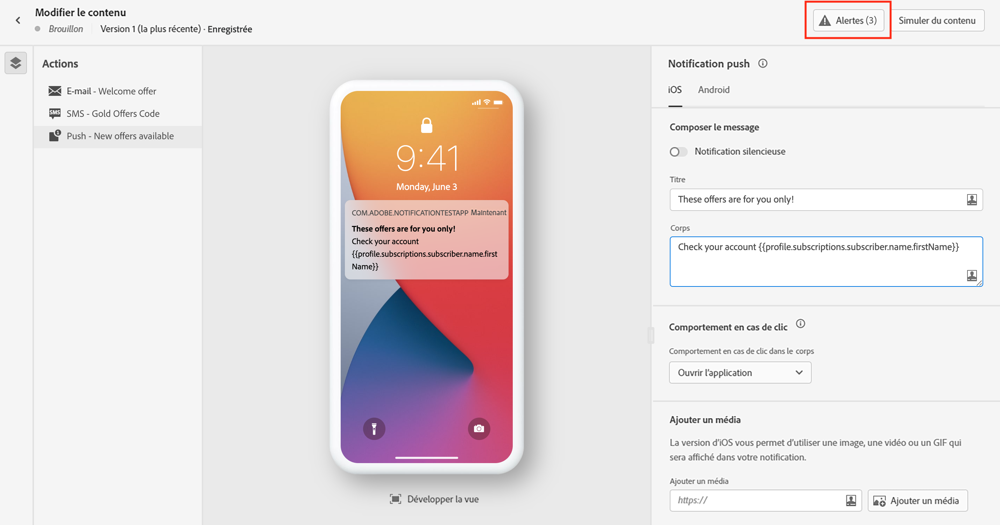

# Créer une notification push {#create-push-notification}

>[!CONTEXTUALHELP]
>id="ajo_message_push"
>title="Créer un message push"
>abstract="Ajoutez votre message push et commencez à le personnaliser à l’aide de l’éditeur d’expression."

Les notifications push vous permettent d&#39;atteindre les utilisateurs de votre application mobile à tout moment, en particulier lorsqu&#39;ils ne l&#39;utilisent pas activement. Elles peuvent vous aider à réaliser divers cas d&#39;utilisation, tels que fournir des mises à jour sur votre service, demander à un utilisateur de prendre des mesures, avertir l&#39;utilisateur d&#39;une nouvelle transaction, etc. Les plateformes d&#39;appareil nécessitent un accord préalable avant que les utilisateurs finaux puissent recevoir ou afficher vos notifications. Lʼaccord préalable de lʼutilisateur peut être reçu dès le lancement de lʼapplication pour la première fois après lʼinstallation, ou au cours dʼune session ou dʼun processus ultérieur, selon le cas.

[!DNL Journey Optimizer] prend en charge les notifications push et vous permet d&#39;envoyer des notifications extrêmement pertinentes à des taux de débit de pointe. Les notifications push peuvent inclure une personnalisation et un contexte basé sur les parcours afin d&#39;exploiter les données de votre marque avec Adobe Experience Cloud.

Les notifications push peuvent être créées :

* Dans un **parcours** : une fois que vous avez ajouté une activité push à votre parcours et défini des paramètres de base, utilisez le volet de droite **[!UICONTROL Actions : Push]** pour créer le contenu des notifications push.

   Pour plus d’informations sur la configuration de votre parcours, consultez cette [page](../building-journeys/journey-gs.md).

* Dans une **campagne** : une fois une campagne créée, sélectionnez Notification push comme action et définissez les paramètres de base.

   Pour plus d’informations sur la configuration de votre campagne, consultez cette [page](../campaigns/create-campaign.md#configure).

Utilisez les onglets dédiés pour définir les paramètres de notification push pour les systèmes d&#39;exploitation **iOS** et **Android**.

Si c’est la première fois que vous créez une notification push, vérifiez que le canal push a été configuré. [En savoir plus](../configuration/push-gs.md).

>[!NOTE]
>
>La section **[!UICONTROL Composer le message]** est commune aux onglets **[!UICONTROL iOS]** et **[!UICONTROL Android]**. Toute modification apportée à cette section sʼappliquera aux deux paramètres.

## Titre et contenu {#push-title-body}

Pour composer votre message, cliquez sur les champs **[!UICONTROL Titre]** et **[!UICONTROL Corps]**. Utilisez l’éditeur d’expression pour définir le contenu, personnaliser les données et ajouter du contenu dynamique. En savoir plus sur la [personnalisation](../personalization/personalize.md) et le [contenu dynamique](../personalization/get-started-dynamic-content.md) dans l’éditeur d’expression.

Utilisez la section de prévisualisation des appareils pour visualiser la façon dont s’affiche la notification push sur les appareils iOS et Android.

## Comportement en cas de clic {#on-click-behavior}

>[!CONTEXTUALHELP]
>id="ajo-message-push-onclick"
>title="À propos du comportement en cas de clic"
>abstract="Sélectionnez le comportement lorsquʼun destinataire clique sur le contenu de la notification push."

Sélectionnez le comportement lorsquʼun utilisateur clique sur le contenu de la notification push.

* Pour ouvrir l’application, sélectionnez l’option **[!UICONTROL Ouvrir l’application]**. Lʼapplication associée à la notification est définie dans la [surface de canal](../configuration/channel-surfaces.md) (c’est-à-dire le préréglage de message).
* Pour rediriger l’utilisateur vers un élément de contenu spécifique dans une application, sélectionnez l’option **[!UICONTROL Lien profond]** .  Le contenu spécifique peut être un affichage spécifique, une section spécifique d’une page ou un certain onglet. Une fois lʼoption sélectionnée, saisissez le lien profond dans le champ correspondant.
* Pour rediriger l’utilisateur vers une URL externe, utilisez l’option **[!UICONTROL URL Web]**. Une fois lʼoption sélectionnée, saisissez lʼURL dans le champ correspondant.

## Ajouter un média {#add-media-push}

Dans la version iOS de votre notification push, vous pouvez ajouter une image, une vidéo ou un fichier GIF qui s&#39;affichera dans votre notification.

Dans la version Android, vous pouvez uniquement ajouter une icône d&#39;image et une image pour les notifications étendues.

Deux options sont disponibles. Vous pouvez :

* Cliquez sur le bouton **[!UICONTROL Ajouter un média]** pour sélectionner une ressource dans **[!DNL Adobe Experience Manager Assets Essentials]**.

   Découvrez comment utiliser **[!DNL Adobe Experience Manager Assets Essentials]** dans [cette page](../design/assets-essentials.md).

* Vous pouvez également saisir lʼURL du média en cliquant sur le champ **[!UICONTROL Ajouter un média]**. Dans ce cas, vous pouvez ajouter une personnalisation à l’URL.

Une fois ajouté, le média s&#39;affiche à droite du corps de la notification.

## Ajouter des boutons {#add-buttons-push}

Créez une notification exploitable en ajoutant des boutons à votre contenu push.

Si l&#39;écran de l&#39;appareil est verrouillé, les boutons suivants ne s&#39;affichent pas : seuls le **Titre** et le **Message** de la notification sont visibles. Si leur appareil est déverrouillé, les destinataires verront les boutons.

Dans la version iOS, vous pouvez ajouter jusquʼà quatre boutons. Dans la version Android, vous pouvez ajouter jusquʼà trois boutons.

>[!NOTE]
>
>Pour iOS, utilisez le champ **[!UICONTROL catégorie iOS]** pour associer les actions à une catégorie de notification.

1. Cliquez sur **[!UICONTROL Ajouter un bouton]** pour définir les paramètres : le libellé et lʼaction correspondante. Les actions possibles sont les mêmes que pour le [comportement en cas de clic](#on-click-behavior).

1. Utilisez l’icone **[!UICONTROL Expansion de l’affichage]** sous l’image d’aperçu centrale pour prévisualiser vos boutons personnalisés.

## Envoyer une notification silencieuse {#silent-notification}

>[!CONTEXTUALHELP]
>id="ajo_message_push_silent_notification"
>title="À propos des notifications silencieuses"
>abstract="Envoyez des notifications sans déranger l’utilisateur. Les notifications ne sont pas affichées dans le centre de notifications ni dans la barre de notifications."

Une notification push silencieuse (ou notification en arrière-plan) est une instruction masquée qui est transmise à l’application. Elle est par exemple utilisée pour informer votre application de la disponibilité d&#39;un nouveau contenu ou pour lancer un téléchargement en arrière-plan.

Sélectionnez l&#39;option **[!UICONTROL Notification silencieuse]** pour avertir l&#39;application en silence : dans ce cas, la notification est transférée directement à l&#39;application. Aucune alerte ne s&#39;affiche sur l&#39;écran de l&#39;appareil.

Utilisez la section **[!UICONTROL Données personnalisées]** pour ajouter des paires clé-valeur.

## Données personnalisées

Dans la section **[!UICONTROL Données personnalisées]**, vous pouvez ajouter des variables personnalisées à la payload, en fonction de la configuration de votre application mobile. Pour plus d&#39;informations sur la configuration des notifications push dans Adobe Experience Platform et Adobe Launch, voir [cette section](../configuration/push-gs.md).

## Options avancées {#advanced-options-push}

Vous pouvez configurer les **[!UICONTROL options avancées]** pour votre notification push. Les paramètres disponibles sont répertoriés ci-dessous :

| Paramètre | Description |
|---------|---------|
| **[!UICONTROL Réductible]** (iOS/Android) | Un message réductible est un message qui peut être remplacé par un nouveau message s&#39;il est obsolète. Les messages utilisés pour indiquer à une application mobile de synchroniser les données du serveur constituent des cas d&#39;utilisation courants de messages réductibles. Par exemple, une application sportive qui informe les utilisateurs du dernier score. Seul le message le plus récent est pertinent. D&#39;un autre côté, avec des messages non réductibles, chaque message est important pour l&#39;application cliente et doit être diffusé. |
| **[!UICONTROL Son personnalisé]**  (iOS / Android) | Son à émettre par le terminal mobile lors de la réception de la notification. Le son doit être assemblé dans l&#39;application. |
| **[!UICONTROL Badges]**  (iOS / Android) | Un badge est utilisé pour afficher directement sur l&#39;icône de l&#39;application le nombre de nouvelles informations non lues.  La valeur du badge disparaît dès que l&#39;utilisateur ouvre ou lit le nouveau contenu de l&#39;application. Lorsqu&#39;une notification est reçue sur un appareil, elle peut actualiser ou ajouter une valeur de badge pour l&#39;application associée. Par exemple, si vous stockez le nombre d&#39;articles non lus de vos clients, vous pouvez tirer parti de la personnalisation pour envoyer la valeur unique de badge d&#39;articles non lus pour chaque client. Pour plus d&#39;informations sur la personnalisation, consultez [cette section](../personalization/personalize.md). |
| **[!UICONTROL Groupe de notifications]** (iOS uniquement) | Associez un groupe de notification à la notification push. À partir d&#39;iOS 12, les groupes de notifications vous permettent de consolider les threads de message et les rubriques de notification en identifiants de threads. Par exemple, une marque peut envoyer des notifications marketing sous un identifiant de groupe, tout en conservant d&#39;autres notifications de type opérationnel sous un ou plusieurs identifiants différents. Pour illustrer cela, vous pouvez avoir les groupes de notification groupID : 123 « Consultez la nouvelle collection printanière de pulls » et groupID : 456 « Votre colis a été livré ». Dans cet exemple, toutes les notifications de diffusion sont regroupées sous l&#39;identifiant de groupe : 456. |
| **[!UICONTROL Canal de notification]**  (Android uniquement) | Associez un canal de notification à la notification push. À partir d&#39;Android 8.0 (niveau API 26), toutes les notifications doivent être affectées à un canal pour s&#39;afficher. Consultez à ce sujet la [documentation pour développeur Android](https://developer.android.com/guide/topics/ui/notifiers/notifications#ManageChannels). |
| **[!UICONTROL Ajouter un indicateur de disponibilité de contenu]**  (iOS uniquement) | Envoie l&#39;indicateur de disponibilité de contenu dans la payload push pour veiller à ce que l&#39;application sorte de veille à la réception de la notification push et puisse accéder ainsi aux données de la payload.  Ce mécanisme fonctionne même si l&#39;application est en cours d&#39;exécution à l&#39;arrière-plan et qu&#39;elle ne nécessite pas l&#39;intervention de l&#39;utilisateur (comme appuyer sur la notification push, par exemple). Toutefois, il ne s&#39;applique pas si l&#39;application n&#39;est pas en cours d&#39;exécution. Consultez à ce sujet la [documentation pour développeur Apple](https://developer.apple.com/library/content/documentation/NetworkingInternet/Conceptual/RemoteNotificationsPG/CreatingtheNotificationPayload.html). |
| **[!UICONTROL Ajouter un indicateur de contenu modifiable]**  (iOS uniquement) | Envoie l&#39;indicateur de contenu modifiable dans la payload push et permet de modifier le contenu de la notification push en utilisant l&#39;extension d&#39;application du service de notification fournie dans le SDK iOS. Consultez à ce sujet la [documentation pour développeur Apple](https://developer.apple.com/library/content/documentation/NetworkingInternet/Conceptual/RemoteNotificationsPG/ModifyingNotifications.html). Vous pouvez ensuite exploiter vos extensions d&#39;applications mobiles pour modifier davantage le contenu ou la présentation des notifications push envoyées depuis [!DNL Journey Optimizer]. Par exemple, les utilisateurs peuvent utiliser cette option pour déchiffrer des données, modifier le corps ou le titre d&#39;une notification, ajouter un identifiant de thread à une notification, etc. |
| **[!UICONTROL Visibilité de la notification]**  (Android uniquement) | Définit la visibilité de la notification push.  <b>Private</b> affichera la notification sur tous les écrans verrouillés, mais dissimulera les informations sensibles ou privées sur les écrans verrouillés sécurisés.  <b>public</b> affichera la notification dans son intégralité sur tous les écrans verrouillés.  <b>secret</b> ne divulguera aucune partie de la notification sur un écran verrouillé sécurisé.  Consultez à ce sujet la [documentation pour développeur Android](https://developer.android.com/reference/android/app/Notification). |
| **[!UICONTROL Priorité des notifications]** (Android uniquement) | Définit l&#39;importance de la notification push de Faible à Max. Cette opération détermine l&#39;intrusion de la notification push lors de sa diffusion. Consultez à ce sujet la [documentation pour développeur Android](https://developer.android.com/guide/topics/ui/notifiers/notifications#importance) |
| **[!UICONTROL Priorité de diffusion]**  (Android uniquement) | Définit une priorité élevée ou normale pour vos notifications push. Pour plus d&#39;informations sur la priorité des messages, consultez la [documentation destinée aux développeurs Google](https://firebase.google.com/docs/cloud-messaging/concept-options#setting-the-priority-of-a-message). |

## Validation de la notification push{#push-preview}

Une fois le contenu de votre message défini, vous pouvez utiliser des profils de test pour le prévisualiser et le tester. Si vous avez inséré du [contenu personnalisé](../personalization/personalize.md), vous pourrez vérifier comment ce contenu s’affiche dans le message en exploitant les données du profil de test.

Pour visualiser l’affichage de votre notification push sur les appareils mobiles, cliquez sur le bouton **[!UICONTROL Simuler du contenu]**. En savoir plus sur la simulation de contenu dans [cette section](../design/preview.md).

Vous devez également vérifier les alertes dans la section supérieure de l’éditeur.  Certaines d’entre elles sont de simples avertissements, mais d’autres peuvent vous empêcher d’utiliser le message. En savoir plus dans [cette section](alerts.md).

**Rubriques connexes**

<!--
* [Understand push notification flow](push-gs.md)
-->

* [Configuration du canal push](../configuration/push-gs.md)
* [Création d&#39;un nouveau message](get-started-content.md)
* [Ajout d&#39;un message dans un parcours](../building-journeys/journeys-message.md)
