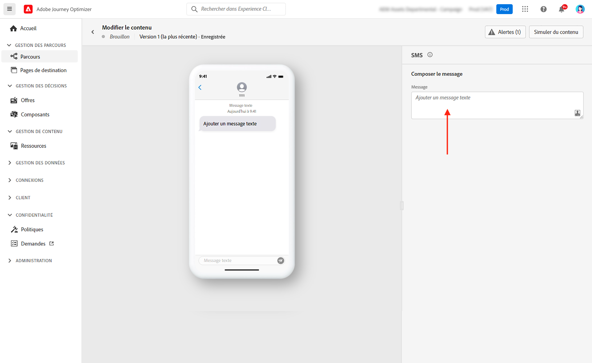
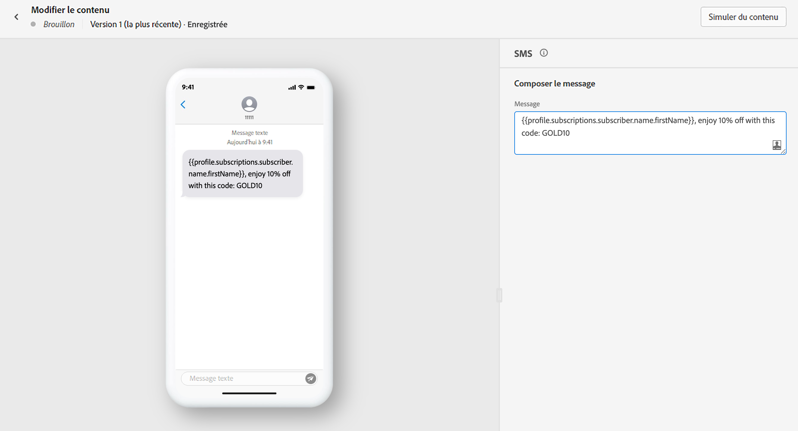
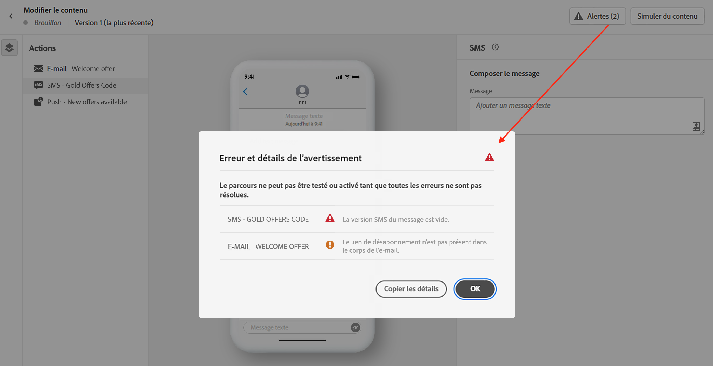

# Création dʼun SMS {#create-sms}

>[!CONTEXTUALHELP]
>id="ajo_message_sms"
>title="Création d&#39;un SMS"
>abstract="Ajoutez votre message texte et commencez à le personnaliser à l’aide de l’éditeur d’expression."

Utilisez [!DNL Journey Optimizer] pour envoyer des messages texte à vos clients sur leur appareil mobile. Vous pouvez créer, personnaliser et prévisualiser des messages au format texte à partir de l’éditeur de SMS.

>[!NOTE]
>
>Conformément aux normes et réglementations du secteur, tous les messages SMS de marketing doivent contenir un moyen permettant aux destinataires de se désabonner facilement. Pour ce faire, les destinataires de SMS peuvent répondre avec des mots-clés d’accord préalable et de droit d’opposition. [Découvrir comment gérer un droit d’opposition](../privacy/opt-out.md#sms-opt-out-management-sms-opt-out-management)

Les diffusions SMS peuvent être créées :

* Dans un **parcours** : une fois que vous avez ajouté une activité de SMS dans votre parcours et défini les paramètres de base, utilisez le volet de droite **[!UICONTROL Actions : SMS]** pour créer le contenu du message SMS.

   Pour plus d’informations sur la configuration de votre parcours, consultez cette [page](../building-journeys/journey-gs.md).

* Dans une **campagne** : une fois une campagne créée, sélectionnez SMS comme action et définissez les paramètres de base.

   Pour plus d’informations sur la configuration de votre campagne, consultez cette [page](../campaigns/create-campaign.md#configure).

Si c’est la première fois que vous créez un message SMS, vérifiez que le canal SMS a été configuré. [En savoir plus](../configuration/sms-configuration.md).

## Définir le contenu de votre SMS{#sms-content}

Pour personnaliser votre message SMS, procédez comme suit :

1. Cliquez sur le champ **[!UICONTROL Message]** pour ouvrir l’éditeur d&#39;expression.

   

1. Utilisez l’éditeur d’expression pour définir le contenu et ajouter du contenu dynamique. Vous pouvez utiliser n’importe quel attribut, comme le nom du profil ou la ville. En savoir plus sur la [personnalisation](../personalization/personalize.md) et le [contenu dynamique](../personalization/get-started-dynamic-content.md) dans l’éditeur d’expression.

1. Cliquez sur **[!UICONTROL Enregistrer]** et vérifiez votre message dans l&#39;aperçu.

   

## Valider votre SMS{#sms-preview}

>[!NOTE]
>
> Pour une meilleure délivrabilité, vous devez toujours utiliser les numéros de téléphone dans les formats pris en charge par le fournisseur. Par exemple, Twilio et Sinch ne prennent en charge que les numéros de téléphone au format E.164.

Une fois le contenu de votre message défini, vous pouvez utiliser des profils de test pour le prévisualiser et le tester. Si vous avez inséré [contenu personnalisé](../personalization/personalize.md), vous pouvez vérifier l’affichage de ce contenu dans le message à l’aide des données de profil de test.

Pour visualiser l’affichage de votre message SMS sur les appareils mobiles, cliquez sur le bouton **[!UICONTROL Simuler du contenu]**. En savoir plus sur la simulation de contenu dans [cette section](../design/preview.md).

Vous devez également vérifier les alertes dans la section supérieure de l’éditeur.  Certaines d’entre elles sont de simples avertissements, mais d’autres peuvent vous empêcher d’utiliser le message. En savoir plus dans [cette section](alerts.md).

<!--
## How-to video

Learn how to configure, author, and include SMS messaging into your customer journeys.

>[!VIDEO](https://video.tv.adobe.com/v/344460?quality=12)
-->
**Rubriques connexes**

* [Configurer le canal SMS](../configuration/sms-configuration.md)
* [Rapport SMS](../reports/journey-global-report.md#sms-global)
* [Création d&#39;un nouveau message](get-started-content.md)
* [Ajout d&#39;un message dans un parcours](../building-journeys/journeys-message.md)
