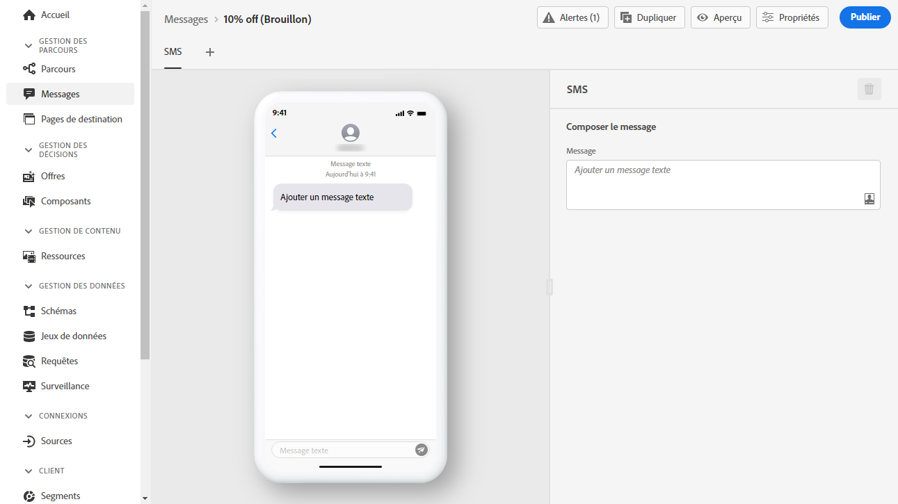
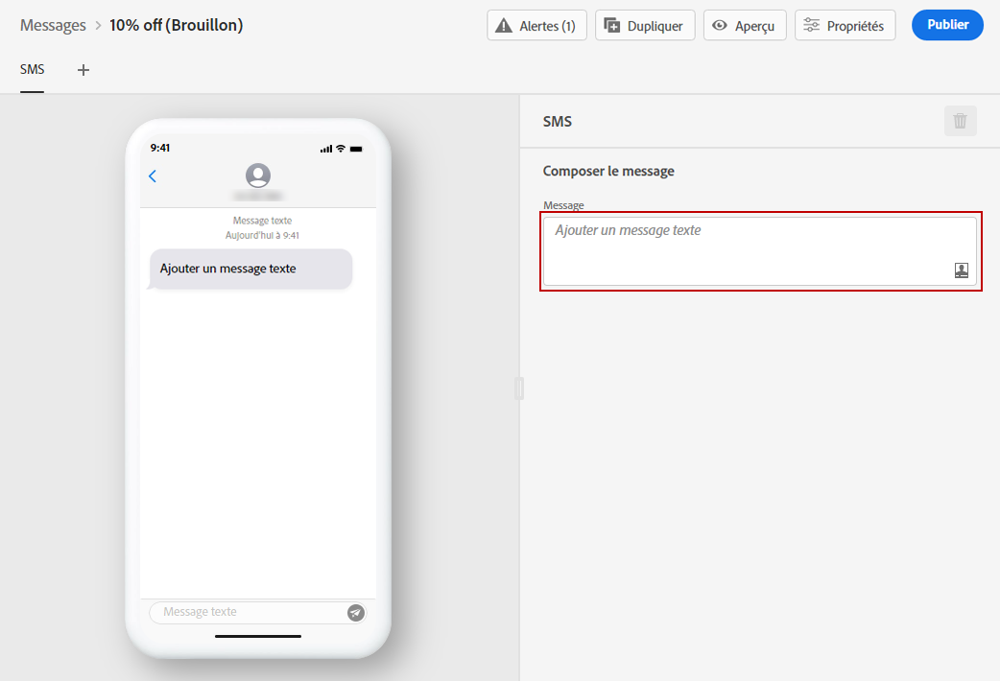
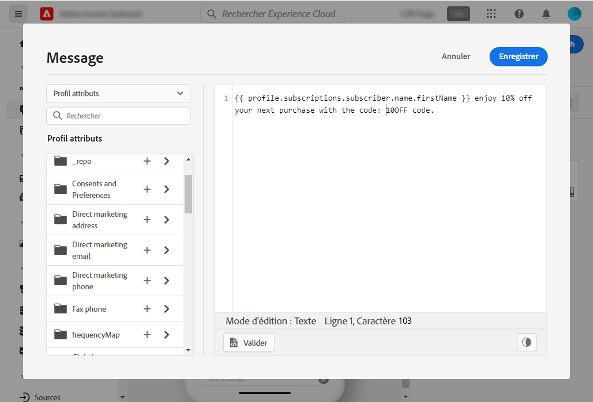

# Création dʼun SMS {#create-sms}

>[!CONTEXTUALHELP]
>id="ajo_message_sms"
>title="Création d&#39;un SMS"
>abstract="Ajoutez votre message texte et commencez à le personnaliser à l&#39;aide de l&#39;éditeur d&#39;expression."

>[!AVAILABILITY]
>
>Le canal SMS est actuellement disponible uniquement pour un ensemble d’organisations (disponibilité limitée). Pour plus d’informations, contactez votre représentant Adobe.

Une fois que vous avez [créé un message](get-started-content.md), utilisez lʼonglet **[!UICONTROL SMS]** pour définir les paramètres et le contenu du canal SMS.

Pour personnaliser votre message SMS, procédez comme suit :

1. Cliquez sur le champ **[!UICONTROL Ajouter un message texte]** pour afficher lʼéditeur dʼexpression.

   

1. Utilisez l&#39;éditeur d&#39;expression pour définir le contenu et les données de personnalisation. Consultez [cette section](../personalization/personalize.md) pour en savoir plus sur la personnalisation dans l&#39;éditeur d&#39;expression.

   >[!NOTE]
   >
   > Le nombre de caractères des SMS est limité à 160.

   

1. Cliquez sur **[!UICONTROL Enregistrer]** lorsque votre message personnalisé est prêt.

1. Cliquez sur **[!UICONTROL Prévisualiser]** pour voir comment votre message SMS sera affiché sur les appareils mobiles. Voir à ce propos [cette section](../design/preview.md).

1. Une fois que votre message est prêt, vous pouvez le publier afin de permettre son exécution à lʼaide du bouton **[!UICONTROL Publier]**. Cette action publiera la nouvelle version du message qui sera utilisée pour les prochaines exécutions dans vos parcours.

Votre message SMS peut maintenant être utilisé dans un parcours. [Découvrez comment créer des parcours](../building-journeys/journey-gs.md).

## Inclusion et exclusion{#sms-opt-in-out}

Les destinataires des SMS peuvent répondre avec des mots-clés d&#39;opt-in et d&#39;opt-out. Conformément aux normes et réglementations du secteur, Adobe Journey Optimizer traite automatiquement les mots-clés suivants dans les messages entrants : DÉMARRER, ARRÊTER et DÉMARRER. Ces mots-clés déclenchent des réponses standard automatiques de la part du fournisseur SMS.

**Rubriques connexes**

* [Configuration du canal SMS](../configuration/sms-configuration.md)
* [Rapport SMS](../reports/journey-global-report.md#sms-global)
* [Création d&#39;un nouveau message](get-started-content.md)
* [Ajout d&#39;un message dans un parcours](../building-journeys/journeys-message.md)
