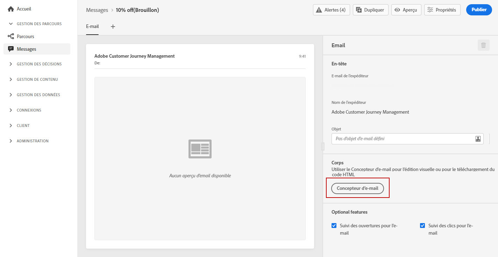
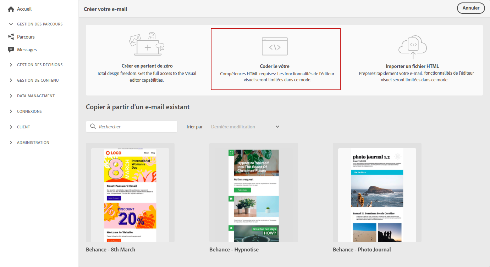
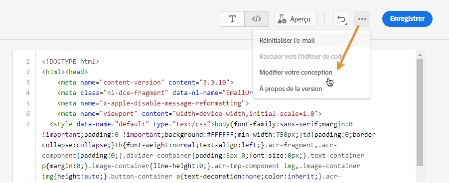
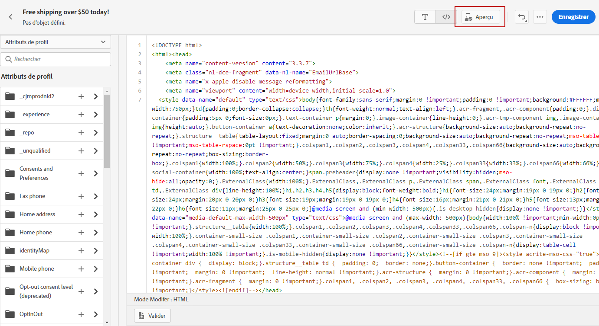
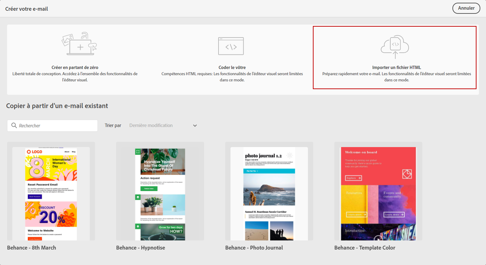
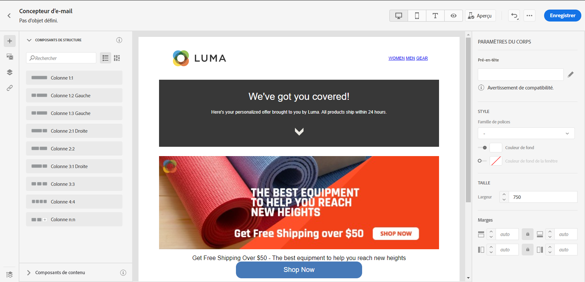

# Importer ou coder le contenu de votre e-mail {#existing-content}

Journey Optimizer vous permet d’importer du contenu HTML existant pour concevoir vos e-mails. Ce contenu peut être du code HTML brut ou du contenu provenant d’un fichier HTML existant ou d’un dossier zip.

➡️ [Découvrez cette fonctionnalité en vidéo](#video)

Pour coder du contenu HTML ou importer du contenu existant, procédez comme suit :

1. [Création d’un message](create-message.md)

1. Ouvrez le **[!UICONTROL Concepteur d&#39;email]** dans la section **[!UICONTROL Modifier le contenu]**.

   

1. Sélectionnez **[!UICONTROL Coder votre propre contenu]** ou **[!UICONTROL Importer HTML]**. Reportez-vous aux sections ci-dessous pour connaître les étapes suivantes.

## Coder votre propre contenu {#import-raw-html-code}

Utilisez le mode **[!UICONTROL Coder votre propre contenu]** pour importer du code HTML brut et/ou coder votre contenu d&#39;e-mail. Cette méthode nécessite des compétences HTML.

>[!CAUTION]
>
> Les images provenant de [Adobe Experience Manager Assets Essentials](assets-essentials.md) ne peuvent pas être référencées lors de l’utilisation de cette méthode. Les images référencées dans votre code HTML doivent être stockées dans un emplacement public.

1. Dans la page d&#39;accueil du Concepteur d’email, sélectionnez **[!UICONTROL Coder votre propre contenu]**.

   

1. Saisissez ou collez votre code HTML brut.

1. Utilisez le volet de gauche pour tirer parti des fonctionnalités de personnalisation [!DNL Journey Optimizer]. Voir à ce propos [cette section](../personalization/personalize.md).

   

1. Si vous souhaitez ouvrir le Concepteur d’email pour commencer votre e-mail à partir d’une nouvelle conception, sélectionnez **[!UICONTROL Modifier votre conception]** dans le menu d’options.

   

1. Cliquez sur le bouton **[!UICONTROL Prévisualisation]** pour vérifier la conception et la personnalisation des messages à l’aide de profils de test. Voir à ce propos [cette section](preview.md).

   

1. Une fois votre code prêt, cliquez sur **[!UICONTROL Enregistrer]**, puis revenez à l’écran de création du message pour finaliser votre message.

   

## Importer du contenu HTML {#import-html-content-from-file}

Vous pouvez importer du contenu HTML dans le Concepteur d’email. Ce contenu peut être :

* Un **fichier HTML** avec une feuille de style incorporée,
* Un **dossier .zip** avec le fichier HTML, la feuille de style (.css) et les images.

   >[!NOTE]
   >
   >Il n’existe aucune contrainte sur la structure des fichiers .zip. Cependant, les références doivent être relatives et s’ajuster à l’arborescence du dossier .zip.

Pour importer un fichier contenant du contenu HTML, procédez comme suit :

1. Dans la page d&#39;accueil du Concepteur d’email, sélectionnez **[!UICONTROL Importer du contenu HTML]**.

   

1. Faites glisser et déposez le fichier HTML ou .zip contenant votre contenu HTML.

1. Une fois le contenu HTML téléchargé, vous pouvez tirer parti des fonctions du Concepteur d’email pour modifier et prévisualiser votre e-mail. [En savoir plus dans cette section](create-email-content.md).

   

## Vidéo pratique {#video}

Découvrez comment importer du contenu HTML existant, améliorer la conception et ajouter une page miroir et des liens de désabonnement. Apprenez également comment coder le contenu.

>[!VIDEO](https://video.tv.adobe.com/v/334102?quality=12)
