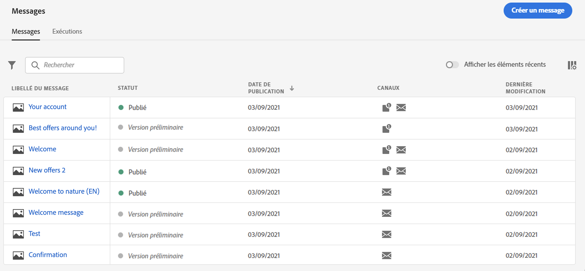
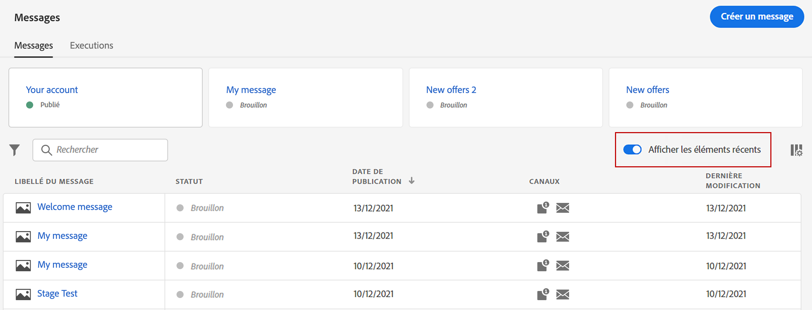
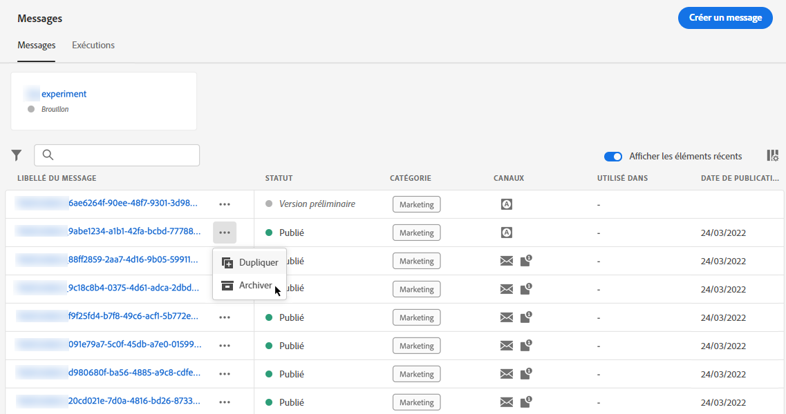
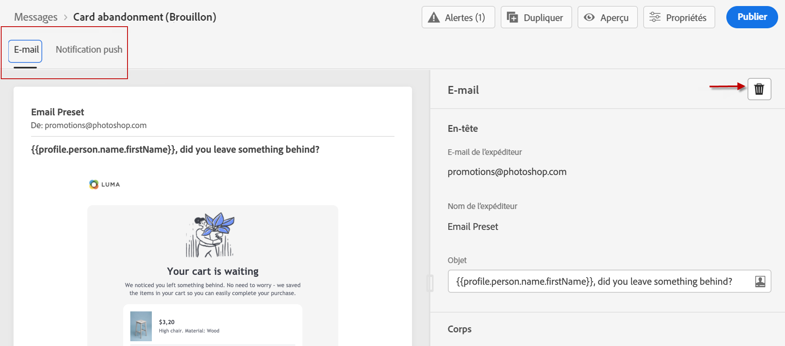
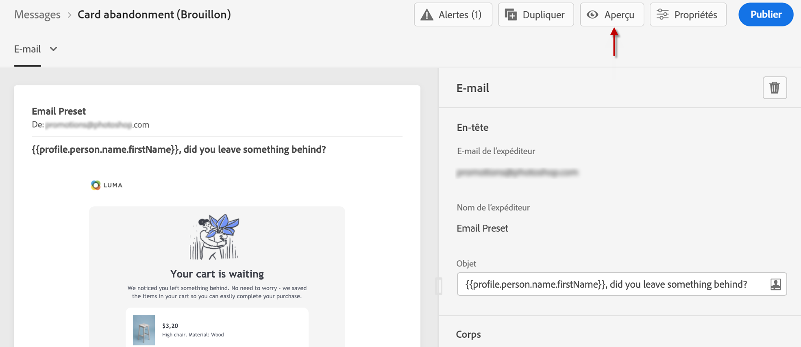
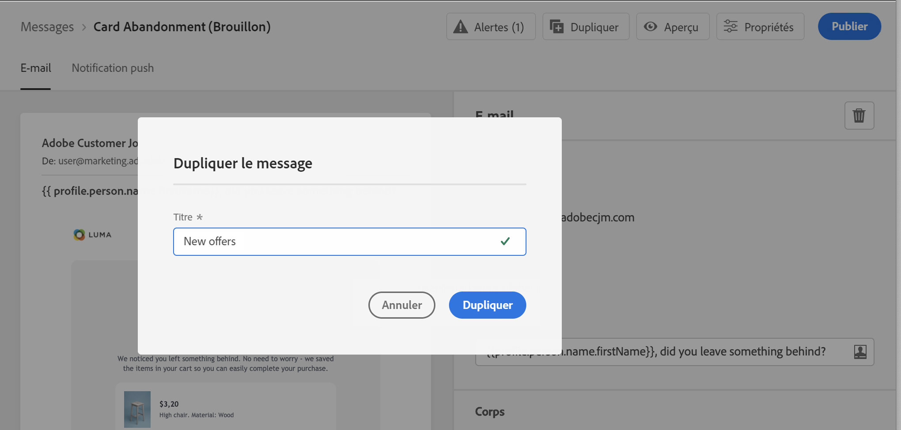
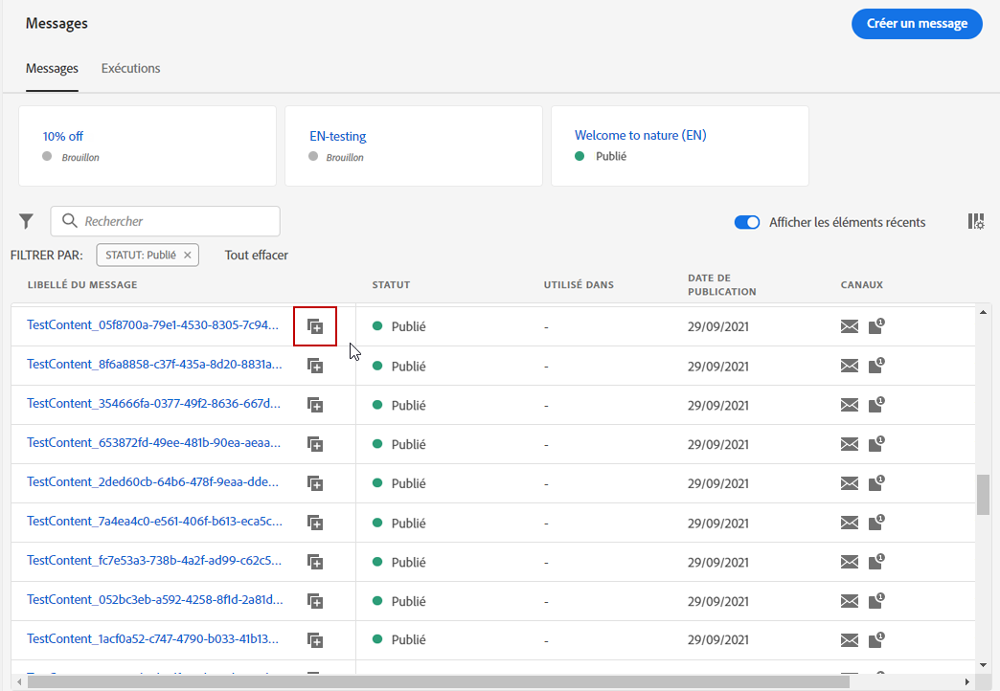

# Prise en main des messages {#get-started-contents-messages}

Utilisez [!DNL Journey Optimizer] pour exploiter plusieurs ressources, telles que du contenu, à un seul endroit, et créer et publier des notifications push et des emails personnalisés.

* Tirez parti des **fonctionnalités de conception d&#39;email** [!DNL Journey Optimizer] pour créer ou importer des emails réactifs.

* Utilisez **Adobe Experience Manager Assets Essentials** pour créer votre propre base de données de ressources et enrichir vos emails.

* Améliorez l’expérience des clients en créant des **messages push et des emails personnalisés** en fonction de leurs attributs de profil.

* **Créez des messages push et des emails** basés sur ces contenus, puis publiez-les.

## Accéder aux messages {#access-messages}

Les messages sont disponibles à partir du raccourci **[!UICONTROL Messages]** sur la navigation de gauche. Tous les messages sont répertoriés, triés par date de publication (pour les messages publiés) ou par date de création (pour les messages à l&#39;état de brouillon).

>[!NOTE]
>
>Les utilisateurs peuvent accéder aux messages, les créer, les modifier et/ou les publier en fonction de leur profil de produit. En savoir plus sur les autorisations utilisateur [dans cette section](../administration/permissions.md).

* Utilisez la bascule **[!UICONTROL Afficher récents]** pour ajouter des liens directs aux messages que vous avez consultés au cours des 5 derniers jours.

   

* Utilisez l&#39;icône en forme de filtre pour afficher uniquement les messages à l&#39;état de brouillon, publiés ou en cours de publication. Vous pouvez également effectuer une recherche sur le libellé du message, comme suit :

   

* Vous pouvez archiver les messages inutilisés pour effacer la liste de messages à l’aide de l’icône dédiée dans le menu des actions rapides.

   

   Utilisez l’icône de filtre pour afficher tous les messages archivés et cliquez sur l’icône **[!UICONTROL Désarchiver]** pour supprimer un élément de la liste des messages archivés.

   >[!NOTE]
   >
   >Vous ne pouvez pas ouvrir un message archivé. Vous devez d’abord le désarchiver.

## Création d&#39;un nouveau message {#create-new-message}

Pour créer un nouveau message, procédez comme suit :

1. Accédez à la liste de messages, puis cliquez sur **[!UICONTROL Créer un message]**.

1. Définissez les propriétés du message.

   

   * Saisissez un **[!UICONTROL Titre]** (obligatoire) et une **[!UICONTROL Description]**.

   * Sélectionnez la **[!UICONTROL Catégorie de message]** : marketing ou transactionnel.

   * Sélectionnez le ou les canaux à utiliser pour ce message : email et/ou notification push. Vous devez sélectionner au moins un canal pour pouvoir créer le message.

   * Sélectionnez le **[!UICONTROL Préréglage]** à utiliser pour le message.

      Les préréglages comprennent tous les paramètres requis pour qu&#39;un email et/ou une notification push soit envoyés selon votre marque. [En savoir plus sur les préréglages](../configuration/message-presets.md)
   >[!CAUTION]
   >
   >Vous devez choisir un paramètre prédéfini de message valide pour la catégorie et le ou les canaux sélectionnés.

   Notez que vous pouvez à tout moment accéder au titre, à la description et au préréglage et les modifier à l&#39;aide du bouton **[!UICONTROL Propriétés]** de l&#39;interface de message.

1. Cliquez sur **[!UICONTROL Créer]** pour confirmer la création du message. Votre message est ajouté dans la liste de messages, dans l&#39;état **[!UICONTROL Brouillon]**.

   Un onglet est disponible pour chaque canal sélectionné. Utilisez ces onglets pour configurer le contenu pour chaque canal. Vous pouvez supprimer un onglet en le sélectionnant et en cliquant sur le bouton **[!UICONTROL Supprimer le canal]** à droite.

   

   Vous pouvez désormais créer le contenu du message et adapter les paramètres. Des informations détaillées sur la configuration des emails et des notifications push sont disponibles dans les sections suivantes :

   * [Création d&#39;un e-mail](create-email.md)
   * [Créer des notification push](create-push.md)

   >[!NOTE]
   >   
   >Vous pouvez personnaliser vos messages à l’aide des données de profil, au moyen de l’éditeur d’expression. Pour plus d&#39;informations sur la personnalisation, consultez [cette section](../personalization/personalize.md).

1. Contrôlez le rendu de vos messages et vérifiez les paramètres de personnalisation avec les profils de test, à l&#39;aide de la section prévisualisation sur le côté gauche. Voir à ce propos [cette section](../design/preview.md).

   

1. Vérifiez les alertes dans la section supérieure de l&#39;éditeur.  Certains d&#39;entre eux sont de simples avertissements, mais d&#39;autres peuvent vous empêcher de publier le message. En savoir plus dans [cette section](alerts.md).

1. Vous pouvez désormais publier votre message en cliquant sur le bouton **[!UICONTROL Publier]**, ou le conserver en tant brouillon et le publier ultérieurement. Pour plus d&#39;informations sur la publication de messages, consultez [cette section](publish-manage-message.md).

## Dupliquer un message {#duplicate-message}

Pour créer un message à partir d’un message existant, procédez comme suit.

1. Ouvrez le message que vous souhaitez copier.

1. Utilisez le bouton **[!UICONTROL Dupliquer]** à partir de l’interface du message.

   

   Tous les paramètres et la configuration seront copiés dans le nouveau message.

1. Vous pouvez renommer le message avant de confirmer la duplication.

   

1. Un message de confirmation s&#39;affiche au bas de la fenêtre une fois le nouveau message créé.

Vous pouvez également dupliquer un message de la liste des messages à l’aide de l’icône dédiée du menu des actions rapides.

Le même processus de confirmation s’applique.

