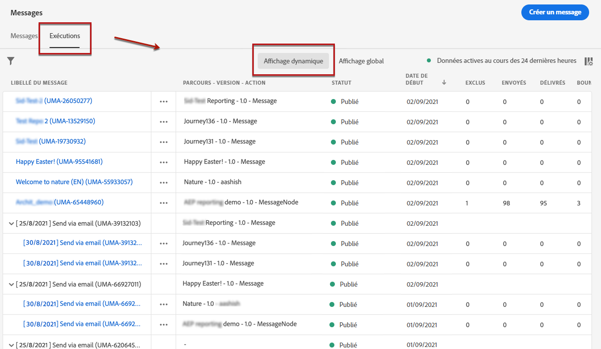
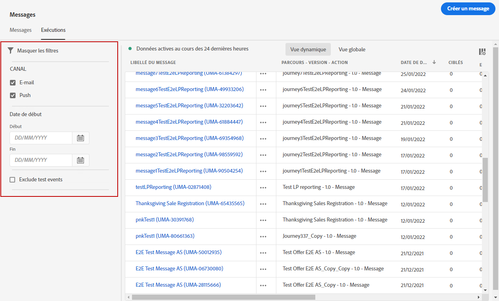
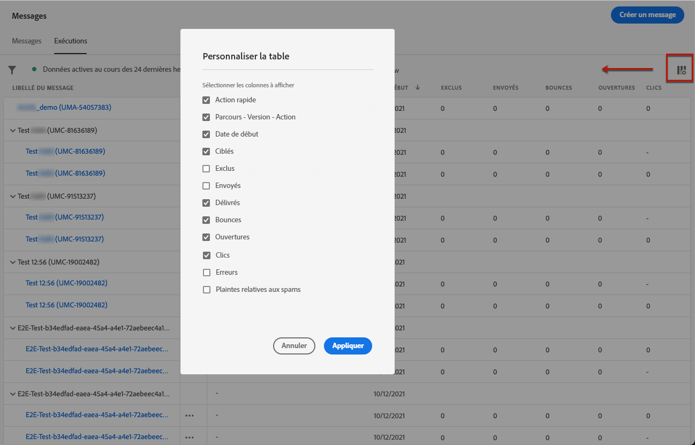
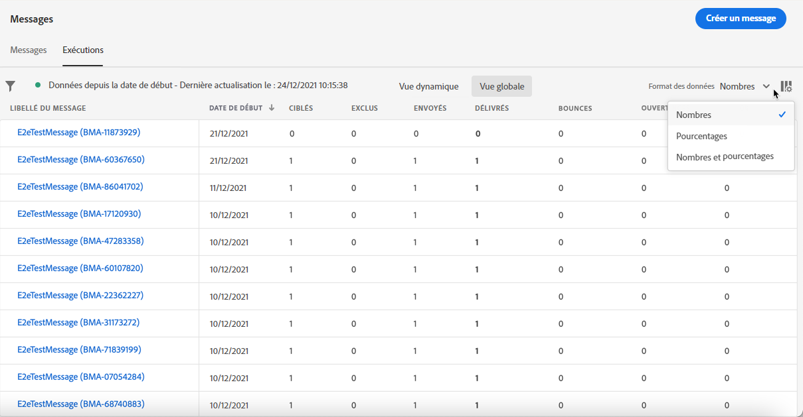

# Surveillance des messages {#monitor-message-execution}

Pour vous assurer que vos messages sont exécutés, envoyés et diffusés avec succès, [!DNL Journey Optimizer] offre des fonctionnalités permettant de surveiller les messages actuellement publiés et déclenchés. Vous pouvez voir comment vos messages se comportent entre les parcours <!--and APIs--> en temps réel à partir de la liste **[!UICONTROL Exécutions]**.

Pour accéder à cette liste, sur la page d&#39;accueil de **[!DNL Journey Optimizer]**, sélectionnez **[!UICONTROL Messages]**, puis cliquez sur l&#39;onglet **[!UICONTROL Exécutions]**.

Cet onglet propose deux affichages : **[!UICONTROL Affichage dynamique]** et **[!UICONTROL Affichage global]**.

* L&#39;onglet **[!UICONTROL Affichage dynamique]** donne un **aperçu en temps réel de tous les messages exécutés** déclenchés par un ou plusieurs [parcours](../building-journeys/journey.md) **au cours des 24 dernières heures uniquement**.

   

   Cette liste est automatiquement actualisée toutes les 60 secondes. Si aucune exécution n&#39;a eu lieu au cours des 24 dernières heures pour un message spécifique, toutes les colonnes affichent des valeurs nulles (0) pour ce message.

* L&#39;onglet **[!UICONTROL Affichage global]** donne un **aperçu de tous les messages exécutés** déclenchés par un ou plusieurs [parcours](../building-journeys/journey.md) **depuis la date de début du message**.

   

   Cette liste est automatiquement actualisée toutes les 90 minutes. Les données sont agrégées au fil du temps depuis chaque date de début du message.

Si un message est publié mais n&#39;est pas encore déclenché par un parcours, il n&#39;est répertorié dans aucun des onglets. Seuls les éléments suivants sont répertoriés :
* Messages ayant été déclenchés mais pas encore démarrés (en attente).
* Messages ayant été déclenchés et en cours d&#39;exécution (en cours).

>[!NOTE]
>
>Si un message a été utilisé dans plusieurs parcours, une ligne par parcours est affichée pour chaque exécution.

Par défaut, les messages s&#39;affichent à partir de la date d&#39;exécution la plus récente. Cliquez sur l’icône **[!UICONTROL Filtres]** pour rechercher les messages en fonction du canal, de la date de début et/ou de la date de fin. Vous pouvez également choisir d’exclure les événements de test de votre **Liste des exécutions**.

La <!--**[!UICONTROL Quick action]**-->seconde colonne permet d&#39;ouvrir le [message](create-message.md) correspondant et d&#39;accéder au [Rapport dynamique](../reports/live-report.md) si vous êtes dans l&#39;**[!UICONTROL Affichage dynamique]** ou au [Rapport global](../reports/global-report.md) si vous êtes dans l&#39;**[!UICONTROL Affichage global]**.

Pour chaque exécution de message, plusieurs indicateurs s&#39;affichent :

* **[!UICONTROL Libellé du message]** : titre du message que vous avez défini lors de la [création du message](create-message.md). L&#39;ID d&#39;exécution, qui est généré automatiquement, est affiché entre parenthèses.

   <!--**[!UICONTROL Execution ID]**: Automatically generated identifier.
  **[!UICONTROL Source]**: Name of the journey leveraging that message.-->

* **[!UICONTROL Parcours - Version - Action]** : nom du parcours utilisant le message, version du parcours et libellé de l&#39;action utilisant le message dans le parcours.

* **[!UICONTROL Statut]** : statut d’exécution du message.

* **[!UICONTROL Date de début]** : date et heure auxquelles le message a été exécuté à partir du parcours.

* **[!UICONTROL Ciblés]** : nombre de profils ciblés pour chaque exécution du message.

* **[!UICONTROL Exclus]** : nombre de profils ayant été exclus de la cible initiale en raison de règles d&#39;exclusion.

* **[!UICONTROL Envoyés]** : nombre de messages ayant été envoyés.

* **[!UICONTROL Délivrés]** : nombre de messages délivrés avec succès dans la boîte aux lettres du destinataire (email) ou sur l&#39;appareil (push) sans générer de bounce ou une autre erreur de diffusion.

* **[!UICONTROL Bounces]** : nombre de messages ne pouvant pas être délivrés en raison d&#39;un échec de diffusion. [En savoir plus sur les bounces](suppression-list.md).

* **[!UICONTROL Ouvertures]** : nombre de messages ayant été ouverts.

* **[!UICONTROL Clics]** : nombre de clics effectués sur des liens dans un email.

   >[!NOTE]
   >
   >Les clics n&#39;existent pas pour les notifications push : lorsqu&#39;un utilisateur clique sur une notification push, une application s&#39;ouvre, qui ne peut être considérée que comme une ouverture.

* **[!UICONTROL Erreurs]** : nombre de messages qui ne peuvent pas être envoyés en raison d&#39;une défaillance technique.

* **[!UICONTROL Plaintes contre le spam]** : nombre de messages signalés comme spam par les destinataires. Pour en savoir plus sur les plaintes, consultez le [Guide des bonnes pratiques en matière de délivrabilité](https://experienceleague.adobe.com/docs/deliverability-learn/deliverability-best-practice-guide/metrics-for-deliverability/complaints.html?lang=fr#metrics-for-deliverability){target=&quot;_blank&quot;}.

Vous pouvez choisir les colonnes à afficher dans le tableau. Pour ce faire, cliquez sur l’icône **[!UICONTROL Personnalisation du tableau]** en haut de l’écran et sélectionnez les colonnes à afficher.

Dans **Vue globale**, vous pouvez uniquement choisir d’afficher les données sous forme de nombres, de pourcentages ou des deux. Cliquez sur la liste déroulante **Format des données** pour basculer entre les trois options.

Cliquer sur chaque lien hypertexte entraîne l&#39;ouverture de la vue de synthèse de message correspondante. [En savoir plus sur les messages](create-message.md).
