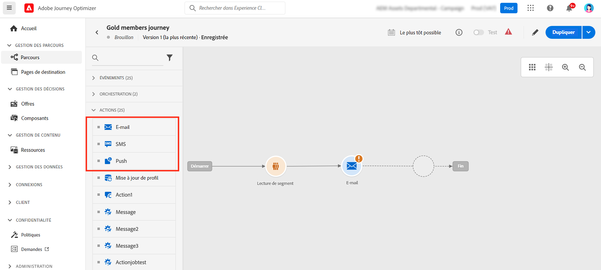
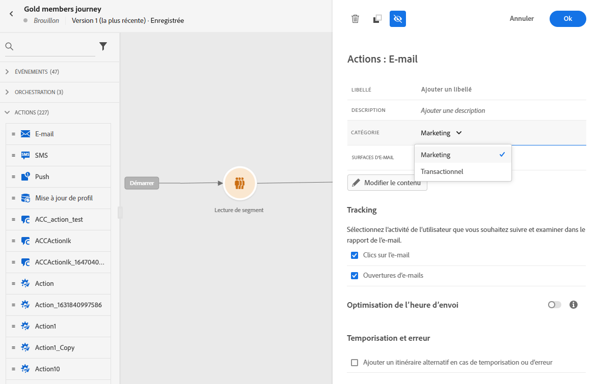
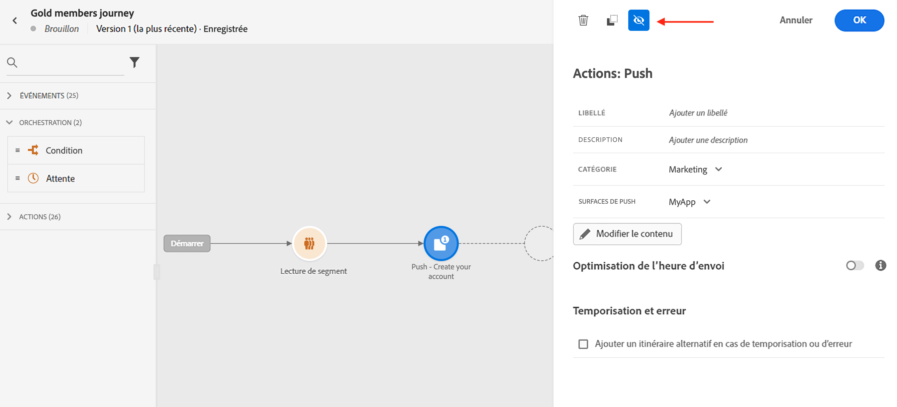
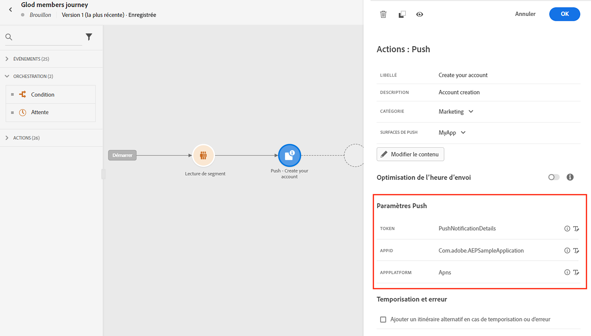
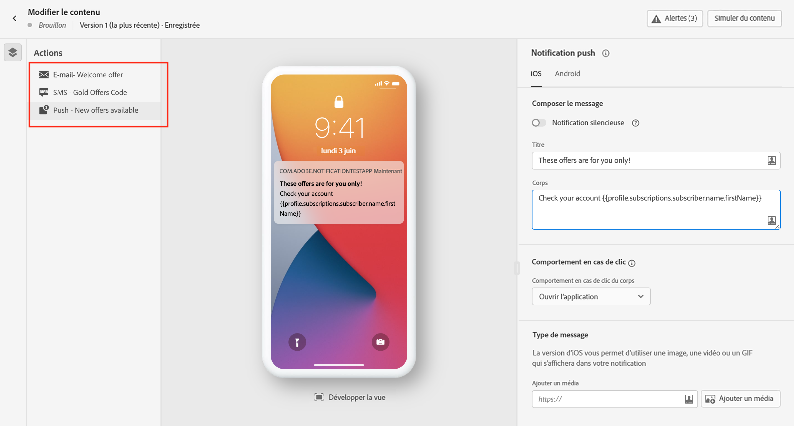
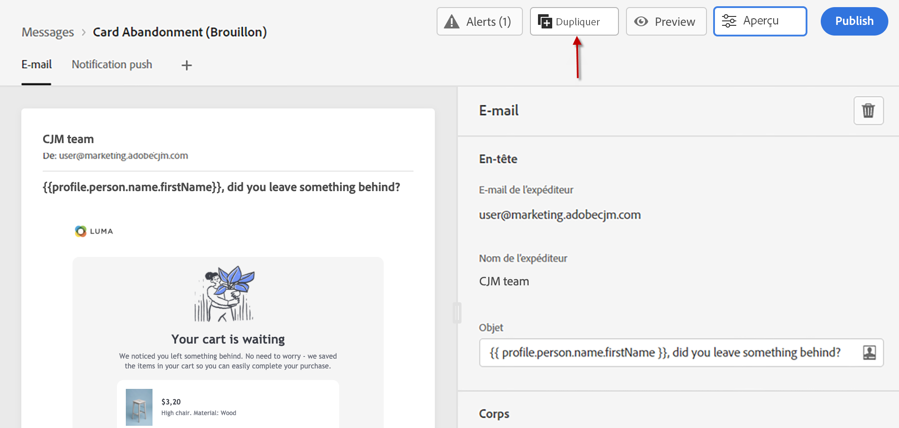
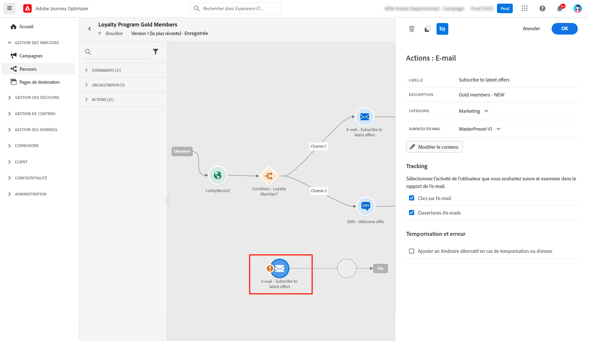
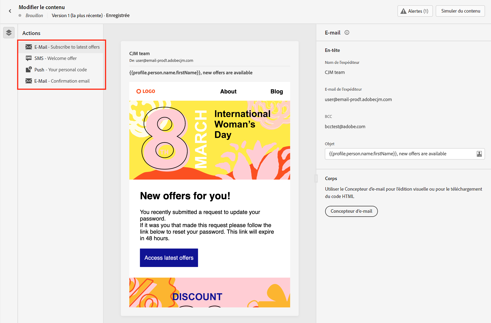
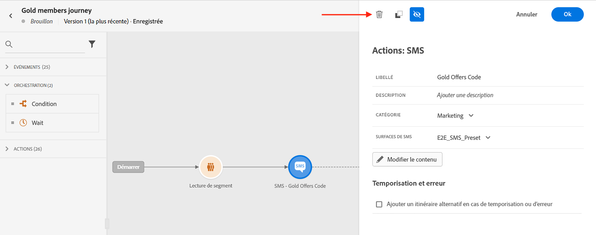

# Ajout de messages dans les parcours{#messages-in-journeys}

>[!CONTEXTUALHELP]
>id="ajo_message_category"
>title="Catégorie de message"
>abstract="Choisissez Marketing pour les messages commerciaux ou Transactionnel pour les messages non commerciaux tels que la confirmation de commande, les notifications de réinitialisation de mot de passe ou les informations de diffusion."

>[!CONTEXTUALHELP]
>id="ajo_message_surface"
>title="Surface de canal"
>abstract="Une surface de canal est une instance de ce canal qui possède tous les paramètres pour diffuser une action avec succès via une campagne ou un parcours. Elle est définie par un administrateur système."

Dans vos parcours, utilisez les actions de canal pour concevoir et personnaliser le message que vous souhaitez envoyer à votre audience. Lorsque vous ajoutez un email, un SMS ou une action Push aux canevas de parcours, vous créez un envoi déclenché. Lorsque les contacts atteignent cette action de canal, Adobe Journey Optimizer envoie automatiquement le message.

>[!NOTE]
>Vous pouvez également créer des campagnes pour envoyer des messages planifiés. En savoir plus dans [cette section](../campaigns/get-started-with-campaigns.md).

Pour ajouter des messages dans un parcours, ajoutez une activité push, SMS ou email dans les canevas du parcours.

1. Débutez votre parcours avec une activité [Événement](../building-journeys/general-events.md) ou [Lecture de segment](../building-journeys/read-segment.md).

1. Dans la section **Actions** de la palette, effectuez un glisser-déposer d’une activité d’**e-mail**, de **SMS** ou de **notification push** dans la zone de travail.

   

1. Saisissez un libellé et une description.

1. Sélectionner la **[!UICONTROL catégorie]** du message : sélectionnez **Marketing** pour les messages commerciaux, ou **Transactionnel** pour les messages non commerciaux tels que la confirmation de commande, les notifications de réinitialisation de mot de passe ou les informations de diffusion.

   >[!CAUTION]
   >
   >Si vous avez défini des [règles de fréquence](../configuration/frequency-rules.md) pour un canal et une catégorie spécifiques, elles sont automatiquement appliquées au message lors de la sélection de ce canal et de cette catégorie. Actuellement, seule la catégorie **[!UICONTROL Marketing]** est disponible pour les règles de fréquence.

   

   >[!CAUTION]
   >
   >Les messages de type marketing doivent inclure un [lien d’opt-out](../messages/consent.md#opt-out-management). Cela n’est pas nécessaire pour les messages transactionnels, car ces messages peuvent être envoyés aux profils qui se sont désabonnés des communications marketing.

1. Sélectionnez la **[!UICONTROL Surface]** de canal (c’est-à-dire le préréglage du message) à utiliser pour envoyer votre message.

   Une surface est une configuration définie par un [administrateur système](../start/path/administrator.md). Elle contient tous les paramètres techniques relatifs à l’envoi du message, tels que les paramètres d’en-tête, le sous-domaine, les applications mobiles, etc. [En savoir plus](../configuration/channel-surfaces.md).

   >[!CAUTION]
   >
   >Vous devez choisir une surface de canal valide pour la catégorie et le canal de message sélectionnés.

   Vous pouvez à tout moment accéder au libellé, à la description et à la surface du message et les modifier à l’aide du bouton **[!UICONTROL Propriétés]** de l’interface de message.

1. Créez le contenu du message.

   Découvrez les étapes détaillées pour créer le contenu de votre message dans la page suivante :

   * [Création d&#39;un e-mail](create-email.md)
   * [Créer des notification push](create-push.md)
   * [Créer un SMS](create-sms.md)

## Activer l’optimisation de l’heure d’envoi{#sto-in-journeys}

Pour les notifications push et les e-mails, vous pouvez activer l’**[!UICONTROL optimisation de l’heure d’envoi]**.

Utilisez l’**[!UICONTROL optimisation de l’heure d’envoi]** pour planifier des heures d’envoi personnalisées pour chaque utilisateur afin d’augmenter les taux d’ouverture et de clic de vos messages. [En savoir plus](../messages/send-time-optimization.md).

## Paramètres avancés{#adv-settings}

Les paramètres avancés sont en lecture seule et masqués par défaut.

Pour accéder aux paramètres avancés, cliquez sur l’icône **[!UICONTROL Afficher les champs en lecture seule]** en haut du volet des messages.

Les paramètres avancés sont affichés au bas du volet des messages. Ces paramètres sont définis par l’[administrateur système](../start/path/administrator.md) dans la [surface de canal](../configuration/channel-surfaces.md) (c’est-à-dire le préréglage du message) associée au message.

Pour les notifications push, vous pouvez afficher les paramètres suivants : Jeton, AppID, AppPlatform.

Pour les e-mails, vous pouvez afficher l’adresse e-mail principale.

Pour une utilisation particulière, vous pouvez remplacer ces valeurs dans des contextes spécifiques. Pour forcer une valeur, cliquez sur l’icône **Activer la substitution de paramètre** à droite du champ. Par exemple, cette option peut être utile pour :

* Tester un e-mail. Vous pouvez ajouter votre adresse e-mail. Une fois le parcours publié, l’e-mail vous est envoyé.
* Se référer à l’adresse e-mail des abonnés d’une liste. En savoir plus sur [ce cas d’utilisation](../building-journeys/message-to-subscribers-uc.md).

Cliquez sur la même icône pour masquer les paramètres avancés.

## Parcourir les messages{#browse-message}

Lorsque plusieurs messages sont utilisés dans un parcours, vous pouvez passer de l’un à l’autre à partir de l’écran **Modifier le contenu**.

Vous pouvez alors [vérifier les alertes](alerts.md) et [simuler](../design/preview.md) chaque contenu depuis une seule vue.

## Dupliquer un message {#duplicate-message}

Vous pouvez copier un message existant à partir de la zone de travail du parcours.

Pour ce faire, suivez les étapes ci-après :

1. Sélectionnez le message que vous souhaitez copier.

1. Utilisez le bouton **[!UICONTROL Copier]** à partir du volet **[!UICONTROL Action]**.

   

1. Appuyez sur **Ctrl+V** pour coller le message.

   Le message est ajouté à la zone de travail du parcours. Tous les paramètres et la configuration sont copiés dans le nouveau message.

   

1. Renommez le message pour pouvoir différencier le message initial de la copie, par exemple lors de l’édition des messages, comme ci-dessous :

   

>[!NOTE]
>
>Pour les e-mails, vous pouvez également transformer un message existant en modèle. [En savoir plus](../design/email-templates.md).

## Supprimer un message{#delete-message}

Pour supprimer un message, utilisez l’icône de corbeille située en haut du volet de l’activité d’action du canal.

Utilisez le bouton **[!UICONTROL Confirmer]** pour valider.
