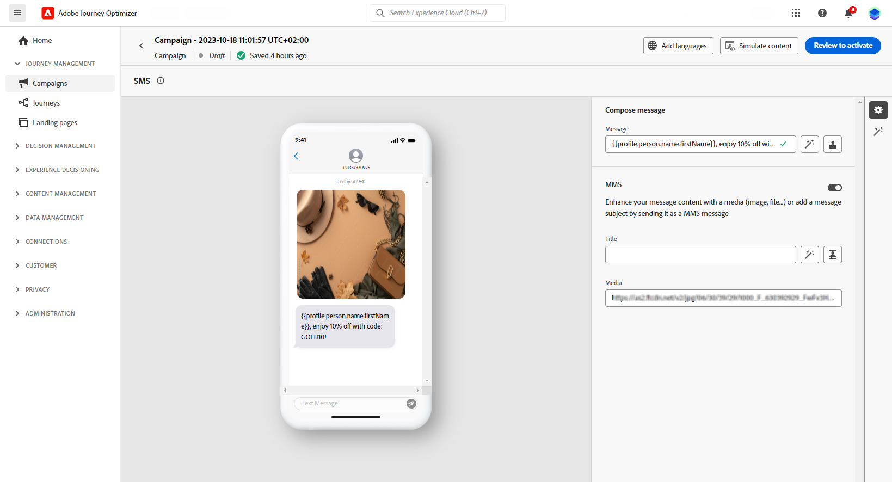

# Concevoir un message mobile {#design-mobile}

>[!BEGINSHADEBOX]

**Sur cette page :** découvrez comment concevoir et personnaliser le contenu des messages SMS, RCS et MMS dans Adobe Journey Optimizer, y compris les médias riches RCS, le texte de remplacement, les actions suggérées, les URL suivies et les médias ajoutés.

>[!ENDSHADEBOX]

Vous pouvez concevoir et envoyer des messages texte (SMS), de communication enrichie (RCS) et multimédia (MMS) avec Adobe Journey Optimizer. Vous devez d’abord ajouter une action Message mobile dans un parcours ou une campagne, puis définir le contenu du Message mobile, comme décrit ci-dessous. Adobe Journey Optimizer offre également des fonctionnalités permettant de tester vos messages mobiles avant l’envoi afin que vous puissiez vérifier le rendu, les attributs de personnalisation et tous les autres paramètres.

Conformément aux normes et réglementations du secteur, tous les messages marketing SMS/RCS/MMS doivent contenir un moyen permettant aux profils de se désabonner facilement. Pour ce faire, les profils SMS peuvent répondre avec des mots-clés d’opt-in et d’opt-out. [Découvrir comment gérer un droit d’opposition](../privacy/opt-out.md#opt-out-decision-management)

## Définition du contenu RCS{#rcs-content}

RCS vous permet d’envoyer des messages riches visuellement avec des images, des vidéos, des carrousels et des boutons interactifs, diffusés via l’application de messagerie native sur les appareils pris en charge. Les messages sont envoyés par un expéditeur de marque vérifié. Lorsque l’appareil ou l’opérateur d’un profil ne prend pas en charge RCS, Journey Optimizer retourne automatiquement à un SMS standard.

Chaque message RCS nécessite un **[!UICONTROL texte de remplacement par défaut]** : une version SMS en texte brut diffusée aux profils dont l’appareil ou l’opérateur ne prend pas en charge RCS. Une campagne ne peut pas être activée sans elle.

Gardez les points suivants à l’esprit lors de la rédaction d’un texte de remplacement :

* **Soyez concis.** Les SMS sont limités à 160 caractères par segment ; les messages plus longs sont divisés en plusieurs parties et peuvent entraîner des frais supplémentaires.
* **Inclure les URL clés.** Si votre message SMS renvoie vers une URL au moyen de boutons d’action, ajoutez une URL abrégée au texte de remplacement afin que les profils SMS puissent toujours atteindre la destination.
* **Évitez les références RCS uniquement.** Ne mentionnez pas les visuels, les carrousels ou les fonctions interactives qui ne sont pas disponibles dans les SMS simples.
* **Personalization est pris en charge.** Vous pouvez utiliser des jetons de personnalisation dans le texte de remplacement pour que le message reste cohérent dans les deux versions.

Pour définir le contenu de votre message RCS, procédez comme suit.

1. Dans le panneau de création, choisissez votre **[!UICONTROL Type de contenu]** :

   +++ Texte

   Corps de texte brut avec des boutons interactifs facultatifs. Idéal pour les notifications, les alertes, les rappels et les flux de conversation lorsque les visuels ne sont pas nécessaires.

   +++

   +++ Média

   Image ou vidéo autonome avec texte facultatif et boutons interactifs. Utilisez-le lorsqu’un seul élément visuel (image de produit, bannière ou clip vidéo) est le point focal de votre message.

   1. Dans le menu d’en-tête, saisissez une **[!UICONTROL URL du média]** pointant vers l’image ou la vidéo à afficher.

   1. Si le média est un fichier vidéo, entrez éventuellement une **[!UICONTROL URL de miniature]**.

   +++

   +++ Carte

   Carte structurée combinant une image ou une vidéo, un titre, un corps de texte et des boutons d’action. Utilisez-le pour présenter un produit, une offre ou un élément de contenu dans un format de marque.

   1. Saisissez un **[!UICONTROL Titre]** et un **[!UICONTROL Description]**.

   1. Saisissez une **[!UICONTROL URL du média]** pointant vers l’image ou la vidéo à afficher.

   1. Si le média est un fichier vidéo, entrez éventuellement une **[!UICONTROL URL de miniature]**.

   +++

   +++ Carrousel

   Série de cartes enrichies défilant horizontalement dans un seul message, chacune ayant sa propre image, son propre titre, sa propre description et ses propres boutons. Idéal pour les catalogues de produits ou les promotions. Un minimum de 2 cartes est requis.

   1. Sélectionnez une **[!UICONTROL Largeur de la carte]** pour contrôler la largeur d’affichage de chaque carte.
   1. Pour chaque carte, saisissez un **[!UICONTROL Titre]** et un **[!UICONTROL Description]**.

   1. Saisissez une **[!UICONTROL URL du média]** pointant vers l’image ou la vidéo de cette carte.

   1. Vous pouvez éventuellement sélectionner une **[!UICONTROL Hauteur du média]** et ajouter des boutons d’action suggérés.

   +++

   +++ Emplacement

   Envoie une épingle de mappage à un ensemble de coordonnées, affiché comme un aperçu de mappage intégré dans le thread de messagerie du profil. Utilisez-la pour partager une adresse de magasin, un lieu d’événement ou une zone de service.

   1. Saisissez la décimale **[!UICONTROL Latitude]** et **[!UICONTROL Longitude]** de l’emplacement.

   1. Éventuellement, saisissez un **[!UICONTROL nom de l’emplacement]** à afficher en tant que libellé sur l’épingle de mappage.

   +++

1. Dans le champ **[!UICONTROL Texte du message]** saisissez le contenu de votre message. Vous pouvez utiliser la personnalisation pour personnaliser le texte en fonction de chaque profil. Notez que les limites de caractères varient selon le type de message : 3 072 caractères pour le format Rich Media (single) et 160 caractères pour le format RCS de base.

1. Utilisez l&#39;éditeur **** pour définir le contenu, ajouter de la personnalisation et du contenu dynamique. Vous pouvez utiliser n’importe quel attribut, comme le nom du profil ou la ville. Vous pouvez également définir des règles conditionnelles.

1. Si vous le souhaitez, ajoutez des boutons interactifs **[!UICONTROL Actions suggérées]** qui permettent aux profils d’agir en une seule touche.

1. Saisissez un **[!UICONTROL Libellé]** pour votre **[!UICONTROL Action]**.

1. Choisissez votre **[!UICONTROL Type d’action]** :

   * **[!UICONTROL Répondre]** : renvoie une réponse textuelle prédéfinie à l’agent RCS au nom du profil. Utilisez-le pour capturer l’intention, orienter les flux de conversation ou déclencher des événements de parcours en aval. Aucun champ supplémentaire n’est requis, le texte de réponse correspond au libellé du bouton.

   * **[!UICONTROL URL d’ouverture]** : redirige le profil vers une page web, un lien profond ou une destination In-App. Prend en charge les jetons de personnalisation et les paramètres de suivi UTM, par exemple `https://www.example.com/offers?id={{profile.userId}}`.

   * **[!UICONTROL Composer un numéro de téléphone]** : ouvre le composeur d’appareil avec un numéro de téléphone spécifié prérempli, prêt à être appelé par le profil.

   * **[!UICONTROL Afficher l’emplacement]** : ouvre l’application Cartes par défaut de l’appareil à un emplacement spécifié. Indiquez la décimale **[!UICONTROL Latitude]** et **[!UICONTROL Longitude]** de l’emplacement à afficher.

1. Dans le champ **[!UICONTROL Texte de remplacement par défaut]** , saisissez la version SMS en texte brut de votre message. Cette configuration est requise et est fournie aux profils dont l’appareil ou l’opérateur ne prend pas en charge RCS.

1. Dans la liste déroulante **[!UICONTROL Webview]**, choisissez la taille de votre **[!UICONTROL Webview]** lors de l’envoi d’une action **[!UICONTROL Ouvrir l’URL]**.

1. Cliquez sur **[!UICONTROL Enregistrer]** et vérifiez votre message dans l’aperçu. Vous pouvez maintenant tester et vérifier le contenu de votre message, comme indiqué dans [cette section](send-mobile-message.md).

## Définir le contenu de votre SMS{#sms-content}

>[!CONTEXTUALHELP]
>id="ajo_message_sms_content"
>title="Définir le contenu de votre SMS"
>abstract="Personnalisez vos messages mobiles à l’aide de l’éditeur de personnalisation pour définir le contenu et incorporer des éléments dynamiques."

Pour configurer le contenu de votre message, suivez les étapes ci-après. Les paramètres des MMS sont décrits dans [cette section](#mms-content).

1. Dans l’écran de configuration du parcours ou de la campagne, cliquez sur le bouton **[!UICONTROL Modifier le contenu]** pour configurer le contenu du message mobile.

1. Cliquez sur le champ **[!UICONTROL Message]** pour ouvrir l’éditeur de personnalisation.

   

1. Générez des messages mobiles attrayants adaptés à votre audience à l’aide de l’assistant [AI pour la génération de texte](../content-management/generative-text.md).

1. Utilisez l’éditeur de personnalisation pour définir le contenu, ajouter de la personnalisation ou du contenu dynamique. Vous pouvez utiliser n’importe quel attribut, comme le nom du profil ou la ville. Vous pouvez également définir des règles conditionnelles. Accédez aux pages suivantes pour en savoir plus sur la [personnalisation](../personalization/personalize.md) et le [contenu dynamique](../personalization/get-started-dynamic-content.md) dans l’éditeur de personnalisation.

1. Une fois le contenu défini, ajoutez les URL trackées à votre message. Pour ce faire, accédez au menu **[!UICONTROL Fonctions d’assistance]** et sélectionnez **[!UICONTROL Helpers]**.

   

1. Sélectionnez **[!UICONTROL URL]** et cliquez sur **[!UICONTROL Ajouter une URL]**. En savoir plus sur la fonction d’assistance `Url` dans [cette section](../personalization/functions/helpers.md#url).

   

1. Pour raccourcir l’URL, collez-la dans le champ `originalUrl` et cliquez sur **[!UICONTROL Enregistrer]**.

   >[!CAUTION]
   >
   >Pour utiliser la fonction de raccourcissement des URL, vous devez d’abord configurer un sous-domaine, qui sera ensuite lié à votre configuration. [En savoir plus](mobile-subdomains.md)
   >
   > La durée de vie des URL courtes est définie sur 30 jours. Passé ce délai, ces URL courtes ne seront plus accessibles et afficheront le message suivant : `404 short-code not found`.

1. Pour ajouter un lien profond qui ouvre un écran spécifique dans votre application mobile, utilisez la fonction d’assistance `Url` avec le type de `DEEPLINK` , comme dans l’exemple ci-dessous. [En savoir plus sur les liens profonds](../email/deeplinks.md)

   ```
   {{url originalUrl='<<deeplink_url>>' type='DEEPLINK' action='CLICK'}}
   ```

   >[!CAUTION]
   >
   >Avant d’utiliser les liens profonds, assurez-vous d’avoir terminé les [étapes de configuration](../email/deeplinks.md#configuration) correspondantes dans Journey Optimizer et implémenté [gestion des liens profonds](../email/deeplinks.md#mobile-implementation) dans votre application mobile. Si vous ne l’avez pas fait, le lien profond ne dirigera pas les utilisateurs vers le contenu in-app prévu.
   >
   >Assurez-vous également que le suivi des liens est activé dans la section **[!UICONTROL Actions]** de votre parcours ou campagne afin que l’URL soit réécrite via les systèmes Adobe.

1. Dans le menu **[!UICONTROL Prise de décision]**, vous pouvez personnaliser et optimiser le contenu de vos messages mobiles avec **Prise de décision**. Cette fonctionnalité vous permet d’utiliser des scores de priorité, des formules ou des modèles d’IA pour sélectionner et afficher dynamiquement le meilleur contenu pour vos clients.

   Pour plus d’informations sur la création et l’utilisation des politiques de décision dans les messages mobiles, consultez [cette section](../experience-decisioning/create-decision.md).

1. Cliquez sur **[!UICONTROL Enregistrer]** et vérifiez votre message dans l’aperçu. Vous pouvez maintenant tester et vérifier le contenu de votre message, comme indiqué dans [cette section](send-mobile-message.md).

## Définir le contenu de votre MMS{#mms-content}

Vous pouvez améliorer votre communication en envoyant des messages MMS (Multimedia Message Service), afin de partager des médias tels que des vidéos, des images, des clips audio, des GIF et bien plus encore. En outre, les MMS autorisent jusqu’à 1 600 caractères de texte dans votre message.

>[!NOTE]
>
> Le canal MMS est fourni avec quelques limites répertoriées sur [cette page](../start/guardrails.md#sms-guardrails).

Pour créer du contenu MMS, procédez comme suit :

1. Créez un Message mobile comme décrit dans [cette section](#create-sms-journey-campaign).

1. Modifiez le contenu de votre SMS comme indiqué dans [cette section](#sms-content).

1. Activez l’option MMS pour ajouter un média à votre contenu SMS.

   

1. Ajoutez un **[!UICONTROL Titre]** à votre média.

1. Saisissez lʼURL de votre média dans le champ **[!UICONTROL Média]**.

   

1. Cliquez sur **[!UICONTROL Enregistrer]** et vérifiez votre message dans l’aperçu. Vous pouvez maintenant tester et vérifier le contenu de votre message, comme décrit ci-dessous.

Une fois que vous avez effectué vos tests et validé le contenu, vous pouvez envoyer votre message mobile à votre audience. Ces étapes sont présentées sur [cette page](send-mobile-message.md).

