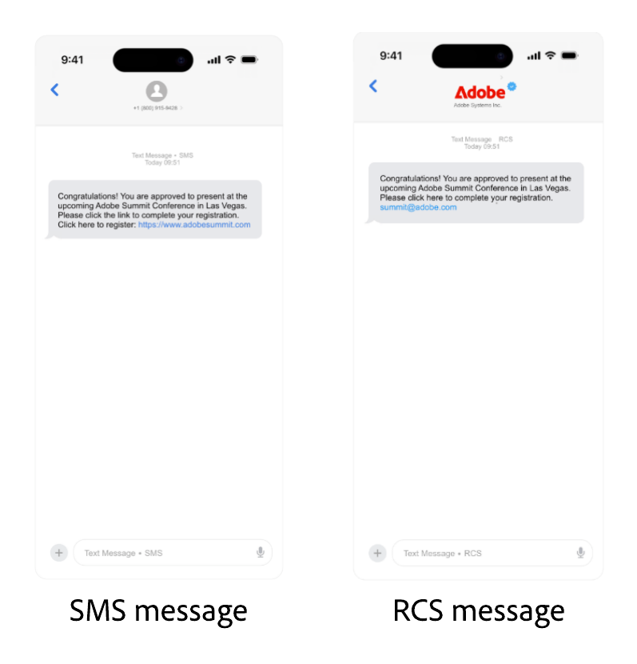

# Configurer le fournisseur Sinch {#sms-configuration-sinch}

Lorsque vous utilisez le fournisseur Sinch avec Journey Optimizer, vous disposez de trois options distinctes :

* **Configuration des SMS** : configurez vos informations d’identification d’API Sinch pour envoyer des messages SMS de manière transparente.

* **Configuration des MMS** : pour la messagerie multimédia (MMS), configurez vos informations d’identification d’API MMS Sinch. Notez que le suivi et la réponse aux messages entrants sont gérés par la configuration des SMS. La configuration des MMS concerne uniquement la diffusion sortante des messages MMS.

* **Configuration RCS** : configurez vos informations d’identification d’API Sinch pour envoyer des messages RCS de manière transparente.

Pour configurer votre fournisseur Sinch, procédez comme suit :

1. [Créer des informations d’identification d’API](#create-api)
1. [Créer un webhook](mobile-webhook.md)
1. [Créer une configuration des canaux](mobile-configuration-surface.md)
1. [Créer un parcours ou une campagne avec une action de canal SMS](create-mobile-message.md)

## Configurer les informations d’identification d’API pour les SMS{#create-api}

Pour configurer votre fournisseur Sinch pour envoyer des SMS et des MMS avec Journey Optimizer, procédez comme suit :

1. Dans le rail de gauche, accédez à **[!UICONTROL Administration]** > **[!UICONTROL Canaux]** `>` **[!UICONTROL Paramètres des SMS]** et sélectionnez le menu **[!UICONTROL Informations d’identification de l’API]**. Cliquez sur le bouton **[!UICONTROL Créer des informations d’identification de l’API]**.

1. Configurez les informations d’identification pour l’API SMS, comme indiqué ci-dessous :

   +++ Liste des informations d’identification SMS pour la configuration

   | Champs de configuration | Description |
   |---|---|
   | Fournisseur SMS | Sinch |
   | Nom | Saisissez un nom pour vos informations d’identification API. |
   | ID de service et jeton API | Accédez à la page des API, puis à vos informations d’identification sous l’onglet SMS. En savoir plus dans la [Documentation Sinch](https://developers.sinch.com/docs/sms/getting-started/){target="_blank"}. |
   | Numéro entrant | Ajoutez votre numéro entrant unique ou votre code court. Cela permet d’utiliser les mêmes informations d’identification d’API dans différents sandbox, chacun ayant son propre numéro entrant ou code court. |
   | URL de remplacement | Saisissez votre URL personnalisée pour remplacer les points d’entrée par défaut des rapports de diffusion par SMS, des données de commentaires, des messages entrants ou des notifications d’événement. Sinch enverra toutes les mises à jour pertinentes à cette URL au lieu des mises à jour prédéfinies. |

   +++

<!--
1. Choose how user consent should be tracked for messaging:

    * **[!UICONTROL Sender short code]**: Inbound keyword consent is keyed to your **sender short code** only. Use when one inbound number is enough to represent consent.

    * **[!UICONTROL Sender short code + profile number]**: Consent is keyed to the **sender short code** and the profile **mobile number**. Use when profiles can have several numbers, or when opt-in/out must apply per sender and recipient pair.
-->

1. Sélectionnez **[!UICONTROL Utiliser un jeu de données personnalisé pour le trafic entrant]** pour acheminer le SMS entrant de ces informations d’identification vers un jeu de données précréé que vous sélectionnez dans la liste déroulante. [En savoir plus sur l’utilisation d’un jeu de données personnalisé pour les mots-clés entrants](../mobile/custom-dataset-inbound-keywords.md)

   >[!NOTE]
   >
   >Le schéma du jeu de données doit être **[!UICONTROL XDM ExperienceEvent]** et inclure au moins les groupes de champs suivants :
   >* Adobe CJM ExperienceEvent - Informations sur l’interaction du message
   >* ExperienceEvent Adobe CJM - Détails d’exécution du message
   >* ExperienceEvent Adobe CJM - Détails du profil de message
   >
   >Le schéma et le jeu de données doivent être activés pour Profil.

1. Cliquez sur **[!UICONTROL Envoyer]** lorsque vous avez terminé la configuration de vos informations d’identification d’API.

1. Dans le menu **[!UICONTROL Informations d’identification d’API]**, cliquez sur l’icône de corbeille pour supprimer vos informations d’identification d’API.

1. Pour modifier les informations d’identification existantes, recherchez les informations d’identification d’API souhaitées et cliquez sur l’option **[!UICONTROL Modifier]** pour apporter les modifications nécessaires.

1. Cliquez sur **[!UICONTROL Vérifier la connexion SMS]**, à partir de vos informations d’identification d’API existantes, pour tester et vérifier vos informations d’identification d’API SMS en envoyant un exemple de message à un appareil désigné.

1. Renseignez les champs **Numéro** et **Message**, puis cliquez sur **[!UICONTROL Vérifier la connexion]**.

   >[!IMPORTANT]
   >
   >Le message doit être structuré de manière à s’aligner sur le format de payload du fournisseur.

   

Après avoir créé et configuré vos informations d’identification API, vous devez maintenant créer [votre Webhook](mobile-webhook.md) et une configuration de canal pour vos messages RCS. [En savoir plus](mobile-configuration-surface.md)

## Configurer les informations d’identification d’API pour les MMS{#sinch-mms}

>[!IMPORTANT]
>
> Avec la configuration des MMS, vous devez également créer des informations d’identification de l’API Sinch spécifiques pour le suivi des messages entrants et la gestion des demandes de consentement.

Pour configurer Sinch MMS avec Journey Optimizer, procédez comme suit :

1. Dans le rail de gauche, accédez à **[!UICONTROL Administration]** > **[!UICONTROL Canaux]** `>` **[!UICONTROL Paramètres des SMS]** et sélectionnez le menu **[!UICONTROL Informations d’identification de l’API]**. Cliquez sur le bouton **[!UICONTROL Créer des informations d’identification de l’API]**.

1. Configurez vos informations d’identification pour l’API MMS, comme indiqué ci-dessous :

   * **[!UICONTROL Fournisseur de SMS]** : Sinch MMS.

   * **[!UICONTROL Nom]** : saisissez un nom pour vos informations d’identification API.

   * **[!UICONTROL Identifiant de projet]**, **[!UICONTROL Identifiant d’application]** et **[!UICONTROL Jeton API]** : suivez les étapes ci-dessous pour collecter vos informations d’identification d’API MMS.

      * Pour l’**[!UICONTROL Identifiant de projet]** et l’**[!UICONTROL Identifiant d’application]** : accédez à la page [Vue d’ensemble de l’API de conversation](https://dashboard.sinch.com/convapi/overview) de votre projet Sinch sur votre tableau de bord Sinch.
      * Pour le **[!UICONTROL Jeton API]** : obtenez les [Clés d’accès](https://community.sinch.com/t5/Customer-Dashboard/Sinch-Access-Keys/ta-p/12638) pour votre projet Sinch et générez un **Jeton API Base64** à partir des **Clés d’accès** de votre projet Sinch.

1. Cliquez sur **[!UICONTROL Envoyer]** lorsque vous avez terminé la configuration de vos informations d’identification d’API.

1. Dans le menu **[!UICONTROL Informations d’identification d’API]**, cliquez sur l’icône de corbeille pour supprimer vos informations d’identification d’API.

1. Pour modifier les informations d’identification existantes, recherchez les informations d’identification d’API souhaitées et cliquez sur l’option **[!UICONTROL Modifier]** pour apporter les modifications nécessaires.

Après avoir créé et configuré vos informations d’identification API, vous devez maintenant créer [votre Webhook](mobile-webhook.md) et une configuration de canal pour vos messages RCS. [En savoir plus](mobile-configuration-surface.md)

## Configurer des informations d’identification d’API pour RCS

<!---->

La messagerie RCS (Rich Communication Services) est prise en charge dans Journey Optimizer via Sinch, ce qui permet d’envoyer des messages de base à l’aide de profils professionnels vérifiés avec des éléments de marque tels que des logos et des noms d’expéditeur ou d’expéditrice.

La création RCS native nécessite Sinch RCS. Twilio, Infobip et d’autres fournisseurs doivent utiliser une [intégration de fournisseur personnalisée](mobile-configuration-custom.md).

Notez que les messages redeviennent automatiquement des SMS lorsque l’appareil du profil ne prend pas en charge RCS ou est temporairement inatteignable via RCS.

Pour configurer Sinch RCS afin d’envoyer RCS avec Journey Optimizer, procédez comme suit :

1. Dans le rail de gauche, accédez à **[!UICONTROL Administration]** > **[!UICONTROL Canaux]** `>` **[!UICONTROL Paramètres des SMS]** et sélectionnez le menu **[!UICONTROL Informations d’identification de l’API]**. Cliquez sur le bouton **[!UICONTROL Créer des informations d’identification de l’API]**.

1. Configurez vos informations d’identification d’API RCS, comme décrit ci-dessous :

   * **[!UICONTROL Fournisseur SMS]** : Sinch RCS.

   * **[!UICONTROL Nom]** : saisissez un nom pour vos informations d’identification API.

   * **[!UICONTROL ID de projet]**, **[!UICONTROL ID d’application]** et **[!UICONTROL Jeton API]** : saisissez l’ID de projet, l’ID d’application et le jeton API à partir de votre compte Sinch RCS.

   * **[!UICONTROL ID du plan de service]** : saisissez l’ID du plan de service associé à votre compte Sinch.

   * **[!UICONTROL Jeton API SMS]** : saisissez le jeton API SMS de votre compte Sinch.

   

1. Vous pouvez éventuellement activer l’option **[!UICONTROL Utiliser un jeu de données personnalisé pour les messages entrants]** pour stocker les messages RCS entrants dans un jeu de données personnalisé. [En savoir plus](../mobile/custom-dataset-inbound-keywords.md)

1. Définissez la **[!UICONTROL limite de débit d’API (requêtes par seconde)]** pour limiter le nombre maximal d’appels d’API par seconde, utilisez la valeur recommandée par votre fournisseur pour éviter le ralentissement, ou laissez-la à 0 pour un nombre illimité de requêtes.

1. Cliquez sur **[!UICONTROL Envoyer]** lorsque vous avez terminé la configuration de vos informations d’identification d’API.

1. Dans le menu **[!UICONTROL Informations d’identification d’API]**, cliquez sur l’icône de corbeille pour supprimer vos informations d’identification d’API.

1. Pour modifier les informations d’identification existantes, recherchez les informations d’identification d’API souhaitées et cliquez sur l’option **[!UICONTROL Modifier]** pour apporter les modifications nécessaires.

Après avoir créé et configuré vos informations d’identification API, vous devez maintenant créer [votre Webhook](mobile-webhook.md) et une configuration de canal pour vos messages RCS. [En savoir plus](mobile-configuration-surface.md)

<!--
### Basic RCS Messages

>[!AVAILABILITY]
>
> Basic RCS messages is only available upon Adobe RCS add-on offering.

1. **Set up your branded RCS agent**

    Create a branded RCS agent in the Sinch Dashboard. [Learn more on branded RCS agent](https://community.sinch.com/t5/RCS/Getting-Started-with-RCS-using-Conversation-API/ta-p/17844)

1. **Set up your [Custom API credentials](mobile-configuration-custom.md)**
    
    Once your RCS agent is approved, you need to set up your Sinch API credentials, which include your access key, secret, and service plan ID. These credentials will be used by Journey Optimizer to authenticate and send messages through Sinch's platform.

1. **Create a [channel configuration](mobile-configuration-surface.md) for your RCS messages**

    Configure a channel surface in Journey Optimizer by linking your Sinch credentials and defining the messaging parameters. This setup enables you to compose and send RCS messages from Journey Optimizer.

1. **Create and personalize your [SMS message](../mobile/create-mobile-message.md)**

    Your messages automatically falls back to SMS when the profile's device does not support RCS or is temporarily unreachable via RCS.
-->

