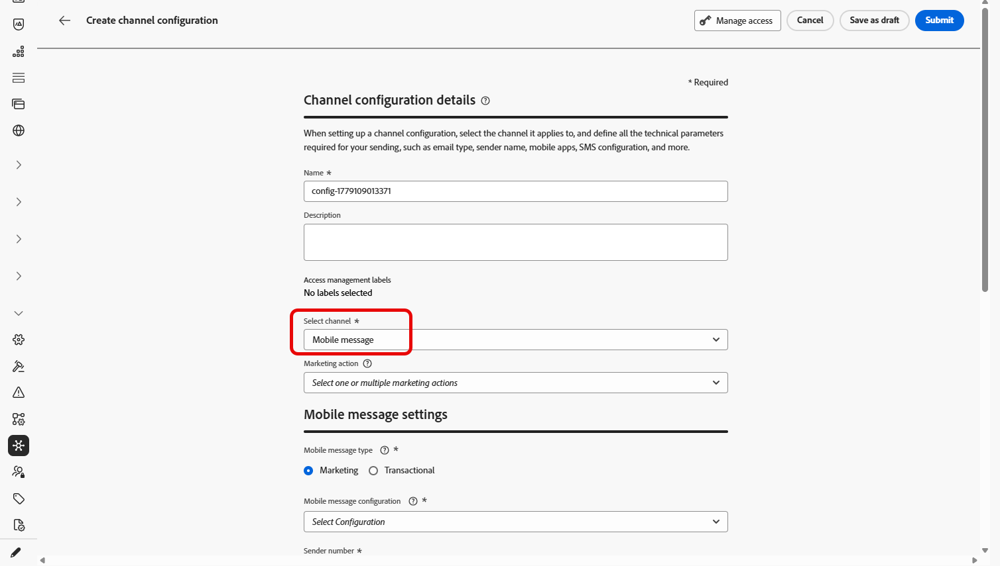
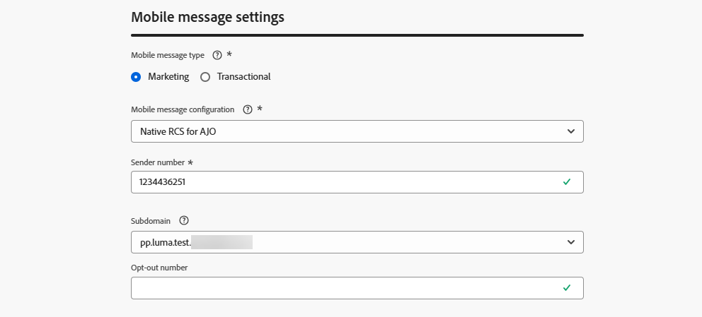

# Créer une configuration de message mobile {#message-preset-sms}

>[!CONTEXTUALHELP]
>id="ajo_admin_surface_sms_type"
>title="Définir la catégorie de message"
>abstract="Sélectionnez le type de messages mobiles utilisant cette configuration : Marketing pour les messages promotionnels, qui nécessitent le consentement de l’utilisateur ou de l’utilisatrice, ou Transactionnel pour les messages non commerciaux, tels que les réinitialisations de mot de passe."
>additional-url="https://experienceleague.adobe.com/docs/journey-optimizer/using/privacy/consent/opt-out.html?lang=fr#sms-opt-out-management" text="Se désinscrire dans les messages mobiles marketing"

Une fois votre canal Message mobile configuré, vous devez créer une configuration de canal afin de pouvoir envoyer des SMS, des SMS, des SMS et des MMS depuis **[!DNL Journey Optimizer]**.

Pour créer une configuration des canaux, procédez comme suit :

1. Dans le rail de gauche, accédez à **[!UICONTROL Administration]** > **[!UICONTROL Canaux]** et sélectionnez **[!UICONTROL Paramètres généraux]** > **[!UICONTROL Configurations de canal]**. Cliquez sur le bouton **[!UICONTROL Créer une configuration de canal]**.

   

1. Saisissez un nom et une description (facultatif) pour la configuration, puis sélectionnez le Canal mobile.

   

   >[!NOTE]
   >
   > Les noms doivent commencer par une lettre (A-Z). Ils ne peuvent contenir que des caractères alphanumériques. Vous pouvez également utiliser le trait de soulignement `_`, le point`.` et le trait d&#39;union `-`.

1. Sélectionnez le **[!UICONTROL Type de SMS]** pour cette configuration :

   * **[!UICONTROL Marketing]** : pour les messages promotionnels qui nécessitent le consentement de l’utilisateur.
   * **[!UICONTROL Transactionnel]** : pour les messages non commerciaux tels que les confirmations de commande, les réinitialisations de mot de passe ou les mises à jour de diffusion.

   >[!CAUTION]
   >
   >Les messages **transactionnels** peuvent être envoyés aux profils qui se sont désabonnés des communications marketing, mais uniquement dans des contextes spécifiques.

   {width=80%}

1. Sélectionnez la **[!UICONTROL Configuration mobile]** à associer à la configuration.

   Pour plus d’informations sur la configuration de votre environnement pour envoyer des messages mobiles, consultez [cette section](#create-api).

1. Saisissez le **[!UICONTROL Numéro dʼexpéditeur]** à utiliser lors de vos communications.

1. Si vous souhaitez utiliser la fonction de raccourcissement des URL dans vos messages mobiles, sélectionnez un élément de la liste **[!UICONTROL Sous-domaine]**.

   >[!NOTE]
   >
   >Avant de pouvoir sélectionner un sous-domaine, vous devez avoir configuré au moins un sous-domaine SMS/RCS/MMS. [Voici comment procéder](mobile-subdomains.md)

1. Dans la section **[!UICONTROL Dimension d’exécution]**, utilisez le **[!UICONTROL Champ d’exécution SMS]** pour sélectionner, parmi les attributs de profil, le numéro de téléphone à utiliser en priorité si plusieurs numéros sont disponibles dans la base de données. [En savoir plus](../configuration/primary-email-addresses.md#override-execution-address-channel-config)

   >[!NOTE]
   >
   >Par défaut, [!DNL Journey Optimizer] utilise le numéro de téléphone spécifié dans les [paramètres généraux](../configuration/primary-email-addresses.md) au niveau du sandbox. La mise à jour de ce champ remplace la valeur par défaut pour les parcours et les campagnes utilisant cette configuration.

1. Sélectionnez **[!UICONTROL Utiliser un jeu de données personnalisé pour le trafic entrant]** pour acheminer le SMS entrant de ces informations d’identification vers un jeu de données précréé que vous sélectionnez dans la liste déroulante. [En savoir plus sur l’utilisation d’un jeu de données personnalisé pour les mots-clés entrants](custom-dataset-inbound-keywords.md)

   >[!NOTE]
   >
   >Le schéma du jeu de données doit être **[!UICONTROL XDM ExperienceEvent]** et inclure au moins les groupes de champs suivants :
   >* Adobe CJM ExperienceEvent - Informations sur l’interaction du message
   >* ExperienceEvent Adobe CJM - Détails d’exécution du message
   >* ExperienceEvent Adobe CJM - Détails du profil de message
   >
   >Le schéma et le jeu de données doivent être activés pour Profil.

1. Une fois tous les paramètres configurés, cliquez sur **[!UICONTROL Envoyer]** pour confirmer. Vous pouvez également enregistrer la configuration de canal en tant que brouillon et reprendre son paramétrage ultérieurement.

   

1. Une fois la configuration de canal créée, elle s’affiche dans la liste avec le statut **[!UICONTROL En cours de traitement]**.

   >[!NOTE]
   >
   >Si les vérifications ne réussissent pas, découvrez les raisons possibles de l’échec dans [cette section](../configuration/channel-surfaces.md).

1. Une fois les contrôles réussis, la configuration de canal obtient le statut **[!UICONTROL Actif]**. Elle est prête à être utilisée pour diffuser des messages.

   

Vous êtes maintenant prêt à envoyer des messages mobiles avec Journey Optimizer.
