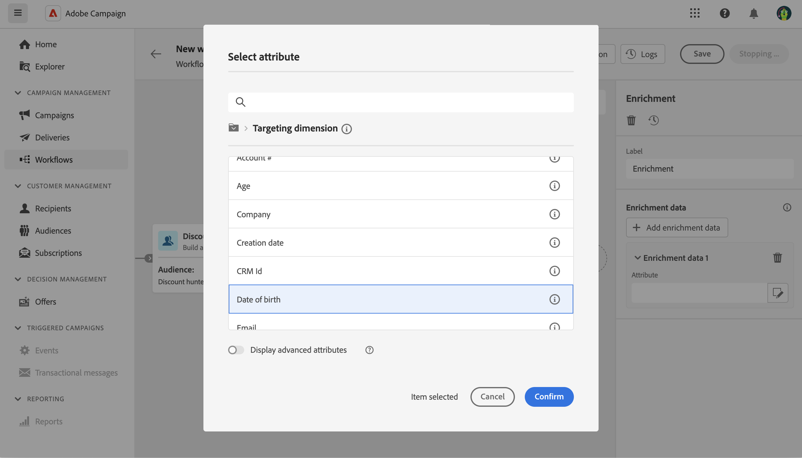

# Enrichissement {#enrichment}

>[!CONTEXTUALHELP]
>id="ajo_orchestration_enrichment"
>title="Activité Enrichissement"
>abstract="L’activité **Enrichissement** permet d’enrichir les données ciblées avec des informations supplémentaires provenant de la base de données. Elle est généralement utilisée dans un workflow après les activités de segmentation."

L’activité **Enrichissement** est une activité de **ciblage**. Elle permet d’enrichir les données ciblées avec des informations supplémentaires provenant de la base de données. Elle est généralement utilisée dans un workflow après les activités de segmentation.

Les données d’enrichissement tirent leur origine des sources suivantes :

* **À partir du même tableau de travail** que celui ciblé dans votre campagne à plusieurs étapes :

  *Ciblez un groupe de clientes et de clients et ajoutez le champ « Date de naissance » au tableau de travail actuel.*

* **Une autre table de travail** :

  *Ciblez un groupe de clients et de clientes et ajoutez les champs « Montant » et « Type de produit » provenant du tableau « Achat »*.

Une fois que les données d’enrichissement ont été ajoutées à la campagne à plusieurs étapes, vous pouvez les utiliser dans les activités ajoutées après l’activité **Enrichissement** pour segmenter les clients en groupes distincts en fonction de leurs comportements, préférences et besoins. Vous pouvez également vous en servir pour créer des messages et des campagnes marketing personnalisés qui résonneront davantage auprès de votre audience cible.

Par exemple, vous pouvez ajouter à la table de travail de la campagne à plusieurs étapes des informations relatives aux achats des clients et clientes et utiliser ces données pour personnaliser les e-mails en fonction de leur dernier achat ou du montant dépensé pour ces achats.

## Ajouter une activité Enrichissement {#enrichment-configuration}

Pour configurer l’activité **Enrichissement**, procédez comme suit :

1. Ajoutez des activités telles que **Créer une audience** et **Combiner**.
1. Ajoutez une activité **Enrichissement**.
1. Si plusieurs transitions ont été configurées dans votre campagne à plusieurs étapes, vous pouvez utiliser le champ **[!UICONTROL Ensemble de Principal]** pour définir la transition à utiliser comme ensemble principal pour enrichir avec des données.

## Ajouter des données d’enrichissement {#enrichment-add}

>[!CONTEXTUALHELP]
>id="ajo_targetdata_personalization_enrichmentdata"
>title="Données d’enrichissement"
>abstract="Sélectionnez les données à utiliser pour enrichir votre campagne à étapes multiples. Vous pouvez sélectionner deux types de données d’enrichissement : un seul attribut d’enrichissement de la dimension cible ou un lien de collection, qui est un lien avec une cardinalité 1-N entre les tableaux."

>[!CONTEXTUALHELP]
>id="ajo_orchestration_enrichment_data"
>title="Activité Enrichissement"
>abstract="Une fois que les données d’enrichissement ont été ajoutées à la campagne à étapes multiples, vous pouvez les utiliser dans les activités ajoutées après l’activité Enrichissement pour segmenter les clientes et clients en groupes distincts en fonction de leurs comportements, préférences et besoins. Vous pouvez également vous en servir pour créer des messages et des campagnes marketing personnalisés qui résonneront davantage auprès de votre audience cible."

1. Cliquez sur **Ajouter des données d’enrichissement** et sélectionnez l’attribut à utiliser pour enrichir les données.

   Vous pouvez sélectionner deux types de données d’enrichissement : un attribut d’enrichissement unique de la dimension cible, ou un lien de collection. Chacun de ces types est détaillé dans les exemples ci-dessous :
   * [Attribut d’enrichissement unique](#single-attribute)
   * [Lien de collection](#collection-link)

   >[!NOTE]
   >
   >Le **bouton Modifier l’expression** dans l’écran de sélection d’attributs vous permet de créer des expressions avancées pour sélectionner l’attribut.

   

## Créer des liens entre les tables {#create-links}

>[!CONTEXTUALHELP]
>id="ajo_orchestration_enrichment_simplejoin"
>title="Définition de lien"
>abstract="Créez un lien entre les données de la table de travail et Adobe Journey Optimizer. Par exemple, si vous chargez les données d’un fichier contenant le numéro de compte, le pays et l’adresse e-mail des personnes destinataires, vous devez créer un lien vers le tableau des pays afin de mettre à jour cette information dans leur profil."

La section **[!UICONTROL Définition du lien]** vous permet de créer un lien entre les données de la table de travail et Adobe Journey Optimizer. Par exemple, si vous chargez les données d’un fichier contenant le numéro de compte, le pays et l’adresse e-mail des personnes destinataires, vous devez créer un lien vers le tableau des pays afin de mettre à jour cette information dans leur profil.

Plusieurs types de liens sont disponibles :

* **[!UICONTROL Lien simple de cardinalité 1]** : chaque enregistrement de l’ensemble principal peut être associé à un seul enregistrement des données liées.
* **[!UICONTROL Lien simple de cardinalité 0 ou 1]** : chaque enregistrement de l’ensemble principal peut être associé à 0 ou 1 enregistrement des données liées (et pas plus de un).
* **[!UICONTROL Lien de collection de cardinalité N]** : chaque enregistrement de l’ensemble principal peut être associé à 0, 1 ou plus (N) d’enregistrements des données liées.

Pour créer un lien, procédez comme suit :

1. Dans la section **[!UICONTROL Définition du lien]**, cliquez sur le bouton **[!UICONTROL Ajouter un lien]**.

   

1. Dans la liste déroulante **Type de relation**, sélectionnez le type de lien que vous souhaitez créer.

1. Identifiez la cible à laquelle vous souhaitez lier l’ensemble principal :

   * Pour lier une table existante dans la base de données, choisissez **[!UICONTROL Schéma de base de données]** et sélectionnez la table souhaitée dans le champ **[!UICONTROL Schéma cible]**.
   * Pour créer un lien avec les données de la transition en entrée, choisissez **Schéma temporaire** et sélectionnez la transition dont vous souhaitez utiliser les données.

1. Définissez les critères de réconciliation pour faire correspondre les données de l’ensemble principal avec le schéma lié. Deux types de jointures sont disponibles :

   * **Jointure simple** : sélectionnez un attribut spécifique pour faire correspondre les données des deux schémas. Cliquez sur **Ajouter une jointure** et sélectionnez les attributs **Source** et **Destination** à utiliser comme critères de réconciliation.
   * **Jointure avancée** : créez une jointure à l’aide de conditions avancées. Cliquez sur **Ajouter une jointure** puis sur le bouton **Créer une condition** pour ouvrir le concepteur de requête.

Un exemple de workflow utilisant des liens est disponible dans la section [Exemples](#link-example).

## Réconciliation des données {#reconciliation}

>[!CONTEXTUALHELP]
>id="ajo_orchestration_enrichment_reconciliation"
>title="Réconciliation"
>abstract="L’activité **Enrichissement** peut être utilisée pour réconcilier des données provenant du schéma de Journey Optimizer avec des données issues d’un autre schéma, ou avec des données provenant d’un schéma temporaire, comme des données chargées à l’aide d’une activité Chargement de fichier. Ce type de lien définit une réconciliation vers un enregistrement unique. Journey Optimizer crée un lien vers un tableau cible en ajoutant une clé étrangère permettant de stocker une référence vers l’enregistrement unique."

L’activité **Enrichissement** peut être utilisée pour réconcilier des données provenant du schéma de la base de données Campaign avec des données issues d’un autre schéma, ou avec des données provenant d’un schéma temporaire, comme des données chargées à l’aide d’une activité Chargement de fichier. Ce type de lien définit une réconciliation vers un enregistrement unique. Journey Optimizer crée un lien vers un tableau cible en ajoutant une clé étrangère permettant de stocker une référence vers l’enregistrement unique.

Par exemple, vous pouvez utiliser cette option pour réconcilier le pays d’un profil, indiqué dans un fichier chargé, avec l’un des pays disponibles dans le tableau dédié de la base de données Campaign.

Procédez comme suit pour configurer une activité **Enrichissement** avec un lien de réconciliation :

1. Cliquez sur le bouton **Ajouter un lien** dans la section **Réconciliation**.
1. Identifiez les données avec lesquelles vous souhaitez créer un lien de réconciliation.

   * Pour créer un lien de réconciliation avec les données de la base de données Campaign, sélectionnez **Schéma de base de données** et choisissez le schéma dans lequel la cible est stockée.
   * Pour créer un lien de réconciliation avec les données provenant de la transition en entrée, sélectionnez **Schéma temporaire** et choisissez la transition de campagne à plusieurs étapes où seront stockées les données de la cible.

1. Les champs **Libellé** et **Nom** sont renseignés automatiquement en fonction du schéma cible sélectionné. Vous pouvez modifier leurs valeurs si nécessaire.

1. Dans la section **Critères de réconciliation**, indiquez comment vous souhaitez réconcilier les données des tableaux source et de destination :

   * **Jointure simple** : réconciliez un champ spécifique du tableau source avec un autre champ du tableau de destination. Pour ce faire, cliquez sur le bouton **Ajouter une jointure** et renseignez les champs **Source** et **Destination** à utiliser pour la réconciliation.

     >[!NOTE]
     >
     >Vous pouvez utiliser une **Jointure simple**, ou plusieurs, auquel cas elles doivent toutes être vérifiées afin que les données puissent être liées.

   * **Jointure avancée** : utilisez le concepteur de requête pour configurer les critères de réconciliation. Pour ce faire, cliquez sur le bouton **Créer une condition**, puis définissez vos critères de réconciliation en créant votre propre règle à l’aide des opérations ET et OU.

L’exemple ci-dessous illustre une campagne en plusieurs étapes configurée pour créer un lien entre la table des profils Journey Optimizer et une table temporaire générée par une activité **Chargement de fichier**. Dans cet exemple, l&#39;activité **Enrichissement** réconcilie les deux tables en utilisant l&#39;adresse e-mail comme critère de réconciliation.

## Ajout d&#39;offres {#add-offers}

>[!CONTEXTUALHELP]
>id="ajo_orchestration_enrichment_offer_proposition"
>title="Proposition d’offre"
>abstract="L’activité Enrichissement vous permet d’ajouter des offres à chaque profil."

L’activité **[!UICONTROL Enrichissement]** vous permet d’ajouter des offres pour chaque profil.

Pour ce faire, suivez les étapes pour configurer une activité **[!UICONTROL Enrichissement]** avec une offre :

1. Dans l’activité **[!UICONTROL Enrichissement]**, dans la section **[!UICONTROL Proposition d’offre]**, cliquez sur le bouton **[!UICONTROL Ajouter une offre]**.

   

1. Vous avez le choix entre deux options pour la sélection d’offre :

   * **[!UICONTROL Rechercher la meilleure offre dans une catégorie]** : cochez cette option et définissez les paramètres de l’appel au moteur d’offres (emplacement, catégorie ou thème(s), date de contact, nombre d’offres à conserver). Le moteur calculera la ou les meilleures offres à ajouter en fonction de ces paramètres. Il est conseillé de renseigner l’un ou l’autre des champs Catégorie et Thème, mais pas les deux en même temps.

     

   * **[!UICONTROL Une offre prédéfinie]** : cochez cette option et définissez un emplacement, une offre précise, ainsi qu’une date de contact afin de directement paramétrer l’offre que vous souhaitez ajouter, sans appeler le moteur d’offres.

     

1. Après avoir sélectionné votre offre, cliquez sur le bouton **[!UICONTROL Confirmer]**.

Vous pouvez maintenant utiliser l’offre dans l’activité de diffusion.

### Utilisation des offres de l’activité Enrichissement

Dans une campagne à plusieurs étapes, si vous souhaitez utiliser les offres que vous obtenez d’une activité d’enrichissement dans votre diffusion, procédez comme suit :

1. Ouvrez l’activité de diffusion et lancez la modification de contenu. Cliquez sur le bouton **[!UICONTROL Paramètres des offres]** et sélectionnez dans la liste déroulante l’**[!UICONTROL Emplacement]** correspondant à votre offre.
Si vous souhaitez afficher uniquement les offres de l’activité Enrichissement, définissez le nombre de **[!UICONTROL Propositions]** sur 0, puis enregistrez les modifications.

   

1. Dans le concepteur d’e-mail, lors de l’ajout d’une personnalisation avec des offres, cliquez sur l’icône **[!UICONTROL Propositions]** qui affiche la ou les offres que vous obtenez de l’activité **[!UICONTROL Enrichissement]**. Ouvrez l’offre que vous souhaitez sélectionner en cliquant dessus.

   

   Accédez à **[!UICONTROL Fonctions de rendu]** et sélectionnez **[!UICONTROL Rendu HTML]** ou **[!UICONTROL Rendu de texte]** en fonction de vos besoins.

   

>[!NOTE]
>
>Si vous choisissez d’avoir plusieurs offres dans l’activité **[!UICONTROL Enrichissement]** à l’option **[!UICONTROL Nombre d’offres à conserver]**, toutes les offres sont affichées en cliquant sur l’icône **[!UICONTROL Propositions]**.

## Exemples {#example}

### Attribut d’enrichissement unique {#single-attribute}

Ici, nous ajoutons un seul attribut d’enrichissement, par exemple, la date de naissance. Procédez comme suit :

1. Cliquez dans le champ **Attribut**.
1. Sélectionnez un champ simple dans la dimension de ciblage, la date de naissance dans notre exemple.
1. Cliquez sur **Confirmer**.

### Lien de collecte {#collection-link}

Dans ce cas pratique plus complexe, nous sélectionnons un lien de collecte qui est un lien avec une cardinalité 1-N entre les tableaux. Récupérons les trois derniers achats inférieurs à 100 USD. Pour cela, vous devez définir :

* un attribut d’enrichissement : le champ **Prix** ;
* le nombre de lignes à récupérer : 3 ;
* un filtre : filtrez les éléments supérieurs à 100 USD ;
* un tri : tri descendant sur le champ **Date de commande**.

#### Ajouter l’attribut {#add-attribute}

C’est là que vous sélectionnez le lien de collecte à utiliser comme données d’enrichissement.

1. Cliquez dans le champ **Attribut**.
1. Cliquez sur **Afficher les attributs avancés**.
1. Sélectionnez le champ **Prix** dans le tableau **Achats**.

<!--  -->

#### Définir les paramètres de la collecte{#collection-settings}

Définissez ensuite la manière dont les données sont collectées et le nombre d’enregistrements à récupérer.

1. Sélectionnez **Collecter des données** dans le menu déroulant **Sélectionner la manière de collecter les données**.
1. Saisissez « 3 » dans le champ **Lignes à récupérer (Colonnes à créer)**.

Si vous souhaitez, par exemple, obtenir le montant moyen des achats d’un client ou une cliente, sélectionnez **Données agrégées**, puis **Moyenne** dans le menu déroulant **Fonction d’agrégat**.

Utilisez les champs **Libellé** et **Alias** de votre attribut afin de le rendre plus compréhensible comme illustré ci-dessous.

#### Définir des filtres{#collection-filters}

Ici, nous définissons la valeur maximale de l’attribut d’enrichissement. Nous filtrons les éléments supérieurs à 100 USD.
1. Cliquez sur **Créer des filtres**.
1. Ajoutez les deux filtres suivants : **Prix** existe ET **Prix** est inférieur à 100. Le premier filtre les valeurs NULL, car elles apparaissent comme la valeur la plus élevée.
1. Cliquez sur **Confirmer**.

#### Définir le tri{#collection-sorting}

Nous devons maintenant appliquer un tri pour récupérer les trois **derniers** achats.

1. Activez l’option **Activer le tri**.
1. Cliquez dans le champ **Attribut**.
1. Sélectionnez le champ **Date de commande**.
1. Cliquez sur **Confirmer**.
1. Sélectionnez **Descendant** dans le menu déroulant **Tri**.

### Enrichissement avec des données liées {#link-example}

L’exemple ci-dessous montre une campagne en plusieurs étapes configurée pour créer un lien entre deux transitions. La première transition cible les données de profil à l’aide d’une activité **Requête**, tandis que la seconde transition inclut les données d’achat stockées dans un fichier chargé via une activité Chargement de fichier.

* La première activité **Enrichissement** lie l’ensemble principal (données issues de l’activité **Requête**) au schéma de l’activité **Chargement de fichier**. Cela nous permet de faire correspondre chaque profil ciblé par la requête avec les données d’achat correspondantes.

  

* Une deuxième activité **Enrichissement** est ajoutée afin d&#39;enrichir les données de la table de campagne à plusieurs étapes avec les données d&#39;achat provenant de l&#39;activité **Chargement de fichier**. Cela nous permet d’utiliser ces données dans d’autres activités, par exemple pour personnaliser les messages envoyés aux clientes et clients avec des informations sur leur achat.

  
