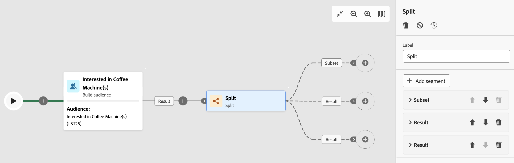

# Partage {#split}

>[!CONTEXTUALHELP]
>id="ajo_orchestration_split"
>title="Activité Partage"
>abstract="L’activité **Partage** permet de segmenter les populations entrantes en plusieurs sous-ensembles selon différents critères de sélection, tels que les règles de filtrage ou la taille de la population."

L’activité **Partage** est une activité de **ciblage** vous permettant de segmenter les populations entrantes en plusieurs sous-ensembles selon différents critères de sélection, tels que les règles de filtrage ou la taille de la population.

## Configurer l’activité Partage {#split-configuration}

>[!CONTEXTUALHELP]
>id="ajo_orchestration_split_segments"
>title="Segments de l’activité de partage"
>abstract="Ajoutez autant de sous-ensembles que vous le souhaitez pour segmenter la population entrante.  Lorsque l’activité **Partage** est exécutée, la population est segmentée entre les différents sous-ensembles dans l’ordre dans lequel ils sont ajoutés à l’activité. Avant de commencer votre campagne à plusieurs étapes, assurez-vous d’avoir trié les sous-ensembles dans l’ordre adapté à vos besoins à l’aide des boutons fléchés."

>[!CONTEXTUALHELP]
>id="ajo_orchestration_split_filter"
>title="Filtre de l’activité Partage"
>abstract="Pour appliquer une condition de filtrage au sous-ensemble, cliquez sur **[!UICONTROL Créer un filtre]** et configurez la règle de filtrage souhaitée à l’aide du concepteur de requête. Par exemple, incluez les profils de la population entrante dont l’adresse e-mail existe dans la base de données."

>[!CONTEXTUALHELP]
>id="ajo_orchestration_split_limit"
>title="Limite de l’activité Partage"
>abstract="Pour limiter le nombre de profils sélectionnés par le sous-ensemble, activez la fonction **[!UICONTROL Activer la limite]** et indiquez le nombre ou les pourcentages de la population à inclure."

>[!CONTEXTUALHELP]
>id="ajo_orchestration_split_sorting"
>title="Tri de l’activité Partage"
>abstract="Lorsque vous définissez une limite de population pour un sous-ensemble, vous pouvez classer les profils sélectionnés en fonction d’un attribut de profil spécifique, dans un ordre croissant ou décroissant. Pour ce faire, activez l’option **Activer le tri**. Par exemple, vous pouvez restreindre un sous-ensemble afin de n’inclure que les 50 premiers profils qui ont le montant d’achat le plus élevé."

>[!CONTEXTUALHELP]
>id="ajo_orchestration_split_complement"
>title="Générer un complément pour l’activité Partage"
>abstract="Une fois que vous avez paramétré tous les sous-ensembles, vous pouvez sélectionner la population restante qui ne correspond à aucun des sous-ensembles et les inclure dans une transition sortante supplémentaire. Pour ce faire, activez l’option **Générer un complément**."

>[!CONTEXTUALHELP]
>id="ajo_orchestration_split_generatesubsets"
>title="Générer tous les sous-ensembles dans le même tableau"
>abstract="Activez cette option pour regrouper tous les sous-ensembles dans une seule transition sortante."

>[!CONTEXTUALHELP]
>id="ajo_orchestration_split_emptytransition"
>title="Ignorer la transition vide"
>abstract="Activez l’option **[!UICONTROL Ignorer la transition vide]** pour désactiver la transition sortante pour ce sous-ensemble si la population entrante est vide."

>[!CONTEXTUALHELP]
>id="ajo_orchestration_split_enable_overlapping"
>title="Permettre le chevauchement des populations de sortie"
>abstract=" L’option **[!UICONTROL Permettre le chevauchement des populations de sortie]** permet de gérer les populations qui appartiennent à plusieurs sous-ensembles. Lorsque la case n’est pas cochée, l’activité de partage fait en sorte qu’une personne destinataire ne puisse pas apparaître dans plusieurs transitions de sortie, même si elle répond aux critères de plusieurs sous-ensembles. Elles apparaissent ainsi dans la cible du premier onglet avec les critères correspondants. Lorsque la case est activée, les destinataires se trouvent dans plusieurs sous-ensembles s’ils ou elles répondent à leurs critères de filtre."

Pour configurer l’activité **Partage**, procédez comme suit :

1. Ajoutez une activité **Partage** à votre campagne à plusieurs étapes.

1. Le volet de configuration des activités s’ouvre avec un sous-ensemble par défaut. Cliquez sur le bouton **Ajouter un segment** pour ajouter autant de sous-ensembles que vous le souhaitez pour segmenter la population entrante.

   

   >[!IMPORTANT]
   >
   >Lorsque l’activité **Partage** est exécutée, la population est segmentée entre les différents sous-ensembles dans l’ordre dans lequel ils sont ajoutés à l’activité. Par exemple, si le premier sous-ensemble récupère 70 % de la population initiale, le sous-ensemble ajouté suivant n’appliquera ses critères de sélection qu’aux 30 % restants, etc.
   >
   >Avant de commencer votre campagne à plusieurs étapes, assurez-vous d’avoir ordonné les sous-ensembles dans l’ordre adapté à vos besoins. Pour ce faire, utilisez les boutons fléchés pour changer la position d’un sous-ensemble.

1. Une fois les sous-ensembles ajoutés, l’activité propose autant de transitions en sortie que de sous-ensembles : Nous vous recommandons vivement de modifier le libellé de chaque sous-ensemble pour les identifier facilement dans la zone de travail de campagne à plusieurs étapes.

1. Configurez la manière dont chaque sous-ensemble doit filtrer la population entrante. Pour ce faire, procédez comme suit :

   1. Ouvrez le sous-ensemble pour afficher ses propriétés.

   1. Pour appliquer une condition de filtrage au sous-ensemble, cliquez sur **[!UICONTROL Créer un filtre]** et configurez la règle de filtrage souhaitée à l’aide du concepteur de requête. Par exemple, incluez les profils de la population entrante dont l’adresse e-mail existe dans la base de données.

   1. Pour limiter le nombre de profils sélectionnés par le sous-ensemble, activez la fonction **[!UICONTROL Activer la limite]** et indiquez le nombre ou les pourcentages de la population à inclure.

   1. Pour désactiver une transition si la population entrante est vide, activez l’option **[!UICONTROL Ignorer la transition vide]**. Si aucun profil ne correspond au sous-ensemble, la campagne à plusieurs étapes ne passera pas à l’activité suivante.

      

1. Une fois que vous avez paramétré tous les sous-ensembles, vous pouvez sélectionner la population restante qui ne correspond à aucun des sous-ensembles et les inclure dans une transition sortante supplémentaire. Pour ce faire, activez l’option **[!UICONTROL Générer un complément]**.

   

   >[!NOTE]
   >
   >L’option **[!UICONTROL Générer tous les sous-ensembles dans le même tableau]** vous permet de regrouper tous les sous-ensembles dans une seule transition sortante.

1. L&#39;option **[!UICONTROL Permettre le recouvrement des populations de sortie]** permet de gérer les populations qui appartiennent à plusieurs sous-ensembles :

   * Lorsque la case est décochée, l&#39;activité de partage assure qu&#39;un destinataire ne sera pas présent dans plusieurs transitions en sortie, même s&#39;il vérifie les critères de plusieurs sous-ensembles. Il sera dans la cible du premier onglet dont les critères sont vérifiés.
   * Lorsque la case est activée, les destinataires se trouvent dans plusieurs sous-ensembles s’ils ou elles répondent à leurs critères de filtre. Une bonne pratique consiste à utiliser des critères exclusifs.

L’activité est désormais configurée. Lors de l&#39;exécution de la campagne en plusieurs étapes, la population est segmentée en différents sous-ensembles, dans l&#39;ordre dans lequel ils ont été ajoutés à l&#39;activité.

## Exemple{#split-example}

Dans l’exemple suivant, l’activité **[!UICONTROL Partage]** sert à segmenter une audience en sous-ensembles distincts en fonction du canal de communication que nous voulons utiliser :

* **Sous-ensemble 1 « notification push »** : ce sous-ensemble comprend tous les profils ayant installé notre application mobile.
* **Sous-ensemble 2 « SMS »** : utilisateurs et utilisatrices de téléphone mobile : pour la population restante qui ne faisait pas partie du sous-ensemble 1, le sous-ensemble 2 applique une règle de filtrage afin de sélectionner les profils avec des téléphones mobiles dans la base de données.
* **Transition complémentaire** : cette transition capture tous les profils restants qui ne correspondent pas au sous-ensemble 1 ou au sous-ensemble 2. Plus précisément, elle inclut les profils qui n’ont pas installé l’application mobile ou qui n’ont pas de téléphone mobile, tels que les utilisateurs et utilisatrices qui n’ont pas installé l’application mobile ou qui ne disposent pas d’un numéro de mobile enregistré.

