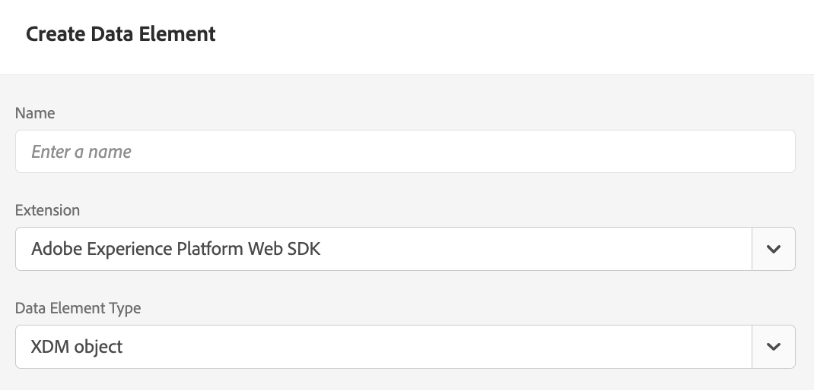

# Diffuser des offres à l’aide de l’API Edge Decisioning {#edge-decisioning-api}

## Prise en main et prérequis {#edge-overview-and-prerequisites}

Le [SDK web d’Adobe Experience Platform](https://experienceleague.adobe.com/docs/experience-platform/edge/home.html?lang=fr#vue-d%E2%80%99ensemble-des-vid%C3%A9os) est une bibliothèque JavaScript côté client qui permet aux clients d’Adobe Experience Cloud d’interagir avec les différents services d’Experience Cloud à l’aide d’Experience Platform Edge Network.

Le SDK web Experience Platform prend en charge la demande des solutions de personnalisation auprès d’Adobe, dont la gestion des décisions, ce qui vous permet de récupérer et de générer des offres personnalisées que vous avez créées à l’aide des API ou de la bibliothèque des offres. Pour obtenir des instructions plus détaillées, consultez la documentation sur la [création d’une offre](../../get-started/starting-offer-decisioning.md).

Vous pouvez mettre en œuvre la gestion des décisions de deux façons différentes à l’aide du [SDK web de Platform](https://experienceleague.adobe.com/docs/experience-platform/edge/home.html?lang=fr#vue-d%E2%80%99ensemble-des-vid%C3%A9os). La première est destinée aux développeurs et nécessite des connaissances en matière de sites web et de programmation. L’autre méthode consiste à utiliser l’interface utilisateur d’Adobe Experience Platform pour configurer les offres. Seul un petit script à référencer dans l’en-tête de la page HTML sera nécessaire.

Pour plus d’informations sur la diffusion d’offres personnalisées à l’aide du SDK web Adobe Experience Platform, consultez la documentation Adobe Experience Platform sur la [gestion des décisions](https://experienceleague.adobe.com/docs/experience-platform/edge/personalization/offer-decisioning/offer-decisioning-overview.html?lang=fr#activation-de-l%E2%80%99offer-decisioning).

## SDK web Adobe Experience Platform {#aep-web-sdk}

Le SDK web de Platform remplace les SDK suivants :

* Visitor.js
* AppMeasurement.js
* AT.js
* DIL.js

Le SDK n’a pas combiné ces bibliothèques. Il s’agit d’une nouvelle implémentation à partir de zéro. Pour l’utiliser, procédez comme suit :

1. Assurez-vous que votre entreprise dispose des autorisations appropriées pour utiliser le SDK et que vous les avez configurées correctement.

   <!-- For more detailed instructions, refer to the documentation on using the [Adobe Experience Platform Web SDK](). -->

1. [Configurez votre train de données](https://experienceleague.adobe.com/docs/experience-platform/edge/fundamentals/datastreams.html?lang=fr) dans l’onglet Collecte de données de votre compte dans Adobe Experience Cloud.

1. Installez le SDK. Pour ce faire, plusieurs méthodes sont à votre disposition. Elles sont décrites sur la page [Installer le SDK](https://experienceleague.adobe.com/docs/experience-platform/edge/fundamentals/installing-the-sdk.html?lang=fr). La présente page décrit chacune des méthodes d’implémentation.

Pour utiliser le SDK, vous devez disposer d’un [schéma](../../../data/get-started-schemas.md) et d’un [flux de données](../../../data/get-started-datasets.md) définis.

<!-- ****TODO - Configure schema**** -->

Pour personnaliser les offres, vous devez configurer séparément vos options de personnalisation/profils.

<!-- Refer to the [doc](www.link.com) for detailed instructions.  -->

>[!NOTE]
>
>**Transmission de données contextuelles dans les requêtes Edge Decisioning**
>
>Vous pouvez transmettre des données contextuelles (telles que le type d’appareil, l’emplacement ou les préférences utilisateur) dans vos requêtes Edge Decisioning pour créer des règles d’éligibilité dynamiques et diffuser des offres personnalisées en fonction des conditions en temps réel. [En savoir plus sur les demandes de données contextuelles et de prise de décision Edge](../../context-data-edge.md)

Pour configurer le SDK pour la gestion des décisions, procédez à l’une des deux étapes ci-dessous :

## Option 1 : installer l’extension de balise et l’implémentation à l’aide de Launch

Cette approche est plus conviviale pour les personnes qui ont moins d’expérience en matière de codage.

1. [Créer une propriété de balise](https://experienceleague.adobe.com/docs/experience-platform/tags/admin/companies-and-properties.html?lang=fr)

1. [Ajouter du code intégré](https://experienceleague.adobe.com/docs/core-services-learn/implementing-in-websites-with-launch/configure-launch/launch-add-embed.html?lang=fr)

1. Installez et configurez l’extension SDK web Adobe Experience Platform avec le train de données créé lors de la sélection de la configuration dans la liste déroulante « Train de données ». Consultez la documentation relative aux [extensions](https://experienceleague.adobe.com/docs/experience-platform/tags/ui/extensions/overview.html?lang=fr).

   

   

1. Créez les [Éléments de données](https://experienceleague.adobe.com/docs/experience-platform/tags/ui/data-elements.html?lang=fr) nécessaires. Au minimum, vous devez créer un mappage d’identité SDK web Platform et un élément de données objet XDM du SDK web Platform.

   

   

1. Créez vos [Règles](https://experienceleague.adobe.com/docs/experience-platform/tags/ui/rules.html?lang=fr) en procédant comme suit :

   Ajoutez une action d’envoi d’événement pour le SDK web Platform et ajoutez les portées de décision appropriées à la configuration de cette action.

   

   

1. [Créez et publiez](https://experienceleague.adobe.com/docs/experience-platform/tags/publish/libraries.html?lang=fr) une bibliothèque contenant toutes les règles, éléments de données et extensions pertinents que vous avez configurés.

## Option 2 : implémenter manuellement à l’aide de la version autonome préconfigurée

Pour utiliser la gestion des décisions avec l’installation autonome préconfigurée du SDK Web, procédez comme suit. Ce guide part du principe qu’il s’agit de votre première implémentation du SDK. Il se peut donc que certaines étapes ne vous concernent pas. Ce guide suppose également que vous possédez déjà des connaissances en matière de développement.

Incluez le fragment de code JavaScript suivant provenant de la section « Option 2 : version autonome préconfigurée » sur [cette page](https://experienceleague.adobe.com/docs/experience-platform/edge/fundamentals/installing-the-sdk.html?lang=fr) dans la section `<head>` de votre page HTML.

```
javascript
    <script>
        !function(n,o){o.forEach(function(o){n[o]||((n.__alloyNS=n.__alloyNS||
        []).push(o),n[o]=function(){var u=arguments;return new Promise(
        function(i,l){n[o].q.push([i,l,u])})},n[o].q=[])})}
        (window,["alloy"]);
    </script>
    <script src="https://cdn1.adoberesources.net/alloy/2.6.4/alloy.js" async></script>
```

Pour configurer le SDK, vous aurez besoin des deux identifiants suivants de votre compte Adobe : edgeConfigId et orgId. edgeConfigId est le même que votre ID de flux de données, que vous avez configuré dans les prérequis.

Pour trouver votre edgeConfigID/ID de flux de données, accédez à Collecte de données et sélectionnez votre flux de données. Pour trouver votre orgId, accédez à votre profil.

Configurez le SDK dans JavaScript en suivant les instructions fournies sur cette page. Vous utiliserez toujours votre edgeConfigId et orgId dans la fonction de configuration. La documentation décrit également les paramètres facultatifs qui existent pour votre configuration. Votre configuration finale peut se présenter comme suit :

```
javascript
    alloy("configure", {
        "edgeConfigId": "12345678-0ABC-DEF-GHIJ-KLMNOPQRSTUV",                            
        "orgId":"ABCDEFGHIJKLMNOPQRSTUVW@AdobeOrg",
        "debugEnabled": true,
        "edgeDomain": "edge.adobedc.net",
        "clickCollectionEnabled": true,
        "idMigrationEnabled": true,
        "thirdPartyCookiesEnabled": true,
        "defaultConsent":"in"  
    });
```

Installez l’extension Chrome Debugger à des fins de débogage. Téléchargez-la ici : <https://chrome.google.com/webstore/detail/adobe-experience-platform/bfnnokhpnncpkdmbokanobigaccjkpob>

Ensuite, connectez-vous à votre compte dans le débogueur. Accédez aux Journaux et vérifiez que vous êtes connecté à l’espace de travail approprié. Copiez à présent la version codée en base64 de la portée de décision de votre offre.

Lors de la modification de votre site web, incluez le script avec la configuration et la fonction `sendEvent` pour envoyer la portée de décision à Adobe.

**Exemple** :

```
javascript
    alloy("sendEvent", {
        "decisionScopes": 
        [
        "eyJ4ZG06YWN0aXZpdHlJZCI6Inhjb3JlOm9mZmVyLWFjdGl2aXR5OjE0ZWE4MDhhZjJjZDM1NzQiLCJ4ZG06cGxhY2VtZW50SWQiOiJ4Y29yZTpvZmZlci1wbGFjZW1lbnQ6MTRjNGFmZDI2OTXXXXXXXXXX"
        ]
    });
```

Consultez l’exemple suivant illustrant comment gérer la réponse :

```
javascript
    alloy("sendEvent", {
        "decisionScopes":
        [
        "eyJ4ZG06YWN0aXZpdHlJZCI6Inhjb3JlOm9mZmVyLWFjdGl2aXR5OjE0ZWE4MDhhZjJjZDM1NzQiLCJ4ZG06cGxhY2VtZW50SWQiOiJ4Y29yZTpvZmZlci1wbGFjZW1lbnQ6MTRjNGFmZDI2OTXXXXXXXXXX"
        ]
    }).then(function(result) {
        Object.entries(result).forEach(([key, value]) => {
            console.log(key, value);
        });
    });
```

Vous pouvez utiliser le débogueur pour vérifier que vous êtes bien connecté au réseau Edge.

>[!NOTE]
>
>Si vous ne voyez pas de connexion à Edge dans les journaux, vous devez peut-être désactiver votre bloqueur de publicités.

Reportez-vous à la façon dont vous avez créé votre offre et à la mise en forme utilisée. En fonction des critères rencontrés dans la décision, une offre vous sera renvoyée contenant les informations que vous avez spécifiées lors de sa création dans Adobe Experience Platform.

Dans cet exemple, le code JSON à renvoyer est le suivant :

```
json
{
   "name":"ABC Test",
   "description":"This is a test offer", 
   "link":"https://sampletesting.online/",
   "image":"https://sample-demo-URL.png"
}
```

Gérez l’objet de réponse et analysez les données dont vous avez besoin. Comme vous pouvez envoyer plusieurs portées de décision en un seul appel `sendEvent`, votre réponse peut être légèrement différente.

```
json
    {
        "id": "abrxgl843d913",
        "scope": "eyJ4ZG06YWN0aXZpdHlJZCI6Inhjb3JlOm9mZmVyLWFjdGl2aXR5OjE0ZWE4MDhhZjJjZDM1NzQiLCJ4ZG06cGxhY2VtZW50SWQiOiJ4Y29yZTpvZmZlci1wbGFjZW1lbnQ6MTRjNGFmZDI2OTVlNWRmOSJ9",
        "items": 
        [
            {
                "id": "xcore:fallback-offer:14ea7f1ea26ebd0a",
                "etag": "1",
                "schema": "https://ns.adobe.com/experience/offer-management/content-component-json",
                "data": {
                    "id": "xcore:fallback-offer:14ea7f1ea26ebd0a",
                    "format": "application/json",
                    "language": [
                        "en-us"
                    ],
                    "content": "{\"name\":\"ABC Test\",\"description\":\"This is a test offer\", \"link\":\"https://sampletesting.online/\",\"image\":\"https://sample-demo-URL.png\"}"
                }
            }
        ]
    }
]
}
```

```
json
{
    "propositions": 
    [
    {
        "renderAttempted": false,
        "id": "e15ecb09-993e-4b66-93d8-0a4c77e3d913",
        "scope": "eyJ4ZG06YWN0aXZpdHlJZCI6Inhjb3JlOm9mZmVyLWFjdGl2aXR5OjE0ZWE4MDhhZjJjZDM1NzQiLCJ4ZG06cGxhY2VtZW50SWQiOiJ4Y29yZTpvZmZlci1wbGFjZW1lbnQ6MTRjNGFmZDI2OTVlNWRmOSJ9",
        "items": 
        [
            {
                "id": "xcore:fallback-offer:14ea7f1ea26ebd0a",
                "etag": "1",
                "schema": "https://ns.adobe.com/experience/offer-management/content-component-json",
                "data": {
                    "id": "xcore:fallback-offer:14ea7f1ea26ebd0a",
                    "format": "application/json",
                    "language": [
                        "en-us"
                    ],
                    "content": "{\"name\":\"Claire Hubacek Test\",\"description\":\"This is a test offer\", \"link\":\"https://sampletesting.online/\",\"image\":\"https://sample-demo-URL.png\"}"
                }
            }
        ]
    }
    ]
}
```

Dans cet exemple, le chemin d’accès nécessaire pour traiter et utiliser les détails spécifiques à l’offre dans la page web était : `result['decisions'][0]['items'][0]['data']['content']`

Pour définir les variables JS, spécifiez ceci :

```
javascript
const offer = JSON.parse(result['decisions'][0]['items'][0]['data']['content']);

let offerURL = offer['link'];
let offerDescription = offer['description'];
let offerImageURL = offer['image'];

document.getElementById("offerDescription").innerHTML = offerDescription;
document.getElementById('offerImage').src = offerImageURL;
```

<!--## Limitations

Some offer constraints are currently not supported with the mobile Experience Edge workflows, for example Capping. The Capping field value specifies the number of times an offer can be presented across all users. For more details, see [Add constraints to an offer](../../offer-library/add-constraints.md#capping).-->
