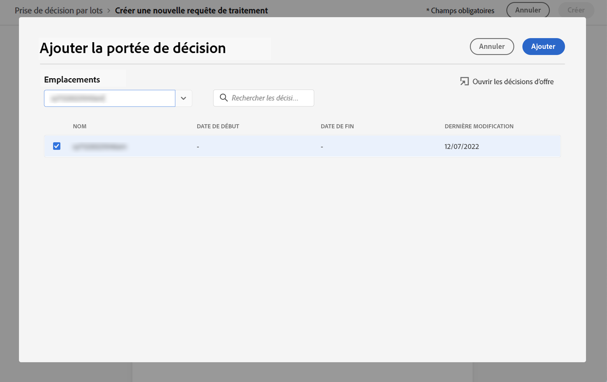

# Prise de décision par lots {#deliver}

## Prise en main de la prise de décision par lots {#start}

Journey Optimizer vous permet de diffuser les décisions d’offre à tous les profils d’un segment Adobe Experience Platform donné.

Pour ce faire, vous devez créer une requête de tâche dans Journey Optimizer qui contiendra des informations sur le segment à cibler et la décision d’utilisation de l’offre. Le contenu de l’offre pour chaque profil du segment est ensuite placé dans un jeu de données Adobe Experience Platform où il est disponible pour les workflows par lots personnalisés.

La remise par lots peut également être effectuée à l’aide d’API. Voir à ce sujet la section [Documentation de l’API Batch Decisioning](api-reference/offer-delivery-api/batch-decisioning-api.md).

## Conditions préalables {#prerequisites}

Avant de configurer une requête de tâche, assurez-vous d’avoir créé :

* **Un jeu de données** dans Adobe Experience Platform. Ce jeu de données sera utilisé pour stocker le résultat de la décision à l’aide du schéma &quot;ODE DecisionEvents&quot;. En savoir plus dans la section [Documentation sur les jeux de données](https://experienceleague.adobe.com/docs/experience-platform/catalog/datasets/overview.html?lang=fr).

* **Un segment** dans Adobe Experience Platform. Le segment doit être évalué, puis mis à jour. Découvrez comment mettre à jour l’évaluation de l’appartenance à un segment dans le [Documentation de Segmentation Service](http://www.adobe.com/go/segmentation-overview-en_fr)

   >[!NOTE]
   >
   >Une tâche par lot s’exécute sur l’instantané de profil qui se produit une fois par jour. La prise de décision par lots limite la fréquence et charge toujours les profils à partir de l’instantané le plus récent.

* **Une décision** dans Adobe Journey Optimizer. [Découvrez comment créer une décision](offer-activities/create-offer-activities.md)

<!-- in API doc, remove these info and add ref here-->

## Création d’une requête de tâche

Pour créer une requête de tâche, procédez comme suit.

1. Dans le **[!UICONTROL Offres]** , ouvrez le menu **[!UICONTROL Prise de décision par lots]** puis cliquez sur **[!UICONTROL Créer une requête]**.

   

1. Nommez votre requête de tâche, puis sélectionnez le jeu de données dans lequel les données de tâche doivent être envoyées.

1. Sélectionnez le segment Adobe Experience Platform à cibler.

1. Sélectionnez une ou plusieurs portées de décision d’offre à utiliser pour diffuser des offres au segment :
   1. Sélectionnez un emplacement dans la liste. 
   1. Les décisions disponibles pour l’emplacement sélectionné s’affichent. Sélectionnez la décision de votre choix et cliquez sur **[!UICONTROL Ajouter]**.
   1. Répétez l’opération pour ajouter autant de portées de décision que vous le souhaitez.

   

1. Par défaut, une offre de la portée de la décision est renvoyée pour chaque profil. Vous pouvez ajuster le nombre d’offres renvoyées à l’aide de la variable **[!UICONTROL Demande d’offre par profil]** . Par exemple, si vous sélectionnez 2, les 2 meilleures offres s’affichent pour la portée de décision sélectionnée.

   >[!NOTE]
   >
   >Vous pouvez demander jusqu’à 30 offres par portée de décision.

1. Si vous souhaitez inclure le contenu de l’offre dans le jeu de données, faites basculer le **[!UICONTROL Inclure le contenu]** sur . Par défaut, cette option est désactivée.

1. Cliquez sur **[!UICONTROL Créer]** pour exécuter la requête de tâche.

## Surveillance des tâches par lots

Toutes les tâches par lots demandées sont accessibles à partir du **[!UICONTROL Prise de décision par lots]** . De plus, des outils de recherche et de filtrage sont disponibles pour vous aider à affiner la liste.

### Statuts des requêtes de tâche

Une fois qu’une requête de tâche a été créée, la tâche par lots passe par plusieurs états :

>[!NOTE]
>
>Pour vous assurer que vous obtenez les dernières informations sur l’état d’une requête de tâche, utilisez le bouton représentant une ellipse en regard de la tâche pour l’actualiser.

1. **[!UICONTROL En file d&#39;attente]**: La requête de tâche a été créée et est entrée dans la file d’attente de traitement. Jusqu’à 5 tâches par lot peuvent être exécutées à la fois par jeu de données. Toutes les autres requêtes par lots avec le même jeu de données de sortie sont ajoutées à la file d’attente. Une tâche en file d’attente est sélectionnée pour traitement une fois que la tâche précédente a fini son exécution.
1. **[!UICONTROL Traitement]**: La requête de tâche est en cours de traitement.
1. **[!UICONTROL Ingestion]**: La requête de tâche a été exécutée, les données de résultat sont ingérées dans le jeu de données sélectionné,
1. **[!UICONTROL Terminé]**: La requête de tâche a été exécutée et les données de résultat sont désormais stockées dans le jeu de données sélectionné.

   >[!NOTE]
   >
   >Vous pouvez accéder au jeu de données dans lequel les résultats d’une tâche sont stockés en cliquant sur son nom dans la liste des tâches.

Si une erreur se produit lors de l’exécution de la requête de tâche, celle-ci reçoit la valeur **[!UICONTROL Erreur]** statut. Essayez de dupliquer la tâche par lots pour créer une requête. [Découvrez comment dupliquer une tâche par lots](#duplicate)

### Durée de traitement des tâches par lots

L’heure de bout en bout de chaque tâche par lot correspond à la durée entre le moment où la charge de travail est créée et le moment où le résultat de la décision est disponible dans le jeu de données de sortie.

La taille du segment est le facteur principal qui affecte le temps de décision du lot de bout en bout. Si le plafond global de fréquence est activé pour l’offre éligible, la prise de décision par lots prend plus de temps. Vous trouverez ci-dessous quelques approximations du temps de traitement de bout en bout pour leurs tailles de segment respectives, avec ou sans limitation de fréquence pour les offres éligibles :

Avec le plafonnement de fréquence activé pour les offres éligibles :

| Taille du segment | Temps de traitement de bout en bout |
|--------------|----------------------------|
| 10 000 profils ou moins | 7 minutes |
| 1 million de profils ou moins | 30 minutes |
| 15 million de profils ou moins | 50 minutes |

Sans limite de fréquence pour les offres éligibles :

| Taille du segment | Temps de traitement de bout en bout |
|--------------|----------------------------|
| 10 000 profils ou moins | 6 minutes |
| 1 million de profils ou moins | 8 minutes |
| 15 million de profils ou moins | 16 minutes |

## Dupliquer une requête de tâche {#duplicate}

Vous pouvez réutiliser les informations d’une tâche existante pour créer une nouvelle requête.

Pour ce faire, cliquez sur l’icône en forme de doublon, modifiez les informations de la tâche si nécessaire, puis cliquez sur **[!UICONTROL Créer]** pour créer la requête.

