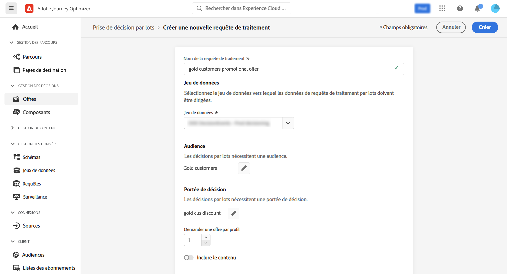
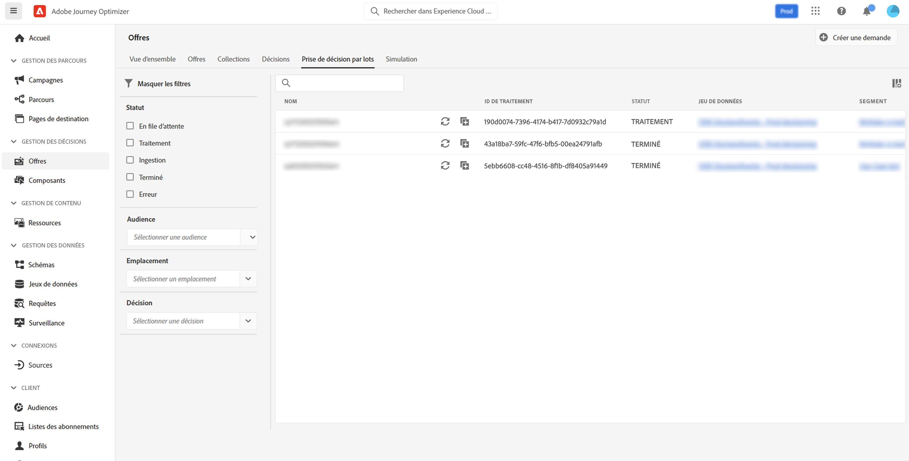

# Prise de décision par lots {#deliver}

>[!TIP]
>
>La prise de décision, la nouvelle fonctionnalité de prise de décision d’[!DNL Adobe Journey Optimizer], est désormais disponible via les canaux d’expérience basée sur du code et d’e-mail. [En savoir plus](../experience-decisioning/gs-experience-decisioning.md)

## Prise en main de la diffusion de décisions par lots {#start}

Journey Optimizer vous permet de diffuser les décisions d’offres à tous les profils d’une audience Adobe Experience Platform donnée.

Pour ce faire, vous devez créer une requête de traitement dans Journey Optimizer qui contient des informations sur l’audience à cibler et la décision d’offres à utiliser. Le contenu de l’offre pour chaque profil de l’audience est alors placé dans un jeu de données Adobe Experience Platform où il est disponible pour les workflows par lots personnalisés.

La diffusion par lots peut également être effectuée à l’aide d’API. Voir à ce sujet la section [Documentation de l’API Batch Decisioning](api-reference/offer-delivery-api/batch-decisioning-api.md).

## Conditions préalables {#prerequisites}

Avant de configurer une demande de traitement, assurez-vous d’avoir créé :

* **Un jeu de données** dans Adobe Experience Platform. Ce jeu de données sera utilisé pour stocker le résultat de la décision à l’aide du schéma « ODE DecisionEvents ». Pour en savoir plus, consultez la [documentation relative aux jeux de données](https://experienceleague.adobe.com/docs/experience-platform/catalog/datasets/overview.html?lang=fr).

* **Une audience** dans Adobe Experience Platform. L’audience doit être évaluée, puis mise à jour. Découvrez comment mettre à jour l’évaluation de l’appartenance à une audience dans la [documentation relative au service de segmentation](https://www.adobe.com/go/segmentation-overview-en_fr).

  >[!NOTE]
  >
  >Un traitement par lots s’exécute hors de l’instantané de profil qui se produit une fois par jour. La diffusion de décisions par lots limite la fréquence et charge toujours les profils à partir de l’instantané le plus récent. Patientez jusqu’à 24 heures après la création d’une audience avant d’essayer l’API Batch Decisioning.

* **Une décision** dans Adobe Journey Optimizer. [Découvrez comment créer une décision](offer-activities/create-offer-activities.md)

<!-- in API doc, remove these info and add ref here-->

## Créer une demande de traitement

Pour créer une nouvelle demande de traitement, procédez comme suit.

1. Dans le menu **[!UICONTROL Offres]**, ouvrez l’onglet **[!UICONTROL Diffusion de décisions par lots]**, puis cliquez sur **[!UICONTROL Créer une demande]**.

   

1. Attribuez un nom à votre demande de traitement, puis sélectionnez le jeu de données dans lequel les données de traitement doivent être envoyées.

1. Sélectionnez l’audience Adobe Experience Platform à cibler.

1. Sélectionnez une ou plusieurs portées de décision d’offres à utiliser pour diffuser des offres à l’audience :
   1. Sélectionnez un emplacement dans la liste.
   1. Les décisions disponibles pour l’emplacement sélectionné s’affichent. Sélectionnez la décision de votre choix et cliquez sur **[!UICONTROL Ajouter]**.
   1. Répétez l’opération pour ajouter autant de portées de décision que vous le souhaitez.

   

1. Par défaut, une offre de la portée de décision est renvoyée pour chaque profil. Vous pouvez ajuster le nombre d’offres renvoyées à l’aide de l’option **[!UICONTROL Demander une offre par profil]**. Par exemple, si vous sélectionnez 2, les 2 meilleures offres s’afficheront pour la portée de décision sélectionnée.

   >[!NOTE]
   >
   >Vous pouvez demander jusqu’à 30 offres par portée de décision.

1. Si vous souhaitez inclure le contenu de l’offre dans le jeu de données, activez l’option **[!UICONTROL Inclure le contenu]**. Par défaut, cette option est désactivée.

1. Cliquez sur **[!UICONTROL Créer]** pour exécuter la demande de traitement.

## Surveiller les traitements par lots

Tous les traitements par lots demandés sont accessibles à partir de l&#39;onglet **[!UICONTROL Diffusion de décisions par lots]**. De plus, des outils de recherche et de filtrage sont disponibles pour vous aider à affiner la liste.

### Statuts des demandes de traitement

Une fois qu’une demande de traitement a été créée, le traitement par lots passe par plusieurs états :

>[!NOTE]
>
>Pour vous assurer que vous obtenez les dernières informations sur le statut d’une demande de traitement, utilisez le bouton représentant des points de suspension en regard du traitement pour l’actualiser.

1. **[!UICONTROL En file d&#39;attente]** : la demande de traitement a été créée et est entrée dans la file d’attente de traitement. Jusqu’à 5 traitements par lots peuvent être exécutés à la fois par jeu de données. Toutes les autres demandes par lots avec le même jeu de données de sortie sont ajoutées à la file d’attente. Un traitement en file d’attente est sélectionné pour traitement une fois que le traitement précédent a fini son exécution.
1. **[!UICONTROL Traitement]** : la demande de traitement est en cours de traitement.
1. **[!UICONTROL Ingestion]** : la demande de traitement a été exécutée, les données de résultat sont ingérées dans le jeu de données sélectionné.
1. **[!UICONTROL Terminé]** : la demande de traitement a été exécutée et les données de résultat sont désormais stockées dans le jeu de données sélectionné.

   >[!NOTE]
   >
   >Vous pouvez accéder au jeu de données dans lequel les résultats d’un traitement sont stockés en cliquant sur son nom dans la liste des traitements.

Si une erreur se produit lors de l’exécution de la demande de traitement, celle-ci reçoit le statut **[!UICONTROL Erreur]**. Essayez de dupliquer le traitement par lots pour créer une demande. [Découvrez comment dupliquer un traitement par lots](#duplicate)

### Durée de traitement des traitements par lots

La durée de bout en bout de chaque traitement par lots correspond à la durée entre le moment où la charge de travail est créée et le moment où le résultat de la décision est disponible dans le jeu de données de sortie.

La taille de l’audience est le facteur principal qui a une incidence sur la durée de la décision par lots de bout en bout. Si la limitation de fréquence globale est activée pour l’offre éligible, la diffusion de décisions par lots prend plus de temps. Vous trouverez ci-dessous quelques approximations du temps de traitement de bout en bout en fonction des tailles d’audience respectives, avec ou sans capping de la fréquence pour les offres éligibles :

Avec la limitation de fréquence activée pour les offres éligibles :

| Taille de l’audience | Temps de traitement de bout en bout |
|--------------|----------------------------|
| 10 000 profils ou moins | 7 minutes |
| 1 million de profils ou moins | 30 minutes |
| 15 millions de profils ou moins | 50 minutes |

Sans limitation de fréquence pour les offres éligibles :

| Taille de l’audience | Temps de traitement de bout en bout |
|--------------|----------------------------|
| 10 000 profils ou moins | 6 minutes |
| 1 million de profils ou moins | 8 minutes |
| 15 millions de profils ou moins | 16 minutes |

## Dupliquer une demande de traitement {#duplicate}

Vous pouvez réutiliser les informations d’un traitement existant pour créer une nouvelle demande.

Pour ce faire, cliquez sur l’icône de doublon, modifiez les informations du traitement si nécessaire, puis cliquez sur **[!UICONTROL Créer]** pour créer la demande.

