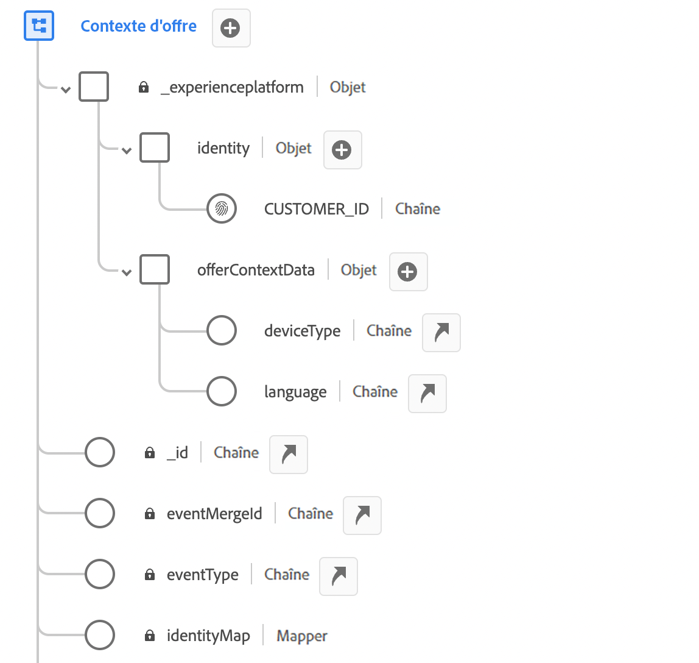
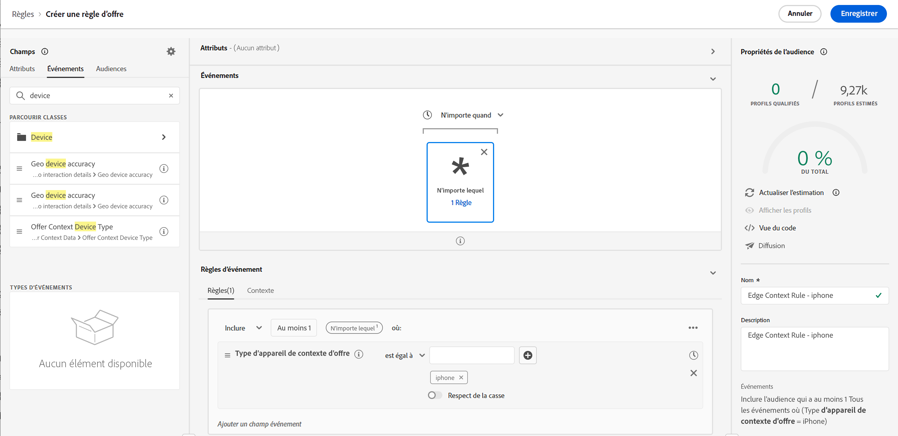
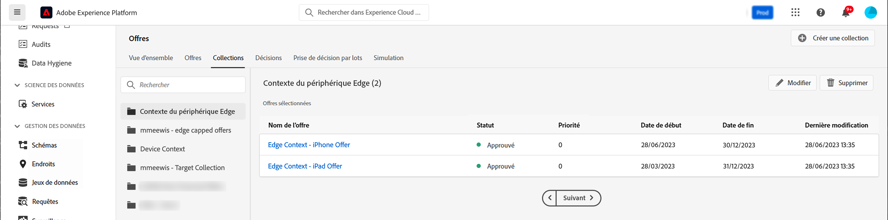
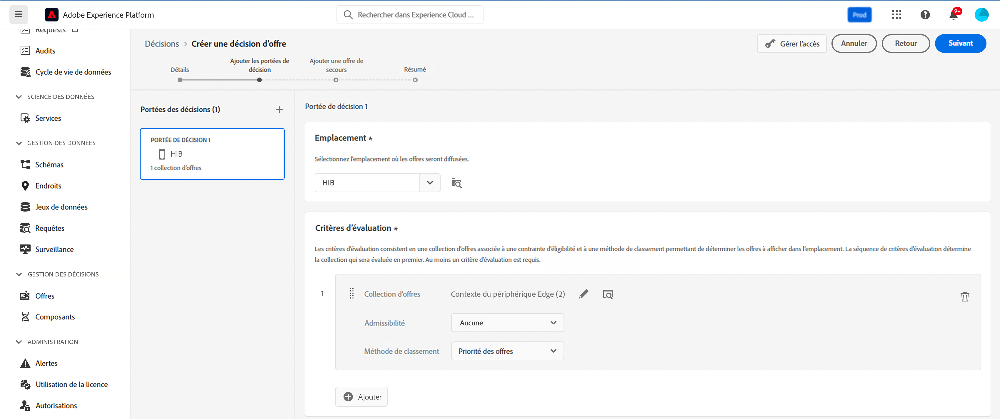
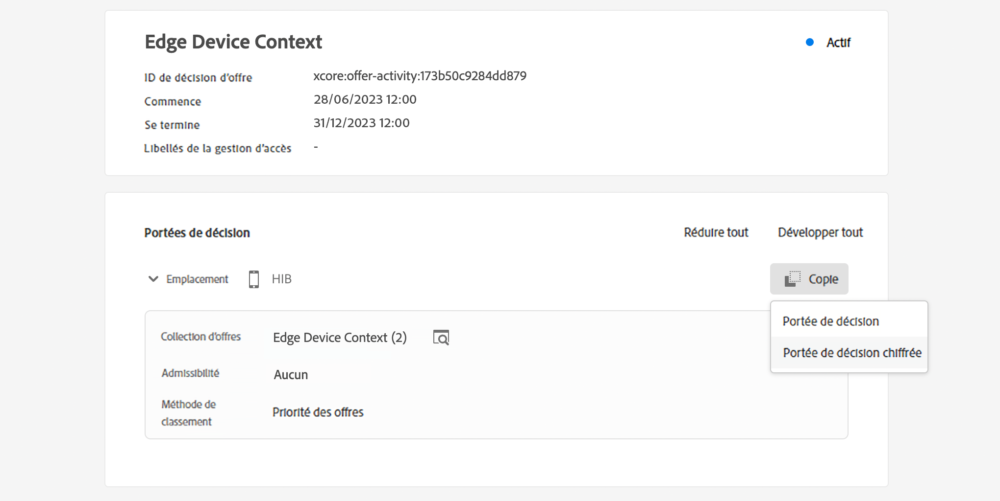

# Données contextuelles et requêtes Edge Decisioning {#edge}

Cette section vous guide tout au long de la transmission de données contextuelles dans les requêtes Edge Decisioning et de leur utilisation dans les règles d&#39;éligibilité. Nous allons explorer un cas d’utilisation complet qui montre comment diffuser des offres personnalisées en fonction du type d’appareil utilisé par les clients et les clientes.

Ce cas pratique comporte plusieurs étapes clés :

1. [Configurer les conditions préalables](#prerequisites) : assurez-vous que toutes les étapes nécessaires sont effectuées pour transmettre des données contextuelles dans vos requêtes.
1. [Utiliser des données contextuelles dans les règles d’éligibilité](#rules) : créez des règles qui déterminent les offres à afficher en fonction du type d’appareil de l’utilisateur ou de l’utilisatrice.
1. [Concevoir des offres spécifiques à un appareil](#offers) : créez des offres personnalisées pour chaque type d’appareil et associez-les aux règles correspondantes.
1. [Créer une collection d&#39;offres](#collection) : regroupez toutes les offres dans une collection statique.
1. [Configurer une décision](#decision) : créez une décision qui utilise le moteur de décision d’offres pour sélectionner la meilleure offre à présenter aux utilisateurs et utilisatrices en fonction de leur type d’appareil.
1. [Transmettre des données contextuelles dans la requête Edge Decisioning](#request) : transmettez des données contextuelles par le biais de votre requête API pour récupérer et présenter les offres appropriées aux utilisateurs et utilisatrices.

>[!BEGINSHADEBOX]

Pour aller plus loin, vous pouvez également exploiter les données contextuelles dans des **formules de classement** ou **personnaliser dynamiquement les rendus de votre offre**. Par exemple, vous pouvez créer une offre unique et utiliser des champs de personnalisation pour adapter son rendu en fonction des données contextuelles. Par exemple, affichez une image donnée si l’utilisateur dispose d’une iPhone et une autre pour les utilisateurs d’iPad. Pour plus d’informations, consultez les sections suivantes :

* [Formules de classement : améliorer les offres en fonction des données contextuelles](../offers/ranking/create-ranking-formulas.md#context-data)
* [Personnaliser des représentations basées sur des données contextuelles](../offers/offer-library/add-representations.md#context-data)

>[!ENDSHADEBOX]

## Conditions préalables pour transmettre des données contextuelles dans les requêtes Edge Decisioning {#prerequisites}

Contrairement à la transmission du contexte dans un format libre à l’aide de l’API Decisioning, le contexte de prise de décision d’Edge nécessite la conformité XDM. La payload du contexte doit être compatible avec les événements d’expérience XDM. Pour ce faire, le contexte doit être défini dans le cadre de l’« Événement d’expérience XDM » utilisé pour la collecte de données.

1. Définissez un schéma d’événement d’expérience. Pour les besoins de ce cas d’utilisation, un schéma « Contexte de l’offre » est créé et les champs de contexte de l’offre font partie d’un groupe de champs « Contexte de l’offre ». En réalité, le groupe de champs serait ajouté au schéma d’événement d’expérience utilisé pour la collecte de données associée au flux de données « Réseau de collecte Edge ».

   >[!NOTE]
   >
   >Le schéma d’événement d’expérience du contexte d’offre doit faire partie du profil, avec un champ « CUSTOMER_ID » utilisé comme identité principale.

   Dans cet exemple, le groupe de champs « Contexte de l’offre » possède deux propriétés : language et deviceType. Ces propriétés seront utilisées dans le classement des offres et les règles d’éligibilité.

   {width="60%" align="center" zoomable="yes"}

   Découvrez comment utiliser les schémas dans [!DNL Adobe Experience Platform] guide [Modèle de données d’expérience (XDM)](https://experienceleague.adobe.com/fr/docs/experience-platform/xdm/home){target="_blank"}

1. Créez un jeu de données (ici, « Contexte de l’offre ») et assurez-vous qu’il est activé pour le profil.

1. Créez un train de données à partir du menu **[!UICONTROL Collecte de données]** > **[!UICONTROL Trains de données]**. Découvrez comment créer et configurer un flux de données dans [!DNL Adobe Experience Platform] guide [Datastreams](https://experienceleague.adobe.com/fr/docs/experience-platform/datastreams/configure){target="_blank"}

   Ici, nous avons créé un train de données « Contexte de l’offre », avec le schéma d’événement « Contenu de l’offre » sélectionné.

   

1. Modifiez le train de données nouvellement créé et sélectionnez « Adobe Experience Platform » comme service et « Contexte de l’offre » comme jeu de données d’événement.

   

1. Enregistrez le train de données et copiez son identifiant. Cet identifiant sera utilisé dans votre point d’entrée de requête API. [Découvrez comment créer l’appel API](#request).

   

## Utiliser des données contextuelles dans les règles d’éligibilité {#rules}

Créez des règles d’éligibilité qui déterminent les offres à afficher en fonction du type d’appareil cible :



* règle pour les appareils iPhone :

   * Nom de la règle : « Règle contextuelle Edge - iPhone »
   * Configuration : deviceType = « iphone »
   * Syntaxe PQL :

     ```
     select _Any1 from xEvent where _Any1._experienceplatform.offerContextData.deviceType.equals("iphone", false)
     ```

* règle pour les appareils iPad :

   * Nom de la règle : « Règle contextuelle Edge - iPad »
   * Configuration : deviceType = « ipad »
   * Syntaxe PQL

     ```
     select _Any1 from xEvent where _Any1._experienceplatform.offerContextData.deviceType.equals("ipad", false)
     ```

## Créer des offres {#offers}

Créez une offre pour chaque type d’appareil et liez-la à la règle d’éligibilité correspondante créée précédemment :

* Offre destinée aux utilisateurs d&#39;iPhone :

   * Nom de l’offre : « Contexte Edge - Contenu de l’offre iPhone »
   * Règle associée : « Règle de contexte Edge - iPhone »

* Offre destinée aux utilisateurs d&#39;iPad :

   * Nom de l’offre : « Contexte Edge - Contenu de l’offre iPad »
   * Règle associée : « Règle de contexte Edge - iPad »

En outre, créez une offre de secours (ici, « Contenu de secours contextuel ») à afficher si aucun critère spécifique d’appareil n’est satisfait.

## Ajouter des offres à une collection {#collection}

Ajoutez les offres créées précédemment à une collection statique nommée ici « Contexte des appareils Edge ». Cette collection correspond à l’endroit où la décision d’offres sélectionne les offres éligibles à présenter à la clientèle.



## Créer une décision d’offres {#decision}

Créez une décision qui utilise le moteur de décision d’offres pour sélectionner la meilleure offre à présenter aux personnes en fonction de leur type d’appareil avec l’offre « Secours contextuel » sélectionnée comme offre de secours.



>[!NOTE]
>
>Pour aller plus loin, vous pouvez exploiter les données contextuelles dans des formules de classement et les affecter à votre décision. AJOUTER DES INFORMATIONS

## Transmettre des données contextuelles dans la requête Edge Decisioning {#request}

### Point d’entrée

Dans le point d’entrée, utilisez l’identifiant du [train de données](#prerequisites) créé précédemment.

`https://edge.adobedc.net/ee/irl1/v1/interact?configId=f3c47f2a-c484-4908-87a5-a82b55039e22`

### Payload

Voici un exemple de requête transmettant des données contextuelles.

* Les informations sur le type d’appareil sont transmises dans le nœud `xdm:ContextData`.
* Dans le nœud `decisionScopes`, copiez-collez la portée de la [décision d’offres](#decision) configurée précédemment.

  +++Où récupérer la portée de décision

  

  +++

```
{
    "events": [{
        "xdm": {
            "identityMap": {
                "customerId": [{
                    "id": "0000158216",
                    "authenticatedState": "authenticated",
                    "primary": true
                }]
            },
            "_experienceplatform": {
                "identity": {
                    "core": {
                        "customerId": "0000158216"
                    }
                },
                "offerContextData" : {
                    "language" : "NL",
                    "deviceType" : "iphone"
                }
            }
        }
    }],
    "query": {
        "personalization": {
            "decisionScopes": ["eyJ4ZG06YWN0aXZpdHlJZCI6Inhjb3JlOm9mZmVyLWFjdGl2aXR5OjE3M2I1MGM5Mjg0ZGQ4NzkiLCJ4ZG06cGxhY2VtZW50SWQiOiJ4Y29yZTpvZmZlci1wbGFjZW1lbnQ6MTZhMzQxZWQ4ZDYyMzc2MSJ9"]
        }
    }
}
```

### Réponse

Voici un exemple de réponse :

```
{
    "requestId": "14a2d3f5-a6fa-494e-b42c-cc65a845284a",
    "handle": [
        {
            "payload": [
                {
                    "id": "1eafc831-4819-4800-8e25-c9e9f0838e09",
                    "scope": "eyJ4ZG06YWN0aXZpdHlJZCI6Inhjb3JlOm9mZmVyLWFjdGl2aXR5OjE3M2I1MGM5Mjg0ZGQ4NzkiLCJ4ZG06cGxhY2VtZW50SWQiOiJ4Y29yZTpvZmZlci1wbGFjZW1lbnQ6MTZhMzQxZWQ4ZDYyMzc2MSJ9",
                    "activity": {
                        "id": "xcore:offer-activity:173b50c9284dd879",
                        "etag": "1",
                        "name": "Edge Device Context"
                    },
                    "placement": {
                        "id": "xcore:offer-placement:16a341ed8d623761",
                        "etag": "1",
                        "name": "HIB",
                        "channel": "https://ns.adobe.com/xdm/channel-types/mobile",
                        "componentType": "https://ns.adobe.com/experience/offer-management/content-component-json"
                    },
                    "items": [
                        {
                            "id": "xcore:personalized-offer:173b4e05676d87f5",
                            "etag": "3",
                            "name": "Edge Context - iPhone Offer",
                            "priority": 0,
                            "schema": "https://ns.adobe.com/experience/offer-management/content-component-json",
                            "data": {
                                "id": "xcore:personalized-offer:173b4e05676d87f5",
                                "format": "application/json",
                                "language": [
                                    "en-gb"
                                ],
                                "content": "{\n    \"name\" : \"iphone offer\"\n}"
                            }
                        }
                    ]
                }
            ],
            "type": "personalization:decisions",
            "eventIndex": 0
        },
        {
            "payload": [],
            "type": "activation:pull",
            "eventIndex": 0
        },
        {
            "payload": [],
            "type": "personalization:decisions",
            "eventIndex": 0
        },
        {
            "payload": [
                {
                    "scope": "Target",
                    "hint": "37",
                    "ttlSeconds": 1800
                },
                {
                    "scope": "AAM",
                    "hint": "6",
                    "ttlSeconds": 1800
                },
                {
                    "scope": "EdgeNetwork",
                    "hint": "irl1",
                    "ttlSeconds": 1800
                }
            ],
            "type": "locationHint:result"
        },
        {
            "payload": [
                {
                    "key": "kndctr_907075E95BF479EC0A495C73_AdobeOrg_identity",
                    "value": "CiY0MDAwMDgyMjMzNTEzNzU1OTcwMjQ0NDcyNjU1MTAyMDEwNDQ3MVIRCNnE4Y6QMRABGAEqBElSTDHwAdnE4Y6QMQ==",
                    "maxAge": 34128000
                },
                {
                    "key": "kndctr_907075E95BF479EC0A495C73_AdobeOrg_cluster",
                    "value": "irl1",
                    "maxAge": 1800
                }
            ],
            "type": "state:store"
        }
    ]
}
```
