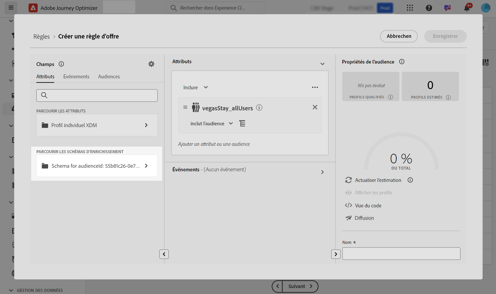
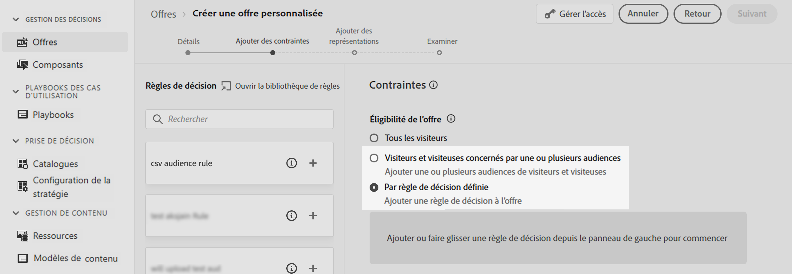
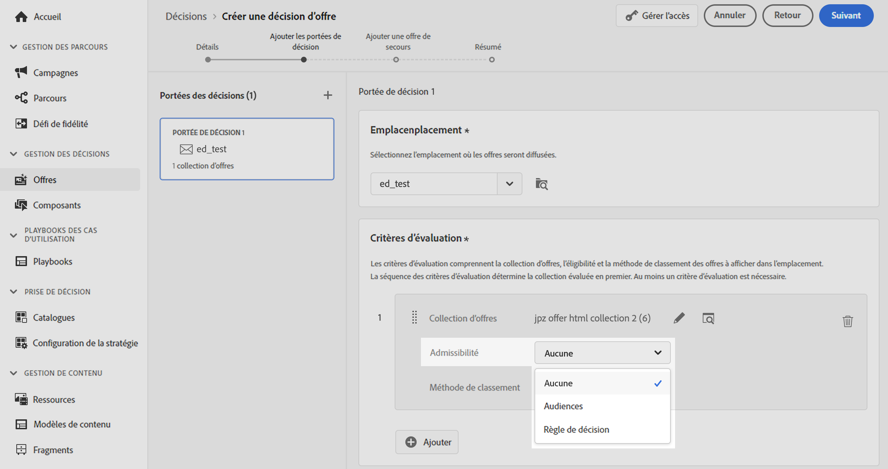
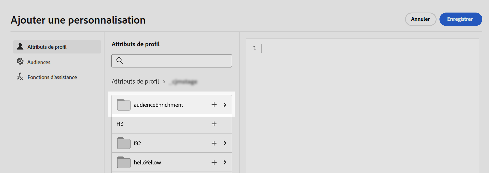

# Utilisation d’audiences de chargement personnalisé pour la prise de décision {#custom-upload-decisioning}

>[!TIP]
>
>La prise de décision, la nouvelle fonctionnalité de prise de décision d’[!DNL Adobe Journey Optimizer], est désormais disponible via les canaux d’expérience basée sur du code et d’e-mail. [En savoir plus](../experience-decisioning/gs-experience-decisioning.md)

Avec Journey Optimizer, vous pouvez utiliser les données des audiences créées à l’aide du chargement personnalisé (fichier CSV) dans Adobe Experience Platform pour prendre en charge vos workflows de gestion des décisions. Cette action est particulièrement utile lorsque les données ne sont pas nécessaires sur le profil, mais qu’elles sont toujours essentielles à la prise de décision.

Les données des audiences de chargement personnalisé peuvent être utilisées dans la gestion de la décision pour :

1. Les critères d’éligibilité des offres et des décisions.
2. Personnaliser le contenu dans les représentations des offres.

Pour plus d’informations sur les audiences de chargement personnalisé, reportez-vous aux sections :

* [Commencer avec les audiences et Journey Optimizer](../audience/about-audiences.md)
* [Import d’une audience dans Adobe Experience Platform](https://experienceleague.adobe.com/fr/docs/experience-platform/segmentation/ui/audience-portal#import-audience){target="_blank"}

## À lire impérativement {#must-read}

* **Gestion des décisions uniquement** - Cette fonctionnalité est prise en charge dans la gestion des décisions uniquement, et non dans Decisioning (anciennement appelée « Experience Decisioning »).
* **API Decisioning (Hub) uniquement** - Elle est disponible exclusivement par le biais de requêtes de l’API Decisioning (Hub) et n’est pas prise en charge par l’API Edge Decisioning ni la prise de décision par lots.
* **Indicateur d’API obligatoire pour les données d’enrichissement** - Lorsque vous utilisez une audience de chargement personnalisé (CSV) et que vous souhaitez récupérer des données d’enrichissement dans la réponse de décision d’offre, vous devez inclure `"xdm:enrichedAudience": true` dans la payload de votre requête API. Sans cet indicateur, les attributs d’enrichissement de l’audience chargée au format CSV ne seront pas renvoyés. [En savoir plus sur l’API Decisioning](api-reference/offer-delivery-api/decisioning-api.md)

## Utilisation d’une audience de chargement personnalisé comme critères d’éligibilité {#eligibilty}

Vous pouvez utiliser une audience de chargement personnalisé comme critères d’éligibilité au niveau de l’offre ou de la décision. Une fois ajoutés, ces critères peuvent exclure des offres ou collections d’offres de l’éligibilité. Voici les différents emplacements où vous pouvez utiliser les audiences de chargement personnalisé pour affiner l’éligibilité des offres et des décisions :

* Créez une règle de décision à l’aide d’une audience de chargement personnalisé :

   1. Lors de la création d’une règle, accédez à l’onglet **Audiences** et recherchez votre audience CSV dans la liste. Faites glisser et déposez l’audience dans la zone de travail des règles.
   1. Utilisez l’onglet **Attributs** et accédez aux schémas d’enrichissement liés à l’audience sélectionnée pour accéder à toutes les données du fichier CSV et les utiliser dans votre règle. Vous pouvez ainsi utiliser un champ du fichier CSV pour affiner votre règle. [Découvrir comment créer une règle de décision](../offers/offer-library/creating-decision-rules.md)
   1. Enregistrez la règle. Une fois la règle créée, elle peut être utilisée au niveau de l’offre et de la décision pour affiner leur éligibilité.

  

* Utilisez des audiences de chargement personnalisé comme contrainte d’offre. [Découvrir comment ajouter des contraintes à une offre](../offers/offer-library/add-constraints.md)

  Lors de la création d’une offre, à l’étape **Ajouter des contraintes**, vous pouvez effectuer l’une des opérations suivantes :

   * Utiliser l’audience de chargement personnalisé pour définir l’éligibilité d’une offre
   * Appliquer une règle qui utilise l’audience de chargement personnalisé

  

* Utiliser des audiences de chargement personnalisé au niveau de la décision

  Lors de la configuration d’une décision, à l’étape **Ajouter une portée de décision**, vous pouvez utiliser des audiences de chargement personnalisé comme critère d’évaluation pour une collection d’offres. [Découvrir comment définir une portée de décision](../offers/offer-activities/create-offer-activities.md#add-decision-scopes)

  

## Utilisation d’une audience de chargement personnalisé pour personnaliser les représentations des offres

Les audiences de chargement personnalisé peuvent également être utilisées pour personnaliser le contenu des représentations des offres en référençant les données du fichier CSV. [Découvrir comment ajouter des représentations à une offre](../offers/offer-library/add-representations.md)

Pour pouvoir utiliser les attributs d’une audience de chargement personnalisé à des fins de personnalisation, vous devez d’abord ajouter l’audience personnalisée comme contrainte. Pour ce faire, lors de la création d’une offre, à l’étape **Ajouter des contraintes**, ajoutez l’audience en tant que contrainte ou sélectionnez une règle utilisant l’audience de chargement personnalisé.

Une fois l’audience ajoutée comme contrainte, vous pouvez utiliser ses attributs pour personnaliser le contenu de représentation. Pour ce faire, accédez à l’onglet **Attributs de profil** et recherchez l’audience de chargement personnalisé. Sélectionnez les attributs pertinents de l’audience pour personnaliser le contenu de l’offre.

