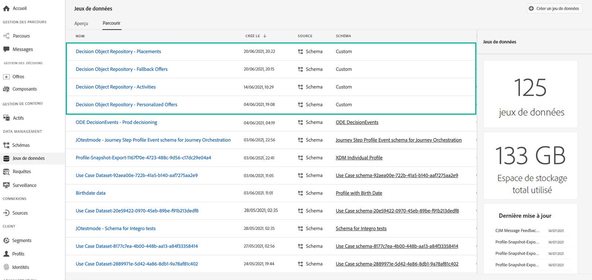
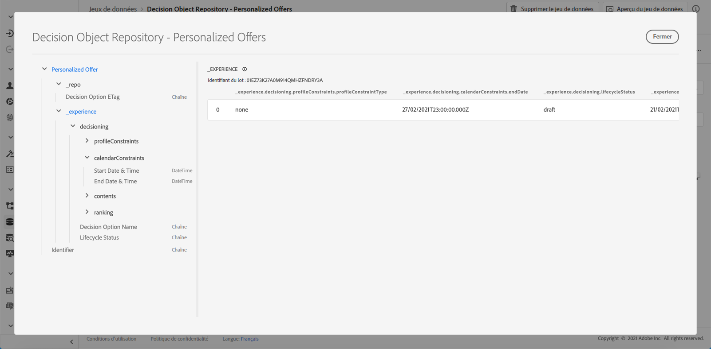

# Accès au catalogue d’offres exporté {#access-exported-catalog}

Le catalogue d’offres exporté est accessible dans le menu **[!UICONTROL Jeux de données]** d’Adobe Experience Platform. Un jeu de données est créé pour chaque objet de votre bibliothèque des offres.

Cliquez sur un jeu de données pour accéder à ses détails.

Le bouton **[!UICONTROL Prévisualiser le jeu de données]** vous permet d’afficher le lot réussi le plus récent du jeu de données. Le volet de gauche fournit des informations sur les types de données qui ont été exportées.

Pour plus d’informations sur la recherche et l’utilisation des jeux de données, reportez-vous à la [documentation sur les jeux de données d’Adobe Experience Platform](https://experienceleague.adobe.com/docs/experience-platform/catalog/datasets/user-guide.html?lang=fr#getting-started).
