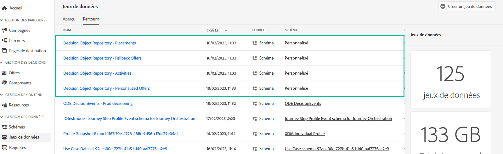
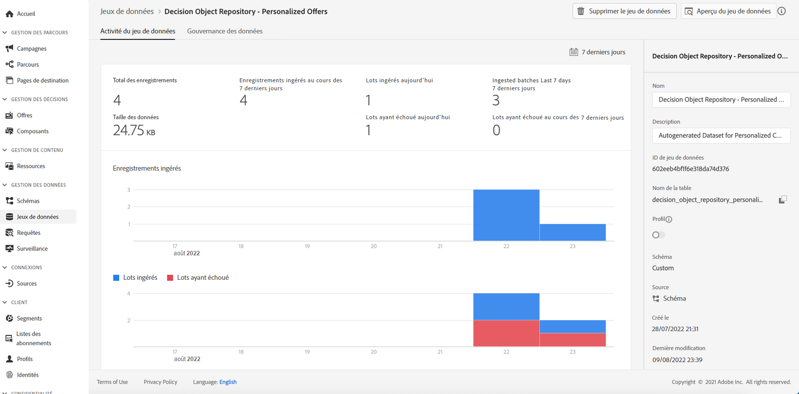

# Accéder au catalogue d’offres exporté {#access-exported-catalog}

>[!TIP]
>
>La prise de décision, la nouvelle fonctionnalité de prise de décision d’[!DNL Adobe Journey Optimizer], est désormais disponible via les canaux d’expérience basée sur du code et d’e-mail. [En savoir plus](../../experience-decisioning/gs-experience-decisioning.md)

Le catalogue d’offres exporté est accessible dans le menu **[!UICONTROL Jeux de données]** d’Adobe Experience Platform. Un jeu de données est créé pour chaque objet de votre bibliothèque des offres.

Cliquez sur un jeu de données pour accéder à ses détails.

Le bouton **[!UICONTROL Prévisualiser le jeu de données]** vous permet d’afficher le lot réussi le plus récent du jeu de données.

Pour plus d’informations sur la navigation et l’utilisation des jeux de données, consultez [cette page](../../data/get-started-datasets.md).
