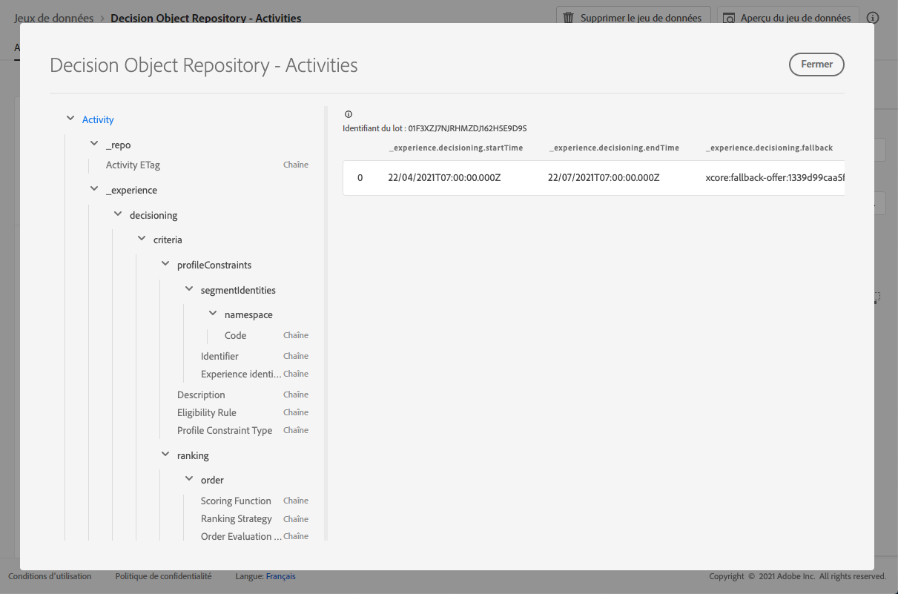

# Jeu de données de décisions {#decisions-dataset}

Chaque fois qu’une offre est modifiée, le jeu de données généré automatiquement pour les décisions (anciennement appelé activités) est mis à jour.

Le lot le plus récent dans le jeu de données s’affiche à droite. La vue hiérarchique du schéma du jeu de données s’affiche dans le volet de gauche.

>[!NOTE]
>
>Découvrez comment accéder aux jeux de données exportés pour chaque objet de la bibliothèque des offres dans [cette section](../export-catalog/access-dataset.md).

Vous trouverez ci-dessous la liste de tous les champs qui peuvent être utilisés dans le jeu de données **[!UICONTROL Référentiel d’objets de décision - Décisions]** (auparavant « Référentiel d’objets de décision - Activités »).

<!--A decision (formerly known as offer decision) is used to control the decisioning process. It specifies the filter applied to the total inventory to narrow down offers by topic/category, the placement to narrow down the inventory to those offers that technically fit into the reserved space for the offer and specifies a fallback option should the combined constraints disqualify all available personalization offers.-->

## Identifiant

**Champ :** _id 
**Titre :** identifiant 
**Description :** identifiant unique de l’enregistrement.
**Type :** Chaîne

## _experience

**Champ :** _experience 
**Type :** objet

### _experience > prise de décision

**Champ :** prise de décision
**Type :** objet

#### _experience > prise de décision > critères

**Champ :** critères
**Titre :** critères
**Description :** définit un ensemble de critères de décision où chaque décision contient un ensemble de contraintes.
**Type :** tableau

**_experience > prise de décision > critères > description**

**Champ :** description 
**Titre :** Description 
**:** Description du critère. Permet de véhiculer les intentions lisibles par l’homme sur la manière dont ou la raison pour laquelle ce critère a été créé et comment il influe sur la décision.
**Type :** Chaîne

**_experience > prise de décision > critères > optionSelection**

**Champ :** optionSelection 
**Titre :** Sélection d’options 
**Description :**  La sélection d’options définit la validité/l’applicabilité des options dans ce contexte.
**Type :** objet

* **Description**

   **Champ :** description
   **Titre :** description
   **Description :** description de la sélection d’options. Permet de véhiculer les intentions lisibles par l’homme sur la manière dont ou la raison pour laquelle cette sélection d’options a été effectuée et/ou qui indiquent l’option qui correspondra.
   **Type :** chaîne

* **Filtre d’option**

   **Champ :** filtre
   **Titre :** filtre d’option
   **Description :** référence à un filtre basé sur les balises qui associe les options d’un inventaire à l’aide de leurs balises jointes. La valeur est l’URI (@id) de la règle de décision référencée. Voir le schéma https://ns.adobe.com/experience/decisioning/filter.
   **Type :** chaîne

* **Type de contrainte de profil**

   **Champ :** optionSelectionType
   **Titre :** type de contrainte de profil
   **Description :** détermine si des contraintes sont actuellement définies et comment elles sont exprimées. Cela peut être via une requête de filtre ou une ou plusieurs appartenances à un segment.
   **Type :** chaîne
   **Valeurs possibles :** &quot;none&quot; (par défaut), &quot;directList&quot;, &quot;filter&quot;

* **Liste d’options**

   **Champ :** options
   **Titre :** liste d’options
   **Description :** liste qui spécifie directement les options sans évaluer de requête de filtre. Vous pouvez spécifier une liste d’options ou une règle de filtre d’option.
   **Type :** tableau

   <!--Missing title under Option List? Desc = An identifier of an decision option entity. The value value refers to an `@id` property of a decision option. Type: string-->

**_experience > prise de décision > critères > emplacements**

**Champ :** emplacements 
**Titre :** Restrictions de positionnement 
**Description :**  la contrainte de placement indique que ce critère s’applique uniquement aux emplacements répertoriés. Ce n’est que lorsque les emplacements ciblés figurent dans la liste `xdm:placements` que la sélection d’options est prise en compte. Sinon, l’ensemble des critères de décision est ignoré. Lorsque la liste xdm:placements est omise ou est vide, le critère est pris en compte pour tout emplacement ciblé. Les emplacements répertoriés ici imposent des critères implicites pour la sélection d’options. Une option à prendre en compte doit comporter une représentation pour l’emplacement ciblé.
**Type :** tableau

* **Identifiant d’emplacement**

   **Titre :** identifiant d’emplacement
   **Description :** référence à une entité d’emplacement. La valeur est l’URI (@id) de l’emplacement qui est référencé. Voir le schéma https://ns.adobe.com/experience/decisioning/placement.
   **Type :** Chaîne

**_experience > prise de décision > critères > profileConstraints**

**Champ :** profileConstraints 
**Titre :** 
**Description de la contrainte de profil :**  la contrainte de profil détermine si une sélection d’options est éligible pour cette identité de profil à ce moment, dans ce contexte. Si la contrainte de profil n&#39;a pas besoin de prendre en compte les valeurs de chacune des options, c&#39;est-à-dire qu&#39;elle est invariante des options de la sélection d&#39;options, la contrainte de profil qui prend la valeur &quot;false&quot; annule l&#39;ensemble de la sélection d&#39;options. D’un autre côté, une règle de contrainte de profil qui prend une option en tant que paramètre est évaluée pour chaque option de qualification de la sélection d’options.
**Type :** objet

* **_experience > prise de décision > critères > profileConstraints > Description**

   **Champ :** description
   **Titre :** description
   **Description :** Description des contraintes de profil. Elle est utilisée pour transmettre des intentions lisibles sur la façon et les raisons pour lesquelles cette contrainte de profil a été construite et/ou sur l&#39;option qui sera incluse ou exclue par elle.
   **Type :** Chaîne

* **_experience > prise de décision > critères > profileConstraints > Règle d’éligibilité**

   **Champ :** eligibilityRule
   **Titre :** règle d’éligibilité
   **Description :** référence à une règle de décision qui renvoie true ou false pour un profil donné et/ou d’autres objets XDM contextuels donnés. La règle est utilisée pour déterminer si l’option est admissible pour un profil donné. La valeur est l’URI (@id) de la règle de décision référencée. Voir le schéma https://ns.adobe.com/experience/decisioning/rule.
   **Type :** Chaîne

* **_experience > prise de décision > critères > profileConstraints > Type de contrainte de profil**

   **Champ :** profileConstraintType
   **Titre :** type de contrainte de profil
   **Description :** Détermine si des contraintes sont actuellement définies et comment les contraintes sont exprimées. Il peut s’agir d’une règle ou d’un ou plusieurs abonnements de segment.
   **Type :**Chaîne
   **Valeurs possibles :**
   * &quot;aucun&quot; (par défaut)
   * &quot;eligibilityRule&quot; : « La contrainte de profil est exprimée sous la forme d’une règle unique qui doit être évaluée comme égale à true avant que l’action contrainte ne soit autorisée. »
   * &quot;anySegments&quot; : « La contrainte de profil est exprimée en un ou plusieurs segments et le profil doit être membre d&#39;au moins l&#39;un d&#39;eux avant que l&#39;action contrainte ne soit autorisée. »
   * &quot;allSegments&quot; : « La contrainte de profil est exprimée en un ou plusieurs segments et le profil doit en être membre pour que l&#39;action restreinte soit autorisée. »
   * &quot;règles&quot; : « La contrainte de profil est exprimée sous la forme d&#39;un certain nombre de règles différentes, par exemple l&#39;éligibilité, l&#39;applicabilité, l&#39;adaptabilité, qui doivent toutes être vérifiées avant que l&#39;action contrainte ne soit autorisée. »

* **_experience > prise de décision > critères > profileConstraints > segmentIdentities**

   **Champ :** segmentIdentities
   **Titre :** identifiants de segment
   **Description :** identifiants des segments.
   **Type :** tableau

   * **Identifiant**

      **Champ :** _id
      **Titre :** identifiant
      **Description :** Identité du segment dans l’espace de noms connexe.
      **Type :** Chaîne

   * **espace de noms**

      **Champ :** espace de noms
      **Titre :** espace de noms
      **Description :** Espace de noms associé à l’attribut `xid`.
      **Type :** objet
      **Obligatoire :** &quot;code&quot;

      * **Code**

         **Champ :** code
         **Titre :** code
         **Description :** Le code est un identifiant lisible par l’homme pour l’espace de noms et peut être utilisé pour demander l’identifiant technique d’espace de noms utilisé pour le traitement des graphiques d’identités.
         **Type :** Chaîne
   * **Identifiant d’expérience**

      **Champ :** xid
      **Titre :** identifiant d’expérience
      **Description** : Lorsqu’elle est présente, cette valeur représente un identifiant d’espace de noms croisé unique pour tous les identifiants d’espace de noms inclus dans tous les espaces de noms.
      **Type :** Chaîne

**_experience > prise de décision > critères > classement**

**Champ :** ranking
**Titre :** Détails de ranking
**Description :** Rang (priorité). Définit comment la \&quot;meilleure option\&quot; est déterminée en fonction du contexte du critère de décision. Parmi toutes les options sélectionnées qui répondent aux contraintes de profil, le classement décide de la ou des options supérieures à proposer.
**Type :** objet

* **_experience > prise de décision > critères > classement > ordre**

   **Champ :** order
   **Titre :** évaluation d’ordre
   **Description :** Évaluation d&#39;un ordre relatif d&#39;une ou de plusieurs options de décision. Les options dont les valeurs ordinales sont supérieures sont sélectionnées pour les options dont les valeurs ordinales sont inférieures. Les valeurs déterminées par cette méthode peuvent être ordonnées mais les distances entre elles ne peuvent pas être mesurées et ni les sommes ni les produits ne peuvent être calculés. La médiane et le mode sont les seules mesures de tendance centrale qui peuvent être utilisées pour les données ordinales.
   **Type :** objet

   * **Fonction de score**

      **Champ :** fonction
      **Titre :** fonction de score
      **Description :** Une référence à une fonction qui calcule un score numérique pour cette option de décision. Les options de décision seront ensuite classées en fonction de ce score. La valeur de cette propriété est l’URI (@id) de la fonction à appeler avec l’option active à la fois. Voir le schéma https://ns.adobe.com/experience/decisioning/function.
      **Type :** Chaîne

   * **Type d&#39;évaluation de commande**

      **Champ :** orderEvaluationType
      **Titre :** type d’évaluation d’ordre
      **Description :** Indique le mécanisme d&#39;évaluation de l&#39;ordre utilisé, la priorité statique des options de décision, une fonction de notation qui calcule une valeur numérique pour chaque option ou une stratégie de classement qui reçoit une liste pour la commander.
      **Type :**Chaîne
      **Valeurs possibles :** &quot;static&quot;, &quot;scoringFunction&quot;, &quot;rankingStrategy&quot;

   * **Stratégie de ranking**

      **Champ :** rankingStrategy
      **Titre :** stratégie de classement
      **Description :** Une référence à une stratégie qui classe une option de liste de décision. Les options de décision seront renvoyées dans une liste ordonnée. La valeur de cette propriété est l’URI (@id) de la fonction à appeler avec l’option active à la fois. Voir le schéma https://ns.adobe.com/experience/decisioning/rankingStrategy.
      **Type :** Chaîne

* **_experience > prise de décision > critères > classement > Priorité**

   **Champ :** priority
   **Titre :** priorité
   **Description :** La priorité d’une option de décision unique par rapport à toutes les autres options. Les options pour lesquelles aucune fonction de commande n’est fournie sont prioritaires à l’aide de cette propriété. Les options ayant des valeurs de priorité plus élevées sont sélectionnées avant les options de priorité plus faible. Si plusieurs options admissibles partagent la valeur de priorité la plus élevée, une option est choisie de façon aléatoire uniforme et utilisée pour la proposition de décision.
   **Type :** integer
   **Valeur minimale :** 0
   **Valeur par défaut ** 0

#### _experience > prise de décision > Date et heure de fin de l’activité

**Champ :** endTime 
**Title :** Date de fin de l’activité et heure 
**Description :** Date de fin de la décision (anciennement appelée activité) et heure de fin. La propriété a la sémantique de la propriété « endTime » de schema.org définie sur http://schema.org/Action.
**Type :** chaîne

#### _experience > prise de décision > Option de secours

**Champ :** secours
**Titre :** option de secours
**Description :** référence à une option de secours utilisée lorsque la prise de décision dans le contexte de cette décision ne remplit aucune des options habituelles (cela se produit généralement lorsque des contraintes strictes sont appliquées). La valeur est l’URI (@id) de l’option de secours référencée.
**Type :** chaîne

#### _experience > prise de décision > Nom de l’activité

**Champ :** nom 
**Titre :** Nom de l’activité 
**Description :** Nom de la décision (anciennement appelé activité) affiché dans différentes interfaces utilisateur.
**Type :** Chaîne

#### _experience > prise de décision > Date et heure de début de l’activité

**Champ :** startTime 
**Titre :** Date de début de l’activité et Heure 
**Description :** Date de début de la décision (anciennement appelée activité) et heure de fin. La propriété a la sémantique de la propriété « startTime » de schema.org définie sur http://schema.org/Action.
**Type :** chaîne

## _repo

**Champ :** _repo 
**Type :** objet

### _repo > Activity ETag

**Champ :** 
**Titre de l’etag :** Activity ETag 
**Description :** révision à laquelle l’objet de décision (anciennement appelé activité) se trouvait lors de la prise de l’instantané.
**Type :** Chaîne
