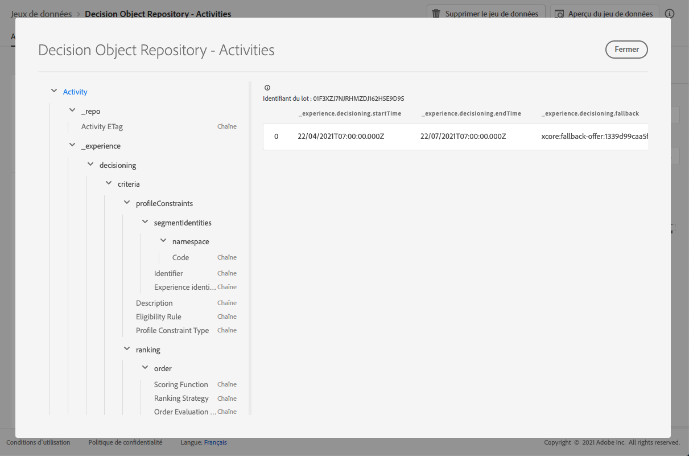

# Jeu de données de décisions {#decisions-dataset}

>[!TIP]
>
>La prise de décision, la nouvelle fonctionnalité de prise de décision d’[!DNL Adobe Journey Optimizer], est désormais disponible via les canaux d’expérience basée sur du code et d’e-mail. [En savoir plus](../../experience-decisioning/gs-experience-decisioning.md)

Chaque fois qu’une offre est modifiée, le jeu de données généré automatiquement pour les décisions est mis à jour.

Le lot le plus récent dans le jeu de données s’affiche à droite. La vue hiérarchique du schéma du jeu de données s&#39;affiche dans le volet de gauche.

>[!NOTE]
>
>Découvrez comment accéder aux jeux de données exportés pour chaque objet de votre bibliothèque des offres dans [cette section](../export-catalog/access-dataset.md).

Vous trouverez ci-dessous la liste de tous les champs qui peuvent être utilisés dans le jeu de données **[!UICONTROL Référentiel d&#39;objets de décision - Décisions]** (auparavant « Référentiel d&#39;objets de décision - Activités »).

<!--A decision (formerly known as offer decision) is used to control the decisioning process. It specifies the filter applied to the total inventory to narrow down offers by topic/category, the placement to narrow down the inventory to those offers that technically fit into the reserved space for the offer and specifies a fallback option should the combined constraints disqualify all available personalization offers.-->

+++ Identifiant

**Champ :** _id 
**Titre :** identifiant 
**Description :** identifiant unique de l&#39;enregistrement.
**Type :** chaîne

+++

+++ _experience

**Champ :** _experience
**Type :** objet

+++

+++ _experience > decisioning

**Champ :** prise de décision
**Type :** objet

+++

+++ _experience > decisioning > criteria

**Champ :** critères
**Titre :** critères
**Description :** définit un jeu de critères de décision, chacun d&#39;eux contenant un jeu de contraintes.
**Type :** tableau

+++

+++ _experience > decisioning > criteria > description

**Champ :** description
**Titre :** description
**Description :** critère de description. Permet de véhiculer les intentions lisibles par l&#39;homme sur la manière dont ou la raison pour laquelle ce critère a été créé et comment il influe sur la décision.
**Type :** Chaîne

+++

+++_experience > decisioning > criteria > optionSelection

**Champ :** optionSelection
**Titre :** sélection d&#39;options
**Description :** la sélection d&#39;options définit la validité/l&#39;applicabilité des options dans ce contexte.
**Type :** objet

* Description

  **Champ :** description
  **Titre :** description
  **Description :** description de la sélection d&#39;options. Permet de véhiculer les intentions lisibles par l&#39;homme sur la manière dont ou la raison pour laquelle cette sélection d&#39;options a été effectuée et/ou qui indiquent l&#39;option qui correspondra.
  **Type :** chaîne

* Filtre d’option

  **Champ :** filtre
  **Titre :** filtre d&#39;option
  **Description :** référence à un filtre basé sur un qualificateur de collection (précédemment appelé « balise ») qui correspond aux options d’un inventaire à l’aide de leurs qualificateurs de collection joints. La valeur est l&#39;URI (@id) de la règle de décision référencée. Voir le schéma https://ns.adobe.com/experience/decisioning/filter.
  **Type :** chaîne

* Type de contrainte de profil

  **Champ :** optionSelectionType
  **Titre :** type de contrainte de profil
  **Description :** détermine si des contraintes sont actuellement définies et comment les contraintes sont exprimées. Cela peut se faire avec une requête de filtre ou avec une ou plusieurs appartenances à des audiences.
  **Type :** chaîne
  **Valeurs possibles :** &quot;none&quot; (par défaut), &quot;directList&quot;, &quot;filter&quot;

* Liste d’options

  **Champ :** options
  **Titre :** liste d&#39;options
  **Description :** liste qui spécifie directement les options sans évaluer une requête de filtre. Vous pouvez spécifier une liste d&#39;options ou une règle de filtre d&#39;option.
  **Type :** tableau

<!--Missing title under Option List? Desc = An identifier of an decision option entity. The value value refers to an `@id` property of a decision option. Type: string-->

+++

+++_experience > decisioning > criteria > placements

**Champ :** emplacements
**Titre :** restrictions d&#39;emplacement 
**Description :** la contrainte d&#39;emplacement indique que ce critère s&#39;applique uniquement aux emplacements répertoriés. Ce n&#39;est que lorsque les emplacements ciblés figurent dans la liste `xdm:placements` que la sélection d&#39;options est prise en compte. Sinon, l&#39;ensemble des critères de décision est ignoré. Lorsque la liste xdm:placements est omise ou vide, le critère est pris en compte pour tout emplacement ciblé. Les emplacements répertoriés ici imposent des critères implicites pour la sélection d&#39;options. Une option à prendre en compte doit comporter une représentation pour l&#39;emplacement ciblé.
**Type :** tableau

* Identifiant d’emplacement

  **Titre :** identifiant d&#39;emplacement
  **Description :** référence à une entité d&#39;emplacement. La valeur est l&#39;URI (@id) de l&#39;emplacement qui est référencé. Voir le schéma https://ns.adobe.com/experience/decisioning/placement.
  **Type :** chaîne

+++

+++_experience > decisioning > criteria > profileConstraints

**Champ :** profileConstraints 
**Titre :** contrainte de profil
**Description :** la contrainte de profil détermine si une option est éligible pour cette identité de profil, à l&#39;heure actuelle, dans ce contexte. Si la contrainte de profil n&#39;a pas besoin de prendre en compte les valeurs de chacune des options, c&#39;est-à-dire qu&#39;elle est invariante par rapport aux options de la sélection d&#39;options, la contrainte de profil qui évalue &#39;false&#39; annule toute la sélection d&#39;options. D&#39;un autre côté, une règle de contrainte de profil qui prend une option en tant que paramètre est évaluée pour chaque option de qualification de la sélection d&#39;options.
**Type :** objet

+++

+++_experience > decisioning > criteria > profileConstraints > Description

**Champ :** description
**Titre :** description 
**Description :** description des contraintes de profil. Elle est utilisée pour transmettre des intentions lisibles sur la façon et les raisons pour lesquelles cette contrainte de profil a été construite et/ou sur l&#39;option qui sera incluse ou exclue par elle.
**Type :** Chaîne

+++

+++ _experience > decisioning > criteria > profileConstraints > Eligibility Rule

**Champ :** eligibilityRule
**Titre :**règle d&#39;éligibilité
**Description :** référence à une règle de décision qui renvoie true ou false pour un profil donné et/ou d&#39;autres objets XDM contextuels donnés. La règle est utilisée pour déterminer si l&#39;option est admissible pour un profil donné. La valeur est l&#39;URI (@id) de la règle de décision référencée. Voir le schéma https://ns.adobe.com/experience/decisioning/rule.
**Type :** Chaîne

+++

+++ _experience > decisioning > criteria > profileConstraints > Profile Constraint Type

**Champ :** profileConstraintType
**Titre :** type de contrainte de profil
**Description :** détermine si des contraintes sont actuellement définies et comment les contraintes sont exprimées. Cela peut se faire avec une règle ou avec une ou plusieurs appartenances à des audiences.
**Type :** chaîne 
**Valeurs possibles :**

* &quot;none&quot; (par défaut)
* &quot;eligibilityRule&quot; : « La contrainte de profil est exprimée sous la forme d&#39;une règle unique qui doit être évaluée comme égale à true avant que l&#39;action contrainte ne soit autorisée. »
* « anySegments » : « La contrainte de profil est exprimée sous la forme d’une ou de plusieurs audiences et le profil doit être membre d’au moins l’une d’entre elles avant que l’action contrainte ne soit autorisée. »
* &quot;allSegments&quot; : « La contrainte de profil est exprimée en une ou plusieurs audiences et le profil doit être membre de toutes ces audiences pour que l’action contrainte soit autorisée. »
* « rules » : « La contrainte de profil est exprimée sous la forme de plusieurs règles différentes (par exemple, l’éligibilité, l’applicabilité, l’adaptabilité), qui doivent toutes renvoyer true avant que l’action contrainte ne soit autorisée. »

+++

+++ _experience > decisioning > criteria > profileConstraints > segmentIdentities

**Champ :** segmentIdentities
**Titre :** Identifiants de segment
**Description :** Identifiants de l’audience.
**Type :** tableau

* Identifiant

  **Champ :** _id
  **Titre :** identifiant
  **Description :** identité de l’audience dans l’espace de noms connexe.
  **Type :** chaîne

* espace de noms

  **Champ :** espace de noms
  **Titre :** espace de noms
  **Description :** Espace de noms associé à l&#39;attribut `xid`.
  **Type :** objet
  **Obligatoire :** &quot;code&quot;

   * Code

     **Champ :** code
     **Titre :** code
     **Description :** Le code est un identifiant lisible par l&#39;homme pour l&#39;espace de noms et peut être utilisé pour demander l&#39;identifiant technique d&#39;espace de noms utilisé pour le traitement des graphiques d&#39;identités.
     **Type :** chaîne

* Identifiant d’expérience

  **Champ :** xid
  **Titre :** identifiant d&#39;expérience
  **Description** : Lorsqu&#39;elle est présente, cette valeur représente un identifiant d&#39;espace de noms croisé unique pour tous les identifiants d&#39;espace de noms inclus dans tous les espaces de noms.
  **Type :** chaîne

+++

+++_experience > decisioning > criteria > ranking

**Champ :** classement
**Titre :** Détails du classement
**Description :** Rang (priorité). Définit comment la \&quot;meilleure option\&quot; est déterminée en fonction du contexte du critère de décision. Parmi toutes les options sélectionnées qui répondent aux contraintes de profil, le classement décide de la ou des options supérieures à proposer.
**Type :** objet

+++ 

+++_experience > decisioning > criteria > ranking > order

**Champ :** ordre
**Titre :** évaluation de l&#39;ordre
**Description :** évaluation d&#39;un ordre relatif d&#39;une ou de plusieurs options de décision. Les options avec des valeurs ordinales plus élevées sont sélectionnées à la place de n&#39;importe quelle option avec des valeurs ordinales plus faibles. Les valeurs déterminées par cette méthode peuvent être ordonnées, mais les distances entre elles ne peuvent pas être mesurées et, ni les sommes ni les produits ne peuvent être calculés. La médiane et le mode sont les seules mesures de tendance centrale qui peuvent être utilisées pour les données ordinales.
**Type :** objet

* Fonction de notation

  **Champ :** fonction
  **Titre :** fonction de notation
  **Description :** référence à une fonction qui calcule un score numérique pour cette option de décision. Les options de décision sont ensuite classées selon ce score. La valeur de cette propriété est l&#39;URI (@id) de la fonction à appeler avec l&#39;option active à la fois. Voir le schéma https://ns.adobe.com/experience/decisioning/function.
  **Type :** chaîne

* Type d’évaluation d’ordre**

  **Champ :** orderEvaluationType
  **Titre :** type d&#39;évaluation d&#39;ordre
  **Description :** indique le mécanisme d’évaluation de l’ordre utilisé, la priorité statique des options de décision, une fonction de notation qui calcule une valeur numérique pour chaque option ou un modèle d’IA qui reçoit une liste pour l’ordonner.
  **Type :** chaîne
  **Valeurs possibles :** &quot;static&quot;, &quot;scoringFunction&quot;, &quot;rankingStrategy&quot;

* Stratégie de classement

  **Champ :** rankingStrategy
  **Titre :** stratégie de classement
  **Description :** référence à une stratégie qui classe une liste d&#39;options de décision. Les options de décision sont renvoyées dans une liste classée. La valeur de cette propriété est l&#39;URI (@id) de la fonction à appeler avec l&#39;option active à la fois. Voir le schéma https://ns.adobe.com/experience/decisioning/rankingStrategy.
  **Type :** chaîne

+++

+++ _experience > decisioning > criteria > ranking > Priority

**Champ :** priorité
**Titre :** priorité
**Description :** priorité d’une seule option de décision par rapport à toutes les autres options. Les options pour lesquelles aucune fonction de commande n&#39;est fournie sont prioritaires à l&#39;aide de cette propriété. Les options avec des valeurs de priorité plus élevée sont sélectionnées avant toute option de priorité plus faible. Si plusieurs options admissibles partagent la valeur de priorité la plus élevée, une option est choisie de façon aléatoire uniforme et utilisée pour la proposition de décision.
**Type :** entier
**Valeur minimum :** 0
**Valeur par défaut :** 0

+++

+++ _experience > prise de décision > Date et heure de fin de l’activité

**Champ** :  endTime
**Titre** : date et heure de fin de l’activité
**Description** : date et heure de fin de la décision (auparavant « activité »). La propriété a la sémantique de la propriété « endTime » de schema.org définie sur https://schema.org/Action.
**Type :** chaîne

+++

+++ _experience > decisioning > Fallback Option

**Champ :** secours
**Titre :** option de secours
**Description :** référence à une option de secours utilisée lors de la prise de décisions dans le cadre de cette décision ne remplit aucune des options standard (cela se produit généralement lorsque des contraintes difficiles sont appliquées). La valeur est l&#39;URI (@id) de l&#39;option de secours référencée.
**Type :** chaîne

+++

+++ _experience > decisioning > Activity Name

**Champ :** nom
**Titre :** nom de l&#39;activité
**Description :** nom de décision (auparavant &quot;activité&quot;) qui s&#39;affiche dans différentes interfaces utilisateur.
**Type :** Chaîne

+++

+++_experience > prise de décision > Date et heure de début de l’activité

**Champ :** startTime
**Titre :** date et heure de début de l’activité
**Description :** date et heure de début de la décision (auparavant « activité »). La propriété a la sémantique de la propriété « startTime » de schema.org définie sur https://schema.org/Action.
**Type :** chaîne

+++

+++ _repo

**Champ :** _repo 
**Type :** objet

+++

+++ _repo > Etag d&#39;activité

**Champ :** etag
**Titre :** ETag d&#39;activité
**Description :** révision à laquelle l&#39;objet de décision (auparavant &quot;activité&quot;) se trouvait au moment de la prise de l&#39;instantané.
**Type :** Chaîne

+++
