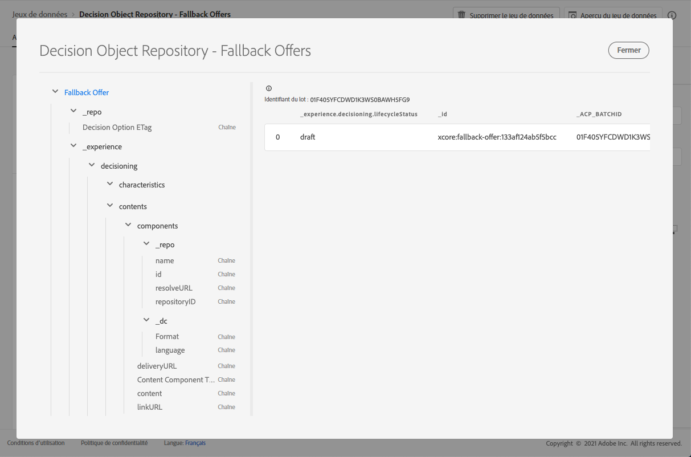

# Jeu de données d&#39;offres de secours {#fallback-dataset}

>[!TIP]
>
>La prise de décision, la nouvelle fonctionnalité de prise de décision d’[!DNL Adobe Journey Optimizer], est désormais disponible via les canaux d’expérience basée sur du code et d’e-mail. [En savoir plus](../../experience-decisioning/gs-experience-decisioning.md)

Chaque fois qu&#39;une offre est modifiée, le jeu de données généré automatiquement pour les offres de secours est mis à jour.

Le lot le plus récent dans le jeu de données s&#39;affiche à droite. La vue hiérarchique du schéma du jeu de données s&#39;affiche dans le volet de gauche.

>[!NOTE]
>
>Les offres de secours supprimées sont marquées comme étant archivées dans le jeu de données.

Vous trouverez ci-dessous la liste de tous les champs qui peuvent être utilisés dans le jeu de données **[!UICONTROL Référentiel d&#39;objets de décision - Offres de secours]**.

+++ Identifiant

**Champ :** _id 
**Titre :** identifiant 
**Description :** identifiant unique de l&#39;enregistrement.
**Type :** chaîne

+++

+++ _experience

**Champ :** _experience
**Type :** objet

+++

+++ _experience > decisioning

**Champ :** prise de décision
**Type :** objet

+++

+++ _experience > decisioning > characteristics

**Champ :** caractéristiques 
**Titre :** Caractéristiques d&#39;option de décision
**Description :** Propriétés ou attributs supplémentaires appartenant à cette option de décision particulière. Différentes instances peuvent avoir différentes caractéristiques (clés dans le mappage). Les caractéristiques sont des paires nom-valeur utilisées pour distinguer une option de décision des autres. Les caractéristiques sont utilisées comme valeurs dans le contenu qui représente cette option de décision et comme fonctionnalités pour analyser et optimiser les performances d&#39;une option. Lorsque chaque instance possède le même attribut ou la même propriété, cet aspect doit être modélisé en tant que schéma d&#39;extension dérivé des détails de l&#39;option de décision.
**Type :** objet

+++

<!--Field under Characteristics without title = additionalProperties? Desc = Value of the property. Type: string-->

+++ _experience > decisioning > contents

**Champ :** contenu 
**Titre :** détails du contenu 
**Description :** éléments de contenu pour afficher l&#39;élément de décision dans différents contextes. Une seule option de décision peut avoir plusieurs variantes de contenu. Le contenu est une information destinée à une audience pour être utilisée dans une expérience (numérique). Le contenu est diffusé par le biais de canaux à un emplacement spécifique.
**Type :** tableau

+++

+++_experience > decisioning > contents > components

**Champ :** composants
**Description :** composants du contenu représentant l’option de décision, y compris toutes leurs variantes linguistiques. Les composants spécifiques sont identifiés par « dx:format », « dc:subject » et « dc:language » ou une combinaison de ces éléments. Ces métadonnées permettent de localiser ou de représenter le contenu associé à une offre et de l&#39;intégrer selon le contrat d’emplacement.
**Type :** tableau
**Obligatoire :** &quot;_type&quot;, &quot;_dc&quot; <!--TBC?-->

* **_experience > decisioning > contents > components > Content Component Type**

  **Champ :** _type
  **Titre :** type du composant du contenu
  **Description** : ensemble énuméré d’URI où chaque valeur correspond à un type donné au composant de contenu. Certains consommateurs des représentations de contenu s&#39;attendent à ce que la valeur @type soit une référence au schéma qui décrit les propriétés supplémentaires du composant de contenu.
  **Type :** chaîne

* **_experience > decisioning > contents > components > _dc**

  **Champ :** _dc
  **Type :** objet
  **Obligatoire :** &quot;format&quot;

   * **Format**

     **Champ :** format
     **Titre :** format
     **Description :** manifestation physique ou numérique de la ressource. En règle générale, le format doit inclure le type de média de la ressource. Le format peut être utilisé pour déterminer le logiciel, le matériel ou tout autre équipement nécessaire pour afficher ou exploiter la ressource. La bonne pratique recommandée consiste à sélectionner une valeur dans un vocabulaire contrôlé (par exemple, la liste des [types de médias Internet] (https://www.iana.org/ assignments/media-types/) définissant les formats de médias informatiques).
     **Type :** chaîne
     **Exemple :** &quot;application/vnd.adobe.photoshop&quot;

   * **Langue**

     **Champ :** language
     **Titre :** langue
     **Description :** la ou les langues de la ressource. \nLes langues sont spécifiées dans le code de langue comme défini dans [IETF RFC 3066](https://www.ietf.org/rfc/rfc3066.txt), qui fait partie de BCP 47, utilisé ailleurs dans XDM.
     **Type :** tableau
     **Exemples :** &quot;\n&quot;, &quot;pt-BR&quot;, &quot;es-ES&quot;

* **_experience > decisioning > contents > components > _repo**

  **Champ :** _repo
  **Type :** objet

   * **identifiant**

     **Champ :** id
     **Description :** identifiant unique facultatif permettant de référencer la ressource dans un référentiel de contenu. Lorsque les API Platform sont utilisées pour récupérer la représentation, le client peut s’attendre à ce qu’une propriété \&quot;repo:resolveUrl\&quot; supplémentaire récupère la ressource.
     **Type :** chaîne
     **Exemple :** &quot;urn:aaid:sc:US:6dc33479-13ca-4b19-b25d-c805eff8a69e&quot;

   * **name**

     **Champ :** nom
     **Description :** conseils sur l’emplacement du référentiel qui stocke la ressource externe par le \&quot;repo:id\&quot;.
     **Type :** chaîne

   * **repositoryID**

     **Champ :** repositoryID
     **Description :** identifiant unique facultatif permettant de référencer la ressource dans un référentiel de contenu. Lorsque les API Platform sont utilisées pour récupérer la représentation, le client peut s’attendre à ce qu’une propriété \&quot;repo:resolveUrl\&quot; supplémentaire récupère la ressource.
     **Type :** chaîne
     **Exemple :** &quot;C87932A55B06F7070A49412D@AdobeOrg&quot;

   * **resolveURL**

     **Champ :** resolveURL
     **Description :** localisateur de ressource unique facultatif pour lire la ressource dans un référentiel de contenu. Il sera ainsi plus facile d&#39;obtenir la ressource sans que le client sache où celle-ci est gérée et quelles API appeler. Ceci est similaire à un lien HAL, mais la sémantique est plus simple et plus pertinente.
     **Type :** chaîne
     **Exemple :** &quot;https://plaftform.adobe.io/resolveByPath?path=&quot;/mycorp/content/projectx/fragment/prod/herobanners/banner14.html3&quot;&quot;

* **_experience > decisioning > contents > components > content**

  **Champ :** contenu
  **Description :** champ facultatif pour contenir directement le contenu. Au lieu de référencer le contenu dans un référentiel de ressources, le composant peut contenir directement du contenu simple. Ce champ n&#39;est pas utilisé pour les ressources de contenu composites, complexes et binaires.
  **Type :** chaîne

* **_experience > decisioning > contents > components > deliveryURL**

  **Champ :** deliveryURL
  **Description :** un localisateur de ressources unique facultatif pour obtenir la ressource à partir d’un réseau de diffusion de contenu ou d’un point d’entrée de service. Cette URL permet d&#39;accéder publiquement à la ressource par un agent utilisateur.
  **Type :** chaîne
  **Exemple :** &quot;https://cdn.adobe.io/content/projectx/fragment/prod/static/1232324wd32.jpeg&quot;

* **_experience > decisioning > contents > components > linkURL**

  **Champ :** linkURL
  **Description :** localisateur de ressource unique facultatif pour les interactions utilisateur. Cette URL permet de renvoyer l&#39;utilisateur final dans un agent utilisateur et peut faire l&#39;objet d&#39;un suivi.
  **Type :** chaîne
  **Exemple :** &quot;https://cdn.adobe.io/tracker?code=23432&amp;redirect=/content/projectx/fragment/prod/static/1232324wd32.jpeg&quot;

+++

+++ _experience > decisioning > contents > Placement

**Champ :** emplacement
**Titre :** emplacement 
**Description :** emplacement à respecter. La valeur est l&#39;URI (@id) de l&#39;emplacement d&#39;offre qui est référencé. Voir le schéma https://ns.adobe.com/experience/decisioning/placement.
**Type :** Chaîne

+++ 

+++ _experience > decisioning > Lifecycle Status

**Champ :** lifecycleStatus
**Titre :** statut du cycle de vie
**Description :** le statut de cycle de vie permet d&#39;exécuter des workflows avec un objet. L&#39;état peut avoir une incidence lorsqu&#39;un objet est visible ou jugé pertinent. Les modifications de statut sont effectuées par les clients ou les services qui utilisent les objets.
**Type :** chaîne
**Valeurs possibles :** &quot;Brouillon&quot; (par défaut), &quot;Approuvé&quot;, &quot;Actif&quot;, &quot;Terminé&quot;, &quot;Archivé&quot;

+++

+++ _experience > decisioning > Decision Option Name

**Champ :** nom
**Titre :** nom de l&#39;option de décision
**Description :** nom d&#39;option affiché dans diverses interfaces utilisateur.
**Type :** chaîne

+++

+++ _experience > decisioning > tags

**Champ :** balises
**Titre :** balises
**Description :** jeu de qualificateurs de collection (précédemment appelés « balises ») associé à cette entité. Les qualificateurs de collection sont utilisés dans les expressions de filtre pour limiter l’inventaire global à un sous-ensemble (catégorie).
**Type :** tableau

+++

<!--Field without name under collection qualifiers: Description: An identifier of a collection qualifier object. The value is the @id of the collection qualifier that is referenced. See tag schema: https://ns.adobe.com/experience/decisioning/tag. Type: string-->

+++ _repo

**Champ :** _repo 
**Type :** objet

+++

+++ _repo > Etag Option de décision

**Champ :** etag
**Titre :** ETag Option de décision 
**Description :** La révision à laquelle l&#39;objet de l&#39;option de décision se trouvait au moment de la prise de l&#39;instantané.
**Type :** chaîne

+++
