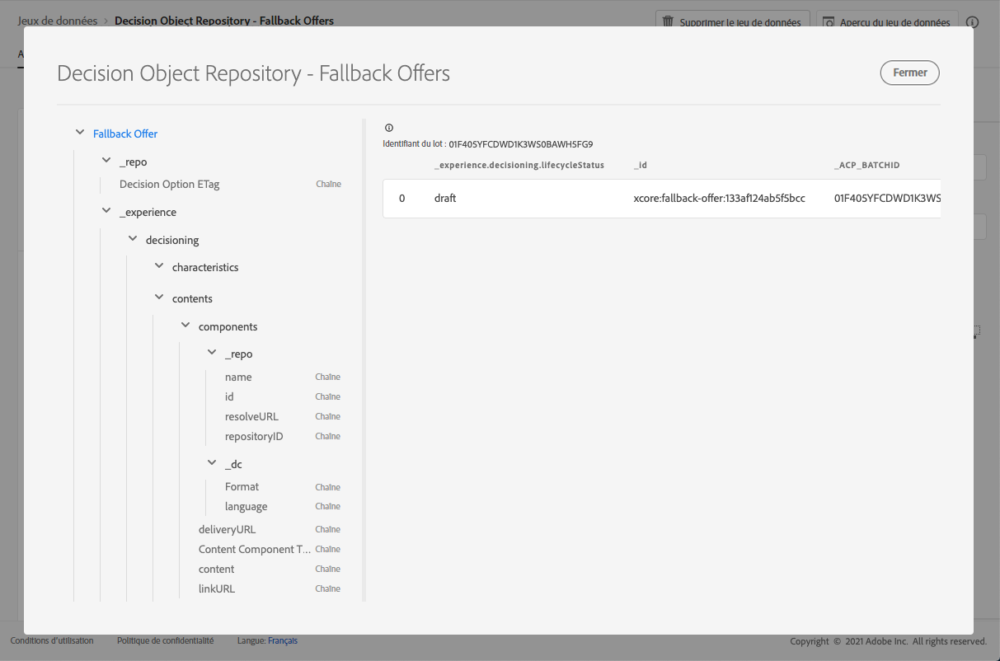

# Jeu de données des offres de secours {#fallback-dataset}

Chaque fois qu&#39;une offre est modifiée, le jeu de données généré automatiquement pour les offres de secours est mis à jour.

Le dernier lot du jeu de données s&#39;affiche à droite. La vue hiérarchique du schéma du jeu de données s&#39;affiche dans le volet de gauche.

>[!NOTE]
>
>Découvrez comment accéder aux jeux de données exportés pour chaque objet de votre bibliothèque des offres dans [cette section](../export-catalog/access-dataset.md).

Vous trouverez ci-dessous la liste de tous les champs pouvant être utilisés dans le jeu de données **[!UICONTROL Référentiel d&#39;objets de décision - Offres de secours]**.

## Identifiant

**Champ :** _id 
**Titre :** identifiant
**Description :** identifiant unique de l&#39;enregistrement.
**Type :** chaîne

## _experience

**Champ :** _experience
**Type :** objet

### _experience > prise de décisions

**Champ :** prise de décisions
**Type :** objet

#### _experience > prise de décisions > caractéristiques

**Champ :** caractéristiques 
**Titre :** caractéristiques de l&#39;option de décision
**Description :** propriétés ou attributs supplémentaires appartenant à cette option de décision spécifique. Différentes instances peuvent avoir différentes caractéristiques (clés dans le mappage). Les caractéristiques sont des paires nom-valeur utilisées pour distinguer une option de décision des autres. Les caractéristiques sont utilisées comme valeurs dans le contenu qui représente cette option de décision et comme fonctionnalités pour analyser et optimiser les performances d&#39;une option. Lorsque chaque instance possède le même attribut ou la même propriété, cet aspect doit être modélisé en tant que schéma d&#39;extension qui dérive du détail de l&#39;option de décision.
**Type :** objet

<!--Field under Characteristics without title = additionalProperties? Desc = Value of the property. Type: string-->

#### _experience > prise de décisions > contenu

**Champ :** contenu 
**Title :** détails du contenu 
**Description :** éléments de contenu pour effectuer le rendu de l&#39;élément de décision dans différents contextes. Une seule option de décision peut avoir plusieurs variantes de contenu. Le contenu est une information destinée à une audience pour être utilisée dans une expérience (numérique). Le contenu est diffusé par le biais de canaux à un emplacement spécifique.
**Type :** tableau

**_experience > prise de décisions > contenu > composants**

**Champ :** composants 
**Description :** composants du contenu représentant l&#39;option de décision, y compris toutes leurs variantes linguistiques. Les composants spécifiques sont identifiés par &#39;dx:format&#39;, &#39;dc:subject&#39; et &#39;dc:language&#39; ou une combinaison de ces composants. Ces métadonnées sont utilisées pour localiser ou représenter le contenu associé à une offre et l&#39;intégrer selon le contrat d&#39;emplacement.
**Type :** tableau 
**Obligatoire :** &quot;_type&quot;, &quot;_dc&quot; <!--TBC?-->

* **_experience > prise de décisions > contenu > composants > Type du composant du contenu**

   **Champ :** _type
   **Titre :** type du composant du contenu
   **Description :** jeu énuméré d&#39;URI où chaque valeur correspond à un type donné au composant de contenu. Certains consommateurs des représentations de contenu s&#39;attendent à ce que la valeur @type soit une référence au schéma qui décrit les propriétés supplémentaires du composant de contenu.
   **Type :** chaîne

* **_experience > prise de décisions > contenu > composants > _dc**

   **Champ :** _dc
   **Type :** objet
   **Obligatoire :** &quot;format&quot;

   * **Format**

      **Champ :** format
      **Titre :** format
      **Description :** manifestation physique ou numérique de la ressource. En règle générale, le format doit inclure le type de média de la ressource. Le format peut être utilisé pour déterminer le logiciel, le matériel ou tout autre équipement nécessaire pour afficher ou exploiter la ressource. La bonne pratique recommandée consiste à sélectionner une valeur dans un vocabulaire contrôlé (par exemple, la liste des [types de médias Internet](http://www.iana.org/ assignments/media-types/) définissant les formats de médias informatiques).
      **Type :** chaîne
      **Exemple :** &quot;application/vnd.adobe.photoshop&quot;

   * **Langue**

      **Champ :** language
      **Titre :** langue
      **Description :** la ou les langues de la ressource. \nLes langues sont spécifiées dans le code de langue comme défini dans [IETF RFC 3066](https://www.ietf.org/rfc/rfc3066.txt), qui fait partie de BCP 47, utilisé ailleurs dans XDM.
      **Type :** tableau
      **Exemples :** &quot;\n&quot;, &quot;pt-BR&quot;, &quot;es-ES&quot;

* **_experience > prise de décisions > contenu > composants > _repo**

   **Champ :** _repo
   **Type :** objet

   * **identifiant**

      **Champ :** id
      **Description :** identifiant unique facultatif permettant de référencer la ressource dans un référentiel de contenu. Lorsque les API de Platform sont utilisées pour récupérer la représentation, le client peut s&#39;attendre à une propriété supplémentaire \&quot;repo:resolveUrl\&quot; pour récupérer la ressource.
      **Type :** chaîne
      **Exemple :** &quot;urn:aaid:sc:US:6dc33479-13ca-4b19-b25d-c805eff8a69e&quot;

   * **name**

      **Champ :** nom
      **Description :** conseils sur l&#39;emplacement du référentiel qui stocke la ressource externe par le \&quot;repo:id\&quot;.
      **Type :** chaîne

   * **repositoryID**

      **Champ :** repositoryID
      **Description :** identifiant unique facultatif permettant de référencer la ressource dans un référentiel de contenu. Lorsque les API de Platform sont utilisées pour récupérer la représentation, le client peut s&#39;attendre à une propriété supplémentaire \&quot;repo:resolveUrl\&quot; pour récupérer la ressource.
      **Type :** chaîne
      **Exemple :** &quot;C87932A55B06F7070A49412D@AdobeOrg&quot;

   * **resolveURL**

      **Champ :** resolveURL
      **Description :** localisateur de ressource unique facultatif pour lire la ressource dans un référentiel de contenu. Cela facilite l&#39;obtention de la ressource sans que le client comprenne où la ressource est gérée et les API à appeler. Ceci est similaire à un lien HAL, mais la sémantique est plus simple et plus pertinente.
      **Type :** chaîne
      **Exemple :** &quot;https://plaftform.adobe.io/resolveByPath?path=&quot;/mycorp/content/projectx/fragment/prod/herobanners/banner14.html3&quot;&quot;

* **_experience > prise de décisions > contenu > composants > contenu**

   **Champ :** contenu
   **Description :** champ facultatif pour contenir directement le contenu. Au lieu de référencer le contenu dans un référentiel de ressources, le composant peut contenir directement du contenu simple. Ce champ n&#39;est pas utilisé pour les ressources de contenu composites, complexes et binaires.
   **Type :** chaîne

* **_experience > prise de décisions > contenu > composants > deliveryURL**

   **Champ :** deliveryURL
   **Description :** localisateur de ressource unique facultatif pour obtenir la ressource à partir d&#39;un réseau de diffusion de contenu ou d&#39;un point d&#39;entrée de service. Cette URL permet d&#39;accéder publiquement à la ressource par un agent utilisateur.
   **Type :** chaîne
   **Exemple :** &quot;https://cdn.adobe.io/content/projectx/fragment/prod/static/1232324wd32.jpeg&quot;

* **_experience > prise de décisions > contenu > composants > linkURL**

   **Champ :** linkURL
   **Description :** localisateur de ressource unique facultatif pour les interactions utilisateur. Cette URL est utilisée pour renvoyer l&#39;utilisateur final vers un agent utilisateur et peut être suivie.
   **Type :** chaîne
   **Exemple :** &quot;https://cdn.adobe.io/tracker?code=23432&amp;redirect=/content/projectx/fragment/prod/static/1232324wd32.jpeg&quot;

**_experience > prise de décisions > contenu > Emplacement**

**Champ :** emplacement
**Titre :** emplacement 
**Description :** emplacement à respecter. La valeur est l&#39;URI (@id) de l&#39;emplacement d&#39;offre qui est référencé. Voir le schéma https://ns.adobe.com/experience/decisioning/placement.
**Type :** chaîne

#### _experience > prise de décisions > Statut du cycle de vie

**Champ :** lifecycleStatus 
**Titre :** statut du cycle de vie 
**Description :** le statut du cycle de vie permet d&#39;exécuter des workflows avec un objet. Le statut peut avoir une incidence lorsqu&#39;un objet est visible ou considéré comme pertinent. Les modifications de statut sont effectuées par les clients ou les services qui utilisent les objets.
**Type :** chaîne 
**Valeurs possibles :** &quot;Draft&quot; (par défaut), &quot;Approved&quot;, &quot;Live&quot;, &quot;Completed&quot;, &quot;Archived&quot;

#### _experience > prise de décisions > Nom de l&#39;option de décision

**Champ :** nom 
**Titre :** nom de l&#39;option de décision 
**Description :** nom de l&#39;option affiché dans différentes interfaces utilisateur.
**Type :** chaîne

#### _experience > prise de décisions > balises

**Champ :** balises
**Titre :** balises 
**Description :** jeu de balises associées à cette entité. Les balises sont utilisées dans les expressions de filtre pour contraindre l&#39;inventaire global à un sous-ensemble (catégorie).
**Type :** tableau

<!--Field without name under tags: Description: An identifier of a tag object. The value is the @id of the tag that is referenced. See tag schema: https://ns.adobe.com/experience/decisioning/tag. Type: string-->

## _repo

**Champ :** _repo 
**Type :** objet

### _repo > Etag d’option de décision

**Champ :** etag
**Titre :** ETag d’option de décision
**Description :** révision à laquelle l&#39;objet de l&#39;option de décision se trouvait lors de la prise de l&#39;instantané.
**Type :** chaîne
