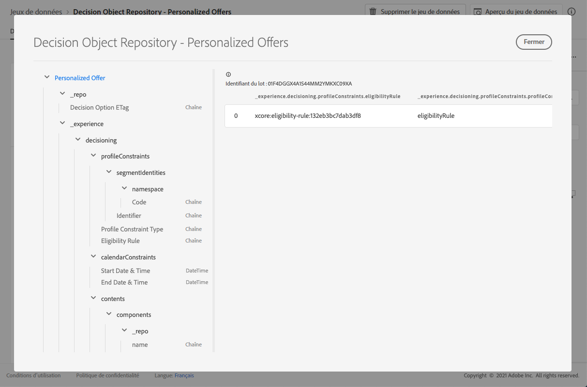

# Jeu de données d’offres personnalisées {#offers-dataset}

>[!TIP]
>
>La prise de décision, la nouvelle fonctionnalité de prise de décision d’[!DNL Adobe Journey Optimizer], est désormais disponible via les canaux d’expérience basée sur du code et d’e-mail. [En savoir plus](../../experience-decisioning/gs-experience-decisioning.md)

Chaque fois qu&#39;une offre est modifiée, le jeu de données généré automatiquement pour les offres de contenu personnalisées est mis à jour.

Le lot le plus récent du jeu de données qui a réussi s&#39;affiche à droite. La vue hiérarchique du schéma du jeu de données s&#39;affiche dans le volet de gauche.

>[!NOTE]
>
>Les offres personnalisées supprimées sont marquées comme étant archivées dans le jeu de données.

Voici la liste de tous les champs qui peuvent être utilisés dans le jeu de données **[!UICONTROL Référentiel d&#39;objet de décision - Offres personnalisées]**.

<!--Personalized offers form the set of choices for a decision. The objective for decisioning is to take a large inventory of items and apply numerous constraint rules to that inventory to narrow it down and then to rank the qualifying options according to a criteria. The resulting propositions assemble and personalize the experience for specific individuals.-->

+++ Identifiant

**Champ :** _id 
**Titre :** identifiant 
**Description :** identifiant unique de l&#39;enregistrement.
**Type :** chaîne

+++

+++ _experience {#experience}

**Champ :** _experience
**Type :** objet

+++

+++ _experience > decisioning

**Champ :** prise de décision
**Type :** objet

+++

+++ _experience > decisioning > calendarConstraints 

**Champ :** calendarConstraints 
**Titre :** détails sur les contraintes de calendrier
**Description :** les contraintes de calendrier déterminent si une option de décision est valide sur une période. En dehors de cette plage de dates, l&#39;option ne peut pas être proposée.
**Type :** objet

* **Date et heure de fin**

  **Champ :** endDate
  **Titre :** date et heure de fin
  **Description :** date de fin de validité des options de décision. Les options qui ont dépassé leur date de fin ne peuvent plus être proposées dans le processus de prise de décision.
  **Type :** chaîne

* **Date et heure de début**

  **Champ :** startDate
  **Titre :** date et heure de début
  **Description :** date de début de validité des options de décision. Les options qui n&#39;ont pas atteint leur date de début ne peuvent pas encore être proposées dans le processus de prise de décision.
  **Type :** chaîne

+++

+++ _experience > decisioning > characteristics

**Champ :** caractéristiques 
**Titre :** caractéristiques de l’option de décision
**Description :** les caractéristiques sont des propriétés ou attributs supplémentaires d’offres qui appartiennent à cette option de décision spécifique. Ces attributs sont des paires clé-valeur, ce qui signifie qu’ils incluent un nom d’attribut (parfois appelé clé) auquel une valeur est associée, et sont utilisés pour distinguer une option de décision des autres offres. Par exemple, pour un nom d’attribut « color », la valeur peut être « green » pour une offre spécifique.<!--Characteristics are used as values in content that represents this decision option and as features to analyze and optimize the performance of an offer. When every instance has the same attribute or property, that aspect should be modeled as an extension schema that derives from the decision option detail.-->
**Type:** objet

+++

+++ _experience > decisioning > contents

**Champ :** contenu 
**Titre :** détails du contenu 
**Description :** éléments de contenu pour afficher l&#39;élément de décision dans différents contextes. Une seule option de décision peut avoir plusieurs variantes de contenu. Le contenu est une information destinée à une audience pour être utilisée dans une expérience (numérique). Le contenu est diffusé par le biais de canaux à un emplacement spécifique.
**Type :** tableau

+++

+++_experience > decisioning > contents > components

**Champ :** composants
**Description :** composants du contenu représentant l’option de décision, y compris toutes leurs variantes linguistiques. Les composants spécifiques sont identifiés par « dx:format », « dc:subject » et « dc:language » ou une combinaison de ces éléments. Ces métadonnées permettent de localiser ou de représenter le contenu associé à une offre et de l&#39;intégrer selon le contrat d’emplacement.
**Type :** tableau
**Obligatoire :** &quot;_type&quot;, &quot;_dc&quot; <!--TBC?-->

* **_experience > decisioning > contents > components > Content Component Type**

  **Champ :** _type
  **Titre :** type du composant du contenu
  **Description** : ensemble énuméré d’URI où chaque valeur correspond à un type donné au composant de contenu. Certains consommateurs des représentations de contenu s&#39;attendent à ce que la valeur @type soit une référence au schéma qui décrit les propriétés supplémentaires du composant de contenu.
  **Type :** chaîne

* **_experience > decisioning > contents > components > _dc**

  **Champ :** _dc
  **Type :** objet
  **Obligatoire :** &quot;format&quot;

   * **Format**

     **Champ :** format
     **Titre :** format
     **Description :** manifestation physique ou numérique de la ressource. En règle générale, le format doit inclure le type de média de la ressource. Le format peut être utilisé pour déterminer le logiciel, le matériel ou tout autre équipement nécessaire pour afficher ou exploiter la ressource. Il est recommandé de sélectionner une valeur dans un vocabulaire contrôlé (par exemple, la liste des [types de média Internet](https://www.iana.org/assignments/media-types/) définissant les formats de médias informatiques).
     **Type :** chaîne
     **Exemple :** &quot;application/vnd.adobe.photoshop&quot;

   * **Langue**
     **Champ :** language
     **Titre :** langue
     **Description :** la ou les langues de la ressource. \nLes langues sont spécifiées dans le code de langue comme défini dans [IETF RFC 3066](https://www.ietf.org/rfc/rfc3066.txt), qui fait partie de BCP 47, utilisé ailleurs dans XDM.
     **Type :** tableau
     **Exemples :** &quot;\n&quot;, &quot;pt-BR&quot;, &quot;es-ES&quot;

* **_experience > decisioning > contents > components > _repo**

  **Champ :** _repo
  **Type :** objet

   * **identifiant**

     **Champ :** id
     **Description :** identifiant unique facultatif permettant de référencer la ressource dans un référentiel de contenu. Lorsque les API Platform sont utilisées pour récupérer la représentation, le client peut s’attendre à ce qu’une propriété \&quot;repo:resolveUrl\&quot; supplémentaire récupère la ressource.
     **Type :** chaîne
     **Exemple :** &quot;urn:aaid:sc:US:6dc33479-13ca-4b19-b25d-c805eff8a69e&quot;

   * **name**

     **Champ :** nom
     **Description :** conseils sur l’emplacement du référentiel qui stocke la ressource externe par le \&quot;repo:id\&quot;.
     **Type :** chaîne

   * **repositoryID**

     **Champ :** repositoryID
     **Description :** identifiant unique facultatif permettant de référencer la ressource dans un référentiel de contenu. Lorsque les API Platform sont utilisées pour récupérer la représentation, le client peut s’attendre à ce qu’une propriété \&quot;repo:resolveUrl\&quot; supplémentaire récupère la ressource.
     **Type :** chaîne
     **Exemple :** &quot;C87932A55B06F7070A49412D@AdobeOrg&quot;

   * **resolveURL**

     **Champ :** resolveURL
     **Description :** localisateur de ressource unique facultatif pour lire la ressource dans un référentiel de contenu. Il sera ainsi plus facile d&#39;obtenir la ressource sans que le client sache où celle-ci est gérée et quelles API appeler. Ceci est similaire à un lien HAL, mais la sémantique est plus simple et plus pertinente.
     **Type :** chaîne
     **Exemple :** &quot;https://plaftform.adobe.io/resolveByPath?path=&quot;/mycorp/content/projectx/fragment/prod/herobanners/banner14.html3&quot;&quot;

* **_experience > decisioning > contents > components > content**

  **Champ :** contenu
  **Description :** champ facultatif pour contenir directement le contenu. Au lieu de référencer le contenu dans un référentiel de ressources, le composant peut contenir directement du contenu simple. Ce champ n&#39;est pas utilisé pour les ressources de contenu composites, complexes et binaires.
  **Type :** chaîne

* **_experience > decisioning > contents > components > deliveryURL**

  **Champ :** deliveryURL
  **Description :** un localisateur de ressources unique facultatif pour obtenir la ressource à partir d’un réseau de diffusion de contenu ou d’un point d’entrée de service. Cette URL permet d&#39;accéder publiquement à la ressource par un agent utilisateur.
  **Type :** chaîne
  **Exemple :** &quot;https://cdn.adobe.io/content/projectx/fragment/prod/static/1232324wd32.jpeg&quot;

* **_experience > decisioning > contents > components > linkURL**

  **Champ :** linkURL
  **Description :** localisateur de ressource unique facultatif pour les interactions utilisateur. Cette URL permet de renvoyer l&#39;utilisateur final dans un agent utilisateur et peut faire l&#39;objet d&#39;un suivi.
  **Type :** chaîne
  **Exemple :** &quot;https://cdn.adobe.io/tracker?code=23432&amp;redirect=/content/projectx/fragment/prod/static/1232324wd32.jpeg&quot;

+++_experience > decisioning > contents > Placement

**Champ :** emplacement
**Titre :** emplacement 
**Description :** emplacement à respecter. La valeur est l&#39;URI (@id) de l&#39;emplacement d&#39;offre qui est référencé. Voir le schéma https://ns.adobe.com/experience/decisioning/placement.
**Type :** Chaîne

+++

+++ _experience > decisioning > Lifecycle Status

**Champ :** lifecycleStatus
**Titre :** statut du cycle de vie
**Description :** le statut de cycle de vie permet d&#39;exécuter des workflows avec un objet. L&#39;état peut avoir une incidence lorsqu&#39;un objet est visible ou jugé pertinent. Les modifications de statut sont effectuées par les clients ou les services qui utilisent les objets.
**Type :** chaîne
**Valeurs possibles :** &quot;Brouillon&quot; (par défaut), &quot;Approuvé&quot;, &quot;Actif&quot;, &quot;Terminé&quot;, &quot;Archivé&quot;

+++

+++ _experience > decisioning > Decision Option Name

**Champ :** nom
**Titre :** nom de l&#39;option de décision
**Description :** nom d&#39;option affiché dans diverses interfaces utilisateur.
**Type :** chaîne

+++

+++ _experience > decisioning > profileConstraints

**Champ :** profileConstraints 
**Titre :** Détails de la contrainte de profil
**Description :** Les contraintes de profil déterminent si une option est éligible pour cette identité de profil, à l&#39;heure actuelle, dans ce contexte. Si la contrainte de profil n&#39;a pas besoin de prendre en compte les valeurs de chacune des options, c&#39;est-à-dire qu&#39;elle est invariante des options de la sélection d&#39;options, la contrainte de profil qui prend la valeur &quot;false&quot; annule l&#39;ensemble de la sélection d&#39;options. D&#39;un autre côté, une règle de contrainte de profil qui prend une option en tant que paramètre est évaluée pour chaque option de qualification de la sélection d&#39;options.
**Type :** objet

+++

+++_experience > decisioning > profileConstraints > Description

**Champ :** description
**Titre :** description 
**Description :** description des contraintes de profil. Elle est utilisée pour transmettre des intentions lisibles sur la façon et les raisons pour lesquelles cette contrainte de profil a été construite et/ou sur l&#39;option qui sera incluse ou exclue par elle.
**Type :** Chaîne

+++

+++_experience > decisioning > profileConstraints > Eligibility Rule

**Champ :** eligibilityRule
**Titre :**règle d&#39;éligibilité
**Description :** référence à une règle de décision qui renvoie true ou false pour un profil donné et/ou d&#39;autres objets XDM contextuels donnés. La règle est utilisée pour déterminer si l&#39;option est admissible pour un profil donné. La valeur est l&#39;URI (@id) de la règle de décision référencée. Voir le schéma https://ns.adobe.com/experience/decisioning/rule.
**Type :** Chaîne

+++

+++_experience > decisioning > profileConstraints > Profile Constraint Type

**Champ :** profileConstraintType
**Titre :** type de contrainte de profil
**Description :** détermine si des contraintes sont actuellement définies et comment les contraintes sont exprimées. Cela peut se faire avec une règle ou avec une ou plusieurs appartenances à des audiences.
**Type :** chaîne 
**Valeurs possibles :**

* &quot;none&quot; (par défaut)
* &quot;eligibilityRule&quot; : « La contrainte de profil est exprimée sous la forme d&#39;une règle unique qui doit être évaluée comme égale à true avant que l&#39;action contrainte ne soit autorisée. »
* « anySegments » : « La contrainte de profil est exprimée sous la forme d’une ou de plusieurs audiences et le profil doit être membre d’au moins l’une d’entre elles avant que l’action contrainte ne soit autorisée. »
* &quot;allSegments&quot; : « La contrainte de profil est exprimée en une ou plusieurs audiences et le profil doit être membre de toutes ces audiences pour que l’action contrainte soit autorisée. »
* « rules » : « La contrainte de profil est exprimée sous la forme de plusieurs règles différentes (par exemple, l’éligibilité, l’applicabilité, l’adaptabilité), qui doivent toutes renvoyer true avant que l’action contrainte ne soit autorisée. »

+++

+++_experience > decisioning > profileConstraints > Segment Identifiers

**Champ :** segmentIdentities
**Titre :** identifiants de segment
**Description :** identifiants des audiences
**Type :** tableau

* **Identifiant**

  **Champ :** _id
  **Titre :** identifiant
  **Description :** identité des audiences dans l’espace de noms connexe.
  **Type :** chaîne

* **Espace de noms**

  **Champ :** espace de noms
  **Titre :** espace de noms
  **Description :** Espace de noms associé à l&#39;attribut `xid`.
  **Type :** objet
  **Obligatoire :** &quot;code&quot;

   * **Code**

     **Champ :** code
     **Titre :** code
     **Description :** Le code est un identifiant lisible par l&#39;homme pour l&#39;espace de noms et peut être utilisé pour demander l&#39;identifiant technique d&#39;espace de noms utilisé pour le traitement des graphiques d&#39;identités.
     **Type :** chaîne

* **Identifiant d&#39;expérience**

  **Champ :** xid
  **Titre :** identifiant d&#39;expérience
  **Description** : Lorsqu&#39;elle est présente, cette valeur représente un identifiant d&#39;espace de noms croisé unique pour tous les identifiants d&#39;espace de noms inclus dans tous les espaces de noms.
  **Type :** chaîne

+++

+++ _experience > decisioning > ranking

**Champ :** classement
**Titre :** Détails du classement
**Description :** Rang (priorité). Définit ce qui est considéré comme la \&quot;meilleure action\&quot; selon le contexte du critère de décision. Parmi toutes les options sélectionnées qui répondent à la contrainte d’éligibilité, l’ordre de classement déterminera les principales options (ou Top N des options) à proposer.
**Type :** objet

+++

+++_experience > decisioning > ranking > Order Evaluation

**Champ :** ordre
**Titre :** évaluation de l&#39;ordre
**Description :** évaluation d&#39;un ordre relatif d&#39;une ou de plusieurs options de décision. Les options avec des valeurs ordinales plus élevées sont sélectionnées à la place de n&#39;importe quelle option avec des valeurs ordinales plus faibles. Les valeurs déterminées par cette méthode peuvent être ordonnées, mais les distances entre elles ne peuvent pas être mesurées et, ni les sommes ni les produits ne peuvent être calculés. La médiane et le mode sont les seules mesures de tendance centrale qui peuvent être utilisées pour les données ordinales.
**Type :** objet

* **Fonction de notation**

  **Champ :** fonction
  **Titre :** fonction de notation
  **Description :** référence à une fonction qui calcule un score numérique pour cette option de décision. Les options de décision sont ensuite classées selon ce score. La valeur de cette propriété est l&#39;URI (@id) de la fonction à appeler avec l&#39;option active à la fois. Voir le schéma https://ns.adobe.com/experience/decisioning/function.
  **Type :** chaîne

* **Type d&#39;évaluation de commande**

  **Champ :** orderEvaluationType
  **Titre :** type d&#39;évaluation d&#39;ordre
  **Description :** indique le mécanisme d’évaluation de l’ordre utilisé, la priorité statique des options de décision, une fonction de notation qui calcule une valeur numérique pour chaque option ou un modèle d’IA qui reçoit une liste pour l’ordonner.
  **Type :** chaîne
  **Valeurs possibles :** &quot;static&quot;, &quot;scoringFunction&quot;, &quot;rankingStrategy&quot;

* **Stratégie de classement**

  **Champ :** rankingStrategy
  **Titre :** stratégie de classement
  **Description :** référence à une stratégie qui classe une liste d&#39;options de décision. Les options de décision sont renvoyées dans une liste classée. La valeur de cette propriété est l&#39;URI (@id) de la fonction à appeler avec l&#39;option active à la fois. Voir le schéma https://ns.adobe.com/experience/decisioning/rankingStrategy.
  **Type :** chaîne

+++

+++_experience > decisioning > ranking > Priority

**Champ :** priorité
**Titre :** priorité
**Description :** priorité d’une seule option de décision par rapport à toutes les autres options. Les options pour lesquelles aucune fonction de commande n&#39;est fournie sont prioritaires à l&#39;aide de cette propriété. Les options avec des valeurs de priorité plus élevée sont sélectionnées avant toute option de priorité plus faible. Si plusieurs options admissibles partagent la valeur de priorité la plus élevée, une option est choisie de façon aléatoire uniforme et utilisée pour la proposition de décision.
**Type :** entier
**Valeur minimum :** 0
**Valeur par défaut :** 0

+++

+++ _experience > decisioning > tags

**Champ :** balises
**Titre :** balises
**Description :** jeu de qualificateurs de collection (précédemment appelés « balises ») associé à cette entité. Les qualificateurs de collection sont utilisés dans les expressions de filtre pour contraindre l’inventaire global à un sous-ensemble (catégorie).
**Type :** tableau

+++

<!--Field without name under tags: Description: An identifier of a collection qualifier object. The value is the @id of the collection qualifier that is referenced. See tag schema: https://ns.adobe.com/experience/decisioning/tag. Type: string-->

+++_repo

**Champ :** _repo 
**Type :** objet

+++ 

+++ _repo > Etag Option de décision

**Champ :** etag
**Titre :** ETag Option de décision 
**Description :** La révision à laquelle l&#39;objet de l&#39;option de décision se trouvait au moment de la prise de l&#39;instantané.
**Type :** chaîne

+++
