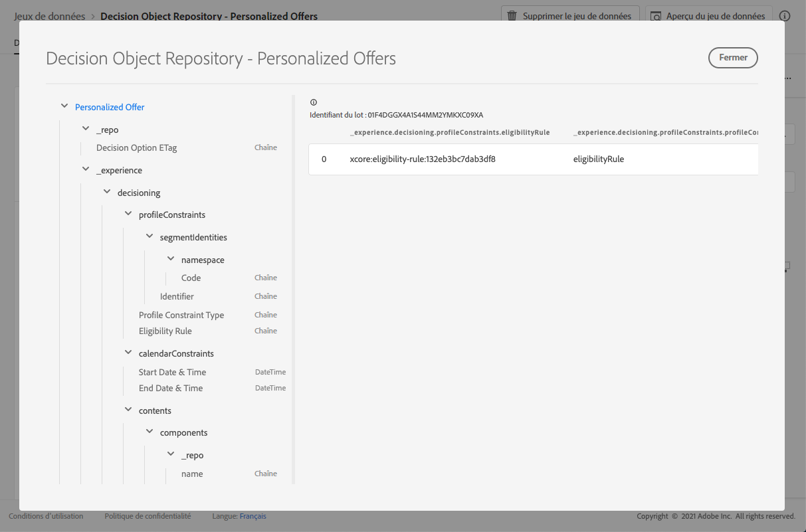

# Jeu de données d&#39;offres personnalisées {#offers-dataset}

Chaque fois qu’une offre est modifiée, le jeu de données généré automatiquement pour les offres de contenu personnalisées est mis à jour.

Le lot le plus récent du jeu de données qui a réussi s&#39;affiche à droite. La vue hiérarchique du schéma du jeu de données s’affiche dans le volet de gauche.

>[!NOTE]
>
>Découvrez comment accéder aux jeux de données exportés pour chaque objet de votre bibliothèque des offres dans [cette section](../export-catalog/access-dataset.md).

Voici la liste de tous les champs qui peuvent être utilisés dans le jeu de données **[!UICONTROL Référentiel d&#39;objet de décision - Offres personnalisées]**.

<!--Personalized offers form the set of choices for a decision. The objective for decisioning is to take a large inventory of items and apply numerous constraint rules to that inventory to narrow it down and then to rank the qualifying options according to a criteria. The resulting propositions assemble and personalize the experience for specific individuals.-->

## Identifiant

**Champ :** _id 
**Titre :** identifiant 
**Description :** identifiant unique de l’enregistrement.
**Type :** Chaîne

## _experience

**Champ :** _experience 
**Type :** objet

### _experience > prise de décision

**Champ :** prise de décision
**Type :** objet

#### _experience > prise de décision > calendarConstraints

**Champ :** calendarConstraints 
**Titre :** Détails de la contrainte Calendrier 
**Description :** les contraintes Calendrier déterminent si une option de décision est valide dans une plage de dates. En dehors de cette plage de dates, l&#39;option ne peut pas être proposée.
**Type :** objet

* **Date et heure de fin**

   **Champ :** endDate
   **Titre :** Date et heure de fin
   **Description :** date de fin de validité des options de décision. Les options qui ont dépassé leur date de fin ne peuvent plus être proposées dans le processus de décision.
   **Type :** Chaîne

* **Date et heure de début**

   **Champ :** startDate
   **Titre :** Date et heure de début
   **Description :** date de début de validité des options de décision. Les options qui n&#39;ont pas atteint leur date de début ne peuvent pas encore être proposées dans le processus de prise de décision.
   **Type :** Chaîne

#### _experience > prise de décision > caractéristiques

**Champ :** caractéristiques 
**Titre :** Caractéristiques d&#39;option de décision
**Description :** Propriétés ou attributs supplémentaires appartenant à cette option de décision particulière. Différentes instances peuvent présenter des caractéristiques différentes (clés dans la carte). Les caractéristiques sont des paires nom-valeur utilisées pour distinguer une option de décision des autres. Les caractéristiques sont utilisées comme valeurs dans le contenu qui représente cette option de décision et comme fonctionnalités pour analyser et optimiser les performances d&#39;une option. Lorsque chaque instance possède le même attribut ou la même propriété, cet aspect doit être modélisé en tant que schéma d&#39;extension dérivé des détails de l’option de décision.
**Type :** objet

#### _experience > prise de décision > contenu

**Champ :** contenu 
**Titre :** détails du contenu 
**Description :** éléments de contenu pour afficher l’élément de décision dans différents contextes. Une seule option de décision peut comporter plusieurs variantes de contenu. Le contenu est une information destinée à une audience destinée à être consommée dans une expérience (numérique). Le contenu est diffusé à travers des canaux dans un emplacement particulier.
**Type :** tableau

**_experience > prise de décision > contenu > composants**

**Champ :** composants 
**Description :** composants du contenu représentant l’option de décision, y compris toutes leurs variantes linguistiques. Les composants spécifiques sont identifiés par &quot;dx:format&quot;, &quot;dc:subject&quot; et &quot;dc:language&quot; ou une combinaison de ces composants. Ces métadonnées permettent de localiser ou de représenter le contenu associé à une offre et de l’intégrer selon le contrat de placement.
**Type :** tableau 
**obligatoire :** &quot;_type&quot;, &quot;_dc&quot;  <!--TBC?-->

* **_experience > prise de décision > contenu > composants > Type de composant de contenu**

   **Champ :** _type
   **Titre :** type de composant de contenu
   **Description :** Un ensemble énuméré d’URI où chaque valeur correspond à un type donné au composant de contenu. Certains consommateurs des représentations de contenu s’attendent à ce que la valeur @type soit une référence au schéma qui décrit les propriétés supplémentaires du composant de contenu.
   **Type :** Chaîne

* **_experience > prise de décision > contenu > composants > _dc**

   **Champ :** _dc
   **Type :** objet
   **Obligatoire :** &quot;format&quot;

   * **Format**

      **Champ :** format
      **Titre :** format
      **Description :** Manifestation physique ou numérique de la ressource. En règle générale, le format doit inclure le type de média de la ressource. Le format peut être utilisé pour déterminer le logiciel, le matériel ou tout autre équipement nécessaire pour afficher ou exploiter la ressource. Il est recommandé de sélectionner une valeur dans un vocabulaire contrôlé (par exemple, la liste des [types de média Internet](http://www.iana.org/assignments/media-types/) définissant les formats de médias informatiques).
      **Type :**Chaîne
      **Exemple :** &quot;application/vnd.adobe.photoshop&quot;

   * **Langue**
      **Champ :** langue
      **Titre :** langue
      **Description :** La ou les langues de la ressource. \nLes langues sont spécifiées dans le code de langue tel que défini dans [IETF RFC 3066](https://www.ietf.org/rfc/rfc3066.txt), qui fait partie du BCP 47, utilisé ailleurs dans XDM.
      **Type :** tableau
      **Exemples :** &quot;\n&quot;, &quot;pt-BR&quot;, &quot;es-ES&quot;

* **_experience > prise de décision > contenu > composants > _repo**

   **Champ :** _repo
   **Type :** objet

   * **identifiant**

      **Champ :** id
      **Description :** identifiant unique facultatif permettant de référencer la ressource dans un référentiel de contenu. Lorsque les API de Platform sont utilisées pour récupérer la représentation, le client peut s’attendre à ce qu’une propriété \&quot;repo:resolveUrl\&quot; supplémentaire récupère la ressource.
      **Type :**Chaîne
      **Exemple :** &quot;urn:aaid:sc:US:6dc33479-13ca-4b19-b25d-c805eff8a69e&quot;

   * **name**

      **Champ :** name
      **Description :** conseils sur l’emplacement du référentiel qui stocke la ressource externe par le \&quot;repo:id\&quot;.
      **Type :** Chaîne

   * **repositoryID**

      **Champ :** repositoryID
      **Description :** identifiant unique facultatif permettant de référencer la ressource dans un référentiel de contenu. Lorsque les API de Platform sont utilisées pour récupérer la représentation, le client peut s’attendre à ce qu’une propriété \&quot;repo:resolveUrl\&quot; supplémentaire récupère la ressource.
      **Type :**Chaîne
      **Exemple :** &quot;C87932A55B06F7070A49412D@AdobeOrg&quot;

   * **resolveURL**

      **Champ :** resolveURL
      **Description :** localisateur de ressources unique facultatif permettant de lire la ressource dans un référentiel de contenu. Il sera ainsi plus facile d’obtenir la ressource sans que le client sache où celle-ci est gérée et quelles API appeler. Ceci est similaire à un lien HAL, mais la sémantique est plus simple et plus utile.
      **Type :**Chaîne
      **Exemple :** &quot;https://plaftform.adobe.io/resolveByPath?path=&quot;/mycorp/content/projectx/fragment/prod/herobanners/banner14.html3&quot;&quot;

* **_experience > prise de décision > contenu > composants > contenu**

   **Champ :** content
   **Description :** Un champ facultatif contenant directement du contenu. Au lieu de référencer le contenu dans un référentiel de ressources, le composant peut contenir directement du contenu simple. Ce champ n’est pas utilisé pour les ressources de contenu composites, complexes et binaires.
   **Type :** Chaîne

* **_experience > prise de décision > contenu > composants > deliveryURL**

   **Champ :** deliveryURL
   **Description :** un localisateur de ressources unique facultatif pour obtenir la ressource à partir d’un réseau de diffusion de contenu ou d’un point d’entrée de service. Cette URL permet d’accéder publiquement à la ressource par un agent utilisateur.
   **Type :**Chaîne
   **Exemple :** &quot;https://cdn.adobe.io/content/projectx/fragment/prod/static/1232324wd32.jpeg&quot;

* **_experience > prise de décision > contenu > composants > linkURL**

   **Champ :** linkURL
   **Description :** Un localisateur de ressources unique facultatif pour les interactions utilisateur. Cette URL permet de renvoyer l’utilisateur final dans un agent utilisateur et peut faire l’objet d’un suivi.
   **Type :**Chaîne
   **Exemple :** &quot;https://cdn.adobe.io/tracker?code=23432&amp;redirect=/content/projectx/fragment/prod/static/1232324wd32.jpeg&quot;

**_experience > prise de décision > contenu > Emplacement**

**Champ :** 
**Titre du placement :** Emplacement 
**Description :** Emplacement à respecter. La valeur est l’URI (@id) de l’emplacement d’offre qui est référencé. Voir le schéma https://ns.adobe.com/experience/decisioning/placement.
**Type :** Chaîne

#### _experience > prise de décision > État du cycle de vie

**Champ :** lifecycleStatus
**Titre :** statut du cycle de vie
**Description :** le statut de cycle de vie permet d’exécuter des workflows avec un objet. L’état peut avoir une incidence lorsqu’un objet est visible ou jugé pertinent. Les modifications de statut sont effectuées par les clients ou les services qui utilisent les objets.
**Type :** string Valeurs 
**possibles :**  &quot;Brouillon&quot; (par défaut), &quot;Approuvé&quot;, &quot;En direct&quot;, &quot;Terminé&quot;, &quot;Archivé&quot;

#### _experience > prise de décision > Nom de l’option de décision

**Champ :** nom
**Titre :** nom de l’option de décision
**Description :** nom d’option affiché dans diverses interfaces utilisateur.
**Type :** Chaîne

#### _experience > prise de décision > profileConstraints

**Champ :** profileConstraints 
**Titre :** Détails de la contrainte de profil
**Description :** Les contraintes de profil déterminent si une option est éligible pour cette identité de profil, à l&#39;heure actuelle, dans ce contexte. Si la contrainte de profil n&#39;a pas besoin de prendre en compte les valeurs de chacune des options, c&#39;est-à-dire qu&#39;elle est invariante des options de la sélection d&#39;options, la contrainte de profil qui prend la valeur &quot;false&quot; annule l&#39;ensemble de la sélection d&#39;options. D’un autre côté, une règle de contrainte de profil qui prend une option en tant que paramètre est évaluée pour chaque option de qualification de la sélection d’options.
**Type :** objet

**_experience > prise de décision > profileConstraints > Description**

**Champ :** description 
**Titre :** Description 
**:** Description de la contrainte de profil. Elle est utilisée pour transmettre des intentions lisibles sur la façon et les raisons pour lesquelles cette contrainte de profil a été construite et/ou sur l&#39;option qui sera incluse ou exclue par elle.
**Type :** Chaîne

**_experience > prise de décision > profileConstraints > Règle d’éligibilité**

**Champ :** 
**Titre de la règle d’éligibilité :** 
**Description de la règle d’éligibilité :** référence à une règle de décision qui renvoie true ou false pour un profil donné et/ou d’autres objets XDM contextuels donnés. La règle est utilisée pour déterminer si l’option est admissible pour un profil donné. La valeur est l’URI (@id) de la règle de décision référencée. Voir le schéma https://ns.adobe.com/experience/decisioning/rule.
**Type :** Chaîne

**_experience > prise de décision > profileConstraints > Type de contrainte de profil**

**Champ :** profileConstraintType 
**Titre :** Type de contrainte de profil 
**Description :** détermine si des contraintes sont actuellement définies et comment les contraintes sont exprimées. Il peut s’agir d’une règle ou d’un ou plusieurs abonnements de segment.
**Type :** string Valeurs 
**possibles :**
* &quot;none&quot; (par défaut)
* &quot;eligibilityRule&quot; : « La contrainte de profil est exprimée sous la forme d’une règle unique qui doit être évaluée comme égale à true avant que l’action contrainte ne soit autorisée. »
* &quot;anySegments&quot; : « La contrainte de profil est exprimée en un ou plusieurs segments et le profil doit être membre d&#39;au moins l&#39;un d&#39;eux avant que l&#39;action contrainte ne soit autorisée. »
* &quot;allSegments&quot; : « La contrainte de profil est exprimée en un ou plusieurs segments et le profil doit en être membre pour que l&#39;action restreinte soit autorisée. »
* &quot;règles&quot; : « La contrainte de profil est exprimée sous la forme d&#39;un certain nombre de règles différentes, par exemple l&#39;éligibilité, l&#39;applicabilité, l&#39;adaptabilité, qui doivent toutes être vérifiées avant que l&#39;action contrainte ne soit autorisée. »

**_experience > prise de décision > profileConstraints > Identifiants de segment**

**Champ :** segmentIdentities 
**Titre :** Identifiants de segment 
**Description :** Identifiants du 
**type de segments :** tableau

* **Identifiant**

   **Champ :** _id
   **Titre :** identifiant
   **Description :** Identité du segment dans l’espace de noms connexe.
   **Type :** Chaîne

* **Espace de noms**

   **Champ :** espace de noms
   **Titre :** espace de noms
   **Description :** Espace de noms associé à l’attribut `xid`.
   **Type :** objet
   **Obligatoire :** &quot;code&quot;

   * **Code**

      **Champ :** code
      **Titre :** code
      **Description :** Le code est un identifiant lisible par l’homme pour l’espace de noms et peut être utilisé pour demander l’identifiant technique d’espace de noms utilisé pour le traitement des graphiques d’identités.
      **Type :** Chaîne

* **Identifiant d’expérience**

   **Champ :** xid
   **Titre :** identifiant d’expérience
   **Description** : Lorsqu’elle est présente, cette valeur représente un identifiant d’espace de noms croisé unique pour tous les identifiants d’espace de noms inclus dans tous les espaces de noms.
   **Type :** Chaîne

#### _experience > prise de décision > ranking

**Champ :** ranking
**Titre :** Détails de ranking
**Description :** Rang (priorité). Définit ce qui est considéré comme la \&quot;meilleure action\&quot; compte tenu du contexte du critère de décision. Parmi toutes les options sélectionnées qui répondent à la contrainte d&#39;éligibilité, l&#39;ordre de classement décidera des options supérieures (ou supérieures N) à proposer.
**Type :** objet

**_experience > prise de décision > classement > Évaluation des commandes**

**Champ :** 
**Titre de la commande :** Évaluation de la commande 
**Description :** Évaluation d’un ordre relatif d’une ou de plusieurs options de décision. Les options dont les valeurs ordinales sont supérieures sont sélectionnées pour les options dont les valeurs ordinales sont inférieures. Les valeurs déterminées par cette méthode peuvent être ordonnées mais les distances entre elles ne peuvent pas être mesurées et ni les sommes ni les produits ne peuvent être calculés. La médiane et le mode sont les seules mesures de tendance centrale qui peuvent être utilisées pour les données ordinales.
**Type :** objet

* **Fonction de score**

   **Champ :** fonction
   **Titre :** fonction de score
   **Description :** Une référence à une fonction qui calcule un score numérique pour cette option de décision. Les options de décision seront ensuite classées en fonction de ce score. La valeur de cette propriété est l’URI (@id) de la fonction à appeler avec l’option active à la fois. Voir le schéma https://ns.adobe.com/experience/decisioning/function.
   **Type :** Chaîne

* **Type d&#39;évaluation de commande**

   **Champ :** orderEvaluationType
   **Titre :** type d’évaluation d’ordre
   **Description :** Indique le mécanisme d&#39;évaluation de l&#39;ordre utilisé, la priorité statique des options de décision, une fonction de notation qui calcule une valeur numérique pour chaque option ou une stratégie de classement qui reçoit une liste pour la commander.
   **Type :**Chaîne
   **Valeurs possibles :** &quot;static&quot;, &quot;scoringFunction&quot;, &quot;rankingStrategy&quot;

* **Stratégie de ranking**

   **Champ :** rankingStrategy
   **Titre :** stratégie de classement
   **Description :** Une référence à une stratégie qui classe une option de liste de décision. Les options de décision seront renvoyées dans une liste ordonnée. La valeur de cette propriété est l’URI (@id) de la fonction à appeler avec l’option active à la fois. Voir le schéma https://ns.adobe.com/experience/decisioning/rankingStrategy.
   **Type :** Chaîne

**_experience > prise de décision > ranking > Priority**

**Champ :** priorité 
**Titre :** Priorité 
**Description :** priorité d’une seule option de décision par rapport à toutes les autres options. Les options pour lesquelles aucune fonction de commande n’est fournie sont prioritaires à l’aide de cette propriété. Les options ayant des valeurs de priorité plus élevées sont sélectionnées avant les options de priorité plus faible. Si plusieurs options admissibles partagent la valeur de priorité la plus élevée, une option est choisie de façon aléatoire uniforme et utilisée pour la proposition de décision.
**Type :** entier 
**Valeur minimum :** 0 
**Valeur par défaut :** 0

#### _experience > prise de décision > balises

**Champ :** balises 
**Titre :** Balises 
**Description :** L&#39;ensemble de balises associées à cette entité. Les balises sont utilisées dans les expressions de filtrage pour limiter l&#39;inventaire global à un sous-ensemble (catégorie).
**Type :** tableau

<!--Field without name under tags: Description: An identifier of a tag object. The value is the @id of the tag that is referenced. See tag schema: https://ns.adobe.com/experience/decisioning/tag. Type: string-->

## _repo

**Champ :** _repo 
**Type :** objet

### _repo > Option de décision ETag

**Champ :** etag
**Titre :** Option de décision ETag 
**Description :** La révision à laquelle l&#39;objet de l&#39;option de décision se trouvait au moment de la prise de l&#39;instantané.
**Type :** Chaîne

