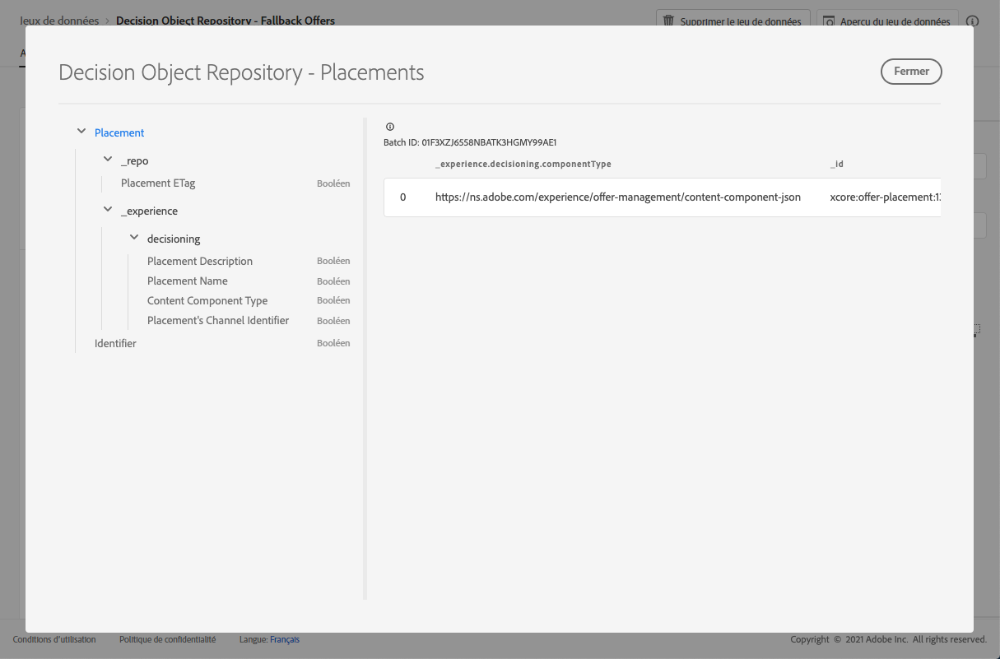

# Jeu de données d&#39;emplacements {#placements-dataset}

Chaque fois qu&#39;une offre est modifiée, le jeu de données généré automatiquement pour les emplacements est mis à jour.

Le dernier lot du jeu de données s&#39;affiche à droite. La vue hiérarchique du schéma du jeu de données s&#39;affiche dans le volet de gauche.

>[!NOTE]
>
>Découvrez comment accéder aux jeux de données exportés pour chaque objet de votre bibliothèque des offres dans [cette section](../export-catalog/access-dataset.md).

Vous trouverez ci-dessous la liste de tous les champs pouvant être utilisés dans le jeu de données **[!UICONTROL Référentiel d&#39;objets de décision - Emplacements]**.

<!--A placement describes a location or place in a personalized message. It is used to set technical constraints for content that the personalization decision supplies. The placement also represents a request to produce certain types of metrics when an experience event is produced where this placement is involved. For instance, the placement facilitates a personalized clickable image inside an email shown to an end-user. The placement may for instance request from the assembled experience that the click on its image gets reported in an experience event with a metric https://ns.adobe.com/xdm/data/metrics/web/linkclicks and a reference to this placement.-->

## Identifiant

**Champ :** _id 
**Titre :** identifiant
**Description :** identifiant unique de l&#39;enregistrement.
**Type :** chaîne

## _experience

**Champ :** _experience
**Type :** objet

### _experience > prise de décisions

**Champ :** prise de décisions
**Type :** objet

#### _experience > prise de décisions > Identifiant du canal de l&#39;emplacement

**Champ :** channelID
**Titre :** identifiant du canal de l&#39;emplacement
**Description :** canal dans lequel la proposition a été faite. La valeur est une URI de canal valide. Voir https://ns.adobe.com/xdm/channels/channel.
**Type :** chaîne

#### _experience > prise de décisions > Type de composant de contenu

**Champ :** componentType
**Titre :** type de composant de contenu
**Description :** jeu énuméré d&#39;URI où chaque valeur correspond à un type donné au composant de contenu. Certains consommateurs des représentations de contenu s&#39;attendent à ce que la valeur @type soit une référence au schéma qui décrit les propriétés supplémentaires du composant de contenu.
**Type :** chaîne

#### _experience > prise de décisions > contentTypes

**Champ :** contentTypes
**Type :** tableau

**_experience > prise de décision > contentTypes > MIME Type de média**

**Titre :** MIME Media Type 
**Description :** contrainte du type de média des composants attendus à cet emplacement. Un composant peut avoir plusieurs types de média, par exemple différents formats d&#39;image.
**Type :** chaîne

#### _experience > prise de décisions > Description d&#39;emplacement

**Champ :** description
**Titre :** description d&#39;emplacement
**Description :** sert à transmettre des intentions lisibles par l&#39;homme sur la manière dont le contenu dynamique est utilisé dans la diffusion globale du message. Le fait qu&#39;un certain espace soit une \&quot;bannière\&quot; dans une page web est souvent transmis via la description et non par une méthode formelle.
**Type :** chaîne

#### _experience > prise de décisions > Nom de l&#39;emplacement

**Champ :** nom
**Titre :** nom de l&#39;emplacement
**Description :** nom attribué à l&#39;emplacement pour y faire référence dans les interactions humaines.
**Type :** chaîne

## _repo

**Champ :** _repo 
**Type :** objet

### _repo > ETag d’emplacement

**Champ :** etag
**Titre :** ETag d’emplacement
**Description :** révision à laquelle l&#39;objet de l&#39;option de décision se trouvait lors de la prise de l&#39;instantané.
**Type :** chaîne
