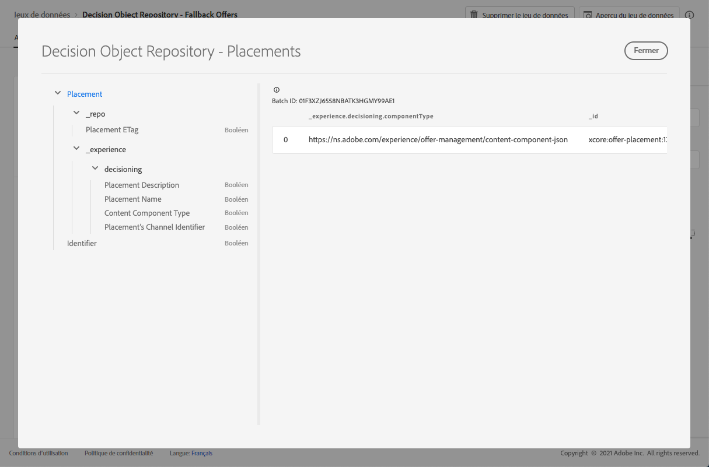

# Jeu de données d’emplacements {#placements-dataset}

>[!TIP]
>
>La prise de décision, la nouvelle fonctionnalité de prise de décision d’[!DNL Adobe Journey Optimizer], est désormais disponible via les canaux d’expérience basée sur du code et d’e-mail. [En savoir plus](../../experience-decisioning/gs-experience-decisioning.md)

Chaque fois qu&#39;une offre est modifiée, le jeu de données généré automatiquement pour les emplacements est mis à jour.

Le lot le plus récent dans le jeu de données s&#39;affiche à droite. La vue hiérarchique du schéma du jeu de données s&#39;affiche dans le volet de gauche.

>[!NOTE]
>
>Découvrez comment accéder aux jeux de données exportés pour chaque objet de votre bibliothèque des offres dans [cette section](../export-catalog/access-dataset.md).

Vous trouverez ci-dessous la liste de tous les champs qui peuvent être utilisés dans le jeu de données **[!UICONTROL Référentiel d&#39;objets de décision - Emplacements]**.

<!--A placement describes a location or place in a personalized message. It is used to set technical constraints for content that the personalization decision supplies. The placement also represents a request to produce certain types of metrics when an experience event is produced where this placement is involved. For instance, the placement facilitates a personalized clickable image inside an email shown to an end-user. The placement may for instance request from the assembled experience that the click on its image gets reported in an experience event with a metric https://ns.adobe.com/xdm/data/metrics/web/linkclicks and a reference to this placement.-->

+++ Identifiant

**Champ :** _id 
**Titre :** identifiant 
**Description :** identifiant unique de l&#39;enregistrement.
**Type :** chaîne

+++

+++ _experience

**Champ :** _experience
**Type :** objet

+++

+++ _experience > decisioning

**Champ :** prise de décision
**Type :** objet

+++

+++ _experience > decisioning > Placement&#39;s Channel Identifier

**Champ :** channelID
**Titre :** identifiant du canal de l&#39;emplacement
**Description :** canal dans lequel la proposition a été effectuée. La valeur est une URI de canal valide. Voir https://ns.adobe.com/xdm/channels/channel.
**Type :** chaîne

+++

+++ _experience > decisioning > Content Component Type

**Champ** : componentType
**Titre** : type de composant de contenu
**Description** : ensemble énuméré d&#39;URI où chaque valeur correspond à un type donné au composant de contenu. Certains consommateurs des représentations de contenu s&#39;attendent à ce que la valeur @type soit une référence au schéma qui décrit les propriétés supplémentaires du composant de contenu.
**Type :** chaîne

+++

+++ _experience > decisioning > contentTypes

**Champ :** contentTypes
**Type :** tableau

+++

+++_experience > decisioning > contentTypes > MIME Media Type

**Titre :** type de média MIME
**Description :** contrainte pour le type de média des composants attendue à cet emplacement. Un composant peut avoir plusieurs types de média, par exemple différents formats d&#39;image.
**Type :** Chaîne

+++

+++ _experience > decisioning > Placement Description

**Champ :** description
**Titre :** description de l&#39;emplacement
**Description :** permet de véhiculer les intentions lisibles par l&#39;homme sur la manière dont le contenu dynamique est utilisé dans la diffusion globale des messages. Le fait qu&#39;un certain espace est une \&quot;bannière\&quot; sur une page web est souvent communiqué par la description et non par une méthode formelle.
**Type :** chaîne

+++

+++ _experience > decisioning > Placement Name

**Champ :** nom
**Titre :** nom de l&#39;emplacement
**Description :** nom attribué à l&#39;emplacement pour s&#39;y référer dans les interactions humaines.
**Type :** chaîne

+++

+++ _repo

**Champ :** _repo 
**Type :** objet

+++

+++ _repo > ETag d&#39;emplacement

**Champ :** etag
**Titre :** ETag d&#39;emplacement
**Description :** révision à laquelle l&#39;objet d&#39;option de décision se trouvait au moment de la prise de l&#39;instantané.
**Type :** chaîne

+++
