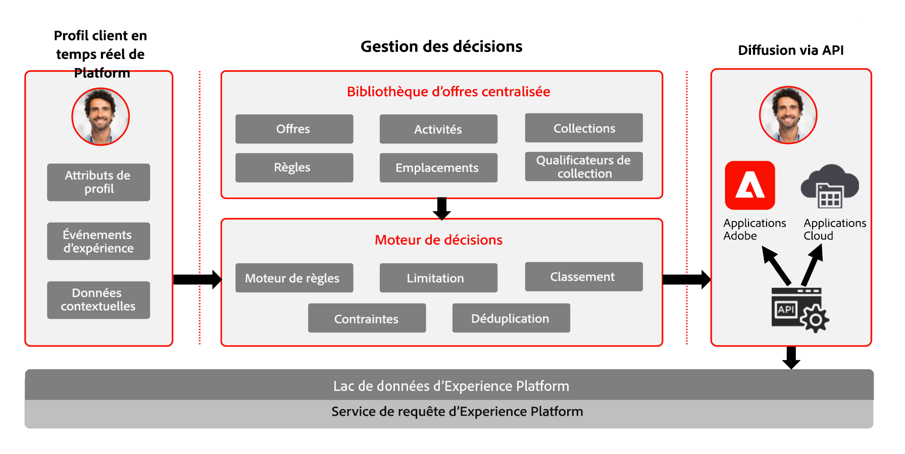

# Commencer avec la gestion des décisions {#about-decision-management}

>[!TIP]
>
>La prise de décision, la nouvelle fonctionnalité de prise de décision d’[!DNL Adobe Journey Optimizer], est désormais disponible via les canaux d’expérience basée sur du code et d’e-mail. [En savoir plus](../../experience-decisioning/gs-experience-decisioning.md)

Utilisez [!DNL Journey Optimizer] pour offrir au bon moment à vos clients les meilleures offre et expérience possibles à tous les points de contact. Une fois la conception réalisée, ciblez vos audiences avec des offres personnalisées.

La gestion des décisions facilite la personnalisation avec une bibliothèque centrale d’offres marketing et un moteur de décision qui applique des règles et des contraintes aux profils en temps réel riches créés par Adobe Experience Platform afin de vous aider à envoyer à vos clients la bonne offre au bon moment.

La fonctionnalité de gestion des décisions comprend deux composants principaux :

* La **bibliothèque des offres centralisée** qui est l’interface qui vous permet de créer et de gérer les différents éléments qui composent vos offres et qui permet de définir leurs règles et contraintes.
* Le **moteur de décision d’offre** qui tire parti des données Adobe Experience Platform et des profils clients en temps réel, ainsi que de la bibliothèque des offres, pour sélectionner le bon moment, les clients et les canaux pour la diffusion des offres.

Voici quelques-uns des avantages :

* Amélioration des performances des campagnes grâce à la diffusion d’offres personnalisées sur plusieurs canaux.
* Workflows améliorés : plutôt que de créer plusieurs diffusions ou plusieurs campagnes, les équipes marketing peuvent améliorer les workflows en créant une seule diffusion et en variant les offres dans les différentes parties du modèle.
* Contrôle du nombre d&#39;affichages d&#39;une offre sur plusieurs campagnes et clients.

➡️ [Découvrez la gestion des décisions dans ces vidéos.](#video)

>[!NOTE]
>
>Si vous utilisez [Adobe Experience Platform](https://experienceleague.adobe.com/docs/experience-platform/landing/home.html?lang=fr){target="_blank"} et l’application **Offer Decisioning**, toutes les fonctionnalités de gestion des décisions décrites dans cette section s’appliquent également à vous.

## À propos des offres et des décisions {#about-offers-and-decisions}

Une **Offre** est composée de contenu, de règles d&#39;éligibilité et de contraintes qui définissent les conditions dans lesquelles elle est présentée à vos clients.

Elle est créée à l&#39;aide de la **bibliothèque des offres**, qui fournit un catalogue centralisé dans lequel vous pouvez associer des règles d&#39;éligibilité et des contraintes à plusieurs éléments de contenu pour créer et publier des offres (voir la section[Interface utilisateur de la bibliothèque des offres](../get-started/user-interface.md)).

Une fois la bibliothèque des offres enrichie d&#39;offres, vous pouvez intégrer vos offres dans les **décisions**.

Les décisions sont des conteneurs qui s’appuient sur le moteur de décision pour choisir la meilleure offre à diffuser en fonction de la cible de la diffusion.

## Cas d’utilisation courants {#common-use-cases}

Les fonctionnalités de gestion des décisions et l’intégration à Adobe Experience Platform vous permettent de couvrir de nombreux cas d’utilisation pour vous aider à augmenter l’engagement et la conversion des clients.

* Affichez sur votre site Web les offres de la page d&#39;accueil qui correspondent au point d&#39;intérêt du client visiteur, en fonction des données issues d&#39;Adobe Experience Platform.

  

* Si les clients passent près de l&#39;un de vos magasins, adressez-leur des notifications Push leur rappelant les offres disponibles en fonction de leurs attributs (niveau de fidélité, genre, achats antérieurs...).

  

* La gestion des décisions permet également d’améliorer l’expérience de vos clients lorsqu’ils contactent votre équipe d’assistance.
Les API de gestion des décisions permettent d’afficher, sur le portail des agents de votre centre d’appels, des informations relatives aux offres échangées par le client ainsi que les meilleures offres suivantes.

  

## Octroi de l’accès à la gestion des décisions {#granting-acess-to-decision-management}

Les autorisations d’accès et d’utilisation des fonctionnalités de prise de décision sont gérées à l’aide d’[Adobe Admin Console](https://helpx.adobe.com/fr/enterprise/managing/user-guide.html){target="_blank"}.

Pour accorder l’accès à la fonctionnalité de gestion des décisions, vous devez créer un **[!UICONTROL profil de produit]** et attribuer les autorisations correspondantes à vos utilisateurs et utilisatrices. Pour en savoir plus sur la gestion des utilisateurs, des utilisatrices et des autorisations [!DNL Journey Optimizer], consultez [cette section](../../administration/permissions.md).

Les autorisations spécifiques à la gestion des décisions sont répertoriées dans [cette section](../../administration/high-low-permissions.md#decisions-permissions).

## Glossaire {#glossary}

Vous trouverez ci-dessous la liste des principaux concepts que vous utiliserez lorsque vous utiliserez la gestion des décisions.

* **Limitation** ou **Capping de la fréquence** : la limitation est utilisée comme contrainte pour définir le nombre de présentations d&#39;une offre. Il existe deux types de limitations : le nombre de fois où une offre peut être proposée à l&#39;audience cible combinée, également appelée « limitation globale », et le nombre de fois où une offre peut être proposée au même utilisateur final, également appelée « limitation de profil ».

* **Collections** : les collections sont des sous-ensembles d’offres, basés sur des conditions prédéfinies établies par un spécialiste marketing, telles que la catégorie de l’offre.

* **Décision** : contient la logique sous-tendant la sélection d’une offre.

* **Règle de décision** : les règles de décision sont des contraintes ajoutées à une offre personnalisée et appliquées à un profil pour déterminer son éligibilité.

* **Offre éligible** : une offre éligible répond aux contraintes définies en amont et peut être systématiquement offerte à un profil.

* **Gestion de décision** : permet de créer et de diffuser des expériences d’offre personnalisées à l’utilisateur final sur plusieurs canaux et applications à l’aide de la logique commerciale et des règles de décision.

* **Offre de secours** : une offre de secours est l&#39;offre par défaut affichée lorsqu&#39;un utilisateur final n&#39;est pas éligible à l&#39;une des offres personnalisées de la collection utilisée.

* **Offre** : une offre est un message marketing auquel des règles peuvent être associées et qui spécifie qui est éligible pour voir l’offre.

* **Bibliothèque des offres** : la bibliothèque des offres est une bibliothèque centralisée, utilisée pour gérer les offres personnalisées et de secours, les règles de décision et les décisions.

* **Offres personnalisées** : une offre personnalisée est un message marketing personnalisable basé sur des contraintes et des règles d’éligibilité.

* **Emplacements** : un emplacement est l&#39;endroit ou le contexte dans lequel apparaît une offre pour un utilisateur final.

* **Priorité** : la priorité est un nombre utilisé pour classer les offres répondant à toutes les contraintes comme l&#39;éligibilité, les dates et la limitation.

* **Représentations** : une représentation est une information utilisée par un canal, comme la localisation ou la langue d&#39;affichage d&#39;une offre.

## Tutoriels vidéo{#video}

### Qu&#39;est-ce que la gestion des décisions ?  {#what-is-offer-decisioning}

La vidéo ci-dessous présente les principales fonctionnalités, l’architecture et les cas d’utilisation de la gestion des décisions :

>[!VIDEO](https://video.tv.adobe.com/v/326961?quality=12&learn=on)

### Définition et gestion des offres {#use-offer-decisioning}

La vidéo ci-dessous montre comment utiliser la gestion des décisions pour définir et gérer vos offres, et exploiter les données client en temps réel.

>[!VIDEO](https://video.tv.adobe.com/v/326841?quality=12&learn=on)

