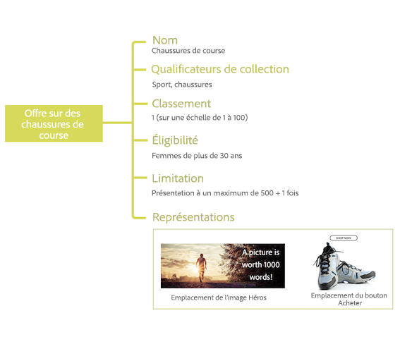

# À propos de la gestion des décisions {#about-offer-decision}

Utilisez [!DNL Journey Optimizer] pour offrir à vos clients la meilleure offre et la meilleure expérience possible à tous les points de contact au bon moment. Une fois conçue, cible vos audiences avec des offres personnalisées.

La fonctionnalité Gestion de la décision comprend deux composants principaux :

* La **bibliothèque d&#39;Offres centralisée** est l&#39;interface dans laquelle vous créez et gérez les différents éléments qui composent vos offres, et définissez leurs règles et contraintes.
* **Moteur de décision d&#39;Offre** qui exploite les données Adobe Experience Platform et les profils client en temps réel, ainsi que la bibliothèque d&#39;Offres, afin de sélectionner l&#39;heure, les clients et les canaux appropriés pour la livraison des offres.

Les avantages incluent :

* Amélioration des performances des campagnes en fournissant des offres personnalisées sur plusieurs canaux,
* Workflows améliorés : au lieu de créer plusieurs diffusions ou campagnes, les équipes marketing peuvent améliorer les workflows en créant une seule diffusion et en modifiant les offres dans différentes parties du modèle,
* Contrôle du nombre d’affichages d’une offre sur plusieurs campagnes et clients.

 [Regardez ces ](#tutorial-videos) vidéos didacticielles pour en savoir plus sur la gestion des décisions.

## À propos des offres et décisions {#offers-offer-activities}

Une **Offre** est composée de contenu, de règles d&#39;éligibilité et de contraintes qui définissent les conditions dans lesquelles elle est présentée à vos clients.

Il est créé à l’aide de la **bibliothèque d’Offres**, qui fournit un catalogue d&#39;offres central dans lequel vous pouvez associer des règles d&#39;éligibilité et des contraintes à plusieurs éléments de contenu pour créer et publier des offres (voir [interface utilisateur de la bibliothèque d’Offres](../get-started/user-interface.md)).

Une fois que la bibliothèque d&#39;Offres a été enrichie avec des offres, vous pouvez intégrer vos offres dans **décisions** (précédemment appelées &quot;activités d&#39;offre&quot;).

Les décisions sont des conteneurs pour vos offres qui exploiteront le moteur de décision d&#39;Offre afin de choisir la meilleure offre à fournir en fonction de la cible de la diffusion.

## Cas d’utilisation courants

Les fonctionnalités de gestion des décisions et l’intégration à Adobe Experience Platform vous permettent de couvrir de nombreux cas d’utilisation afin d’augmenter l’engagement et la conversion des clients.

* Affichez sur votre site Web les offres de la page d’accueil qui correspondent au point d’intérêt du client visiteur, en fonction des données de Adobe Experience Platform.

   

* Si les clients se rendent près d&#39;un de vos magasins, envoyez-leur des notifications Push leur rappelant les offres disponibles en fonction de leurs attributs (niveau de fidélité, sexe, anciens achats...).

   

* La gestion des décisions vous aide également à améliorer l’expérience de vos clients lorsque vous contactez votre équipe d’assistance. Les API de gestion des décisions vous permettent d’afficher dans le portail des agents de votre centre d’appels des informations sur les meilleures offres échangées par le client et les prochaines.

   

## Vidéos didactiques {#tutorial-videos}

>[!NOTE]
>
>Ces vidéos s’appliquent au service d’applications d’Offer decisioning créé sur Adobe Experience Platform et ne sont pas spécifiques à [!DNL Adobe Journey Optimizer]. Toutefois, il fournit des directives générales pour l&#39;utilisation de la gestion des décisions dans le contexte de [!DNL Journey Optimizer].

### Qu&#39;est-ce que la gestion des décisions ? {#what-is-offer-decisioning}

La vidéo ci-dessous présente les principales fonctionnalités, l’architecture et les cas d’utilisation de la gestion des décisions :

>[!VIDEO](https://video.tv.adobe.com/v/326961?quality=12&learn=on)

### Définition et gestion des offres {#use-offer-decisioning}

La vidéo ci-dessous montre comment utiliser la gestion des décisions pour définir et gérer vos offres et exploiter les données client en temps réel.

>[!VIDEO](https://video.tv.adobe.com/v/326841?quality=12&learn=on)
