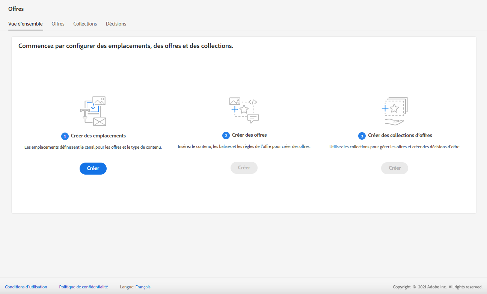
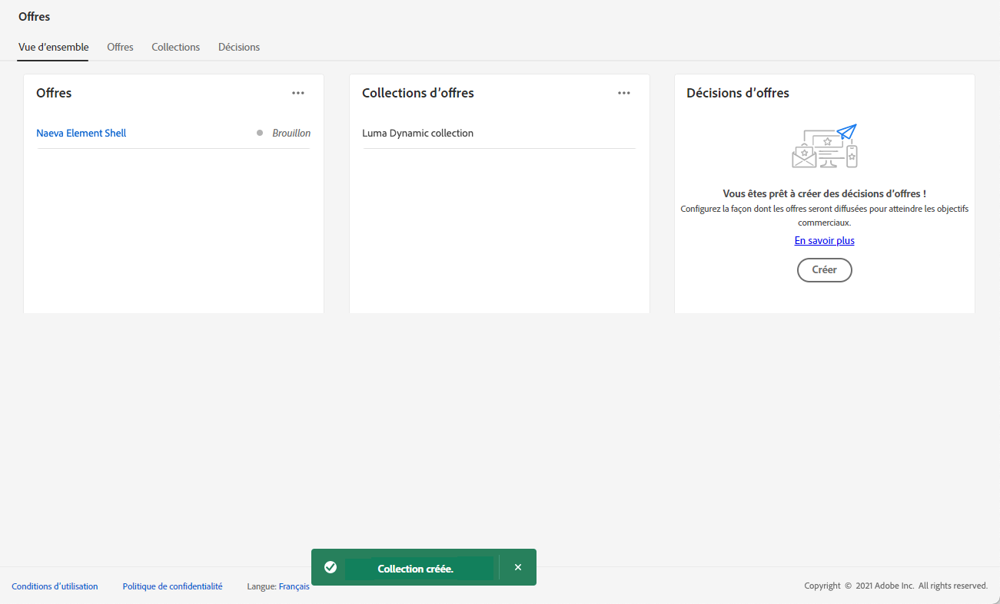
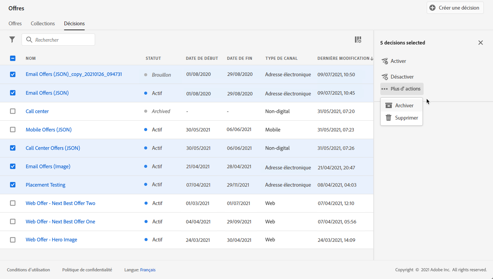
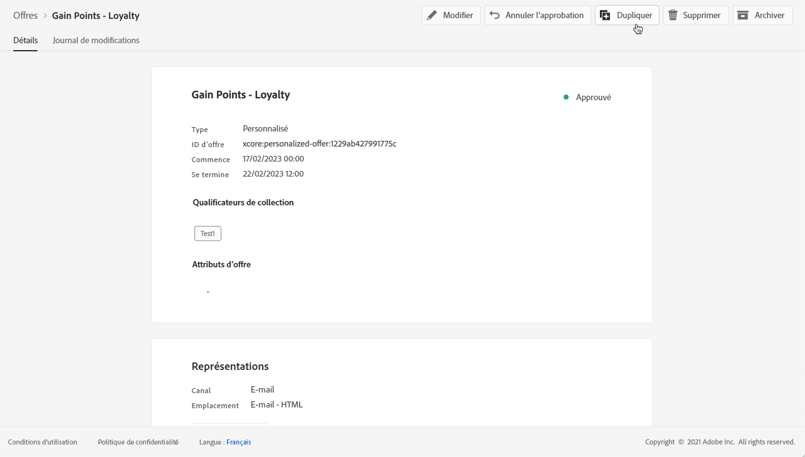

# Interface utilisateur {#user-interface}

La bibliothèque des offres vous permet de créer et de gérer vos emplacements et vos offres à un emplacement unique, mais aussi d’accéder à toutes les décisions (auparavant « activités d’offre ») créées.

>[!NOTE]
>
>Si vous rencontrez des problèmes pour accéder à la bibliothèque des offres ou à certaines de ses fonctionnalités, vérifiez auprès d&#39;un administrateur que les droits nécessaires vous ont été accordés. Voir [Octroi de l’accès à la gestion des décisions](starting-offer-decisioning.md#granting-acess-to-decision-management).

Utilisez le menu **[!UICONTROL Offres]** pour gérer les offres personnalisées et de secours, les organiser en collections et les diffuser en créant des décisions :

* **[!UICONTROL Aperçu]** : vous découvrez [!DNL Offer Decisioning] ? Suivez les étapes à l’écran pour commencer à configurer des emplacements, des offres et des collections. Lorsque vous connaissez déjà [!DNL Offer Decisioning], consultez l&#39;aperçu de vos offres, collections et décisions les plus récentes. Voir [Aperçu](#overview).

* **[!UICONTROL Offres]** : accédez à vos offres personnalisées et de secours ou créez-en de nouvelles. Voir [Création d&#39;une offre](../offer-library/creating-personalized-offers.md) et [Création d&#39;une offre de secours](../offer-library/creating-fallback-offers.md).

* **[!UICONTROL Collections]** : créez et gérez des collections d&#39;offres dynamiques et statiques. Voir [À propos des collections d&#39;offres](../offer-library/creating-collections.md).

* **[!UICONTROL Décisions]** : créez et gérez des décisions pour diffuser vos offres. Voir [Création de décisions](../offer-activities/create-offer-activities.md).

Utilisez le menu **[!UICONTROL Composants]** pour gérer les composants requis afin de créer des offres :

* **[!UICONTROL Emplacements]** : créez et gérez les emplacements où vos offres s’afficheront. Voir [Création d&#39;emplacements](../offer-library/creating-placements.md).

* **[!UICONTROL Balises]** : créez et gérez des balises pour organiser et filtrer vos offres. Voir [Création de balises](../offer-library/creating-tags.md).

* **[!UICONTROL Règles]** : gérez les conditions selon lesquelles vos offres sont présentées. Voir [Création d&#39;une règle de décision](../offer-library/creating-decision-rules.md).

* **[!UICONTROL Classements]** créez et gérez des formules de classement afin de déterminer l&#39;offre qui doit être présentée en premier pour un emplacement donné. Voir [Création de formules de classement](../ranking/create-ranking-formulas.md).

## Présentation {#overview}

Lorsque vous découvrez [!DNL Offer Decisioning], l&#39;onglet **[!UICONTROL Aperçu]** vous guide tout au long des principales étapes nécessaires pour commencer à créer votre première décision d&#39;offre.

Suivez les étapes à l’écran pour commencer à créer des emplacements, des offres et des collections.

Une fois que vous avez terminé ces premières étapes, vous êtes invité à créer des décisions d&#39;offre (précédemment appelées « activités d&#39;offre »).

>[!NOTE]
>
>Les principales étapes pour créer des offres et les utiliser dans une décision sont présentées dans [cette section](../offer-library/key-steps.md).

Lorsque vous connaissez mieux [!DNL Offer Decisioning] et que vous avez déjà créé au moins une décision d&#39;offre, l&#39;onglet **[!UICONTROL Aperçu]** affiche vos offres, collections et décisions les plus récentes.

Cliquez sur une offre ou une décision pour accéder directement aux détails de l&#39;élément sélectionné.

Cliquez sur le bouton **[!UICONTROL Afficher tout]** pour accéder aux listes d&#39;offres, de collections ou de décisions.

## Recherche et filtrage d’informations {#search-and-filter-information}

Utilisez la **barre de recherche** pour rechercher un élément spécifique.

Pour accéder aux **filtres**, vous pouvez également cliquer sur l&#39;icône en forme de filtre en haut à gauche de la liste. Il permettent de filtrer les éléments affichés en fonction de différents critères. Vous pouvez, par exemple, filtrer les emplacements créés pour le canal de communication par email et les contenus de type image.

## Personnaliser les informations affichées {#customize-displayed-information}

Il est possible de personnaliser les listes des menus de la gestion des décisions à l’aide du bouton de configuration situé en haut à droite de ces listes.

Il est ainsi possible de choisir les informations à afficher selon vos besoins.

Notez que la personnalisation des colonnes est enregistrée pour chaque utilisateur.

## Volet d&#39;informations {#information-pane}

Dans les différentes listes, sélectionnez un élément pour afficher un volet d&#39;informations afin de récupérer des informations et d&#39;exécuter des actions de base sur l&#39;élément.

Les listes des offres et des décisions vous permettent également d&#39;effectuer des actions en masse sur plusieurs éléments. Pour cela, sélectionnez les offres ou décisions de votre choix, puis l’action à exécuter dans le volet d’informations.

Vous pouvez également dupliquer une offre ou une décision existante afin de créer une copie présentant l’état **[!UICONTROL Brouillon]**. Il est possible d’effectuer cette opération à partir du volet d’informations, d’une offre ou d’un affichage détaillé d’une décision.

## Logs des modifications des offres et des décisions {#changes-logs}

La bibliothèque des offres permet de visualiser toutes les modifications apportées à une offre ou à une décision. Pour cela, ouvrez l&#39;offre ou la décision en cliquant sur son nom dans la liste, puis sélectionnez l&#39;onglet **[!UICONTROL Log des modifications]**.

Toutes les modifications apportées s&#39;affichent dans cet écran, ainsi que le nom de l&#39;utilisateur qui les a effectuées.

