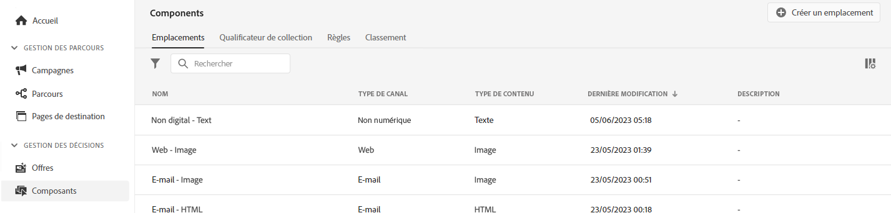

# Interface utilisateur {#user-interface}

La bibliothèque des offres vous permet de créer et de gérer vos emplacements et offres au même endroit, ainsi que d’accéder à toutes les décisions créées.

>[!NOTE]
>
>Si vous rencontrez des problèmes lors de l’accès à la bibliothèque des offres ou à certaines de ses fonctionnalités, vérifiez auprès d’un utilisateur administrateur que les droits requis vous ont été attribués. Voir [Accorder l’accès à la gestion des décisions](starting-offer-decisioning.md#granting-acess-to-decision-management).

Utilisez la variable  **[!UICONTROL Offers]** pour gérer les offres personnalisées et de secours, les organiser en collections et les diffuser en créant des décisions :

* **[!UICONTROL Overview]**: Nouveau pour [!DNL decision management]? Suivez les étapes à l’écran pour commencer à configurer des emplacements, des offres et des collections. Lorsqu’il est déjà familier avec [!DNL decision management], obtenez un aperçu de vos offres, collections et décisions les plus récentes. Voir [Présentation](#overview).

* **[!UICONTROL Offers]**: Accédez à vos offres personnalisées et de secours ou créez-en de nouvelles. Voir [Créer une offre](../offer-library/creating-personalized-offers.md) et [Créer une offre de secours](../offer-library/creating-fallback-offers.md).

* **[!UICONTROL Collections]**: Créez et gérez des collections d’offres dynamiques et statiques. Voir [À propos des collections d’offres](../offer-library/creating-collections.md).

* **[!UICONTROL Decisions]**: Créez et gérez des décisions pour diffuser vos offres. Voir [Créer des décisions](../offer-activities/create-offer-activities.md).

Utilisez la variable  **[!UICONTROL Components]** pour gérer les composants requis pour créer des offres :

* **[!UICONTROL Placements]**: Créez et gérez des emplacements où vos offres s’afficheront. Voir [Créer des emplacements](../offer-library/creating-placements.md).

* **[!UICONTROL Tags]**: Créez et gérez des balises pour organiser et filtrer vos offres. Voir [Création de balises](../offer-library/creating-tags.md).

* **[!UICONTROL Rules]**: Gérez les conditions dans lesquelles vos offres sont présentées. Voir [Créer une règle de décision](../offer-library/creating-decision-rules.md).

* **[!UICONTROL Rankings]**: Créez et gérez des formules de classement afin de déterminer l’offre qui doit être présentée en premier pour un emplacement donné. Voir [Création de formules de classement](../ranking/create-ranking-formulas.md).

## Présentation {#overview}

Lorsque vous découvrez [!DNL decision management], la variable **[!UICONTROL Overview]** vous guide tout au long des étapes principales nécessaires pour commencer à créer votre première décision d’offre.

Suivez les étapes à l’écran pour commencer à créer des emplacements, des offres et des collections.

Une fois que vous avez terminé ces premières étapes, vous êtes invité à créer des décisions d’offre.

>[!NOTE]
>
>Les principales étapes pour créer des offres et les utiliser dans une décision sont présentées dans la section [cette section](../offer-library/key-steps.md).

Lorsque vous connaissez mieux les [!DNL decision management] et que vous avez déjà créé au moins une décision d’offre, la **[!UICONTROL Overview]** affiche vos offres, collections et décisions les plus récentes.

Cliquez sur une offre ou une décision pour accéder directement aux détails de l’élément sélectionné.

Cliquez sur le bouton **[!UICONTROL View all]** pour accéder aux listes d’offres, de collections ou de décisions.

## Recherche et filtrage des informations {#search-and-filter-information}

Utilisez la variable **barre de recherche** pour rechercher un élément spécifique.

**Filtres** est également accessible en cliquant sur l’icône de filtre en haut à gauche de la liste. Ils permettent de filtrer les éléments affichés en fonction de différents critères. Vous pouvez, par exemple, filtrer les emplacements créés pour le canal de communication par e-mail et les contenus de type image.

## Personnalisation des informations affichées {#customize-displayed-information}

Les listes des menus de la gestion des décisions peuvent être personnalisées à l’aide du bouton de configuration situé en haut à droite des listes.

Vous pouvez ainsi choisir les informations à afficher selon vos besoins.

Notez que la personnalisation des colonnes est enregistrée pour chaque utilisateur.

## Volet d’informations {#information-pane}

Dans les différentes listes, sélectionnez un élément pour afficher un volet d’informations qui vous permettra de récupérer des informations et d’effectuer des actions de base sur l’élément.

Les listes d’offres et de décisions vous permettent également d’effectuer des actions en bloc sur plusieurs éléments. Pour ce faire, sélectionnez les offres ou décisions souhaitées, puis sélectionnez l’action à exécuter dans le volet d’informations.

Notez que vous pouvez également dupliquer une offre ou des décisions existantes afin de créer une copie avec le **[!UICONTROL Draft]** statut. Cela peut être effectué à partir du volet d’informations ou d’une offre ou de la vue détaillée d’une décision.

## Journaux des modifications des offres et décisions {#changes-logs}

La bibliothèque des offres vous permet de visualiser toutes les modifications apportées à une offre ou à une décision. Pour ce faire, ouvrez l’offre ou la décision en cliquant sur son nom dans la liste, puis sélectionnez la **[!UICONTROL Change log]** .

Toutes les modifications apportées s’affichent dans cet écran, ainsi que le nom de l’utilisateur qui les a effectuées.

