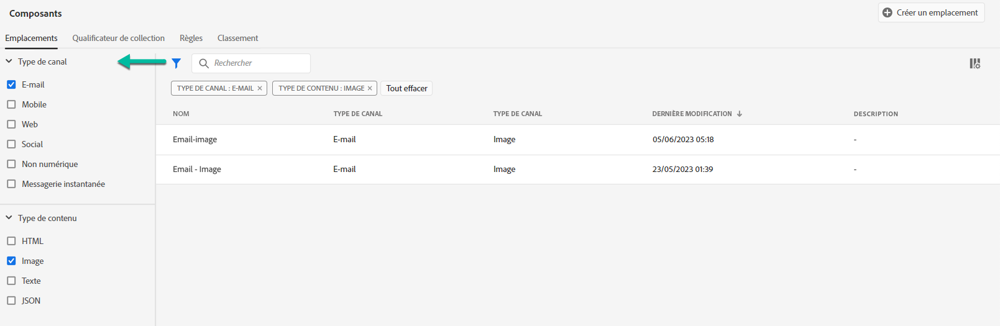

# Interface d’utilisation de la bibliothèque des offres {#user-interface}

>[!TIP]
>
>La prise de décision, la nouvelle fonctionnalité de prise de décision d’[!DNL Adobe Journey Optimizer], est désormais disponible via les canaux d’expérience basée sur du code et d’e-mail. [En savoir plus](../../experience-decisioning/gs-experience-decisioning.md)

La section **[!UICONTROL Gestion des décisions]** du rail de gauche propose deux menus permettant d’accéder aux fonctionnalités de gestion des décisions :

Utilisez le menu **[!UICONTROL Offres]** pour gérer et diffuser vos offres :

* **[!UICONTROL Aperçu]** : vous découvrez [!DNL decision management] ? Suivez les étapes à l’écran pour commencer à configurer des emplacements, des offres et des collections. Lorsque vous connaissez déjà [!DNL decision management], consultez l&#39;aperçu de vos offres, collections et décisions les plus récentes. [En savoir plus](#overview).
* **[!UICONTROL Offres]** : créez vos offres personnalisées et de secours, puis accédez-y. Découvrez comment créer des [offres](../offer-library/creating-personalized-offers.md) et des [offres de secours](../offer-library/creating-fallback-offers.md).
* **[!UICONTROL Collections]** : organisez vos offres en collections statiques et dynamiques. [En savoir plus](../offer-library/creating-collections.md).
* **[!UICONTROL Décisions]** : créez et gérez des décisions pour diffuser vos offres. [En savoir plus](../offer-activities/create-offer-activities.md).
* **[!UICONTROL Prise de décision par lots]** : diffusez les décisions d’offres à tous les profils d’une audience Adobe Experience Platform donnée. [En savoir plus](../batch-delivery.md).
* **[!UICONTROL Simulation]** : pour valider votre logique de prise de décision, vous pouvez simuler les offres qui seront diffusées à un profil de test pour un emplacement donné. [En savoir plus](../offer-activities/simulation.md).

Utilisez le menu **[!UICONTROL Composants]** pour créer et gérer des composants nécessaires à la création d’offres et de décisions :

* **[!UICONTROL Emplacements]** : créez et gérez des emplacements où vos offres s’afficheront. [En savoir plus](../offer-library/creating-placements.md).
* **[!UICONTROL Qualificateurs de collection]** : créez et gérez des qualificateurs de collection (auparavant appelés « balises ») pour classer et filtrer vos offres. [En savoir plus](../offer-library/creating-tags.md).
* **[!UICONTROL Règles]** : gérez les conditions selon lesquelles vos offres sont présentées. [En savoir plus](../offer-library/creating-decision-rules.md).
* **[!UICONTROL Classement]** : créez et gérez des formules de classement afin de déterminer quelle offre doit être présentée en premier pour un emplacement donné. [En savoir plus](../ranking/create-ranking-formulas.md).

>[!NOTE]
>
>Si vous rencontrez des problèmes pour accéder à la gestion des décisions ou à certaines de ses fonctionnalités, vérifiez auprès de l’administration que les droits nécessaires vous ont été accordés. Voir [Octroi de l’accès à la gestion des décisions](starting-offer-decisioning.md#granting-acess-to-decision-management).

## Présentation {#overview}

Lorsque vous découvrez [!DNL decision management], l’onglet **[!UICONTROL Aperçu]** vous guide tout au long des principales étapes nécessaires pour commencer à créer votre première décision d’offres. Suivez les étapes à l’écran pour commencer à créer des emplacements, des offres et des collections. Une fois que vous avez terminé ces premières étapes, vous êtes invité à créer des décisions d’offre.

>[!NOTE]
>
>Les principales étapes pour créer des offres et les utiliser dans une décision sont présentées dans [cette section](../offer-library/key-steps.md).

Lorsque vous connaissez mieux [!DNL decision management] et que vous avez déjà créé au moins une décision d&#39;offre, l&#39;onglet **[!UICONTROL Aperçu]** affiche vos offres, collections et décisions les plus récentes.

Cliquez sur une offre ou une décision pour accéder directement aux détails de l&#39;élément sélectionné.

Cliquez sur le bouton **[!UICONTROL Afficher tout]** pour accéder aux listes d&#39;offres, de collections ou de décisions.

## Recherche et filtrage d’informations {#search-and-filter-information}

Utilisez la **barre de recherche** pour rechercher un élément spécifique.

Pour accéder aux **filtres**, vous pouvez également cliquer sur l&#39;icône en forme de filtre en haut à gauche de la liste. Il permettent de filtrer les éléments affichés en fonction de différents critères. Vous pouvez, par exemple, filtrer les emplacements créés pour le canal de communication par email et les contenus de type image.

## Personnaliser les informations affichées {#customize-displayed-information}

Il est possible de personnaliser les listes des menus de la gestion des décisions à l’aide du bouton de configuration situé en haut à droite de ces listes.

Il est ainsi possible de choisir les informations à afficher selon vos besoins.

Notez que la personnalisation des colonnes est enregistrée pour chaque utilisateur.

## Volet d&#39;informations {#information-pane}

Dans les différentes listes, sélectionnez un élément pour afficher un volet d&#39;informations afin de récupérer des informations et d&#39;exécuter des actions de base sur l&#39;élément.

Les listes des offres et des décisions vous permettent également d&#39;effectuer des actions en masse sur plusieurs éléments. Pour cela, sélectionnez les offres ou décisions de votre choix, puis l’action à exécuter dans le volet d’informations.

Vous pouvez également dupliquer une offre ou une décision existante afin de créer une copie présentant l’état **[!UICONTROL Brouillon]**. Il est possible d’effectuer cette opération à partir du volet d’informations, d’une offre ou d’un affichage détaillé d’une décision.

## Logs des modifications des offres et des décisions {#changes-logs}

[!DNL Journey Optimizer] permet de visualiser toutes les modifications apportées à une offre ou à une décision. Pour ce faire, accédez au menu **[!UICONTROL Audits]** dans le menu de gauche. [Découvrir comment effectuer un audit des actions sur les ressources](../../privacy/audit-logs.md)
