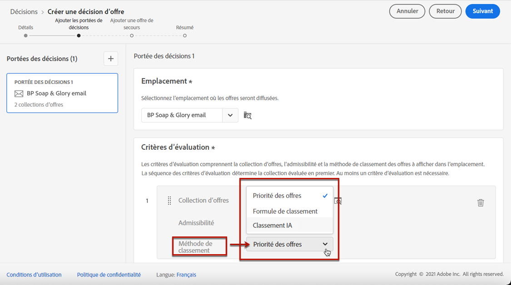
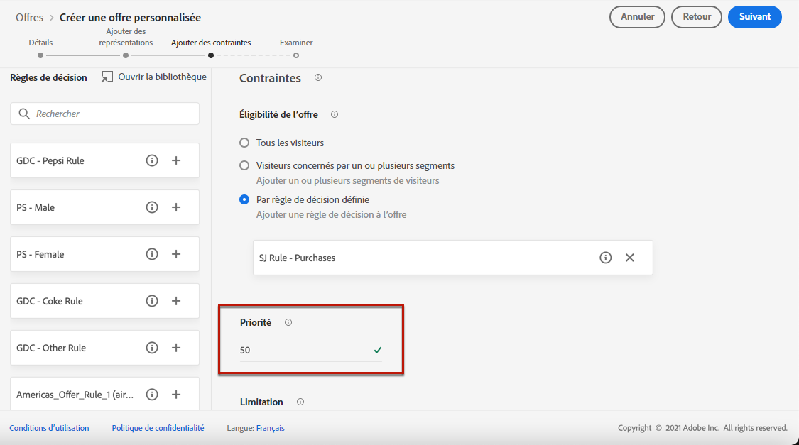
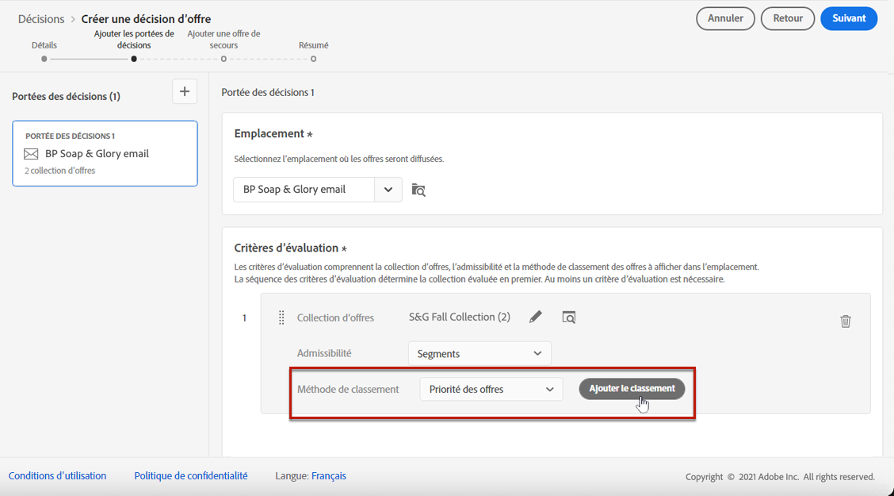
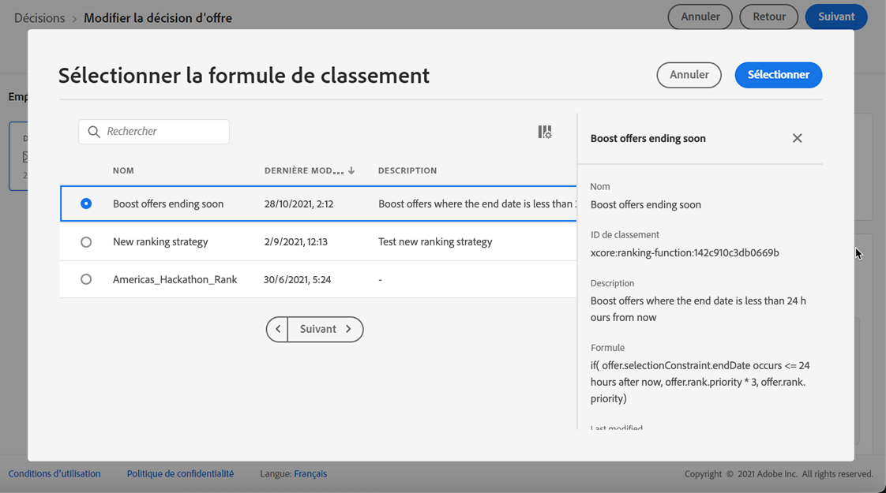
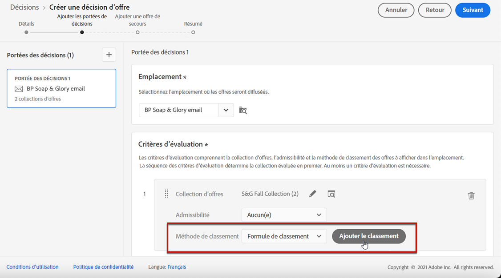
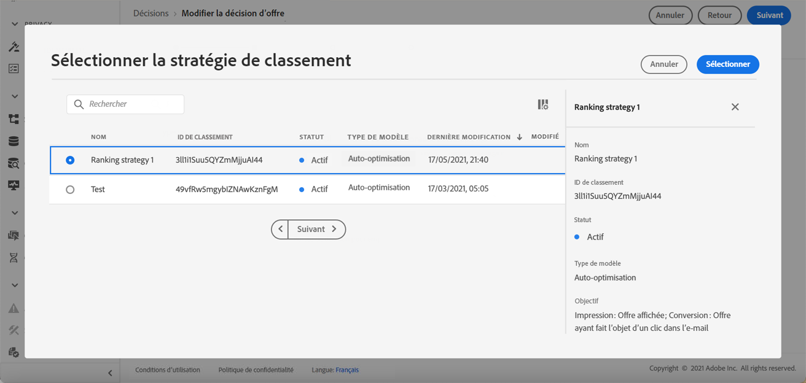

# Configuration de la sélection des offres dans les décisions {#offers-selection-in-activities}

Si plusieurs offres sont éligibles pour un emplacement donné, vous pouvez choisir la méthode qui sélectionnera la meilleure offre pour chaque profil lors de la configuration d&#39;une décision (précédemment appelée « activité d&#39;offre »). Vous pouvez classer les offres par :
* Priorité des offres
* Formule de classement
* [Classement par l’IA](#use-ranking-strategy) (en accès anticipé pour certains utilisateurs uniquement)

## Priorité d’offre {#about-offers-priority}

Par défaut, lorsque plusieurs offres sont éligibles pour un emplacement donné dans une décision (auparavant « activité d’offre »), les offres présentant la **priorité** la plus élevée sont diffusées en premier aux clients.

Les scores de priorité d&#39;une offre sont attribués lors de sa création. Découvrez comment créer une offre personnalisée dans [cette section](../offer-library/creating-personalized-offers.md).

## Formule de classement {#assign-ranking-formula}

En plus de la priorité d’offre, Journey Optimizer vous permet de créer des **formules de classement**. Ces formules déterminent quelle offre doit être présentée en premier pour un emplacement donné au lieu de prendre en compte les scores de priorité des offres.

Par exemple, vous pouvez augmenter la priorité de toutes les offres dont la date de fin est inférieure à 24 heures, ou remonter les offres de la catégorie « en cours » si le point ciblé du profil est « en cours ».

Découvrez comment créer une formule de classement dans [cette section](../offer-library/create-ranking-formulas.md).

Après avoir créé une formule de classement, vous pouvez l&#39;affecter à un emplacement dans une décision (auparavant appelée activité d&#39;offre). Pour ce faire, procédez comme suit :

1. Créez une décision ou modifiez une décision existante. Voir la section [Créer des décisions](../offer-activities/create-offer-activities.md).

1. Ajoutez les emplacements qui contiendront vos offres. Voir [Créer des emplacements](../offer-library/creating-placements.md).

1. Pour chaque emplacement, ajoutez une collection. Voir [Créer des collections](../offer-library/creating-collections.md).

1. Sélectionner **[!UICONTROL Formule de classement]** comme méthode de classement, puis cliquez sur **[!UICONTROL Ajouter un classement]**.

   

1. Sélectionnez la formule de classement souhaitée, puis cliquez sur **[!UICONTROL Sélectionner]**.

   

La formule de classement est désormais associée à l&#39;emplacement.

Si plusieurs offres sont éligibles à la présentation dans cet emplacement, la décision utilisera la formule de classement pour calculer l&#39;offre à diffuser en premier.

## Classement par l&#39;IA {#use-ranking-strategy}

<!--If you are an [Adobe Experience Platform](https://experienceleague.adobe.com/docs/experience-platform/landing/home.html){target="_blank"} user leveraging the **Offer Decisioning** application service,-->You can also use an trained model system that automatically ranks offers to display for a given profile by selecting a ranking strategy. Learn how to create a ranking strategy in [this section](../offer-library/create-ranking-strategies.md).

>[!CAUTION]
>
>L&#39;utilisation du classement par l&#39;IA est actuellement disponible en accès anticipé uniquement pour certains utilisateurs.

Après avoir créé une stratégie de classement, vous pouvez l&#39;affecter à un emplacement dans une décision (précédemment appelée « activité d&#39;offre »). Pour ce faire, procédez comme suit :

1. Créez une décision ou modifiez une décision existante. Voir la section [Créer des décisions](../offer-activities/create-offer-activities.md).

1. Ajoutez les emplacements qui contiendront vos offres. Voir [Créer des emplacements](../offer-library/creating-placements.md).

1. Pour chaque emplacement, ajoutez une collection. Voir [Créer des collections](../offer-library/creating-collections.md).

1. Choisir de classer les offres par **[!UICONTROL Classement AI]** dans la liste déroulante, puis cliquez sur **[!UICONTROL Ajouter un classement]**.

   

1. Sélectionnez la stratégie de classement que vous avez créée. Tous les détails de la stratégie de classement s&#39;affichent.

   

1. Cliquez sur **[!UICONTROL Sélectionner]**. La stratégie de classement est désormais associée à l&#39;emplacement.

Si plusieurs offres sont éligibles, le système de modèles formés détermine l&#39;offre qui doit être présentée en premier pour un emplacement donné.

<!--Result? Describe the impact for the user, i.e. what's the effect of selecting this ranking strategy for this collection/placement.-->

<!--Click **[!UICONTROL Next]** to confirm and save your decision.-->
