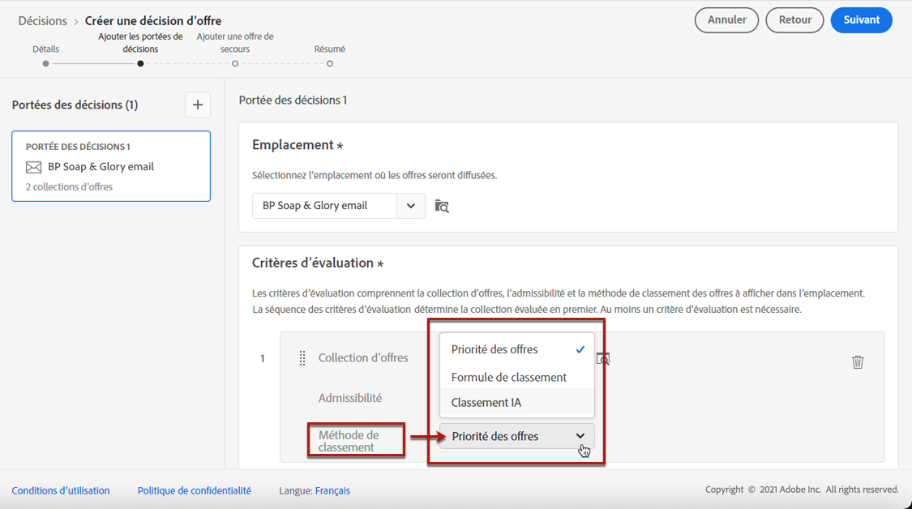
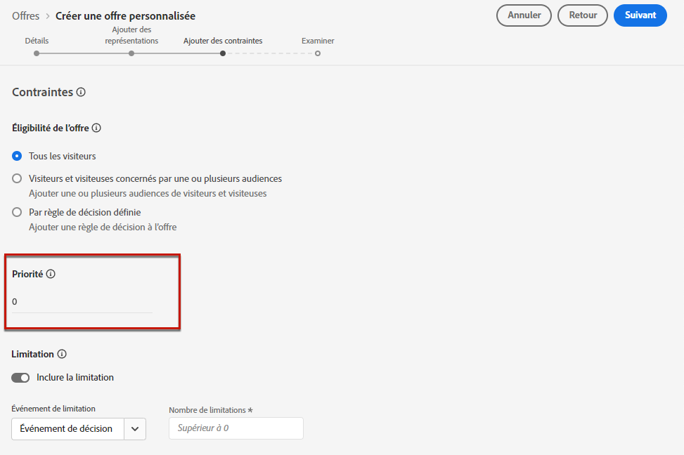
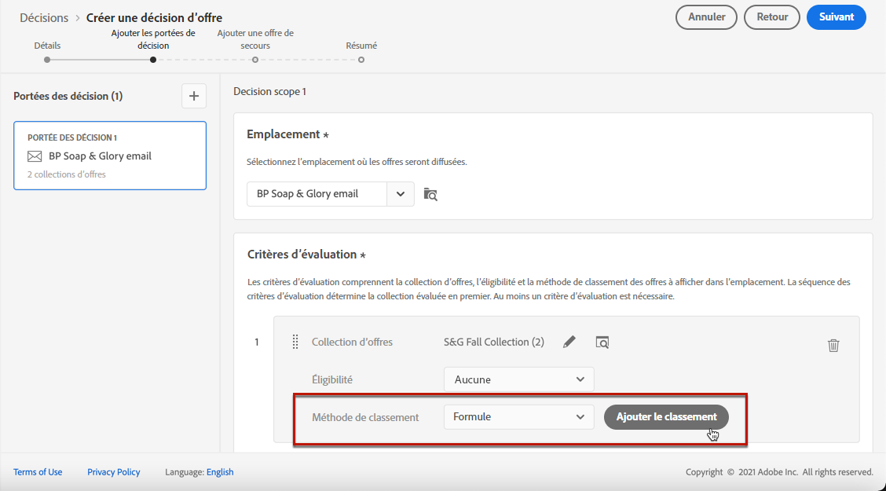
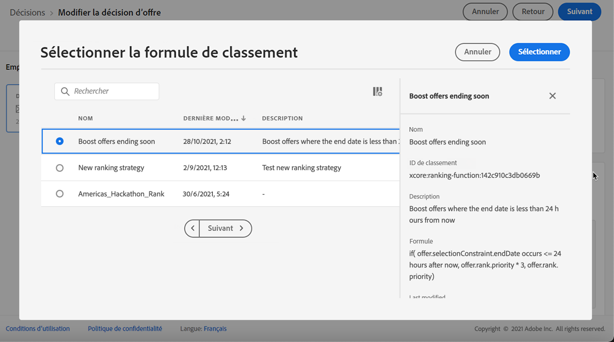
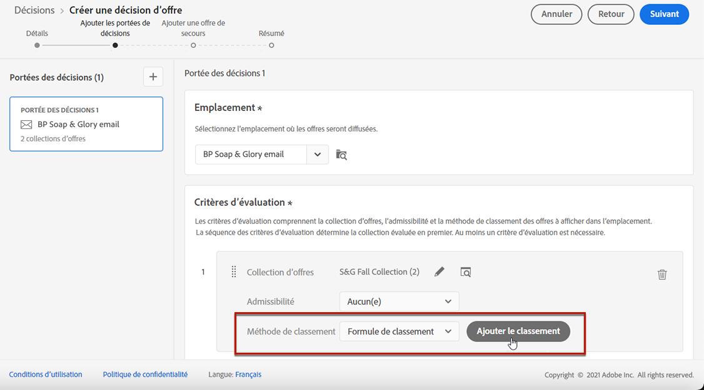
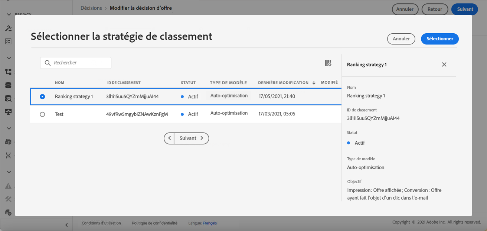

# Configurer la sélection des offres dans les décisions {#offers-selection-in-decisions}

>[!TIP]
>
>La prise de décision, la nouvelle fonctionnalité de prise de décision d’[!DNL Adobe Journey Optimizer], est désormais disponible via les canaux d’expérience basée sur du code et d’e-mail. [En savoir plus](../../experience-decisioning/gs-experience-decisioning.md)

Si plusieurs offres sont éligibles pour un emplacement donné, vous pouvez choisir la méthode qui sélectionnera la meilleure offre pour chaque profil lors de la configuration d’une décision. Vous pouvez classer les offres par :

* Priorité des offres
* Formule de classement
* [Classement par l&#39;IA](#use-ranking-strategy)

## Priorité des offres {#offer-priority}

Par défaut, lorsque plusieurs offres sont éligibles pour un emplacement donné dans une décision, les offres avec la **priorité** la plus élevée sont diffusées en premier aux clients.

Les scores de priorité d&#39;une offre sont attribués lors de sa création. Découvrez comment créer une offre personnalisée dans [cette section](../offer-library/creating-personalized-offers.md).

## Formule de classement {#assign-ranking-formula}

En plus de la priorité d’offre, Journey Optimizer vous permet de créer des **formules de classement**. Ces formules déterminent quelle offre doit être présentée en premier pour un emplacement donné au lieu de prendre en compte les scores de priorité des offres.

Par exemple, vous pouvez augmenter la priorité de toutes les offres dont la date de fin est inférieure à 24 heures, ou remonter les offres de la catégorie « en cours » si le point ciblé du profil est « en cours ».

Découvrez comment créer une formule de classement dans [cette section](../ranking/create-ranking-formulas.md).

Après avoir créé une formule, vous pouvez l’affecter à un emplacement dans une décision. Pour ce faire, procédez comme suit :

1. Créez une décision ou modifiez une décision existante. Voir [Créer des décisions](../offer-activities/create-offer-activities.md).

1. Ajoutez les emplacements qui contiendront vos offres. Voir [Créer des emplacements](../offer-library/creating-placements.md).

1. Pour chaque emplacement, ajoutez une collection. Voir [Créer des collections](../offer-library/creating-collections.md).

1. Sélectionnez **[!UICONTROL Formule]** comme méthode de classement, puis cliquez sur **[!UICONTROL Ajouter un classement]**.

   

1. Sélectionnez la formule souhaitée, puis cliquez sur **[!UICONTROL Sélectionner]**.

   

La formule de classement est désormais associée à l’emplacement.

Si plusieurs offres sont éligibles à la présentation dans cet emplacement, la décision utilisera la formule sélectionnée pour calculer l’offre à présenter en premier.

## Classement par l’IA {#use-ranking-strategy}

<!--If you are an [Adobe Experience Platform](https://experienceleague.adobe.com/docs/experience-platform/landing/home.html){target="_blank"} user leveraging the **Offer Decisioning** application service,-->

Vous pouvez également utiliser un système de modèles formés qui classe automatiquement les offres à afficher pour un profil donné en sélectionnant un modèle d’IA. Découvrez comment créer un modèle d’IA dans [cette section](../ranking/create-ranking-strategies.md).

Une fois un modèle d’IA créé, affectez-le à un emplacement dans une décision. Pour ce faire, procédez comme suit :

1. Créez une décision ou modifiez une décision existante. Voir [Créer des décisions](../offer-activities/create-offer-activities.md).

1. Ajoutez les emplacements qui contiendront vos offres. Voir [Créer des emplacements](../offer-library/creating-placements.md).

1. Pour chaque emplacement, ajoutez une collection. Voir [Créer des collections](../offer-library/creating-collections.md).

1. Choisissez de classer les offres par **[!UICONTROL classement AI]** dans la liste déroulante, puis cliquez sur **[!UICONTROL Ajouter un classement]**.

   

1. Sélectionnez le modèle d’IA que vous avez créé. Tous les détails du modèle d’IA s’affichent.

   

1. Cliquez sur **[!UICONTROL Sélectionner]**. Le modèle d’IA est désormais associé à l’emplacement.

Si plusieurs offres sont éligibles, le système de modèles formés détermine l&#39;offre qui doit être présentée en premier pour un emplacement donné.

