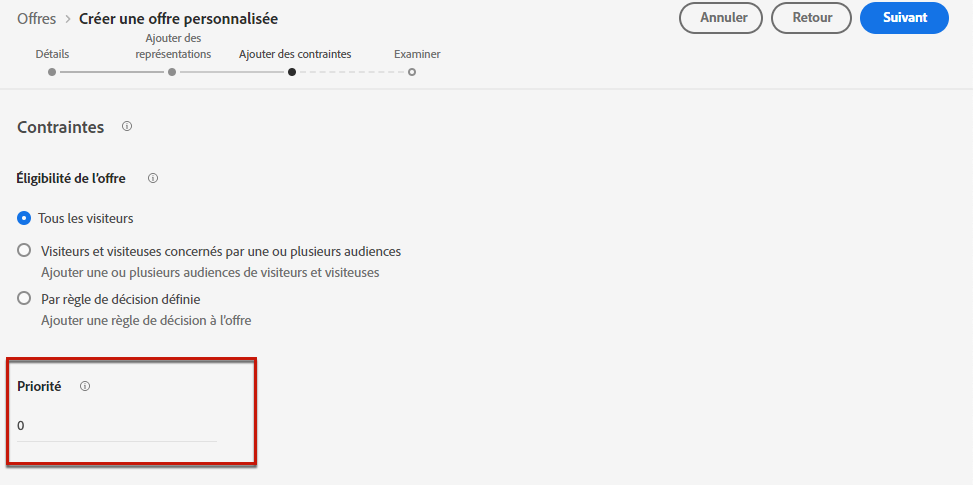

# Configurer la sélection des offres dans les décisions {#offers-selection-in-activities}

## A propos de la priorité des Offres {#about-offers-priority}

Par défaut, lorsque plusieurs offres sont éligibles pour un placement donné dans une décision (précédemment connue sous le nom d&#39;activité d&#39;offre), les offres ayant la priorité la plus élevée **** sont livrées en premier aux clients. Les scores de priorité des Offres sont attribués lors de la création d&#39;une offre (voir [Création d&#39;une offre personnalisée](../offer-library/creating-personalized-offers.md)).

De plus, Journey Optimizer vous permet de créer des **formules de classement**. Il s&#39;agit de formules qui déterminent quelle offre doit être présentée en premier pour un placement donné, plutôt que de prendre en compte les notes de priorité des offres. Par exemple, vous pouvez augmenter la priorité de toutes les offres dont la date de fin est inférieure à 24 heures, ou augmenter les offres de la catégorie &quot;en cours&quot; si le point d’intérêt du profil est &quot;en cours&quot;.

Pour plus d&#39;informations sur la création d&#39;une formule de classement, consultez [cette section](../offer-library/create-ranking-formulas.md).

## Affecter une formule de classement à un emplacement {#assign-ranking-formula}

Une fois qu&#39;une formule de classement a été créée, vous pouvez l&#39;affecter à un emplacement dans une décision. Pour ce faire, procédez comme suit :

* Créez une décision ou modifiez une décision existante, puis créez les emplacements qui contiendront vos offres (voir [Créer des décisions](../offer-activities/create-offer-activities.md)).

* Pour chaque emplacement, sélectionnez **[!UICONTROL Classement]** dans la liste déroulante, puis cliquez sur **[!UICONTROL Ajouter le classement]**.

   

* Sélectionnez la formule de classement souhaitée, puis cliquez sur **[!UICONTROL Sélectionner]**.

   

La formule de classement est désormais associée au placement. Si plusieurs offres sont admissibles à ce placement, la décision utilisera la formule de classement pour calculer l&#39;offre à livrer en premier.
