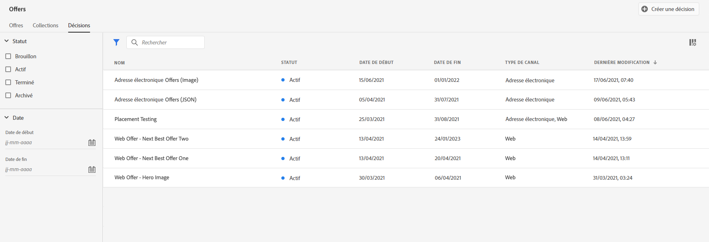
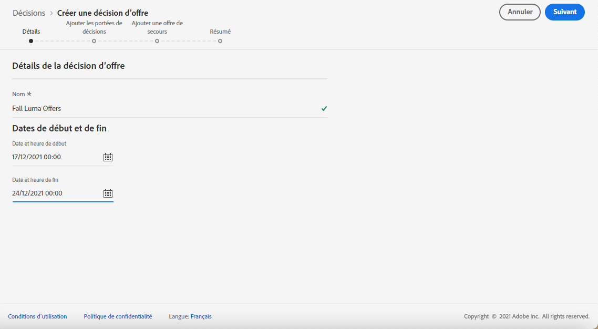
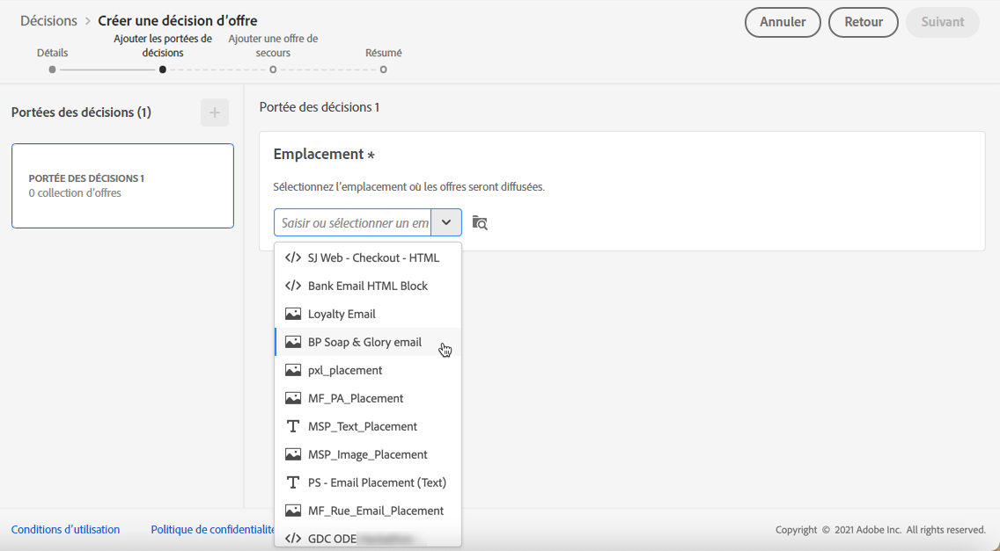
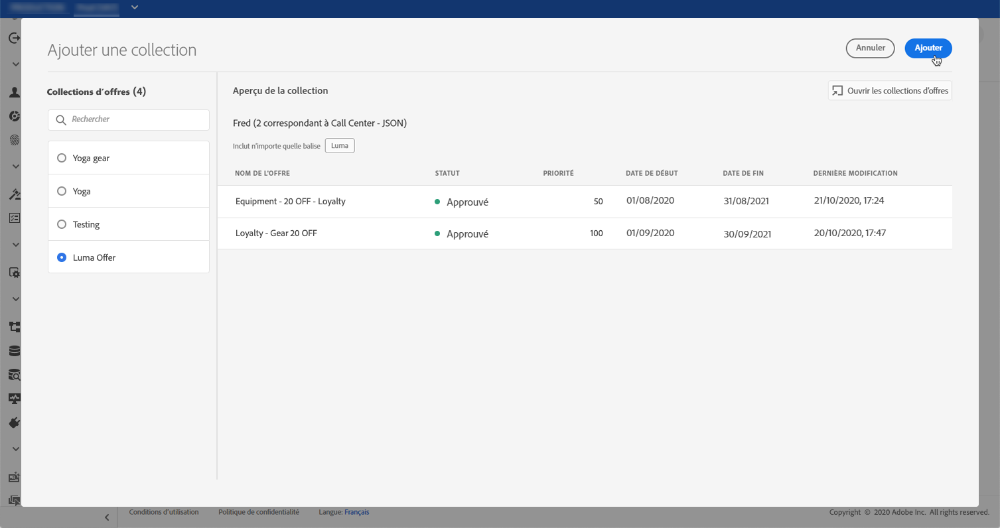
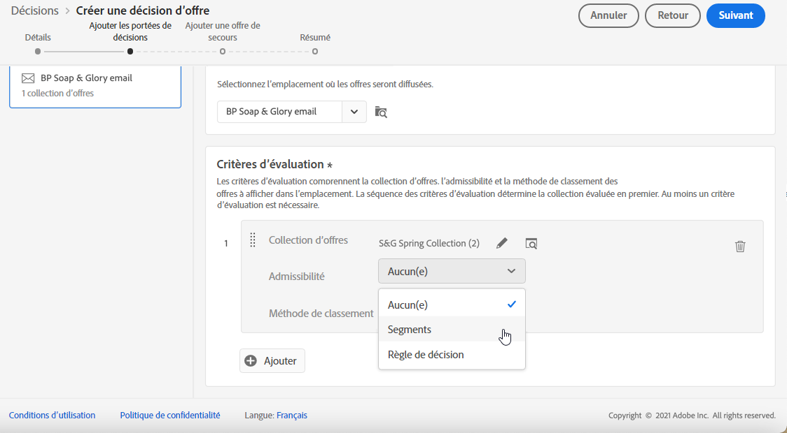
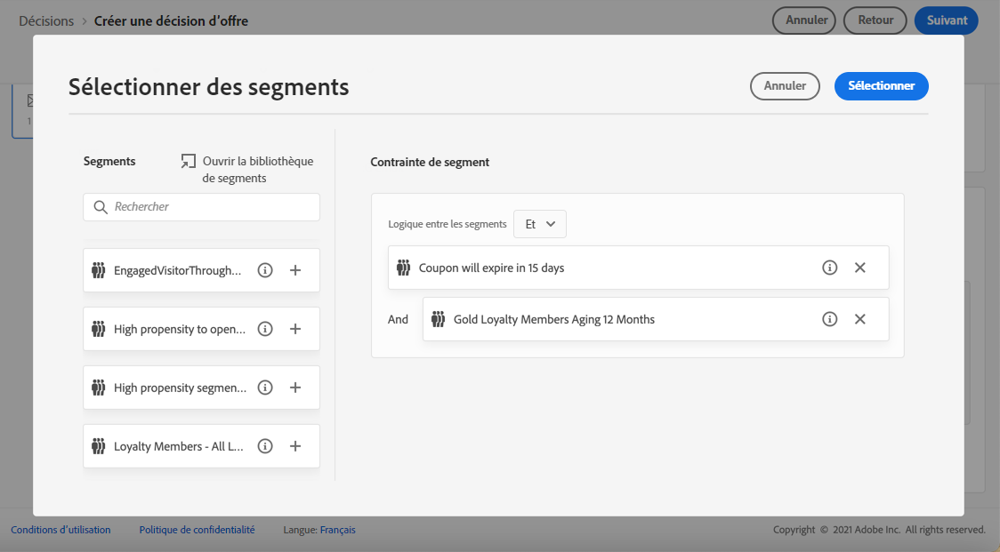
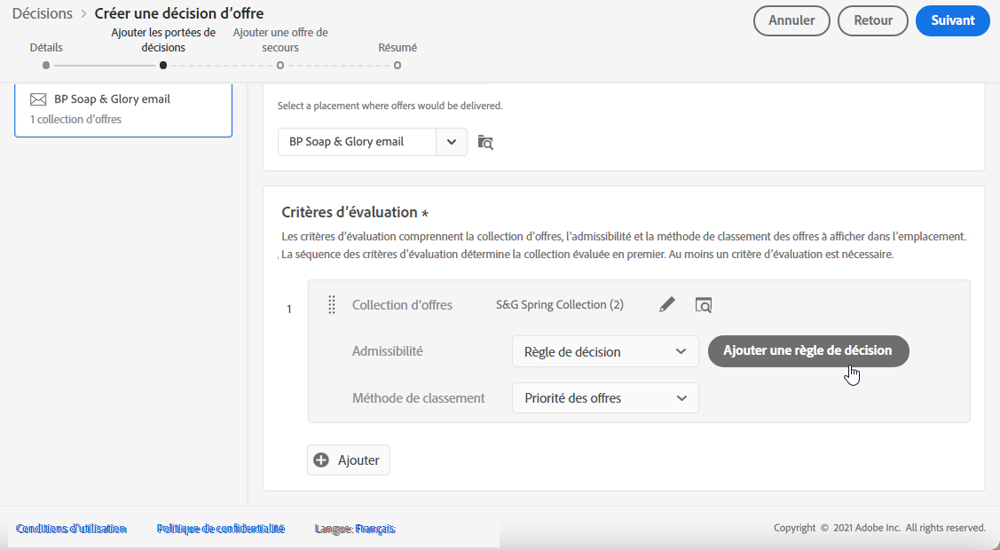
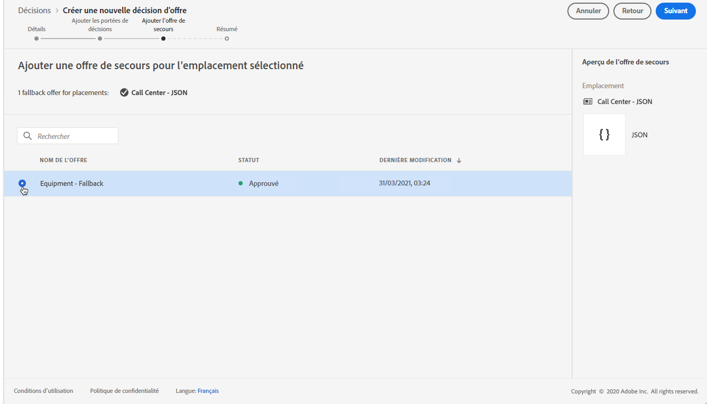
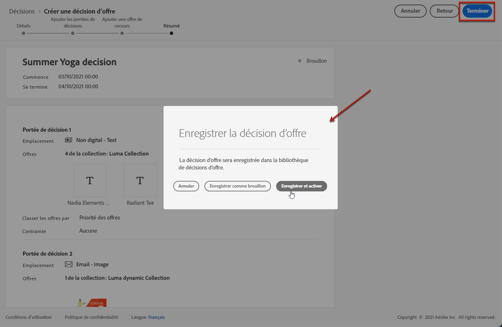
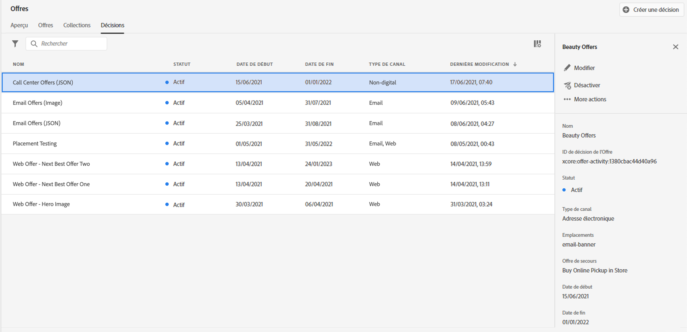

# Création de décisions {#create-offer-activities}

Les décisions (précédemment appelées activités d&#39;offre) sont des conteneurs qui s&#39;appuient sur le moteur de décision pour choisir la meilleure offre à diffuser en fonction de la cible de la diffusion.

➡️ [Découvrez cette fonctionnalité en vidéo](#video)

La liste des décisions est accessible dans le menu **[!UICONTROL Offres]**/onglet **[!UICONTROL Décisions]**. Des filtres sont disponibles pour vous aider à récupérer les décisions en fonction de leurs statuts ou de leurs dates de début ou de fin.

Avant de créer une décision, vérifiez que les composants suivants ont été créés dans la bibliothèque des offres :

* [Emplacements](../offer-library/creating-placements.md)
* [Collections](../offer-library/creating-collections.md)
* [Offres personnalisées](../offer-library/creating-personalized-offers.md)
* [Offres de secours](../offer-library/creating-fallback-offers.md)

## Création de la décision {#create-activity}

1. Accédez à la liste des décisions, puis cliquez sur **[!UICONTROL Créer une activité]**.

1. Indiquez le nom de la décision, ainsi que ses dates et heures de début et de fin, puis cliquez sur **[!UICONTROL Suivant]**.

   

## Ajout de portées de décision {#add-decision-scopes}

1. Effectuez un glisser-déposer d&#39;un emplacement de la liste pour l&#39;ajouter à la décision, puis cliquez sur **[!UICONTROL Ajouter une collection]**.

   

   >[!NOTE]
   >
   >Le même emplacement peut être sélectionné plusieurs fois dans la décision.

1. Sélectionnez la collection qui contient les offres à prendre en compte, puis cliquez sur **[!UICONTROL Ajouter]**.

   

1. Les offres sélectionnées sont ajoutées à l&#39;emplacement. Dans cet exemple, nous avons sélectionné deux offres qui s&#39;afficheront dans un emplacement de type JSON destiné à présenter des offres dans une solution de centre d&#39;appels.

   

1. Par défaut, si plusieurs offres sont éligibles pour cet emplacement, ce sont les offres ayant le score de priorité le plus élevé qui sont diffusées au client.

   Si vous souhaitez utiliser une formule spécifique pour choisir l&#39;offre éligible à diffuser, sélectionnez une formule de classement dans la liste déroulante **[!UICONTROL Classer les offres par]**. Voir à ce propos [cette section](../offer-activities/configure-offer-selection.md).

1. Le champ **[!UICONTROL Contrainte]** limite la sélection des offres pour cet emplacement. Cette contrainte peut être appliquée en utilisant une règle de décision ou un ou plusieurs segments Adobe Experience Platform.

   Pour limiter la sélection des offres aux membres d&#39;un segment Adobe Experience Platform, sélectionnez **[!UICONTROL Segments]**, puis cliquez sur **[!UICONTROL Ajouter des segments]**.

   

   Ajoutez un ou plusieurs segments du volet de gauche, combinez-les à l&#39;aide des opérateurs logiques **[!UICONTROL Et]** / **[!UICONTROL Ou]**, puis cliquez sur **[!UICONTROL Sélectionner]** pour confirmer.

   Pour plus d’informations sur l’utilisation des segments, consultez [cette page](../../segment/about-segments.md).

   

   Si vous souhaitez ajouter une contrainte de sélection pour cet emplacement à l&#39;aide d&#39;une règle de décision, sélectionnez l&#39;option **[!UICONTROL Règle de décision]**, puis faites glisser la règle de votre choix depuis le volet de gauche vers la zone **[!UICONTROL Règle de décision]**. Pour plus d&#39;informations sur la façon de créer une règle de décision, reportez-vous à [cette section](../offer-library/creating-decision-rules.md).

   

## Ajout d&#39;une offre de secours {#add-fallback}

Sélectionnez l&#39;offre de secours qui sera présentée en dernier recours aux clients qui ne correspondent pas aux règles d&#39;éligibilité et contraintes des offres, puis cliquez sur **[!UICONTROL Suivant]**.

## Examen et enregistrement de la décision {#review}

Si tout est configuré correctement et que votre décision est prête à être utilisée pour présenter des offres aux clients, cliquez sur **[!UICONTROL Terminer]**, puis sélectionnez **[!UICONTROL Enregistrer et activer]**.

Vous pouvez également enregistrer la décision en tant que version préliminaire afin de la modifier et de l&#39;activer ultérieurement.

La décision s&#39;affiche dans la liste avec l&#39;état **[!UICONTROL Actif]** ou **[!UICONTROL Version préliminaire]**, selon que vous l&#39;avez activée ou non à l&#39;étape précédente.

Elle est maintenant prête à être utilisée pour diffuser des offres vers les clients. Vous pouvez la sélectionner pour afficher ses propriétés et la modifier ou la supprimer.

Pour plus d’informations sur la diffusion des offres, reportez-vous aux sections suivantes :

* [Ajouter des offres personnalisées dans les messages](../../deliver-personalized-offers.md)
* [Diffuser des offres à l’aide d’API](../api-reference/decisions-api/deliver-offers.md)

>[!NOTE]
>
>Une fois une décision créée, vous pouvez cliquer sur son nom dans la liste pour accéder à des informations détaillées et visualiser toutes les modifications qui lui ont été apportées à l’aide de l’onglet **[!UICONTROL Journal des modifications]**. [En savoir plus](../get-started/user-interface.md#changes-log).

## Tutoriel vidéo {#video}

>[!NOTE]
>
>Cette vidéo s&#39;applique au service applicatif d&#39;Offer Decisioning basé sur Adobe Experience Platform. Elle fournit toutefois des orientations générales pour l&#39;utilisation d&#39;Offer dans le contexte de Journey Optimizer.

>[!VIDEO](https://video.tv.adobe.com/v/329606?quality=12)
