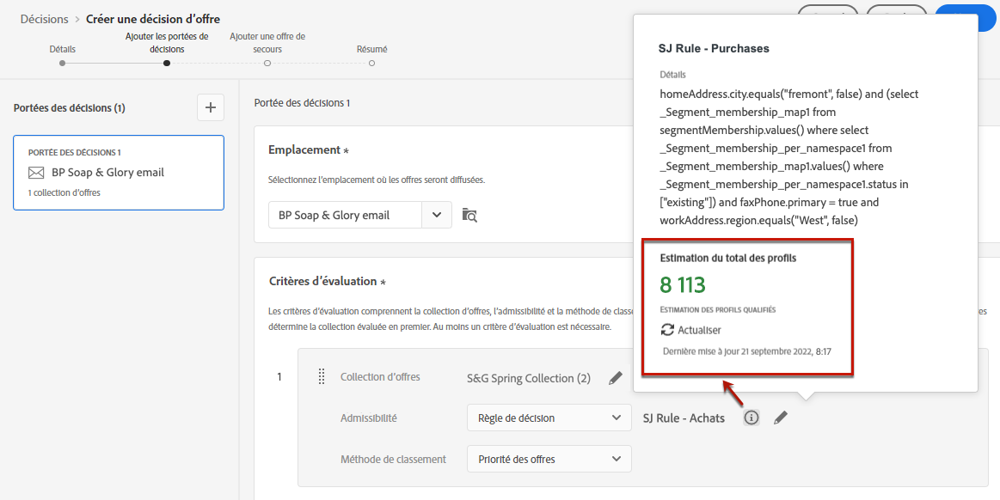
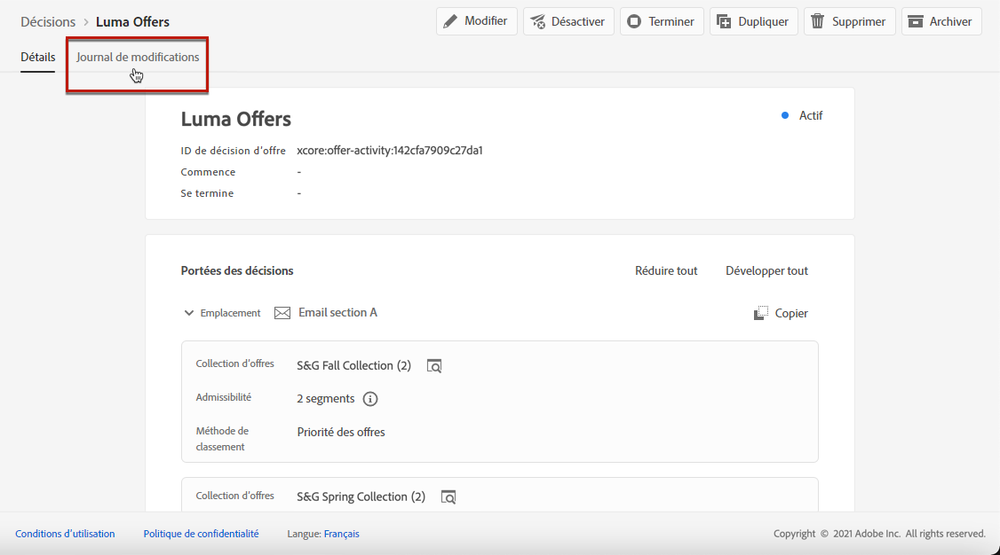

# Créer des décisions {#create-offer-activities}

Les décisions sont des conteneurs pour vos offres qui s’appuient sur le moteur de décision d’offre pour choisir la meilleure offre à diffuser en fonction de la cible de la diffusion.

➡️ [Découvrez comment créer des activités d&#39;offre dans cette vidéo](#video)

La liste des décisions est accessible dans le menu **[!UICONTROL Offres]**> onglet **[!UICONTROL Décisions]**. Des filtres sont disponibles pour vous aider à récupérer les décisions en fonction de leurs statuts ou de leurs dates de début ou de fin.

Avant de créer une décision, vérifiez que les composants suivants ont été créés dans la bibliothèque des offres :

* [Emplacements](../offer-library/creating-placements.md)
* [Collections](../offer-library/creating-collections.md)
* [Offres personnalisées](../offer-library/creating-personalized-offers.md)
* [Offres de secours](../offer-library/creating-fallback-offers.md)

## Création de la décision {#create-activity}

1. Accédez à la liste des décisions, puis cliquez sur **[!UICONTROL Créer une décision]**.

1. Indiquez le nom de la décision.

1. Définissez une date et une heure de début et de fin si nécessaire, puis cliquez sur **[!UICONTROL Suivant]**.

   

1. Pour attribuer des étiquettes d’utilisation des données personnalisées ou de base à la décision, sélectionnez **[!UICONTROL Gérer l’accès]**. [En savoir plus sur le contrôle d’accès au niveau de l’objet (OLAC)](../../administration/object-based-access.md)

## Définir des portées de décision {#add-decision-scopes}

1. Sélectionnez un emplacement dans la liste déroulante. Il sera ajouté à la première portée de décision de votre décision.

   

1. Cliquez sur **[!UICONTROL Ajouter]** pour sélectionner les critères d’évaluation de cet emplacement.

   

   Chaque critère consiste en une collection d’offres associée à une contrainte d’éligibilité et à une méthode de classement permettant de déterminer les offres à afficher dans l’emplacement.

   >[!NOTE]
   >
   >Au moins un critère d’évaluation est requis.

1. Sélectionnez la collection d’offres qui contient les offres à prendre en compte, puis cliquez sur **[!UICONTROL Ajouter]**.

   

   >[!NOTE]
   >
   >Vous pouvez cliquer sur le lien **[!UICONTROL Ouvrir les collections d’offres]** pour afficher la liste des collections dans un nouvel onglet, qui permet de parcourir les collections et les offres qu’elles contiennent.

   La collection sélectionnée est ajoutée au critère.

   

1. Utilisez le champ **[!UICONTROL Éligibilité]** pour restreindre la sélection des offres pour cet emplacement.

   Cette contrainte peut être appliquée en utilisant une **règle de décision** ou un ou plusieurs **segments Adobe Experience Platform**. Ceux-ci sont présentés dans [cette section](../offer-library/add-constraints.md#segments-vs-decision-rules).

   * Pour limiter la sélection des offres aux membres d’un segment Experience Platform, sélectionnez **[!UICONTROL Segments]**, puis cliquez sur **[!UICONTROL Ajouter des segments]**.

      

      Ajoutez un ou plusieurs segments depuis le volet de gauche, puis combinez-les à l’aide des opérateurs logiques **[!UICONTROL Et]**/**[!UICONTROL Ou]**.

      

      Découvrez comment utiliser des segments dans [cette section](../../segment/about-segments.md).

   * Si vous souhaitez ajouter une contrainte de sélection avec une règle de décision, utilisez l’option **[!UICONTROL Règle de décision]** et sélectionnez la règle de votre choix.

      

      Découvrez comment créer une règle de décision dans [cette section](../offer-library/creating-decision-rules.md).

1. Lorsque vous sélectionnez des segments ou des règles de décision, vous pouvez afficher des informations sur les profils qualifiés estimés. Cliquez sur **[!UICONTROL Actualiser]** pour mettre à jour les données.

   >[!NOTE]
   >
   >Les estimations de profil ne sont pas disponibles lorsque les paramètres de règle incluent des données qui ne figurent pas dans le profil, telles que des données contextuelles. Par exemple, une règle d’éligibilité qui exige que la météo actuelle soit de ≥80 degrés.

   

1. Définissez la méthode de classement à utiliser pour sélectionner la meilleure offre pour chaque profil. [En savoir plus](../offer-activities/configure-offer-selection.md).

   

   * Par défaut, si plusieurs offres sont éligibles pour cet emplacement, la méthode **[!UICONTROL Priorité des offres]** utilise la valeur définie dans les offres : l’offre ayant le score de priorité le plus élevé sera présentée à l’utilisateur ou l’utilisatrice.

   * Si vous souhaitez utiliser un score calculé spécifique pour choisir l’offre éligible à présenter, sélectionnez **[!UICONTROL Formule]** ou **[!UICONTROL Modèle d’IA]**. [En savoir plus](../offer-activities/configure-offer-selection.md).

1. Cliquez sur **[!UICONTROL Ajouter]** pour définir d’autres critères pour le même emplacement.

   

1. Lorsque vous ajoutez plusieurs critères, ils sont évalués dans un ordre spécifique. La première collection ajoutée à la séquence sera évaluée en premier, etc. [En savoir plus](#evaluation-criteria-order).

   Pour modifier la séquence par défaut, vous pouvez faire glisser et déposer les collections afin de les réorganiser selon vos besoins.

   

1. Vous pouvez également évaluer plusieurs critères en même temps. Pour ce faire, glissez et déposez la collection au-dessus d’une autre.

   

   Ils possèdent désormais le même rang et seront donc évalués en même temps. [En savoir plus](#evaluation-criteria-order).

   

1. Pour ajouter un emplacement supplémentaire pour vos offres dans le cadre de cette décision, cliquez sur le bouton **[!UICONTROL Nouvelle portée]**. Répétez les étapes ci-dessus pour chaque portée de décision.

   

### Ordre des critères d’évaluation {#evaluation-criteria-order}

Comme décrit ci-dessus, un critère d’évaluation se compose d’une collection, de contraintes d’éligibilité et d’une méthode de classement. Vous pouvez définir l’ordre séquentiel dans lequel les critères d’évaluation s’appliquent, mais vous pouvez également combiner plusieurs critères d’évaluation afin de les appliquer ensemble et non séparément.

Prenons l’exemple suivant : vous disposez de deux collections, l’une dans le critère d’évaluation A et l’autre dans le critère d’évaluation B. La demande concerne le renvoi de deux offres. Deux offres répondent au critère d’évaluation A et trois offres au critère d’évaluation B.

* Si les deux critères d’évaluation ne sont **pas combinés** et/ou dans l’ordre séquentiel (1 et 2), les deux meilleures offres éligibles selon les critères d’évaluation seront renvoyées dans la première ligne. S’il n’y a pas deux offres éligibles pour le premier critère d’évaluation, le moteur de décision passera au critère d’évaluation suivant dans l’ordre pour trouver autant d’offres que nécessaire, et renverra finalement une offre de secours si nécessaire.

   

* Si les deux collections sont **évaluées en même temps**, car deux offres répondent au critère d’évaluation A et trois offres au critère d’évaluation B, les cinq offres sont regroupées et classées dans l’ordre de leurs méthodes de classement respectives. Comme deux offres sont demandées, les deux meilleures offres éligibles parmi ces cinq offres seront renvoyées.

   

## Ajouter une offre de secours {#add-fallback}

Une fois que vous avez défini les portées de décision, définissez l’offre de secours qui sera présentée en dernier recours aux clients qui ne correspondent pas aux règles d’éligibilité et contraintes des offres.

Pour ce faire, sélectionnez-la dans la liste des offres de secours disponibles pour les emplacements définis dans la décision, puis cliquez sur **[!UICONTROL Suivant]**.

>[!NOTE]
>
>Vous pouvez cliquer sur le lien **[!UICONTROL Ouvrir la bibliothèque des offres]** pour afficher la liste des offres dans un nouvel onglet.

## Examiner et enregistrer la décision {#review}

Si tout est configuré correctement, un résumé des propriétés de la décision s&#39;affiche.

1. Assurez-vous que la décision est prête à être utilisée pour présenter des offres aux clients. Toutes les portées de décision et l’offre de secours qu’elle contient s’affichent.

   

1. Vous pouvez développer ou réduire chaque emplacement. Vous pouvez prévisualiser les offres disponibles, les détails d’éligibilité et de classement pour chaque emplacement. Vous pouvez également afficher des informations sur les profils qualifiés estimés. Cliquez sur **[!UICONTROL Actualiser]** pour mettre à jour les données.

   

1. Cliquez sur **[!UICONTROL Terminer]**.
1. Sélectionnez **[!UICONTROL Enregistrer et activer]**.

   

   Vous pouvez également enregistrer la décision en tant que brouillon afin de la modifier et de l&#39;activer ultérieurement.

La décision s&#39;affiche dans la liste avec l&#39;état **[!UICONTROL Actif]** ou **[!UICONTROL Brouillon]**, selon que vous l&#39;avez activée ou non à l&#39;étape précédente.

Elle est maintenant prête à être utilisée pour diffuser des offres vers les clients.

## Liste des décisions {#decision-list}

Dans la liste des décisions, vous pouvez sélectionner la décision afin d&#39;afficher ses propriétés. Depuis cet emplacement, vous pouvez également la modifier, modifier son statut (**Brouillon**, **Actif**, **Terminé**, **Archivé**), la dupliquer ou la supprimer.

Sélectionnez le bouton **[!UICONTROL Modifier]** pour revenir au mode d&#39;édition de la décision, où vous pouvez modifier ses [détails](#create-activity), les [portées de décision](#add-decision-scopes) et l&#39;[offre de secours](#add-fallback).

>[!IMPORTANT]
>
>Si des modifications sont apportées à la décision d’une offre qui est utilisée dans le message d’un parcours, vous devez annuler la publication du parcours et le republier.  Cela permet de s’assurer que les modifications sont intégrées au message du parcours et que le message est cohérent avec les dernières mises à jour.

Sélectionnez une décision active et cliquez sur **[!UICONTROL Désactiver]** pour redéfinir le statut de la décision sur **[!UICONTROL Brouillon]**.

Pour définir à nouveau le statut sur **[!UICONTROL Actif]**, cliquez sur le bouton **[!UICONTROL Activer]** qui s&#39;affiche désormais.

Le bouton **[!UICONTROL Autres actions]** active les actions décrites ci-dessous.

* **[!UICONTROL Terminé]** : définit le statut de la décision sur **[!UICONTROL Terminé]**, ce qui signifie que la décision ne peut plus être appelée. Cette action n&#39;est disponible que pour les décisions activées. La décision est toujours disponible dans la liste, mais vous ne pouvez pas redéfinir son statut sur **[!UICONTROL Brouillon]** ou **[!UICONTROL Approuvé]**. Vous pouvez uniquement la dupliquer, la supprimer ou l&#39;archiver.

* **[!UICONTROL Dupliquer]** : crée une décision avec les mêmes propriétés, portées de décision et offre de secours. Par défaut, la nouvelle décision a le statut **[!UICONTROL Brouillon]**.

* **[!UICONTROL Supprimer]** : supprime la décision de la liste.

   >[!CAUTION]
   >
   >La décision et son contenu ne seront plus accessibles. Cette action ne peut pas être annulée.
   >
   >Si la décision est utilisée dans un autre objet, elle ne peut pas être supprimée.

* **[!UICONTROL Archiver]** : définit le statut de la décision sur **[!UICONTROL Archivé]**. La décision est toujours disponible dans la liste, mais vous ne pouvez pas redéfinir son statut sur **[!UICONTROL Brouillon]** ou **[!UICONTROL Approuvé]**. Vous pouvez uniquement la dupliquer ou la supprimer.

Vous pouvez également supprimer ou modifier le statut de plusieurs décisions en même temps en cochant les cases correspondantes.

Si vous souhaitez modifier le statut de plusieurs décisions dont les statuts sont différents, seuls les statuts correspondants seront modifiés.

Une fois une décision créée, vous pouvez cliquer sur son nom dans la liste.

Vous pouvez ainsi accéder à des informations détaillées sur cette décision. Sélectionnez l&#39;onglet **[!UICONTROL Log des modifications]** pour [surveiller toutes les modifications](../get-started/user-interface.md#changes-log) qui ont été apportées à la décision.

## Vidéo pratique{#video}

Découvrez comment créer des activités d’offre dans la gestion de décisions.

>[!VIDEO](https://video.tv.adobe.com/v/329606?quality=12)

