# Création de simulations

## A propos de la simulation

Pour valider votre logique de prise de décision, vous pouvez simuler les offres qui seront diffusées à un profil de test pour un emplacement donné.

<!--Simulation allows you to view the results of offer decisions as a selected profile.-->

Vous pouvez ainsi tester et affiner différentes versions de vos offres sans aucun impact sur les destinataires ciblés.

>[!NOTE]
>
>Cette fonctionnalité simule une requête unique à la fonction [!DNL Decisions] API. En savoir plus sur [Diffuser des offres à l’aide de l’API Decisions](../api-reference/decisions-api/deliver-offers.md).

Pour accéder à cette fonctionnalité, sélectionnez la **[!UICONTROL Simulation]** à partir de l’onglet **[!UICONTROL Gestion des décisions]** > **[!UICONTROL Offres]** .

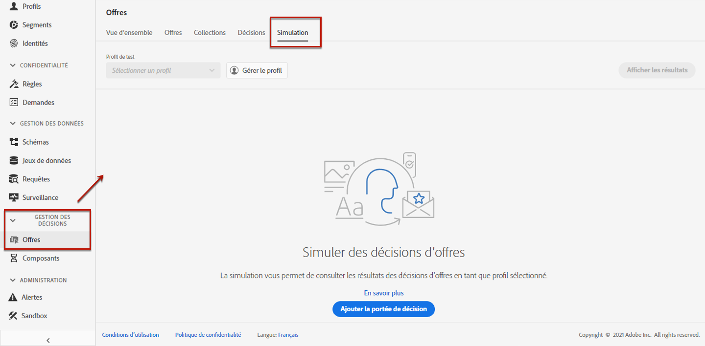

<!--
➡️ [Discover this feature in video](#video)
-->

## Sélectionner des profils de test

Vous devez d&#39;abord sélectionner les profils de test que vous allez utiliser pour la simulation.

1. Cliquez sur **[!UICONTROL Gérer le profil]**.

   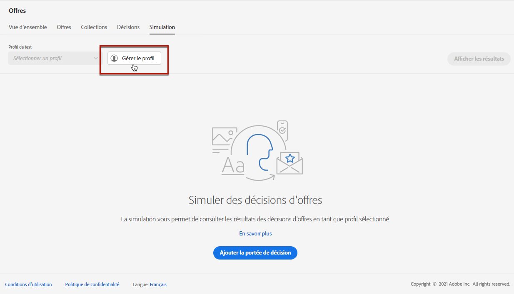

1. Sélectionnez l’espace de noms d’identité à utiliser pour identifier les profils de test. Dans cet exemple, nous utiliserons l&#39;espace de noms **E-mail**.

   >[!NOTE]
   >
   >Un espace de noms d’identité définit le contexte d’un identifiant, tel qu’une adresse électronique ou un identifiant CRM. Apprenez-en davantage sur les espaces de noms d&#39;identité d&#39;Adobe Experience Platform [dans cette section](../../get-started-identity.md){target=&quot;_blank&quot;}.

1. Saisissez la valeur d’identité et cliquez sur **[!UICONTROL Affichage]** pour répertorier les profils disponibles.

   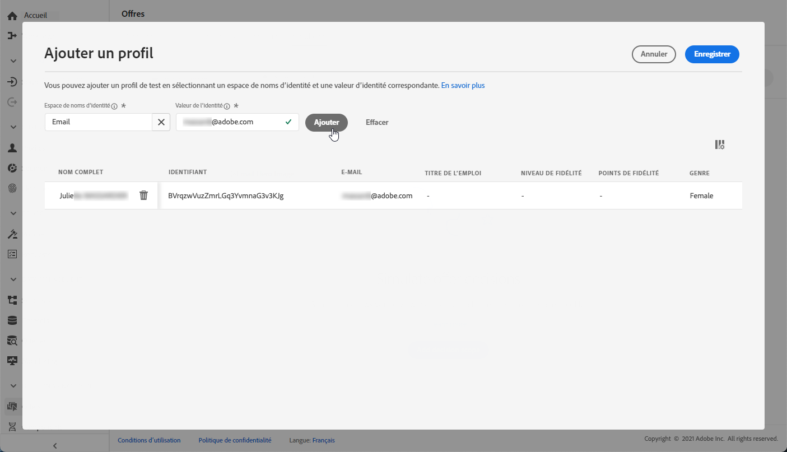

1. Ajoutez d’autres profils si vous souhaitez tester différentes données de profil et enregistrez votre sélection.

   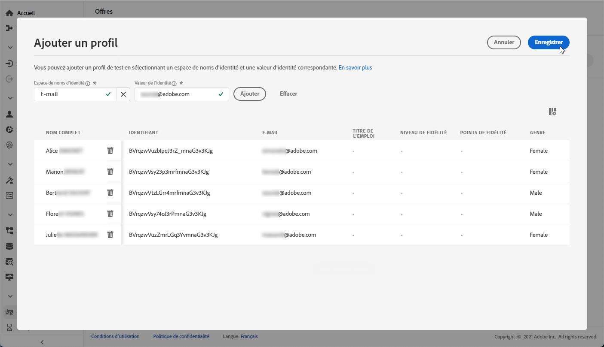

1. Une fois ajoutés, tous les profils sont répertoriés dans la liste déroulante sous **[!UICONTROL Profil de test]**. Vous pouvez basculer entre les profils de test enregistrés pour afficher les résultats pour chaque profil sélectionné.

   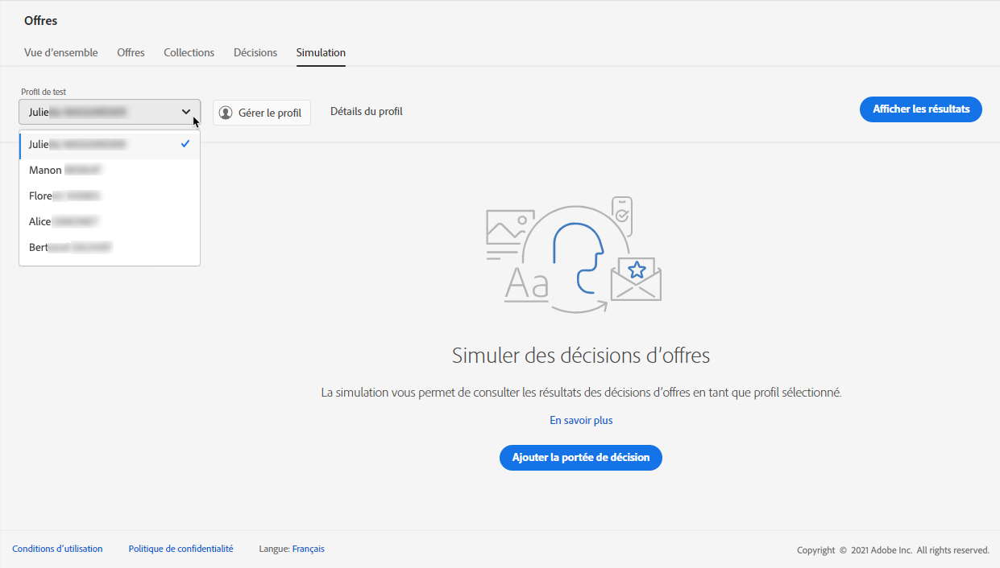

1. Vous pouvez cliquer sur le bouton **[!UICONTROL Détails du profil]** lien pour afficher les données de profil sélectionnées.

<!--Learn more on [selecting test profiles](preview.md#select-test-profiles)-->

## Ajout des portées de décision

Sélectionnez maintenant les décisions d’offre que vous souhaitez simuler sur vos profils de test.

1. Sélectionner **[!UICONTROL Ajouter une portée de décision]**.

   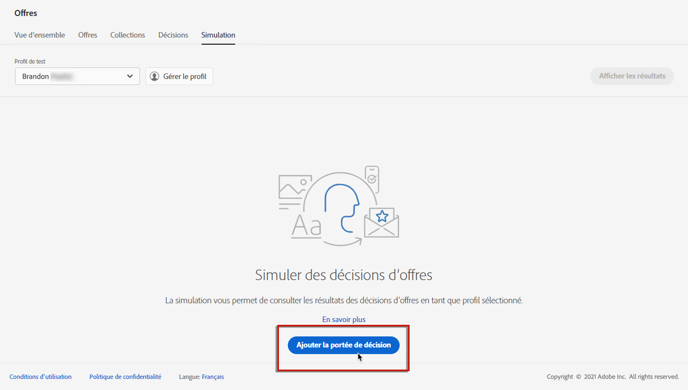

1. Sélectionnez un emplacement dans la liste.

   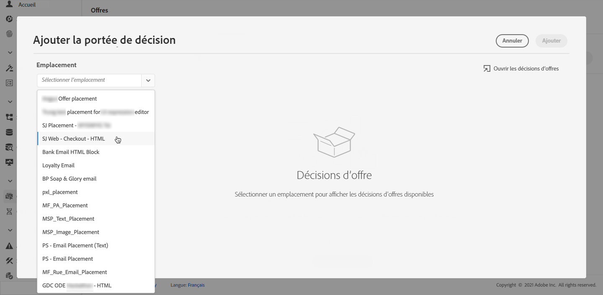

1. Les décisions disponibles s’affichent.

   * Vous pouvez utiliser le champ de recherche pour affiner la sélection.
   * Vous pouvez cliquer sur le bouton **[!UICONTROL Ouvrir les décisions d’offre]** pour ouvrir la liste de toutes les décisions que vous avez créées. En savoir plus sur [décisions](create-offer-activities.md).

   Sélectionnez la décision de votre choix et cliquez sur **[!UICONTROL Ajouter]**.

   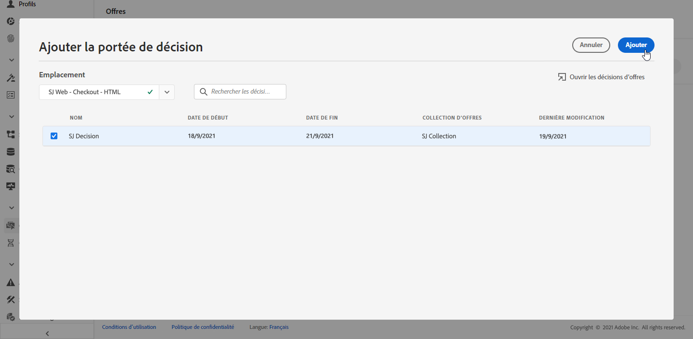

1. La portée de décision que vous venez de définir s’affiche dans l’espace de travail principal.

   Vous pouvez ajuster le nombre d’offres que vous souhaitez demander. Par exemple, si vous sélectionnez 2, les 2 meilleures offres s’afficheront pour cette portée de décision.

   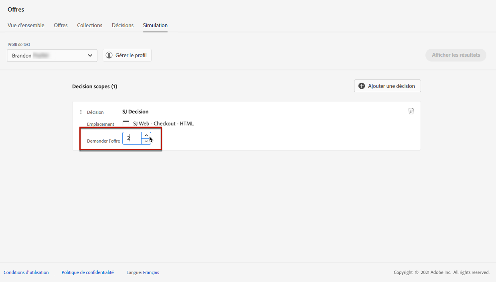

   >[!NOTE]
   >
   >Vous pouvez demander jusqu’à 30 offres.

1. Répétez les étapes ci-dessus pour ajouter autant de décisions que nécessaire.

   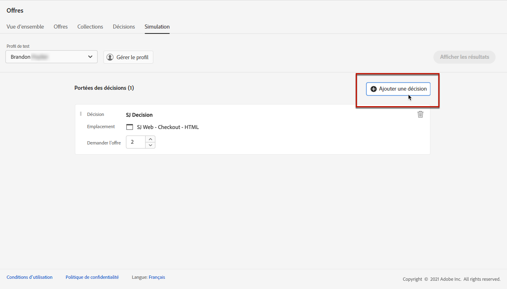

   >[!NOTE]
   >
   >Même si vous définissez plusieurs portées de décision, une seule requête API est simulée.
   >
   >Tous les indicateurs de déduplication sont activés par défaut pour la simulation, ce qui signifie que le moteur de décision autorise les doublons et peut donc faire la même proposition dans plusieurs décisions. En savoir plus sur la [!DNL Decisions] Propriétés de requête d’API dans [cette section](../api-reference/decisions-api/deliver-offers.md).

## Affichage des résultats de la simulation

Une fois que vous avez ajouté une portée de décision et sélectionné un profil de test, vous pouvez afficher les résultats.

1. Cliquez sur **[!UICONTROL Affichage des résultats]**.

   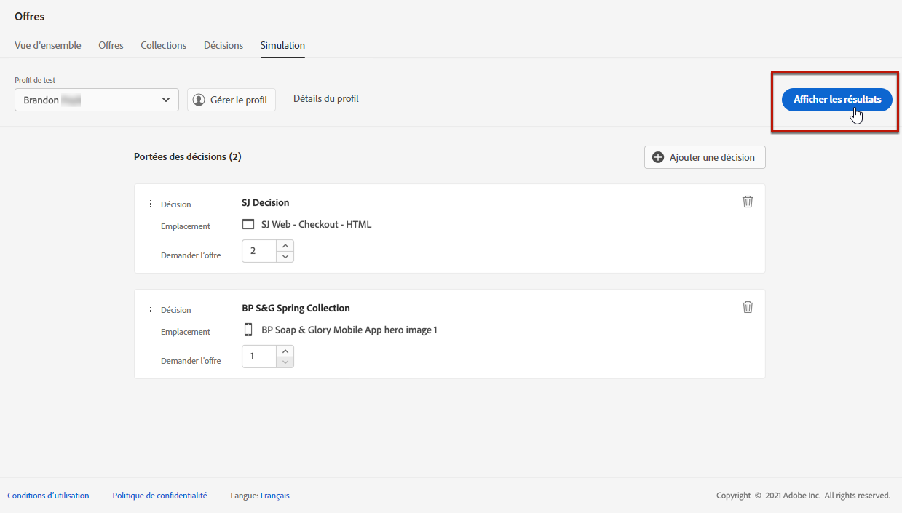

1. Les meilleures offres disponibles s’affichent en fonction du profil sélectionné pour chaque décision.

   Sélectionnez une offre pour afficher ses détails.

   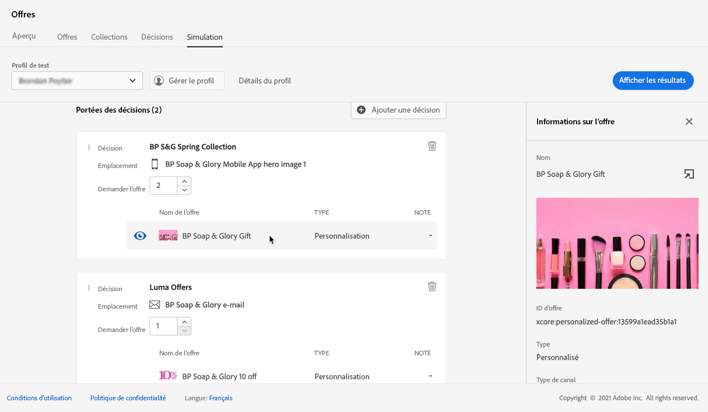

1. Sélectionnez un autre profil dans la liste pour afficher les résultats des décisions d’offre pour un autre profil de test.

1. Vous pouvez ajouter, supprimer ou mettre à jour les portées de décision autant de fois que nécessaire.

>[!NOTE]
>
>Chaque fois que vous modifiez des profils ou mettez à jour des portées de décision, vous devez actualiser les résultats à l’aide de la variable **[!UICONTROL Affichage des résultats]** bouton .

<!--Questions

* Is it recommended to first select profiles or first add decision scopes?
* What does Request offer changes?
* Nothing displays when I click View results? Can't see any score...
* What's the typical example? i.e. how many decisions do you select, and how do you compare scores?
* What do you learn from simulation? i.e. if I selected 2 decisions and I compare the scores, which one is better or should I use for my customers?
* Is there a way to create relevant test profiles?
* Error on Profile details link.
* Is there a tutorial planned to be released?
* Why still a big red frame when no profile is found?

## Tutorial video {#video}

>[!NOTE]
>
>This video applies to the Offer Decisioning application service built on Adobe Experience Platform. However, it provides generic guidance to use Offer in the context of Journey Optimizer.

>[!VIDEO](https://video.tv.adobe.com/v/329606?quality=12)
-->