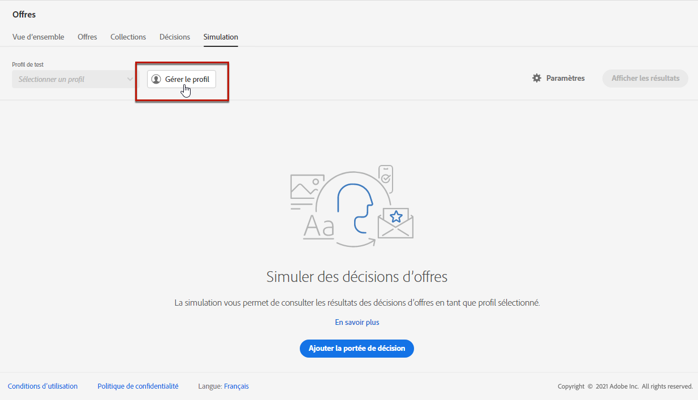

# Création de simulations {#create-simulations}

>[!TIP]
>
>La prise de décision, la nouvelle fonctionnalité de prise de décision d’[!DNL Adobe Journey Optimizer], est désormais disponible via les canaux d’expérience basée sur du code et d’e-mail. [En savoir plus](../../experience-decisioning/gs-experience-decisioning.md)

>[!CONTEXTUALHELP]
>id="ajo_decisioning_simulation"
>title="Simulation de décisions d’offre"
>abstract="La simulation vous permet de simuler les offres qui seront diffusées à un profil de test pour un emplacement donné. Vous pouvez ainsi tester et affiner différentes versions de vos offres sans aucun impact sur les destinataires ciblés."

## À propos de la simulation {#about-simulation}

Pour valider votre logique de prise de décision, vous pouvez simuler les offres qui seront diffusées à un profil de test pour un emplacement donné. 

<!--Simulation allows you to view the results of offer decisions as a selected profile.-->

Vous pouvez ainsi tester et affiner différentes versions de vos offres sans aucun impact sur les destinataires ciblés. 

>[!NOTE]
>
>Cette fonctionnalité simule une demande unique à l’API [!DNL Decisioning]. Pour en savoir plus, consultez la section [Diffuser des offres à l’aide de l’API Decisioning](../api-reference/offer-delivery-api/decisioning-api.md).

Pour accéder à cette fonctionnalité, sélectionnez l’onglet **[!UICONTROL Simulation]** dans le menu **[!UICONTROL Gestion des décisions]**/**[!UICONTROL Offres]**. 

>[!NOTE]
>
>Comme la simulation ne génère aucun événement de décision, le comptage [limitation](../offer-library/add-constraints.md#capping) n’est pas affecté.

<!--
➡️ [Discover this feature in video](#video)
-->

## Sélectionner des profils de test {#select-test-profiles}

>[!CONTEXTUALHELP]
>id="ajo_decisioning_simulation_test_profile"
>title="Ajout de profils de test"
>abstract="Vous pouvez ajouter un profil de test en sélectionnant un espace de noms d’identité et une valeur d’identité correspondante. Vous devez disposer de profils de test déjà disponibles pour pouvoir les utiliser en simulation."

Vous devez d’abord sélectionner les profils de test que vous allez utiliser pour la simulation. 

>[!CAUTION]
>
>Vous devez disposer de profils de test pour simuler les offres qui leur seront diffusées. Découvrez comment [créer des profils de test](../../audience/creating-test-profiles.md).

1. Cliquez sur **[!UICONTROL Gérer le profil]**.

   

1. Sélectionnez l’espace de noms d’identité à utiliser pour identifier les profils de test. Dans cet exemple, nous utiliserons l’espace de noms **E-mail**. 

   >[!NOTE]
   >
   >Un espace de noms d’identité définit le contexte d’un identifiant, tel qu’une adresse e-mail ou un identifiant CRM. Apprenez-en davantage sur les espaces de noms d’identité d’Adobe Experience Platform [dans cette section](../../audience/get-started-identity.md){target="_blank"}.

1. Saisissez la valeur d’identité et cliquez sur **[!UICONTROL Affichage]** pour répertorier les profils disponibles. 

   

1. Ajoutez d’autres profils si vous souhaitez tester différentes données de profil et enregistrez votre sélection. 

   

1. Une fois ajoutés, tous les profils sont répertoriés dans la liste déroulante sous **[!UICONTROL Profil de test]**. Vous pouvez basculer entre les profils de test enregistrés pour afficher les résultats de chaque profil sélectionné. 

   

   >[!NOTE]
   >
   >Les profils sélectionnés restent répertoriés en tant que profils de test dans l’onglet **[!UICONTROL Simulation]** d’une session à l’autre jusqu’à ce qu’ils soient supprimés à l’aide de **[!UICONTROL Gérer le profil]**.

1. Vous pouvez cliquer sur le lien **[!UICONTROL Détails du profil]** pour afficher les données de profil sélectionnées. 

## Ajout de portée de décision {#add-decision-scopes}

Sélectionnez maintenant les décisions d’offre que vous souhaitez simuler sur vos profils de test. 

1. Sélectionnez **[!UICONTROL Ajouter une portée de décision]**.

   

1. Sélectionnez un emplacement dans la liste. 

   

1. Les décisions disponibles s’affichent. 

   * Vous pouvez utiliser le champ de recherche pour affiner la sélection. 
   * Vous pouvez cliquer sur le lien **[!UICONTROL Ouvrir les décisions d’offre]** pour ouvrir la liste de toutes les décisions que vous avez créées. En savoir plus sur les [décisions](create-offer-activities.md).

   Sélectionnez la décision de votre choix et cliquez sur **[!UICONTROL Ajouter]**.

   

1. La portée de décision que vous venez de définir s’affiche dans l’espace de travail principal. 

   Vous pouvez ajuster le nombre d’offres que vous souhaitez demander. Par exemple, si vous sélectionnez 2, les 2 meilleures offres s’afficheront pour cette portée de décision. 

   

   >[!NOTE]
   >
   >Vous pouvez demander jusqu’à 30 offres. 

1. Répétez les étapes ci-dessus pour ajouter autant de décisions que nécessaire. 

   

   >[!NOTE]
   >
   >Même si vous définissez plusieurs portées de décision, une seule demande d’API est simulée.

## Définition des paramètres de simulation {#define-simulation-settings}

Pour modifier les paramètres par défaut de vos simulations, procédez comme suit.

1. Cliquez sur **[!UICONTROL Paramètres]**.

   

1. Dans la section **[!UICONTROL Déduplication]**, vous pouvez choisir d’autoriser les offres en double à travers les décisions et/ou les emplacements. Cela signifie que plusieurs décisions/emplacements peuvent se voir attribuer la même offre.

   

   >[!NOTE]
   >
   >Tous les indicateurs de déduplication sont activés par défaut pour la simulation, ce qui signifie que le moteur de décision autorise les doublons et peut donc faire la même proposition dans plusieurs décisions/placements. En savoir plus sur les propriétés des requêtes de l’API [!DNL Decisioning] dans [cette section](../api-reference/offer-delivery-api/decisioning-api.md).

1. Dans la section **[!UICONTROL Format de la réponse]**, vous pouvez choisir d’inclure les métadonnées dans l’affichage du code. Cochez l’option correspondante, puis sélectionnez les métadonnées de votre choix. Elles s’affichent dans les payloads de la requête et de la réponse lors de la sélection de **[!UICONTROL Afficher le code]**. En savoir plus dans la section [Affichage des résultats de la simulation](#simulation-results).

   

   >[!NOTE]
   >
   >Lorsque l’option est activée, tous les éléments sont sélectionnés par défaut.

1. Cliquez sur **[!UICONTROL Enregistrer]**.

>[!NOTE]
>
>Actuellement, pour les données de simulation, vous pouvez uniquement utiliser l’API **[!UICONTROL Hub]**.

<!--
In the **[!UICONTROL API for simulation]** section, select the API you want to use: **[!UICONTROL Hub]** or **[!UICONTROL Edge]**.
Hub and Edge are two different end points for simulation data.

In the **[!UICONTROL Context data]** section, you can add as many elements as needed.

    >[!NOTE]
    >
    >This section is hidden if you select Edge API in the section above. Hub allows the use of Context data, Edge does not.

Context data allows the user to add contextual data that could affect the simulation score.
For instance, let's say the customer has an offer for a discount on ice cream. In the rules for that offer, it can have logic that would rank it higher when the temperature is above 80 degrees. In simulation, the user could add context data: temperature=65 and that offer would rank lower, of they could add temperature=95 and that would rank higher.
-->

## Afficher les résultats de la simulation {#simulation-results}

Une fois que vous avez ajouté une portée de décision et sélectionné un profil de test, vous pouvez afficher les résultats. 

1. Cliquez sur **[!UICONTROL Afficher les résultats]**.

   

1. La ou les meilleures offres disponibles sont affichées en fonction du profil sélectionné pour chaque décision. 

   Sélectionnez une offre pour afficher ses détails. 

   

1. Cliquez sur **[!UICONTROL Afficher le code]** pour afficher les payloads de la requête et de la réponse. [En savoir plus](#view-code)

1. Sélectionnez un autre profil dans la liste pour afficher les résultats des décisions d’offre pour un autre profil de test. 

1. Vous pouvez ajouter, supprimer ou mettre à jour les portées de décision autant de fois que nécessaire. 

>[!NOTE]
>
>Chaque fois que vous modifiez des profils ou mettez à jour des portées de décision, vous devez actualiser les résultats à l’aide du bouton **[!UICONTROL Afficher les résultats]**. 

## Afficher le code {#view-code}

1. Utilisez le bouton **[!UICONTROL Afficher le code]** pour afficher les payloads de la requête et de la réponse.

   

   L’affichage du code montre les informations sur le développeur à l’utilisateur actuel. Par défaut, la **[!UICONTROL Payload de réponse]** s’affiche.

   

1. Cliquez sur **[!UICONTROL Payload de réponse]** ou **[!UICONTROL Payload de requête]** pour naviguer entre les deux onglets.

   

1. Pour utiliser la payload de la requête en dehors de [!DNL Journey Optimizer], à des fins de dépannage par exemple, copiez-la à l’aide du bouton **[!UICONTROL Copier dans le presse-papiers]** au-dessus de l’affichage du code.

   

   <!--You cannot copy the response payload. ACTUALLY YES YOU CAN > to confirm with PM/dev? -->

   >[!NOTE]
   >
   >Lors de la copie des payloads de la requête ou de la réponse dans votre propre code, veillez à remplacer {USER_TOKEN} et {API_KEY} par des données valides. Découvrez comment récupérer ces valeurs dans la documentation sur les [API Adobe Experience Platform](https://experienceleague.adobe.com/docs/experience-platform/landing/platform-apis/api-authentication.html?lang=fr){target="_blank"}.

