# Ajouter des contraintes à une offre {#add-constraints}

>[!TIP]
>
>La prise de décision, la nouvelle fonctionnalité de prise de décision d’[!DNL Adobe Journey Optimizer], est désormais disponible via les canaux d’expérience basée sur du code et d’e-mail. [En savoir plus](../../experience-decisioning/gs-experience-decisioning.md)

>[!CONTEXTUALHELP]
>id="od_offer_constraints"
>title="À propos des contraintes d&#39;offre"
>abstract="Les contraintes vous permettent de spécifier le type de priorisation de l&#39;offre et la manière dont elle est présentée à l&#39;utilisateur en comparaison avec d&#39;autres offres."

>[!CONTEXTUALHELP]
>id="ajo_decisioning_constraints"
>title="À propos des contraintes d&#39;offre"
>abstract="Les contraintes vous permettent de spécifier le type de priorisation de l&#39;offre et la manière dont elle est présentée à l&#39;utilisateur en comparaison avec d&#39;autres offres."

>[!CONTEXTUALHELP]
>id="od_offer_priority"
>title="À propos de la priorité de l&#39;offre"
>abstract="Dans ce champ, vous pouvez spécifier les paramètres de priorité de l&#39;offre. La priorité est un nombre utilisé pour classer les offres répondant à toutes les contraintes comme l&#39;éligibilité, les dates et la limitation."

>[!CONTEXTUALHELP]
>id="ajo_decisioning_priority"
>title="Définir la priorité"
>abstract="La priorité permet de définir la priorité de l’offre par rapport à d’autres si l’utilisateur est éligible à plusieurs offres. Plus la priorité d’une offre est élevée, plus elle sera comparée à celle d’autres offres."

Les contraintes vous permettent de définir les conditions d’affichage d’une offre.

1. Configurez l’**[!UICONTROL admissibilité des offres]**. [En savoir plus](#eligibility)

   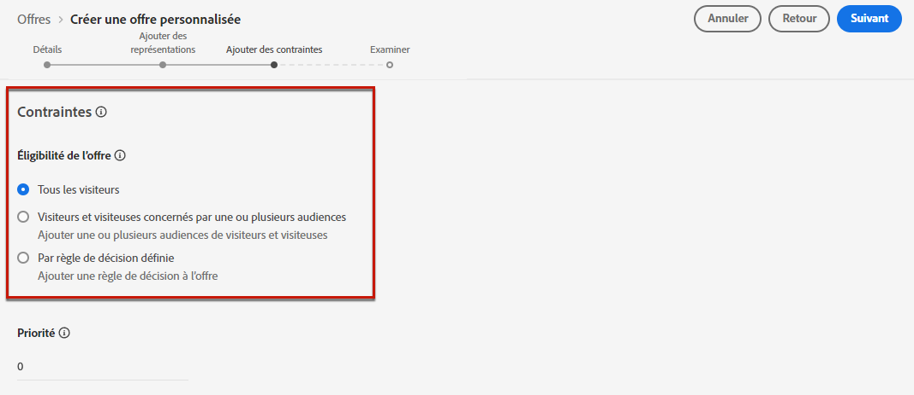

1. Définissez la **[!UICONTROL Priorité]** de l&#39;offre par rapport à d&#39;autres si l&#39;utilisateur est éligible à plusieurs offres. Plus la priorité d&#39;une offre est élevée, plus elle sera comparée à celle d&#39;autres offres.

   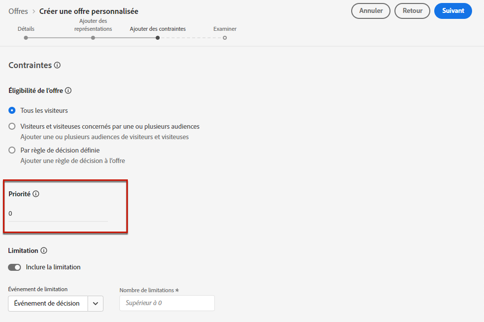

   >[!NOTE]
   >
   >La priorité de l’offre doit être une valeur entière (pas de décimales).

1. Spécifiez la **[!UICONTROL Limitation]** de l’offre, soit le nombre total de fois où l’offre sera présentée. [En savoir plus](#capping)

   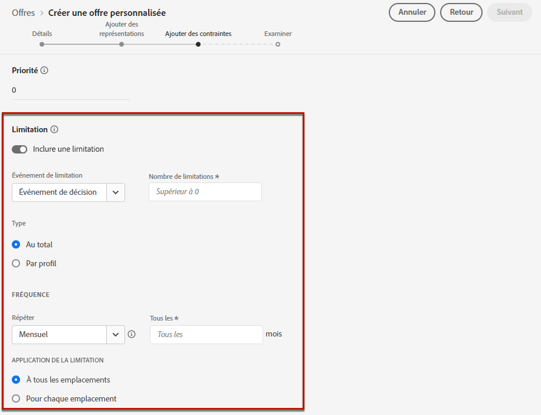

1. Cliquez sur **[!UICONTROL Suivant]** pour confirmer toutes les contraintes que vous avez définies.

Par exemple, si vous définissez les contraintes suivantes :

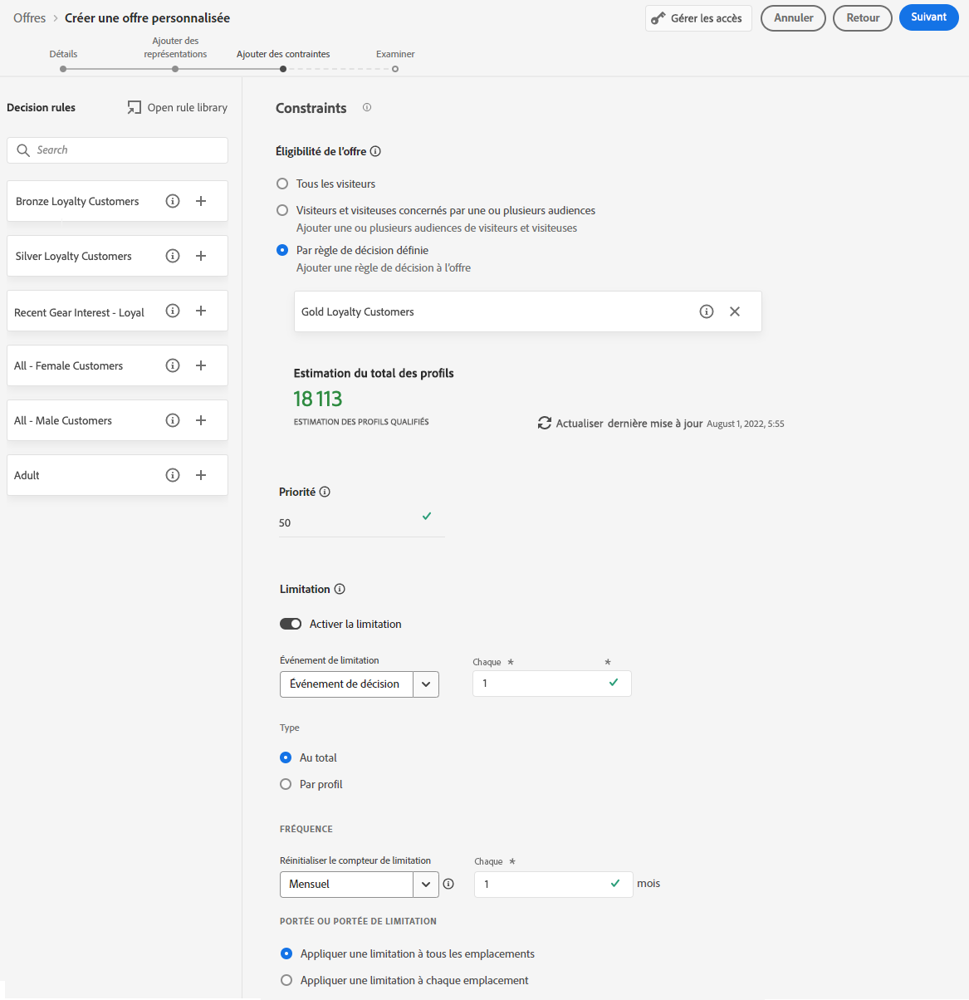

* L’offre sera prise en compte uniquement pour les personnes qui correspondent à la règle de décision « Clients fidèles Gold ».
* La priorité de l’offre est définie sur « 50 », ce qui signifie que l’offre sera présentée avant les offres dont la priorité est comprise entre 1 et 49, et après celles dont la priorité est d’au moins 51.
* L’offre ne sera présentée qu’une seule fois par mois, pour chaque personne et à tous les emplacements.

## Admissibilité {#eligibility}

>[!CONTEXTUALHELP]
>id="ajo_decisioning_eligibility"
>title="Définir l’éligibilité"
>abstract="Par défaut, tout profil peut se voir présenter l’offre, mais vous pouvez utiliser des audiences ou des règles de décision pour restreindre l’offre à des profils spécifiques."

>[!CONTEXTUALHELP]
>id="od_offer_eligibility"
>title="À propos de l&#39;éligibilité de l&#39;offre"
>abstract="Dans cette section, vous pouvez utiliser des règles de décision pour déterminer quels utilisateurs sont éligibles à l&#39;offre."

<!--additional-url="https://video.tv.adobe.com/v/329373" text="Watch demo video"-->

>[!CONTEXTUALHELP]
>id="ajo_decisioning_total_profile_estimate"
>title="Estimation du total des profils"
>abstract="Lorsque vous sélectionnez des audiences ou des règles de décision, vous pouvez afficher des informations sur les profils qualifiés estimés."

La section **[!UICONTROL Éligibilité à l’offre]** vous permet de restreindre l’offre à des profils spécifiques que vous définissez à l’aide d’audiences ou de règles de décision.

>[!NOTE]
>
>Pour en savoir plus sur l’utilisation des **audiences** par rapport aux **règles de décision**, consultez [cette section](#segments-vs-decision-rules).

* Par défaut, l’option **[!UICONTROL Tous les visiteurs]** est sélectionnée, ce qui signifie que tout profil peut se voir présenter l’offre.

  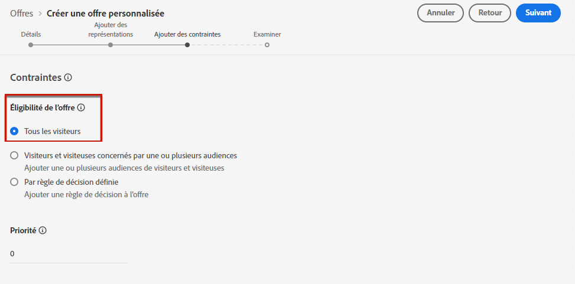

* Vous pouvez également limiter la présentation de l’offre aux personnes membres d’une ou plusieurs [audiences Adobe Experience Platform](../../audience/about-audiences.md).

  Pour cela, activez l’option **[!UICONTROL Visiteurs appartenant à une ou plusieurs audiences]**, puis ajoutez une ou plusieurs audiences dans le volet de gauche et combinez-les à l’aide des opérateurs logiques **[!UICONTROL Et]** / **[!UICONTROL Ou]**.

  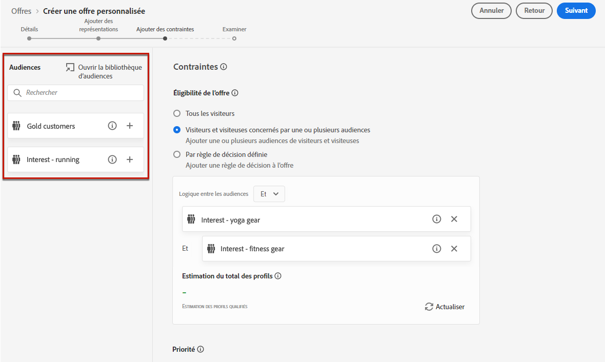

* Si vous souhaitez associer une [règle de décision](../offer-library/creating-decision-rules.md) spécifique à l’offre, sélectionnez **[!UICONTROL Par une règle de décision définie]**, puis faites glisser la règle de votre choix depuis le volet de gauche vers la zone **[!UICONTROL Règle de décision]**.

  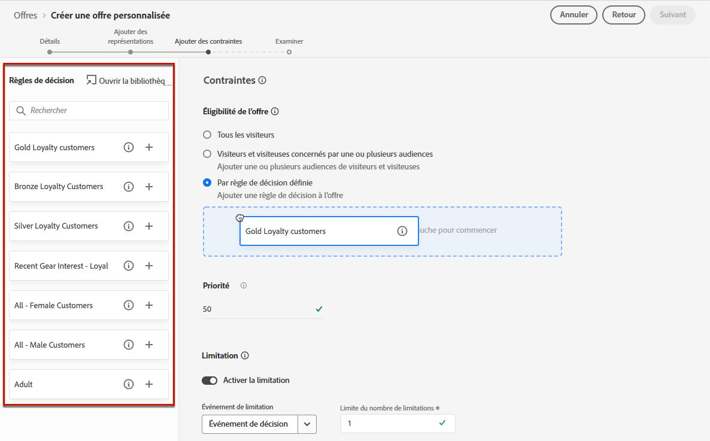

  >[!CAUTION]
  >
  >Les offres basées sur un événement ne sont actuellement pas prises en charge dans [!DNL Journey Optimizer]. Si vous créez une règle de décision basée sur un [événement](https://experienceleague.adobe.com/docs/experience-platform/segmentation/ui/segment-builder.html?lang=fr#events){target="_blank"}, vous ne pourrez pas l’exploiter dans une offre.

Lorsque vous sélectionnez des audiences ou des règles de décision, vous pouvez afficher des informations sur les profils qualifiés estimés. Cliquez sur **[!UICONTROL Actualiser]** pour mettre à jour les données.

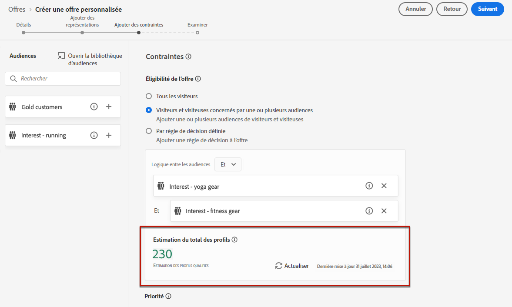

>[!NOTE]
>
>Les estimations de profil ne sont pas disponibles lorsque les paramètres de règle incluent des données qui ne figurent pas dans le profil, telles que des données contextuelles. Par exemple, une règle d’éligibilité qui exige que la météo actuelle soit de ≥80 degrés.

### Utiliser les audiences ou les règles de décision {#segments-vs-decision-rules}

Pour appliquer une contrainte, vous pouvez restreindre la sélection des offres aux personnes membres d’une ou plusieurs **audiences Adobe Experience Platform**. Vous pouvez également utiliser une **règle de décision**, les deux solutions correspondant à des utilisations différentes.

Pour faire simple, la sortie d’une audience est une liste de profils, tandis qu’une règle de décision est une fonction exécutée à la demande sur un seul profil pendant le processus de prise de décision. La différence entre ces deux usages est présentée ci-dessous.

* **Audiences**

  D’un côté, les audiences sont un groupe de profils Adobe Experience Platform qui correspondent à une certaine logique basée sur les attributs de profil et les événements d’expérience. Cependant, la gestion des offres ne recalcule pas l’audience, qui peut ne pas être à jour lors de la présentation de l’offre.

  En savoir plus sur les audiences dans [cette section](../../audience/about-audiences.md).

* **Règles de décision**

  D’un autre côté, une règle de décision est basée sur les données disponibles dans Adobe Experience Platform et détermine à qui une offre peut être montrée. Une fois sélectionnée dans une offre ou une décision pour un emplacement donné, la règle est exécutée chaque fois qu’une décision est prise, ce qui garantit que chaque profil obtient la dernière et la meilleure offre.

  En savoir plus sur les règles de décision dans [cette section](creating-decision-rules.md).

## Limitation {#capping}

>[!CONTEXTUALHELP]
>id="od_offer_globalcap"
>title="À propos de la limitation de l&#39;offre"
>abstract="Dans ce champ, vous pouvez spécifier le nombre de fois où l’offre peut être présentée."

>[!CONTEXTUALHELP]
>id="ajo_decisioning_capping"
>title="Utilisation de la limitation"
>abstract="Pour éviter de trop solliciter votre clientèle, utilisez la limitation pour définir le nombre maximal de fois où une offre peut être présentée. Vous pouvez créer jusqu’à 10 règles de limitation pour une offre donnée."
>additional-url="https://experienceleague.adobe.com/fr/docs/journey-optimizer/using/decisioning/offer-decisioning/managing-offers-in-the-offer-library/configure-offers/add-constraints#capping" text="La modification des dates peut avoir un impact sur la limitation."

La limitation est utilisée comme contrainte pour définir le nombre maximal de fois où une offre peut être présentée. Limiter le nombre de fois où les personnes reçoivent des offres spécifiques vous permet d’éviter de sur-solliciter votre clientèle et donc d’optimiser chaque point de contact avec la meilleure offre.

Vous pouvez ajouter jusqu’à 10 règles de limitation pour une offre donnée. Pour définir une règle de limitation, cliquez sur le bouton **[!UICONTROL Créer une limitation]** puis procédez comme suit.

1. Définissez l’**[!UICONTROL Événement de limitation]** à prendre en compte pour augmenter le compteur. [En savoir plus](#capping-event).

1. Choisissez si vous souhaitez appliquer la limitation à tous les utilisateurs et utilisatrices ou à un seul profil spécifique. [En savoir plus](#capping-type).

1. Définissez le nombre de fois où l’offre peut être présentée. [En savoir plus](#capping-count).

1. Définissez la **[!UICONTROL Fréquence]** pour définir la fréquence à laquelle le nombre de limitations est réinitialisé. [En savoir plus](#frequency-capping).

1. Si vous avez défini plusieurs [représentations](add-representations.md) pour votre offre, indiquez si vous souhaitez appliquer une limitation **à tous les emplacements** ou **pour chaque emplacement**. [En savoir plus](#placements).

1. Une fois enregistrée et validée, si l’offre a été présentée le nombre de fois que vous avez spécifiées dans ce champ en fonction des critères et du délai que vous avez définis, sa diffusion s’arrêtera.

Le nombre de fois où une offre est proposée est calculé au moment de la préparation de l&#39;e-mail. Par exemple, si vous préparez un e-mail contenant un certain nombre d&#39;offres, ces chiffres sont pris en compte dans votre limitation maximale, et ce que l&#39;e-mail soit envoyé ou non.

<!--If an email delivery is deleted or if the preparation is done again before being sent, the capping value for the offer is automatically updated.-->

>[!NOTE]
>
>Les compteurs de limitation seront réinitialisés à l’expiration de l’offre ou 2 ans après la date de début de l’offre, le premier événement prévalant. Découvrez comment définir la date d’une offre dans [cette section](creating-personalized-offers.md#create-offer).

### Événement de limitation {#capping-event}

>[!CONTEXTUALHELP]
>id="ajo_decisioning_frequency_capping_impression"
>title="Impression"
>abstract="L’utilisation des impressions comme événements de limitation n’est disponible que pour les canaux entrants."

Le champ **[!UICONTROL Choisir l’événement de limitation]** vous permet de définir l’événement à prendre en compte pour augmenter la valeur du compteur :

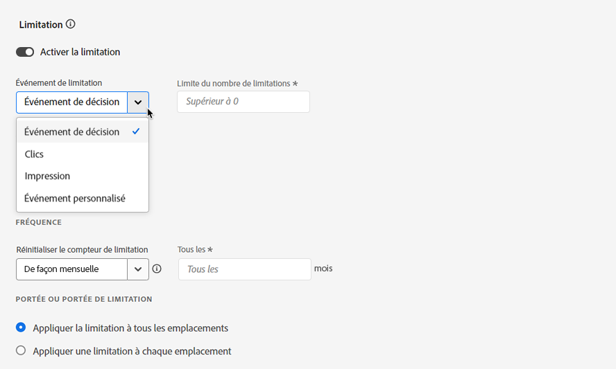

* **[!UICONTROL Événement de décision]** (valeur par défaut) : nombre maximal de fois où une offre peut être présentée.
* **[!UICONTROL Clics]** : nombre maximal de fois où l’utilisateur ou l’utilisatrice peut cliquer sur une offre.
* **[!UICONTROL Impression]** : nombre maximal de fois où l’offre peut être présentée à un utilisateur ou une utilisatrice.

  >[!NOTE]
  >
  >L’utilisation des impressions comme événements de limitation est réservée aux **canaux entrants**.

* **[!UICONTROL Événement personnalisé]** : vous pouvez définir un événement personnalisé afin de limiter le nombre d’offres envoyées. Par exemple, vous pouvez limiter la validité d’un bon à 10 000 utilisations ou jusqu’à ce qu’un profil donné l’ait utilisé 1 fois. Pour ce faire, utilisez les schémas [XDM d’Adobe Experience Platform](https://experienceleague.adobe.com/fr/docs/experience-platform/xdm/home){target="_blank"} pour créer une règle d’événement personnalisé.

  <!--For example, you can cap on the number of redemptions so that the offer can be shown until redemptions equal 10,000. You can only select XDM ExperienceEvents. -->

  Dans l’exemple ci-dessous, vous souhaitez limiter le nombre de passages en caisse.

   1. Sélectionnez **[!UICONTROL Événement personnalisé]** dans la liste, puis cliquez sur le bouton **[!UICONTROL Ajouter un événement personnalisé]**.

   1. Utilisez le créateur **[!UICONTROL Créer des règles d’événement personnalisées]** pour sélectionner l’événement approprié. Vous pouvez choisir l’action de l’utilisateur ou de l’utilisatrice en fonction de laquelle vous souhaitez limiter les offres.

      Dans cet exemple, sélectionnez **[!UICONTROL Commerce]** > **[!UICONTROL Passages en caisse]** > **[!UICONTROL Valeur]** et choisissez **[!UICONTROL existe]** dans la liste déroulante.

      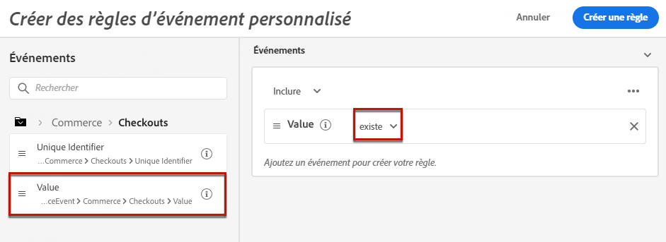

   1. Une fois créée, la règle s’affiche dans le champ **[!UICONTROL Requête d’événement personnalisé]**.

      

>[!CAUTION]
>
>Pour tous les événements de limitation, à l’exception des événements de décision, les commentaires sur la gestion des décisions peuvent ne pas être collectés automatiquement, ce qui peut entraîner une incrémentation incorrecte du compteur de limitation. [En savoir plus](../data-collection/data-collection.md).
>
>Pour vous assurer que chaque événement de limitation est suivi et comptabilisé dans le compteur de limitation, vérifiez que le schéma utilisé pour collecter les événements d’expérience inclut le groupe de champs approprié pour cet événement. [En savoir plus](../data-collection/schema-requirement.md)

### Type de limitation {#capping-type}

Vous pouvez indiquer si vous souhaitez que la limitation soit appliquée à tous les utilisateurs et utilisatrices ou à un seul profil spécifique :

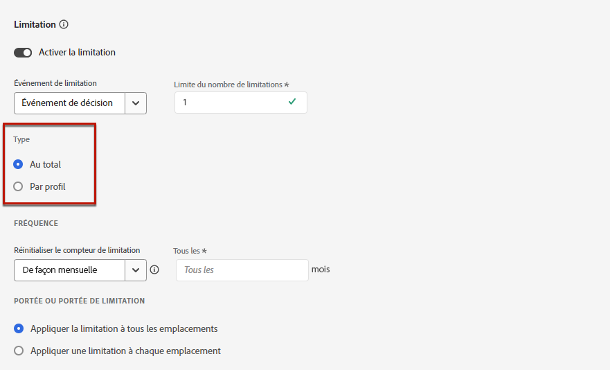

* Sélectionnez **[!UICONTROL Au total]** pour définir le nombre de fois où une offre peut être proposée dans l’audience cible combinée, ce qui signifie pour tous les utilisateurs.

  Par exemple, si vous êtes un détaillant d’électronique qui a conclu un « contrat télévisuel d’offre d’ouverture » vous souhaitez que l’offre ne soit renvoyée que 200 fois sur tous les profils.

* Sélectionnez **[!UICONTROL Par profil]** pour définir le nombre de fois où une offre peut être proposée au même utilisateur.

  Par exemple, si vous êtes une banque avec une offre « Carte de crédit Platinum », vous ne souhaitez pas que cette offre soit présentée plus de 5 fois par profil. En effet, vous pensez que si l’utilisateur ou l’utilisatrice a vu l’offre 5 fois sans réagir à celle-ci, il ou elle sera plus susceptible de passer à l’action lors de la meilleure offre suivante.

### Nombre de limitations {#capping-count}

Le champ **[!UICONTROL Nombre de limitations]** vous permet d’indiquer le nombre de fois où l’offre peut être présentée.

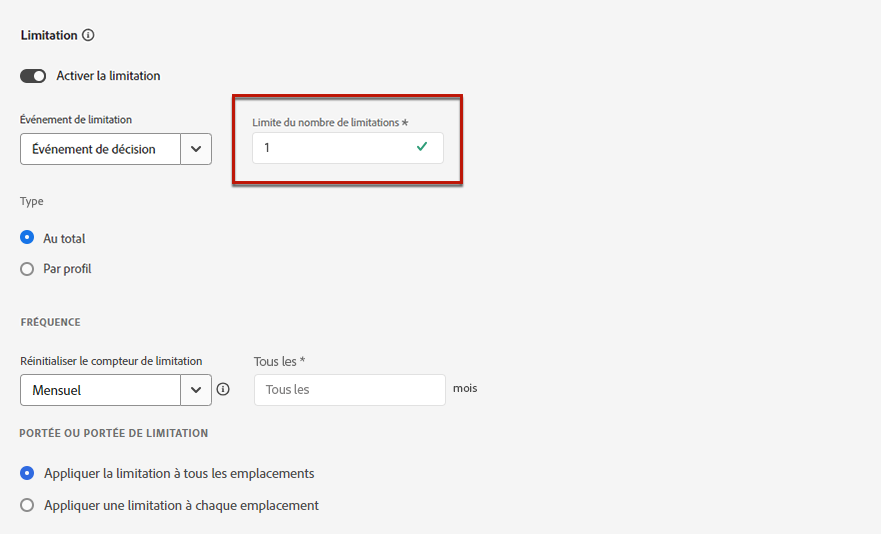

>[!NOTE]
>
>Le nombre doit être un entier supérieur à 0.

Par exemple, vous avez défini un événement de limitation personnalisé comme le nombre de passages en caisse pris en compte. Si vous saisissez « 10 » dans le champ **[!UICONTROL Limiter le nombre de limitations]**, aucune autre offre ne sera envoyée après 10 passages en caisse.

### Capping de la fréquence {#frequency-capping}

>[!CONTEXTUALHELP]
>id="ajo_decisioning_frequency_capping"
>title="Définir la fréquence de limitation"
>abstract="Vous pouvez choisir de réinitialiser le compteur de limitation des offres tous les jours, toutes les semaines ou tous les mois. Notez qu’après la publication de l’offre avec le capping de la fréquence activé, vous ne pourrez pas modifier la fréquence définie."

Le champ **[!UICONTROL Réinitialiser la fréquence de limitation]** vous permet de définir la fréquence à laquelle le nombre de limitations est réinitialisé. Pour ce faire, définissez la période du comptage (quotidienne, hebdomadaire ou mensuelle) et saisissez le nombre de jours, semaines ou mois de votre choix. Par exemple, si vous souhaitez que le nombre de limitations soit réinitialisé toutes les 2 semaines, sélectionnez **[!UICONTROL Hebdomadaire]** dans la liste déroulante correspondante et saisissez **2** dans l’autre champ.

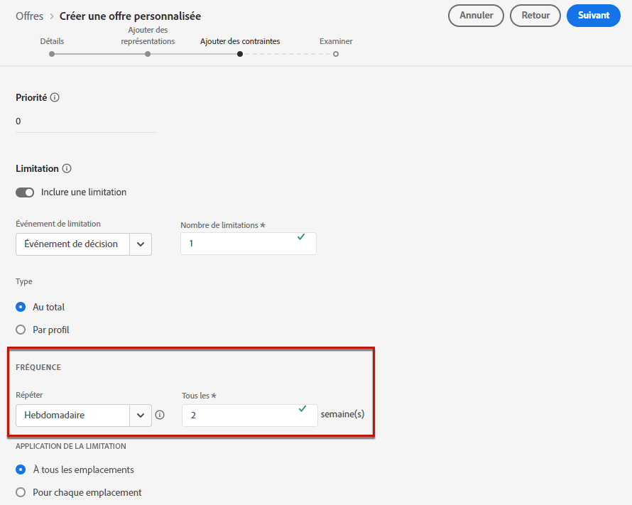

* Le compteur de capping de la fréquence se réinitialise à **00 h 00 UTC**, le jour que vous avez défini ou le premier jour de la semaine ou du mois, le cas échéant. Le jour de début de semaine est le **dimanche**. La durée que vous avez choisie ne peut pas dépasser **2 ans** (ou le nombre correspondant de mois, de semaines ou de jours).

* Une fois que vous avez publié votre offre, vous ne pourrez plus modifier la période (mensuelle, hebdomadaire ou quotidienne) de la fréquence. Vous pouvez désormais modifier le capping de la fréquence si le statut de l’offre est **[!UICONTROL Brouillon]** et si l’offre n’a jamais été publiée auparavant avec le capping de la fréquence activé.

* Une durée de mise en mémoire tampon maximale de 15 minutes peut être nécessaire avant que les événements ne soient comptabilisés dans les contraintes de capping de la fréquence, soit lorsque l’offre est approuvée, soit lorsque la limitation est créée, selon ce qui se produit en dernier.

+++ **À lire : capping de la fréquence et API de gestion des décisions**

Le compteur de capping de la fréquence est mis à jour et disponible dans une décision de l’[API Edge Decisioning](../api-reference/offer-delivery-api/start-offer-delivery-apis.md#edge) en moins de 3 secondes.

Chaque région de hub est associée à une ou plusieurs régions périphériques. Les règles de capping de fréquence sont générées et exportées de chaque région de hub vers ses régions périphériques associées. Chaque fois qu’une décision est prise à l’aide de l’API Edge Decisioning, le système applique les règles disponibles dans la même région périphérique :

* S’il existe une règle correspondante, le compteur de capping de fréquence du profil est incrémenté.
* Dans le cas contraire, aucun compteur n’est créé pour le profil et la règle de capping de fréquence ne s’applique pas. Par conséquent, le profil continuera à recevoir des offres personnalisées, même si le seuil de limitation est dépassé.

Par exemple, la région de hub de votre organisation est *NLD2* et vous envoyez une demande de prise de décision depuis l’Europe (région périphérique *IRL1*). Dans ce scénario, la requête de prise de décision incrémente le compteur du profil, car les règles sont disponibles dans la région *IRL1* (Irlande). Cependant, si la demande de prise de décision provient d’une région comme le Japon (*JPN3*), qui n’est pas une région périphérique liée à la région de hub *NLD2* (Pays-Bas), aucun compteur ne sera créé et les règles de limitation de fréquence ne seront pas appliquées.

>[!NOTE]
>
>Lorsque les compteurs sont propagés des zones périphériques vers le centre ou du centre vers les zones périphériques, un délai pouvant aller jusqu’à 30 minutes peut s’appliquer.

Pour plus d’informations sur les régions hub et edge associées à votre organisation, contactez votre représentant ou représentante Adobe.

Avec les autres API, le compteur de capping de la fréquence est mis à jour comme suit :

* Dans une décision [API Decisioning](../api-reference/offer-delivery-api/start-offer-delivery-apis.md#decisioning), le compteur de capping de le fréquence peut être mis à jour avec un délai de quelques minutes, en fonction du trafic.

* Dans une décision [API Batch Decisioning](../api-reference/offer-delivery-api/batch-decisioning-api.md), les instantanés sont utilisés lorsque le compteur de capping de la fréquence reste fixe. Tant que le même instantané est utilisé, le compteur ne change pas.

+++

### Limitation et emplacements {#placements}

Si vous avez défini plusieurs [représentations](add-representations.md) pour votre offre, indiquez si vous souhaitez appliquer une limitation à tous les emplacements ou pour chaque emplacement.

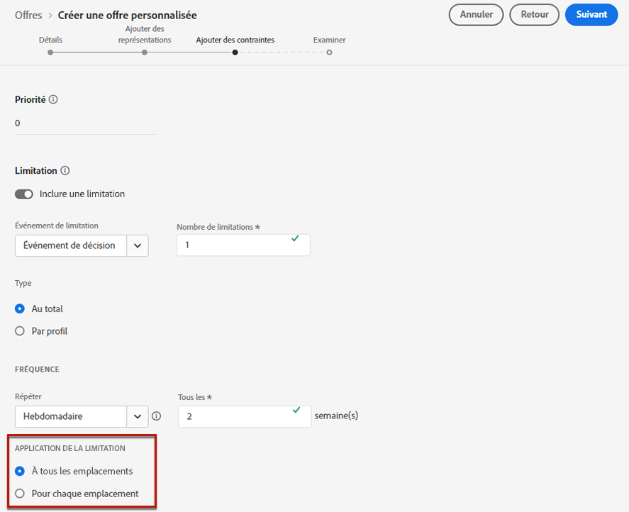

* **[!UICONTROL Appliquer la limitation à tous les emplacements]** : le nombre de limitations va totaliser toutes les décisions parmi les emplacements associés à l’offre.

  Par exemple, si une offre comporte un emplacement **E-mail** et un emplacement **Web** et que vous définissez la limitation sur **2 par profil à tous les emplacements**, chaque profil peut alors recevoir l’offre jusqu’à 2 fois au total, quelle que soit la combinaison d’emplacements.

* **[!UICONTROL Appliquer la limitation pour chaque emplacement]** : les valeurs de limitation appliqueront séparément les valeurs de décision pour chaque emplacement.

  Par exemple, si une offre comporte un emplacement **E-mail** et un emplacement **Web** et que vous définissez la limitation sur **2 par profil pour chaque emplacement**, alors chaque profil peut recevoir l’offre jusqu’à 2 fois pour l’emplacement de l’e-mail, et 2 fois supplémentaires pour l’emplacement web.

### Impact de la modification des dates sur la limitation {#capping-change-date}

>[!CONTEXTUALHELP]
>id="ajo_decisioning_offer_change_date"
>title="La modification des dates peut avoir un impact sur la limitation."
>abstract="Si la limitation est appliquée à cette offre, elle peut être affectée lorsque vous modifiez la date de début ou de fin."

Vous devez procéder avec précaution lors de la modification de la date d’une offre, car cela peut avoir un impact sur la limitation si les conditions suivantes sont remplies :

* L’offre est [approuvée](#review).
* La [Limitation](#capping) est déjà appliquée à l’offre.
* La limitation est définie par profil.

>[!NOTE]
>
>Découvrez comment définir la date d’une offre dans [cette section](creating-personalized-offers.md#create-offer).

La limitation par profil stocke les valeurs de limitation sur chaque profil. Lorsque vous modifiez la date de début et de fin d’une offre approuvée, le nombre de limitations de certains profils peut être affecté selon les différents scénarios décrits ci-dessous.

Voici les scénarios possibles lors de la **modification de la date de début d’une offre**:

| Scénario : Si... | Ce qui se passe : alors... | Impact possible sur le nombre de limitations |
|--- |--- |--- |
| ...la date de début de l’offre est mise à jour avant le début de la date de début de l’offre initiale, | ... le nombre de limitations commencera à la nouvelle date de début. | Non |
| ...la nouvelle date de début est antérieure à la date de fin courante, | ... la limitation se poursuit avec une nouvelle date de début et le nombre de limitations précédent pour chaque profil est reporté. | Non |
| ...la nouvelle date de début est postérieure à la date de fin courante, | ... la limitation actuelle expirera et le nouveau nombre de limitations reprendra à 0 pour tous les profils à la nouvelle date de début. | Oui |

Voici les scénarios possibles lors de l’**extension de la date de fin d’une offre** :

| Scénario : Si... | Ce qui se passe : alors... | Impact possible sur le nombre de limitations |
|--- |--- |--- |
| ... une demande de prise de décision survient avant la date de fin de l’offre d’origine, | ...le nombre de limitations sera mis à jour et le nombre de limitations précédent pour chaque profil sera reporté. | Non |
| ... aucune demande de prise de décision ne se produit avant la date de fin d’origine, | ... le nombre de limitations est réinitialisé à la date de fin d’origine de chaque profil. Le nouveau nombre de limitations redémarre alors à partir de 0 pour toutes les nouvelles requêtes de prise de décision qui se produiront après la date de fin d’origine. | Oui |

**Exemple**

Supposons que vous ayez une offre dont la date de début d’origine est définie sur **1 janvier**, expirant le **31 janvier**.

1. Les profils X, Y et Z se voient présenter l’offre.
1. Le **10 janvier**, la date de fin de l’offre est remplacée par le **15 février**.
1. **Du 11 janvier au 31 janvier**, seul le profil Z se voit présenter l’offre.

   * Parce qu’une demande de prise de décision s’est produite avant la date de fin d’origine **pour le profil Z**, la date de fin de l’offre peut être étendue au **15 février**.
   * Cependant, comme aucune activité ne s’est produite avant la date de fin d’origine pour les **profils X et Y**, leurs compteurs expirent et leurs nombres de limitation sont réinitialisés à 0 le **31 janvier**.

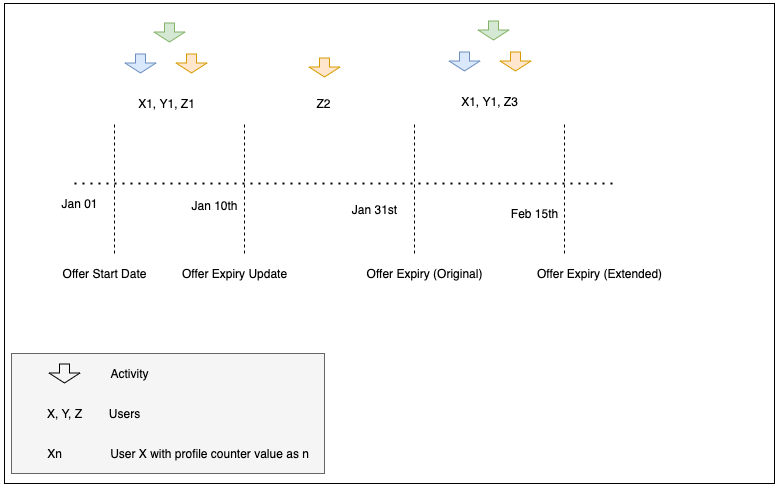
