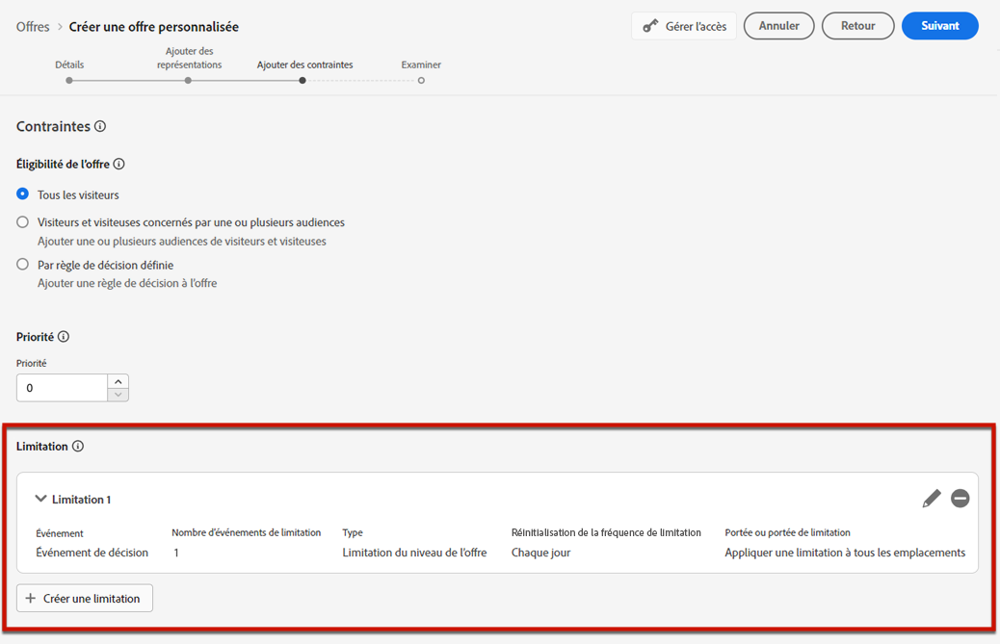
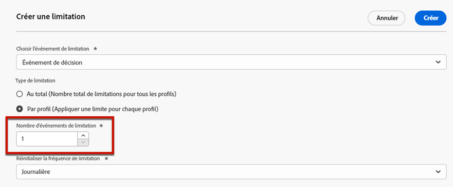
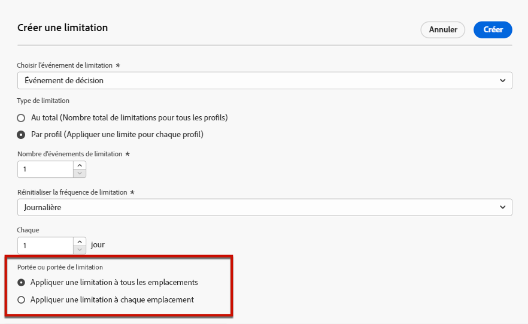
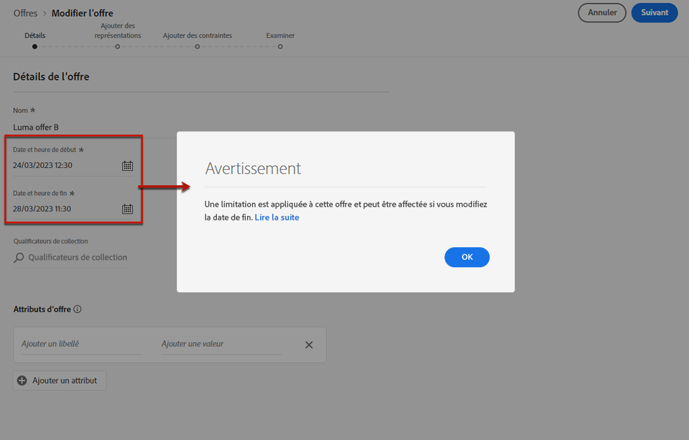

# Ajouter des contraintes à une offre {#add-constraints}

>[!CONTEXTUALHELP]
>id="od_offer_constraints"
>title="À propos des contraintes d&#39;offre"
>abstract="Les contraintes vous permettent de spécifier le type de priorisation de l&#39;offre et la manière dont elle est présentée à l&#39;utilisateur en comparaison avec d&#39;autres offres."

>[!CONTEXTUALHELP]
>id="ajo_decisioning_constraints"
>title="À propos des contraintes d&#39;offre"
>abstract="Les contraintes vous permettent de spécifier le type de priorisation de l&#39;offre et la manière dont elle est présentée à l&#39;utilisateur en comparaison avec d&#39;autres offres."

>[!CONTEXTUALHELP]
>id="od_offer_priority"
>title="À propos de la priorité de l&#39;offre"
>abstract="Dans ce champ, vous pouvez spécifier les paramètres de priorité de l&#39;offre. La priorité est un nombre utilisé pour classer les offres répondant à toutes les contraintes comme l&#39;éligibilité, les dates et la limitation."

>[!CONTEXTUALHELP]
>id="ajo_decisioning_priority"
>title="Définir la priorité"
>abstract="La priorité permet de définir la priorité de l’offre par rapport à d’autres si l’utilisateur est éligible à plusieurs offres. Plus la priorité d’une offre est élevée, plus elle sera comparée à celle d’autres offres."

Les contraintes vous permettent de définir les conditions d’affichage d’une offre.

1. Configurez l’**[!UICONTROL admissibilité des offres]**. [En savoir plus](#eligibility)

   

1. Définissez la **[!UICONTROL Priorité]** de l&#39;offre par rapport à d&#39;autres si l&#39;utilisateur est éligible à plusieurs offres. Plus la priorité d&#39;une offre est élevée, plus elle sera comparée à celle d&#39;autres offres.

   

1. Spécifiez la **[!UICONTROL Limitation]** de l’offre, soit le nombre total de fois où l’offre sera présentée. [En savoir plus](#capping)

   

1. Cliquez sur **[!UICONTROL Suivant]** pour confirmer toutes les contraintes que vous avez définies.

Par exemple, si vous définissez les contraintes suivantes :

* L’offre sera prise en compte uniquement pour les utilisateurs qui correspondent à la règle de décision « Clients fidèles Gold ».
* La priorité de l’offre est définie sur « 50 », ce qui signifie que l’offre sera présentée avant les offres dont la priorité est comprise entre 1 et 49, et après celles dont la priorité est d’au moins 51.
* L’offre ne sera présentée qu’une seule fois par utilisateur à tous les emplacements.

## Admissibilité {#eligibility}

>[!CONTEXTUALHELP]
>id="ajo_decisioning_eligibility"
>title="Définir l’éligibilité"
>abstract="Par défaut, tout profil peut se voir présenter l’offre, mais vous pouvez utiliser des segments ou des règles de décision pour restreindre l’offre à des profils spécifiques."

>[!CONTEXTUALHELP]
>id="od_offer_eligibility"
>title="À propos de l&#39;éligibilité de l&#39;offre"
>abstract="Dans cette section, vous pouvez utiliser des règles de décision pour déterminer quels utilisateurs sont éligibles à l&#39;offre."
>additional-url="https://video.tv.adobe.com/v/329373?captions=fre-fr" text="Regarder une vidéo de démonstration"

La section **[!UICONTROL Admissibilité de l’offre]** vous permet de restreindre l’offre à des profils spécifiques que vous définissez à l’aide de segments ou de règles de décision.

>[!NOTE]
>
>Pour en savoir plus sur l’utilisation des **segments** par rapport aux **règles de décision**, consultez [cette section](#segments-vs-decision-rules).

* Par défaut, l’option **[!UICONTROL Tous les visiteurs]** est sélectionnée, ce qui signifie que tout profil peut se voir présenter l’offre.

   

* Vous pouvez également limiter la présentation de l’offre aux membres d’un ou de plusieurs [segments d’Adobe Experience Platform](../../segment/about-segments.md).

   Pour cela, activez l’option **[!UICONTROL Visiteurs appartenant à un ou plusieurs segments]**, puis ajoutez un ou plusieurs segments dans le volet de gauche et combinez-les à l’aide des opérateurs logiques **[!UICONTROL Et]** / **[!UICONTROL Ou]**.

   

* Si vous souhaitez associer une [règle de décision](../offer-library/creating-decision-rules.md) spécifique à l’offre, sélectionnez **[!UICONTROL Par une règle de décision définie]**, puis faites glisser la règle de votre choix depuis le volet de gauche vers la zone **[!UICONTROL Règle de décision]**.

   

   >[!CAUTION]
   >
   >Les offres basées sur un événement ne sont actuellement pas prises en charge dans [!DNL Journey Optimizer]. Si vous créez une règle de décision basée sur un [événement](https://experienceleague.adobe.com/docs/experience-platform/segmentation/ui/segment-builder.html?lang=fr#events){target=&quot;_blank&quot;}, vous ne pourrez pas l&#39;exploiter dans une offre.

Lorsque vous sélectionnez des segments ou des règles de décision, vous pouvez afficher des informations sur les profils qualifiés estimés. Cliquez sur **[!UICONTROL Actualiser]** pour mettre à jour les données.

>[!NOTE]
>
>Les estimations de profil ne sont pas disponibles lorsque les paramètres de règle incluent des données qui ne figurent pas dans le profil, telles que des données contextuelles. Par exemple, une règle d’éligibilité qui exige que la météo actuelle soit de ≥80 degrés.

### Utilisation des segments par rapport aux règles de décision {#segments-vs-decision-rules}

Pour appliquer une contrainte, vous pouvez restreindre la sélection des offres aux membres d’un ou de plusieurs **segments Adobe Experience Platform**, ou vous pouvez utiliser une **règle de décision**, les deux solutions correspondant à des utilisations différentes.

Pour faire simple, la sortie d’un segment est une liste de profils, tandis qu’une règle de décision est une fonction exécutée à la demande sur un seul profil pendant le processus de prise de décision. La différence entre ces deux usages est présentée ci-dessous.

* **Segments**

   D’une part, les segments sont un groupe de profils Adobe Experience Platform qui correspondent à une certaine logique basée sur les attributs de profil et les événements d’expérience. Cependant, la gestion des offres ne recalcule pas le segment, qui peut ne pas être à jour lors de la présentation de l’offre.

   En savoir plus sur les segments dans [cette section](../../segment/about-segments.md).

* **Règles de décision**

   D’un autre côté, une règle de décision est basée sur les données disponibles dans Adobe Experience Platform et détermine à qui une offre peut être montrée. Une fois sélectionnée dans une offre ou une décision pour un emplacement donné, la règle est exécutée chaque fois qu’une décision est prise, ce qui garantit que chaque profil obtient la dernière et la meilleure offre.

   Pour en savoir plus sur les règles de décision, consultez [cette section](creating-decision-rules.md).

## Limitation {#capping}

>[!CONTEXTUALHELP]
>id="od_offer_globalcap"
>title="À propos de la limitation de l&#39;offre"
>abstract="Dans ce champ, vous pouvez spécifier le nombre de fois où l’offre peut être présentée."

>[!CONTEXTUALHELP]
>id="ajo_decisioning_capping"
>title="Utilisation de la limitation"
>abstract="Pour éviter de sursolliciter vos clients, utilisez la limitation pour définir le nombre maximal de fois où une offre peut être présentée."

La limitation est utilisée comme contrainte pour définir le nombre maximal de fois où une offre peut être présentée.

Limiter le nombre de fois où les utilisateurs reçoivent des offres spécifiques vous permet d’éviter de sur-solliciter vos clients et donc d’optimiser chaque point de contact avec la meilleure offre.

Pour définir la limitation, procédez comme suit.

1. Définissez le nombre de fois où l’offre peut être présentée.

   

   >[!NOTE]
   >
   >Le nombre doit être un entier supérieur à 0.

1. Indiquez si vous souhaitez que la limitation soit appliquée à tous les utilisateurs ou à un profil spécifique :

   

   * Sélectionnez **[!UICONTROL Au total]** pour définir le nombre de fois où une offre peut être proposée dans l’audience cible combinée, ce qui signifie pour tous les utilisateurs.

      Par exemple, si vous êtes un détaillant d’électronique qui a conclu un « contrat télévisuel d’offre d’ouverture » vous souhaitez que l’offre ne soit renvoyée que 200 fois sur tous les profils.

   * Sélectionnez **[!UICONTROL Par profil]** pour définir le nombre de fois où une offre peut être proposée au même utilisateur.

      Par exemple, si vous êtes une banque avec une offre « Carte de crédit Platinum », vous ne souhaitez pas que cette offre soit présentée plus de 5 fois par profil. En effet, vous pensez que si l’utilisateur a vu l’offre 5 fois et n’a pas agi dessus, il a plus de chance d’agir sur la meilleure offre suivante.

1. Si vous avez défini plusieurs [représentations](#representations) pour votre offre, indiquez si vous souhaitez appliquer une limitation. **[!UICONTROL À tous les emplacements]** ou **[!UICONTROL Pour chaque emplacement]**.

   

   * **[!UICONTROL À tous les emplacements]** : le nombre de limitations va totaliser toutes les décisions parmi les emplacements associés à l’offre.

      Par exemple, si une offre comporte un emplacement **E-mail** et un emplacement **Web** et que vous définissez la limitation sur **2 par profil à tous les emplacements**, chaque profil peut alors recevoir l’offre jusqu’à 2 fois au total, quelle que soit la combinaison d’emplacements.

   * **[!UICONTROL Pour chaque emplacement]** : les valeurs de limitation appliqueront séparément les valeurs de décision pour chaque emplacement.

      Par exemple, si une offre comporte un emplacement **E-mail** et un emplacement **Web** et que vous définissez la limitation sur **2 par profil pour chaque emplacement**, alors chaque profil peut recevoir l’offre jusqu’à 2 fois pour l’emplacement de l’e-mail, et 2 fois supplémentaires pour l’emplacement web.

1. Une fois enregistrée et validée, si l&#39;offre a été présentée le nombre de fois que vous avez spécifié dans ce champ en fonction des critères que vous avez définis, sa diffusion s&#39;arrêtera.

Le nombre de fois où une offre est proposée est calculé au moment de la préparation de l&#39;email. Par exemple, si vous préparez un email contenant un certain nombre d&#39;offres, ces chiffres sont pris en compte dans votre limitation maximale, et ce que l&#39;email soit envoyé ou non.

<!--If an email delivery is deleted or if the preparation is done again before being sent, the capping value for the offer is automatically updated.-->

>[!NOTE]
>
>Les compteurs de limitation seront réinitialisés à l’expiration de l’offre ou 2 ans après la date de début de l’offre, le premier événement prévalant. Découvrez comment définir la date d’une offre dans [cette section](creating-personalized-offers.md#create-offer).

### Impact de la modification des dates sur la limitation {#capping-change-date}

>[!CONTEXTUALHELP]
>id="ajo_decisioning_offer_change_date"
>title="La modification des dates peut avoir un impact sur la limitation."
>abstract="Si la limitation est appliquée à cette offre, elle peut être affectée lorsque vous modifiez la date de début ou de fin."

Vous devez procéder avec précaution lors de la modification de la date d’une offre, car cela peut avoir un impact sur la limitation si les conditions suivantes sont remplies :

* L’offre est [approuvée](#review).
* La [Limitation](#capping) est déjà appliquée à l’offre.
* La limitation est définie par profil.

>[!NOTE]
>
>Découvrez comment définir la date d’une offre dans [cette section](creating-personalized-offers.md#create-offer).

La limitation par profil stocke les valeurs de limitation sur chaque profil. Lorsque vous modifiez la date de début et de fin d’une offre approuvée, le nombre de limitations de certains profils peut être affecté selon les différents scénarios décrits ci-dessous.

Voici les scénarios possibles lors de la **modification de la date de début d’une offre**:

| Scénario : Si... | Ce qui se passe : alors... | Impact possible sur le nombre de limitations |
|--- |--- |--- |
| ...la date de début de l’offre est mise à jour avant le début de la date de début de l’offre initiale, | ... le nombre de limitations commencera à la nouvelle date de début. | Non |
| ...la nouvelle date de début est antérieure à la date de fin courante, | ... la limitation se poursuit avec une nouvelle date de début et le nombre de limitations précédent pour chaque profil est reporté. | Non |
| ...la nouvelle date de début est postérieure à la date de fin courante, | ... la limitation actuelle expirera et le nouveau nombre de limitations reprendra à 0 pour tous les profils à la nouvelle date de début. | Oui |

Voici les scénarios possibles lors de l’**extension de la date de fin d’une offre** :

| Scénario : Si... | Ce qui se passe : alors... | Impact possible sur le nombre de limitations |
|--- |--- |--- |
| ... une demande de prise de décision survient avant la date de fin de l’offre d’origine, | ...le nombre de limitations sera mis à jour et le nombre de limitations précédent pour chaque profil sera reporté. | Non |
| ... aucune demande de prise de décision ne se produit avant la date de fin d’origine, | ... le nombre de limitations est réinitialisé à la date de fin d’origine de chaque profil. Le nouveau nombre de limitations redémarre alors à partir de 0 pour toutes les nouvelles requêtes de prise de décision qui se produiront après la date de fin d’origine. | Oui |

**Exemple**

Supposons que vous ayez une offre dont la date de début d’origine est définie sur **1 janvier**, expirant le **31 janvier**.

1. Les profils X, Y et Z se voient présenter l’offre.
1. Le **10 janvier**, la date de fin de l’offre est remplacée par le **15 février**.
1. **Du 11 janvier au 31 janvier**, seul le profil Z se voit présenter l’offre.

   * Parce qu’une demande de prise de décision s’est produite avant la date de fin d’origine **pour le profil Z**, la date de fin de l’offre peut être étendue au **15 février**.
   * Cependant, comme aucune activité ne s’est produite avant la date de fin d’origine pour les **profils X et Y**, leurs compteurs expirent et leurs nombres de limitation sont réinitialisés à 0 le **31 janvier**.

