# Ajouter des représentations à une offre {#add-representations}

>[!TIP]
>
>La prise de décision, la nouvelle fonctionnalité de prise de décision d’[!DNL Adobe Journey Optimizer], est désormais disponible via les canaux d’expérience basée sur du code et d’e-mail. [En savoir plus](../../experience-decisioning/gs-experience-decisioning.md)

>[!CONTEXTUALHELP]
>id="ajo_decisioning_representation"
>title="Représentations"
>abstract="Ajoutez des représentations pour définir l’emplacement d’affichage de votre offre dans le message. Plus une offre a de représentations, plus il y a d&#39;occasions d&#39;utiliser l&#39;offre dans différents contextes d&#39;emplacement."

Une offre peut être affichée à différents endroits dans un message : dans une bannière supérieure avec une image, sous forme de texte dans un paragraphe, sous forme de bloc HTML, etc. Plus une offre a de représentations, plus il y a d&#39;occasions d&#39;utiliser l&#39;offre dans différents contextes d&#39;emplacement.

## Configuration des représentations de l’offre {#representations}

Pour ajouter une ou plusieurs représentations à votre offre et les configurer, procédez comme suit.

1. Pour la première représentation, commencez par sélectionner le **[!UICONTROL canal]** qui sera utilisé.

   

   >[!NOTE]
   >
   >Seuls les emplacements disponibles pour le canal sélectionné s&#39;affichent dans la liste déroulante **[!UICONTROL Emplacement]**.

1. Sélectionnez un emplacement dans la liste.

   Vous pouvez également utiliser le bouton en regard de la liste déroulante **[!UICONTROL Emplacement]** pour parcourir tous les emplacements.

   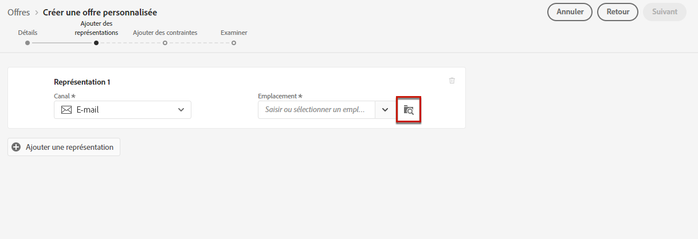

   Vous pouvez toujours filtrer les emplacements selon leur canal et/ou type de contenu. Choisissez un emplacement et cliquez sur **[!UICONTROL Sélectionner]**.

   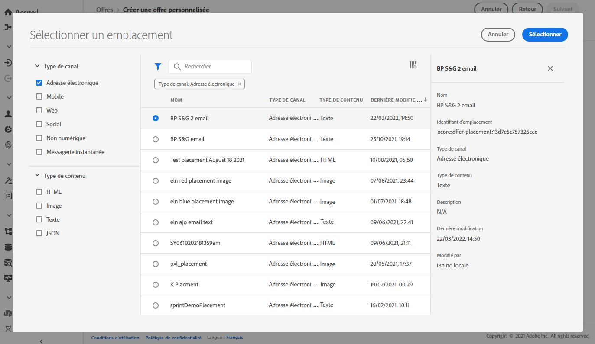

1. Ajoutez du contenu à chaque représentation. Découvrez comment dans [cette section](#content).

1. Lorsque vous ajoutez du contenu tel qu&#39;une image ou une URL, vous pouvez spécifier un **[!UICONTROL Lien destination]** : les utilisateurs qui cliquent sur l&#39;offre sont redirigés vers la page correspondante.

   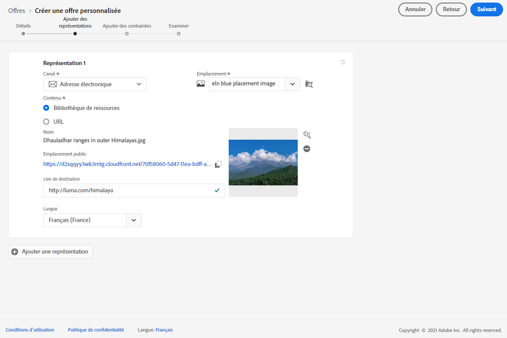

1. Enfin, sélectionnez la langue de votre choix pour vous aider à identifier et gérer les éléments à afficher pour les utilisateurs.

1. Pour ajouter une autre représentation, utilisez le bouton **[!UICONTROL Ajouter une représentation]**, puis ajoutez autant de représentations que nécessaire.

   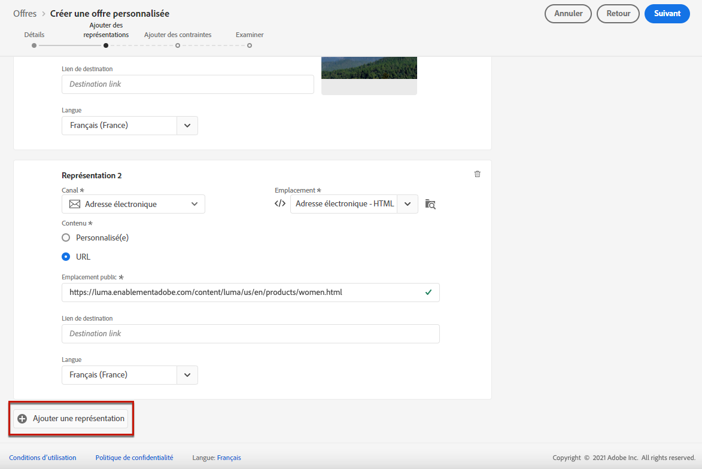

1. Une fois que vous avez ajouté toutes vos représentations, sélectionnez **[!UICONTROL Suivant]**.

## Définition du contenu de vos représentations {#content}

Vous pouvez ajouter différents types de contenu à une représentation.

>[!NOTE]
>
>Notez que seul le contenu correspondant au type de contenu de l&#39;emplacement peut être utilisé.

### Ajout d’images {#images}

Si l&#39;emplacement sélectionné est de type image, vous pouvez ajouter du contenu provenant de la bibliothèque **Adobe Experience Cloud Asset**, un référentiel centralisé de ressources fourni par [!DNL Adobe Experience Manager Assets].

>[!NOTE]
>
> Pour utiliser [Adobe Experience Manager Assets Essentials](https://experienceleague.adobe.com/docs/experience-manager-assets-essentials/help/introduction.html?lang=fr){target="_blank"}, vous devez déployer [!DNL Assets Essentials] pour votre organisation et vous assurer que les utilisateurs et les utilisatrices font partie des profils de produits **Utilisateurs consommateurs et utilisatrices consommatrices Assets Essentials** et/ou **Utilisateurs et utilisatrices Assets Essentials**. En savoir plus sur [cette page](https://experienceleague.adobe.com/docs/experience-manager-assets-essentials/help/get-started-admins/deploy-administer.html?lang=fr){target="_blank"}.

1. Choisissez l’option **[!UICONTROL Bibliothèque de ressources]**.

1. Sélectionnez **[!UICONTROL Parcourir]**.

   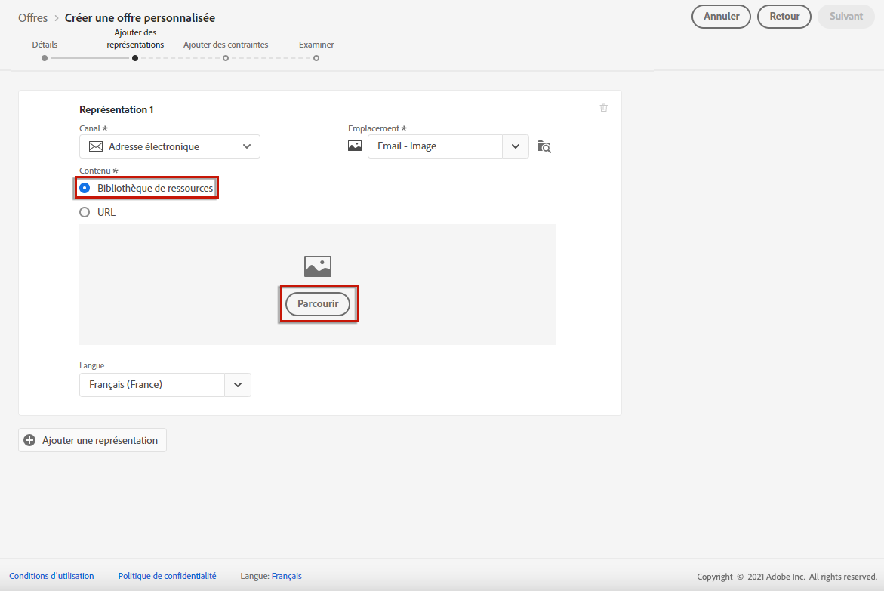

1. Parcourez les ressources pour sélectionner l&#39;image de votre choix.

1. Cliquez sur **[!UICONTROL Sélectionner]**.

   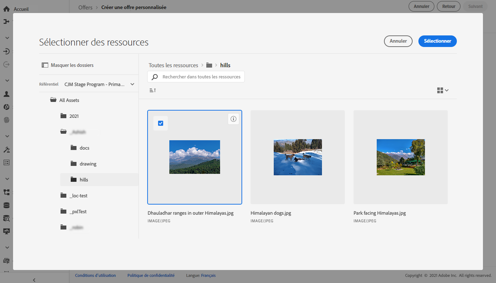

### Ajout de fichiers HTML ou JSON {#html-json}

Si l’emplacement sélectionné est de type HTML, vous pouvez également ajouter du contenu JSON ou HTML provenant de la [bibliothèque de ressources Adobe Experience Cloud](https://experienceleague.adobe.com/docs/experience-manager-assets-essentials/help/introduction.html?lang=fr){target="_blank"}).

Par exemple, vous avez créé un modèle d’e-mail HTML dans [Adobe Experience Manager](https://experienceleague.adobe.com/docs/experience-manager.html?lang=fr){target="_blank"} et vous souhaitez utiliser ce fichier pour le contenu de votre offre. Au lieu de créer un nouveau fichier, vous pouvez simplement charger le modèle dans la **Bibliothèque de ressources** pour pouvoir le réutiliser dans les représentations de votre offre.

Pour réutiliser votre contenu dans une représentation, accédez à la **Bibliothèque de ressources** comme décrit dans [cette section](#images) et sélectionnez le fichier HTML ou JSON de votre choix.

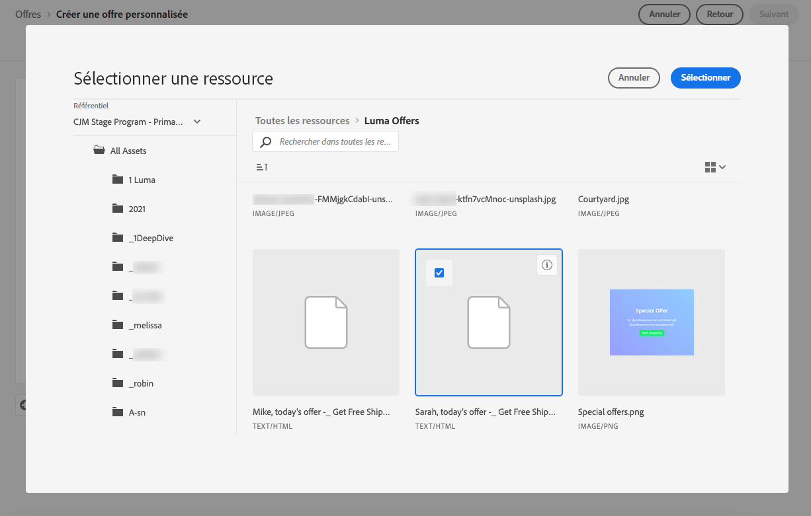

### Ajout d’URL {#urls}

Pour ajouter du contenu provenant d&#39;un emplacement public externe, sélectionnez **[!UICONTROL URL]**, puis saisissez l&#39;adresse URL du contenu à ajouter.

Vous pouvez personnaliser vos URL à l’aide de l’éditeur de personnalisation. En savoir plus sur la [personnalisation](../../personalization/personalize.md#use-expression-editor).

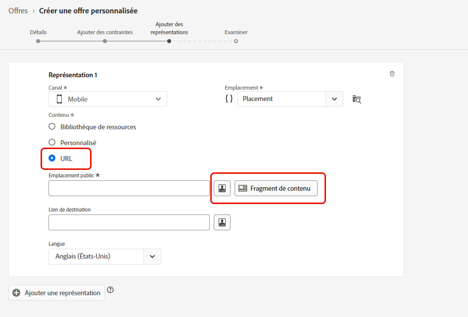

Par exemple, vous souhaitez personnaliser l’image qui s’affiche sous forme d’offre. Vous voulez que les utilisateurs et utilisatrices qui préfèrent les vacances en ville voient la skyline de New York et les utilisateurs et utilisatrices qui préfèrent les vacances à la plage voient la rive nord d’Hawaii.

Utilisez l’éditeur de personnalisation pour récupérer des attributs de profils stockés dans Adobe Experience Platform à l’aide de schémas d’union. [En savoir plus](https://experienceleague.adobe.com/docs/experience-platform/profile/union-schemas/union-schemas-overview.html?lang=fr){target="_blank"}

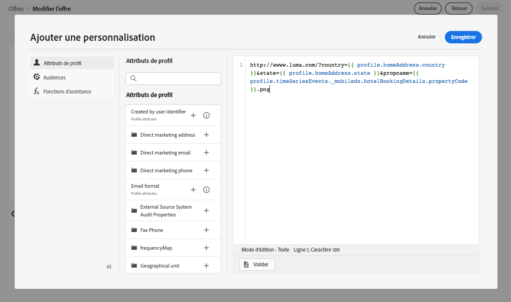

Si vous indiquez un **[!UICONTROL lien de destination]**, vous pouvez également personnaliser l’URL vers laquelle seront dirigés les utilisateurs et utilisatrices qui cliquent sur l’offre.

### Ajout de texte personnalisé {#custom-text}

Vous pouvez également insérer du contenu de type texte lors de la sélection d&#39;un emplacement compatible.

1. Sélectionnez l’option **[!UICONTROL Personnalisé]** et cliquez sur **[!UICONTROL Ajouter du contenu]**.

   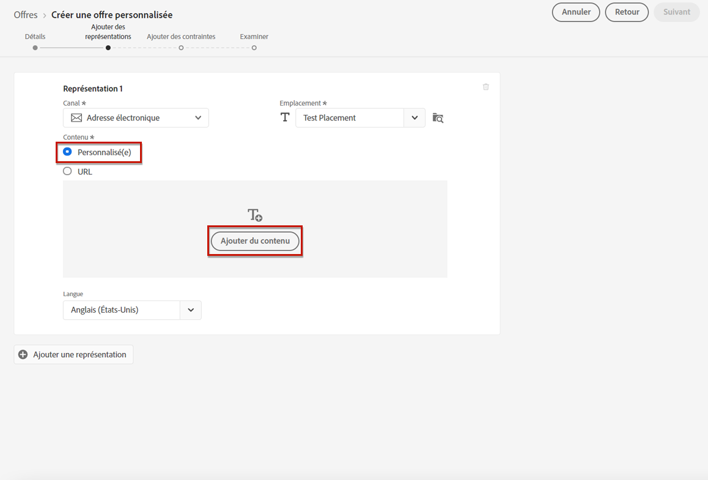

   >[!NOTE]
   >
   >Cette option n&#39;est pas disponible pour les emplacements de type image.

1. Saisissez le texte qui s’affichera dans l’offre.

   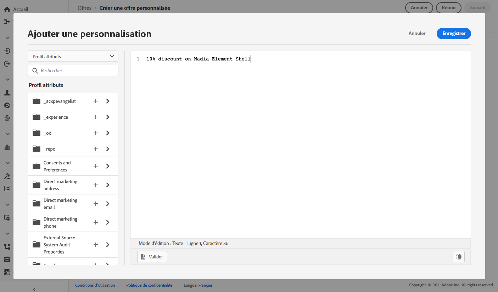

   Vous pouvez personnaliser votre contenu à l’aide de l’éditeur de personnalisation. En savoir plus sur la [personnalisation](../../personalization/personalize.md#use-expression-editor).

   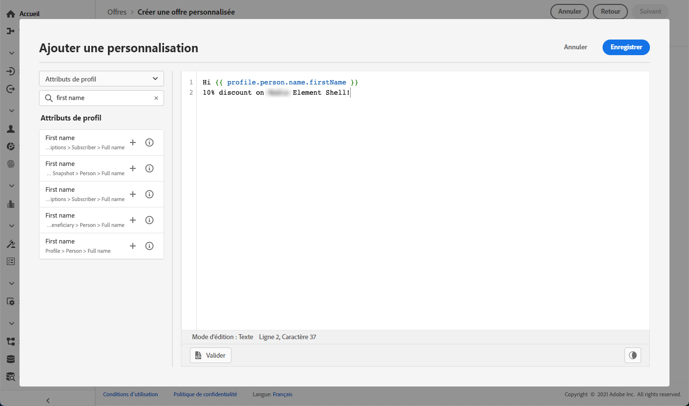

   >[!NOTE]
   >
   >Seules les sources **[!UICONTROL Attributs de profil]**, **[!UICONTROL Audiences]** et **[!UICONTROL Fonctions d’assistance]** sont disponibles pour la gestion des décisions.

## Personnaliser des représentations basées sur des données contextuelles{#context-data}

Lorsque des données contextuelles sont transmises dans l’appel [Prise de décision Edge](../api-reference/offer-delivery-api/edge-decisioning-api.md), vous pouvez utiliser ces données pour personnaliser dynamiquement les représentations. Par exemple, vous pouvez personnaliser la représentation d’une offre en fonction de facteurs en temps réel, tels que les conditions météorologiques actuelles au moment de la décision.

Pour utiliser les données contextuelles dans les représentations des offres, incorporez la variable de données contextuelles directement dans le contenu de représentation à l’aide de l’espace de noms `profile.timeSeriesEvents.`.

Voici un exemple de syntaxe utilisé pour personnaliser la représentation d’une offre en fonction des systèmes d’exploitation des utilisateurs et des utilisatrices :

```
 iosandroid 
```

La requête de prise de décision Edge correspondante, y compris les données contextuelles, est la suivante :

```
{
    "body": {
        "xdm": {
            "identityMap": {
                "Email": [
                    {
                        "id": "xyz@abc.com"
                    }
                ]
            },
            "device": {
                "model": "Apple"
            }
        },
        "extra": {
            "query": {
                "decisionScopes": [
                    "eyJ4ZG06..."
                ]
            }
        }
    }
}
```
