# Classements par l&#39;IA {#ai-rankings}

## Prise en main des classements par l&#39;IA {#get-started-with-ai-rankings}

<!--If you are an [Adobe Experience Platform](https://experienceleague.adobe.com/docs/experience-platform/landing/home.html){target="_blank"} user leveraging the **Offer Decisioning** application service,-->You can use a trained model system that ranks offers to display for a given profile.

>[!CAUTION]
>
>L&#39;utilisation du classement par l&#39;IA est actuellement disponible en accès anticipé uniquement pour certains utilisateurs.

Cette fonctionnalité permet de créer différentes **stratégies de classement** en fonction des objectifs de votre entreprise. En appliquant ces différentes stratégies basées sur des objectifs à une décision (précédemment appelée « activité d&#39;offre »), le système de modèles formés vous aidera à comprendre l&#39;impact des différentes stratégies de classement sur vos objectifs.

Vous pouvez par exemple sélectionner une stratégie de classement pour le canal e-mail et une autre pour le canal push. Pour chaque canal, le système de modèles formés exploite différents points de données pour déterminer l&#39;offre qui doit être présentée en premier pour un emplacement donné, plutôt que de prendre en compte les scores de priorité des offres ou une [formule de classement](create-ranking-formulas.md).

<!--This feature is not enabled by default. To be able to use it, reach out to your Adobe contact.-->

Une fois la formule de classement créée, affectez-la à un emplacement dans une décision. En savoir plus dans la section [Configuration de la sélection des offres dans les décisions](../offer-activities/configure-offer-selection.md).

### Modèle dʼoptimisation automatique {#auto-optimization}

Actuellement, le seul type de modèle pris en charge pour le classement par lʼIA dans [!DNL Journey Optimizer] est lʼ&#x200B;**optimisation automatique**.

Un modèle d’optimisation automatique vise à diffuser des offres qui maximisent le rendement, sur la base des indicateurs clés de performance (KPI) que vous avez définis. <!--These KPIs could be in the form of conversion rates, revenue, etc.-->À ce stade, l’optimisation automatique cherche à optimiser les clics sur les offres, avec comme objectif final la conversion de lʼoffre.

>[!NOTE]
>
>Le modèle d’optimisation automatique n’utilise aucune donnée contextuelle ou de profil utilisateur. Il optimise les résultats en fonction des performances globales des offres.

Toute la difficulté avec lʼoptimisation automatique consiste à atteindre un équilibre entre l’apprentissage exploratoire et l’exploitation de cet apprentissage. Ce principe est connu sous le nom d’**approche du « bandit manchot »**.

Pour relever ce défi, le modèle d’optimisation automatique utilise la méthode **Échantillonnage de Thompson**, qui permet d’identifier l’option à poursuivre pour maximiser les gains attendus. En dʼautres termes, lʼéchantillonnage de Thompson est un type de technique dʼapprentissage par renforcement, cherchant à résoudre le dilemme exploration-exploitation dans un problème de bandit manchot.

La méthode dʼéchantillonnage de Thompson permet également de relever des défis tels que le problème du « démarrage à froid », qui est le suivant : une nouvelle offre est introduite dans la campagne, mais elle nʼa pas dʼhistorique dont elle pourrait sʼinspirer.

## Création d’une stratégie de classement {#create-ranking-strategy}

Pour créer une stratégie de classement, procédez comme suit :

1. Accédez au menu **[!UICONTROL Composants]**, puis sélectionnez l&#39;onglet **[!UICONTROL Classements par l&#39;IA]**.

   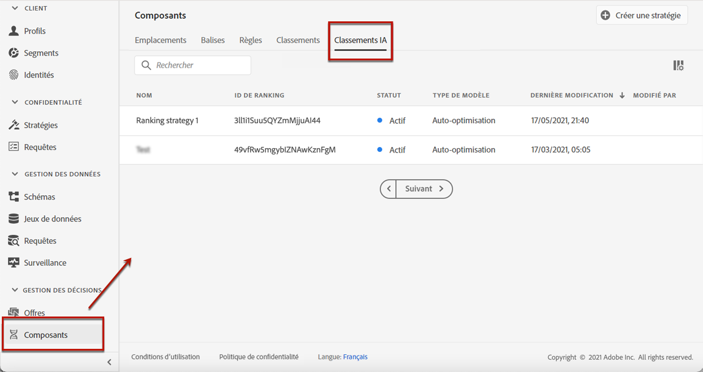

   Toutes les stratégies de classement créées jusqu&#39;à présent y sont répertoriées.

1. Cliquez sur le bouton **[!UICONTROL Créer une stratégie]**.

1. Renseignez les champs suivants :

   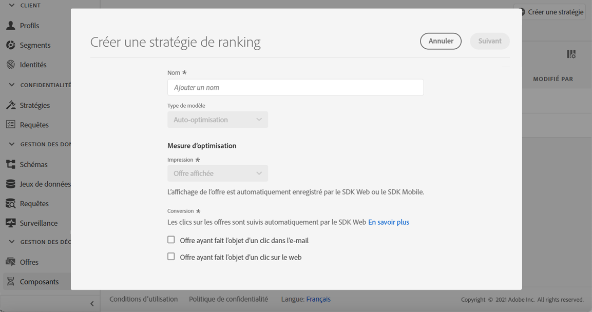

   * **[!UICONTROL Nom]** : nom unique que vous devez fournir.

   * **[!UICONTROL Type de modèle]** : actuellement, le seul type de modèle pris en charge est l&#39;**[!UICONTROL optimisation automatique]** <!--More will be supported in the future so the drop-down list will be enabled.-->

   * **[!UICONTROL Mesure d&#39;optimisation]** :

      cette option permet aux marketeurs de choisir comment le modèle d&#39;apprentissage automatique doit être créé et formé : selon les offres affichées, les offres ayant fait l&#39;objet d&#39;un clic dans un e-mail et/ou les offres ayant fait l&#39;objet d&#39;un clic sur le web.

      >[!NOTE]
      >
      >Si nécessaire, vous pouvez sélectionner tous les types de mesures.

      Il existe deux types de mesures d&#39;optimisation :
      * **[!UICONTROL Impression]** : actuellement, les événements d&#39;impression correspondent à toutes les offres affichées.
      * **[!UICONTROL Conversion]** : les événements de conversion correspondent à toutes les offres qui génèrent des clics par e-mail ou sur le web.

      Tous les événements d&#39;impression et/ou de conversion sélectionnés seront automatiquement capturés à l&#39;aide du SDK Web ou du SDK Mobile fourni. Pour en savoir plus à ce sujet, consultez la [présentation du SDK web Adobe Experience Platform](https://experienceleague.adobe.com/docs/experience-platform/edge/home.html?lang=fr).

   * **[!UICONTROL Identifiant du jeu de données]** : pour la conversion, vous devez fournir un jeu de données dans lequel les événements sont collectés en les sélectionnant dans la liste déroulante. Découvrez comment créer un jeu de données dans [cette section](#create-dataset). <!--This dataset needs to be associated with a schema that must have the **[!UICONTROL Proposition Interactions]** field group (previously known as mixin) associated with it.-->

   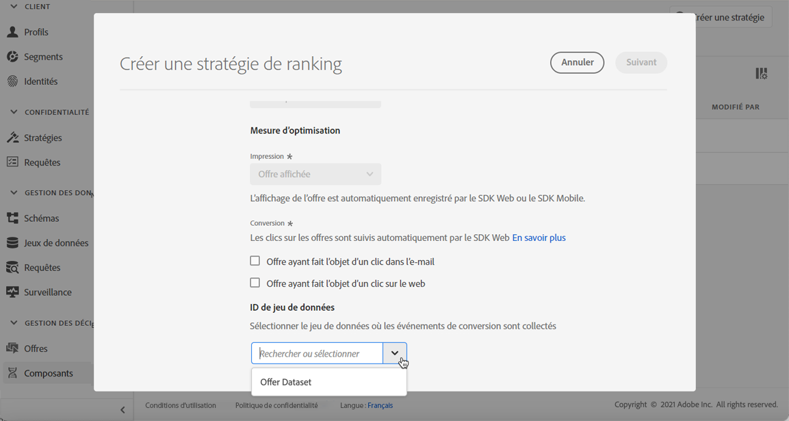

   >[!CAUTION]
   >
   >Seuls les jeux de données créés à partir de schémas associés au groupe de champs **[!UICONTROL Événement d&#39;expérience - Interactions de propositions]** (précédemment appelé « mixin ») s&#39;affichent dans la liste déroulante.

1. Enregistrez et activez la stratégie de classement.

   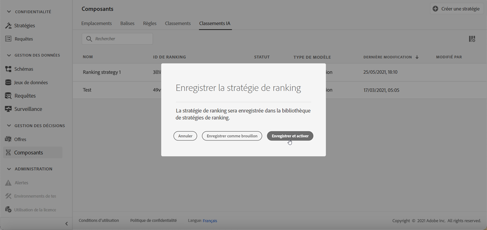

Elle est maintenant prête à être utilisée dans une décision de classement des offres éligibles pour un emplacement. En savoir plus dans [cette section](../offer-activities/configure-offer-selection.md#use-ranking-strategy).<!--TBC?-->

## Création d’un jeu de données pour collecter des événements {#create-dataset}

Vous devez créer un jeu de données dans lequel les événements de conversion seront collectés. Commencez par créer le schéma qui sera utilisé dans votre jeu de données :

1. Dans le menu **[!UICONTROL Data Management]**, sélectionnez **[!UICONTROL Schéma]**, accédez à l&#39;onglet **[!UICONTROL Parcourir]** et cliquez sur **[!UICONTROL Créer un schéma]**.

   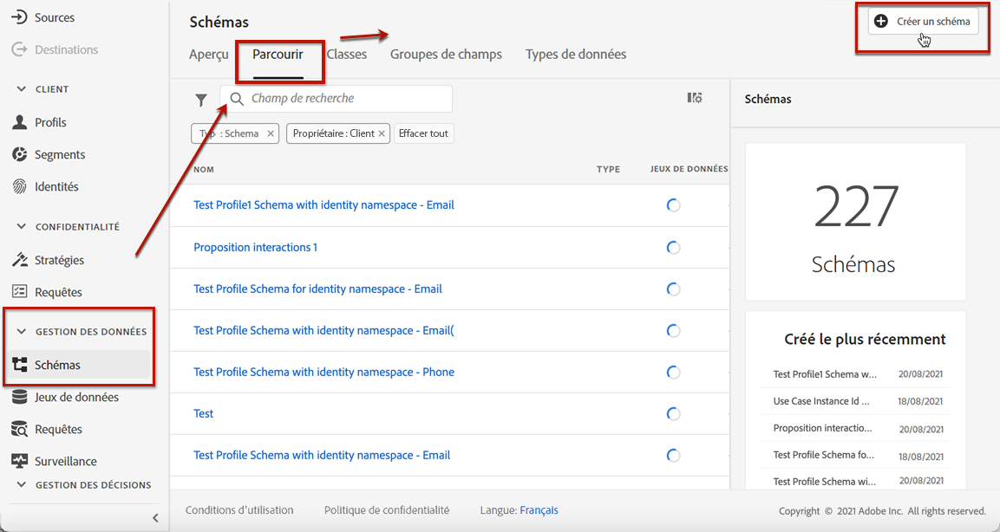

1. Sélectionnez **[!UICONTROL XDM ExperienceEvent]**.

   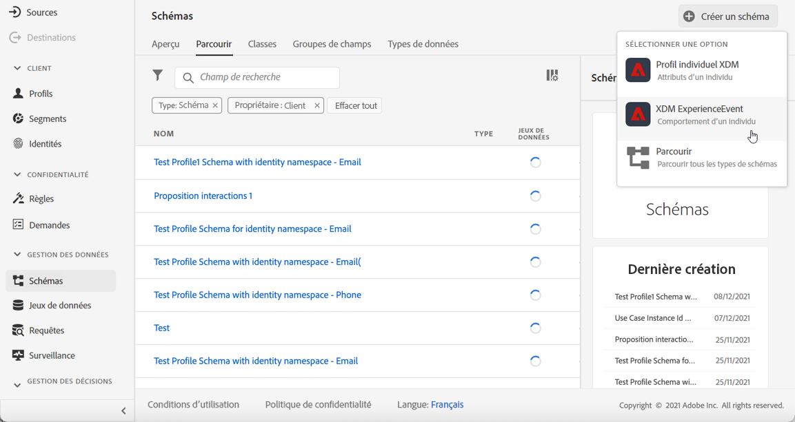

   >[!NOTE]
   >
   >    Pour en savoir plus sur les schémas et les groupes de champs XDM, consultez la [documentation de présentation du système XDM](https://experienceleague.adobe.com/docs/experience-platform/xdm/home.html?lang=fr).


1. Dans le champ **[!UICONTROL Rechercher]**, saisissez « interaction de proposition » et sélectionnez le groupe de champs **[!UICONTROL Événement d&#39;expérience - Interactions de proposition]**.

   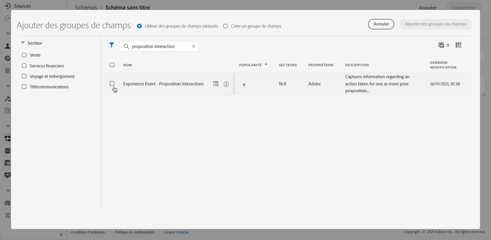

   >[!CAUTION]
   >
   >    Le schéma qui sera utilisé dans votre jeu de données doit être associé au groupe de champs **[!UICONTROL Événement d&#39;expérience - Interactions de proposition]**. Sinon, vous ne pourrez pas l&#39;utiliser dans votre stratégie de classement.

1. Cliquez sur **[!UICONTROL Ajouter des groupes de champs]**.

   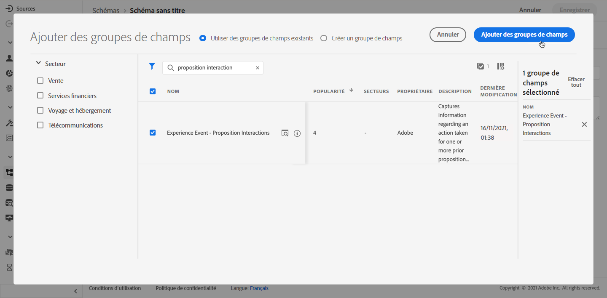

   >[!NOTE]
   >Le groupe de champs était auparavant appelé « mixin ».

1. Saisissez un nom et enregistrez le schéma.<!--How do you edit the fields in this new schema? Examples?-->

>[!NOTE]
>
>    Pour en savoir plus sur la création de schémas, consultez la section [Principes de base de la composition des schémas](https://experienceleague.adobe.com/docs/experience-platform/xdm/schema/composition.html?lang=fr?lang=fr#Understanding-schemas).

Vous êtes maintenant prêt à créer un jeu de données à l&#39;aide de ce schéma. Pour ce faire, procédez comme suit :

1. Dans le menu **[!UICONTROL Data Management]**, sélectionnez **[!UICONTROL Jeux de données]**, accédez à l&#39;onglet **[!UICONTROL Parcourir]** et cliquez sur **[!UICONTROL Créer un jeu de données]**.

   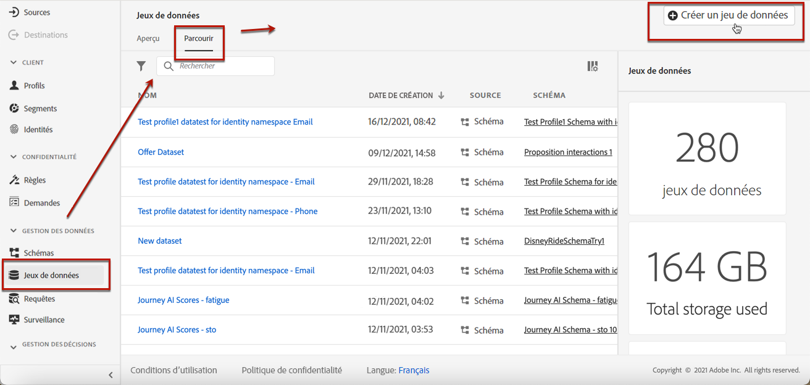

1. Sélectionnez **[!UICONTROL Créer un jeu de données à partir d&#39;un schéma]**.

   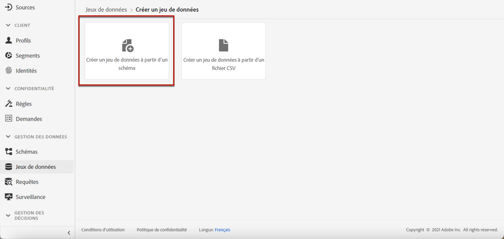

1. Sélectionnez le schéma que vous venez de créer dans la liste.

   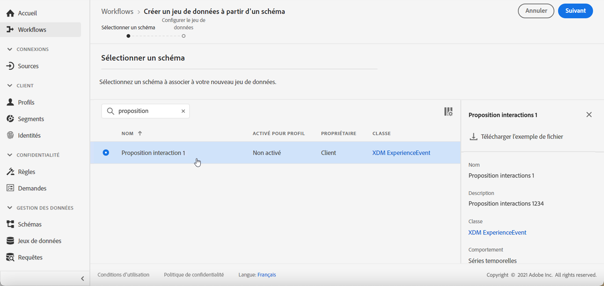

1. Cliquez sur **[!UICONTROL Suivant]**.

1. Attribuez un nom unique au jeu de données dans le champ **[!UICONTROL Nom]** et cliquez sur **[!UICONTROL Terminer]**.

   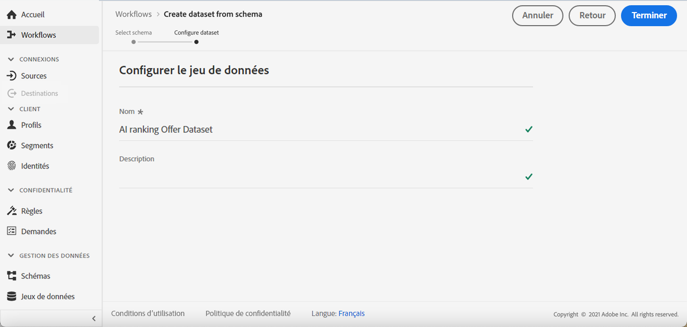

Le jeu de données est maintenant prêt à être sélectionné pour collecter les données dʼévénement lors de la [création dʼune stratégie de classement](#create-ranking-strategy).

## Exigences relatives au schéma de lʼoffre {#schema-requirements}

À ce stade, vous devez avoir :

* créé la stratégie de classement,
* défini le type dʼévénement à capturer : offre affichée (impression) et/ou offre ayant fait l’objet d’un clic (conversion)
* ainsi que le jeu de données dans lequel vous souhaitez collecter les données d’événement.

Désormais, chaque fois quʼune offre est affichée et/ou qu’un utilisateur clique dessus, vous souhaitez que lʼévénement correspondant soit automatiquement capturé par le groupe de champs **[!UICONTROL Événement dʼexpérience - Interactions de proposition]** à lʼaide du [SDK web Adobe Experience Platform](https://experienceleague.adobe.com/docs/experience-platform/edge/web-sdk-faq.html?lang=fr#what-is-adobe-experience-platform-web-sdk%3F){target=&quot;_blank&quot;} ou du SDK mobile.

Pour envoyer des types d’événement (offre affichée ou offre ayant fait l’objet d’un clic), vous devez définir la valeur correcte pour chaque type d’événement dans un événement d’expérience qui est envoyé dans Adobe Experience Platform. Vous trouverez ci-dessous les exigences du schéma que vous devez implémenter dans votre code JavaScript :

### Scénario d&#39;offre affichée

**Type d’événement :** `decisioning.propositionDisplay`
**Source :** Web.sdk/Alloy.js (`sendEvent command -> xdm : {eventType, interactionMixin}`) ou par ingestion par lots
+++**Exemple de payload :**

```
{
    "@id": "a7864a96-1eac-4934-ab44-54ad037b4f2b",
    "xdm:timestamp": "2020-09-26T15:52:25+00:00",
    "xdm:eventType": "decisioning.propositionDisplay",
    "https://ns.adobe.com/experience/decisioning/propositions":
    [
        {
            "xdm:items":
            [
                {
                    "xdm:id": "personalized-offer:f67bab756ed6ee4",
                },
                {
                    "xdm:id": "personalized-offer:f67bab756ed6ee5",
                }
            ],
            "xdm:id": "3cc33a7e-13ca-4b19-b25d-c816eff9a70a", //decision event id - taken from experience event for “nextBestOffer”
            "xdm:scope": "scope:12cfc3fa94281acb", //decision scope id - taken from experience event for “nextBestOffer”
        }
    ]
}
```

+++

### Scénario sur l’offre cliquée

**Type d’événement :** `decisioning.propositionInteract`
**Source :** Web.sdk/Alloy.js (`sendEvent command -> xdm : {eventType, interactionMixin}`) ou par ingestion par lots
+++**Exemple de payload :**

```
{
    "@id": "a7864a96-1eac-4934-ab44-54ad037b4f2b",
    "xdm:timestamp": "2020-09-26T15:52:25+00:00",
    "xdm:eventType": "decisioning.propositionInteract",
    "https://ns.adobe.com/experience/decisioning/propositions":
    [
        {
            "xdm:items":
            [
                {
                    "xdm:id": "personalized-offer:f67bab756ed6ee4"
                },
                {
                    "xdm:id": "personalized-offer:f67bab756ed6ee5"
                },
            ],
            "xdm:id": "3cc33a7e-13ca-4b19-b25d-c816eff9a70a", //decision event id
            "xdm:scope": "scope:12cfc3fa94281acb", //decision scope id
        }
    ]
}
```

+++

<!--
## Using a ranking strategy {#using-ranking}

To use the ranking strategy you created above, follow the steps below:

Once a ranking strategy has been created, you can assign it to a placement in a decision. For more on this, see [Configure offers selection in decisions](../offer-activities/configure-offer-selection.md).

1. Create a decision.
1. Add a placement.
1. Add a collection.
1. Choose to rank offers by AI ranking (select it from the drop-down list).
1. Click Add ranking.
1. Select the ranking strategy that you created. All the details of the ranking strategy are displayed.
1. Click Next to confirm.
1. Save your decision.

It is now ready to be used in a decision to rank eligible offers for a placement (see [Configure offers selection in decisions](../offer-activities/configure-offer-selection.md)).
-->

