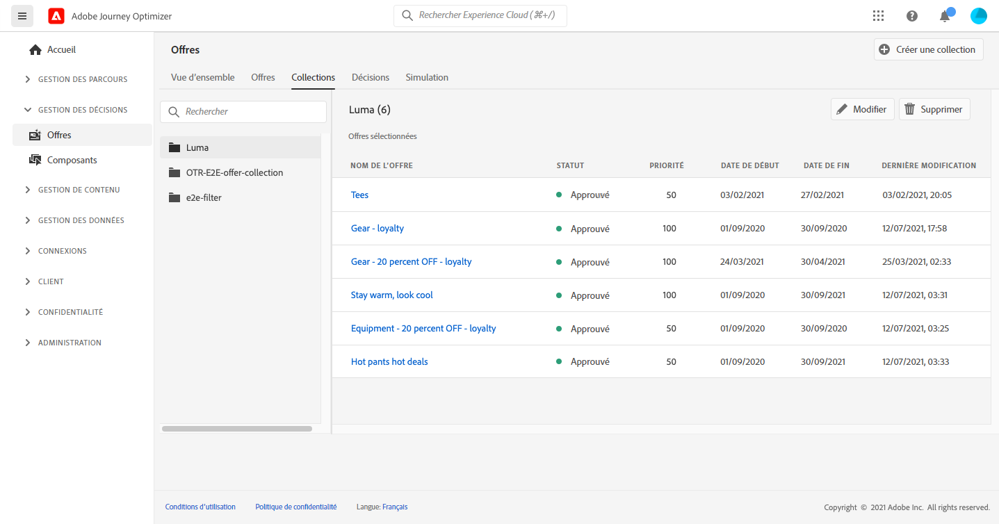
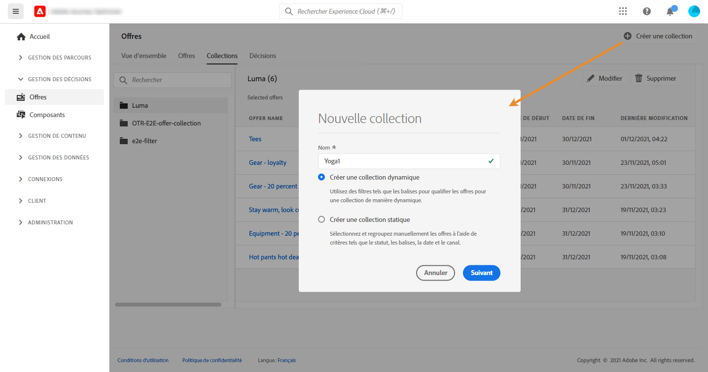
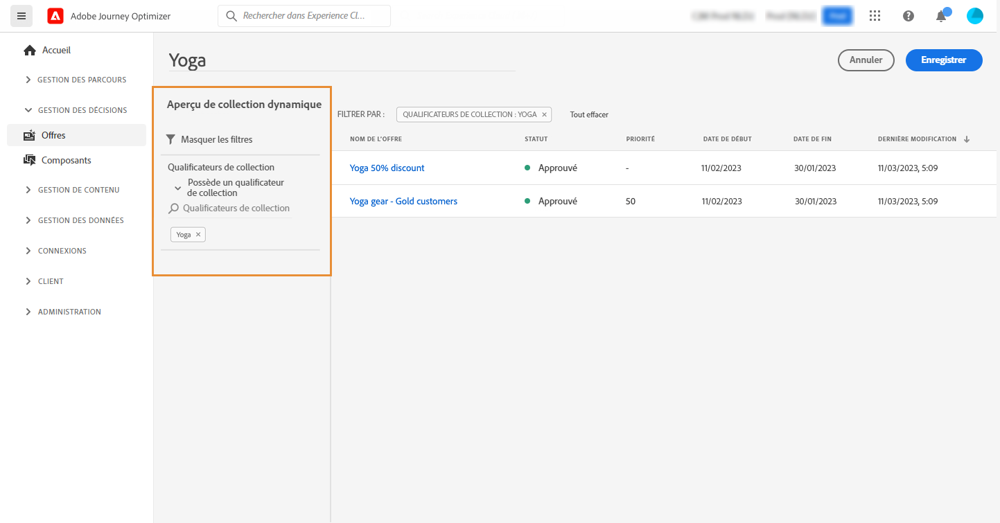
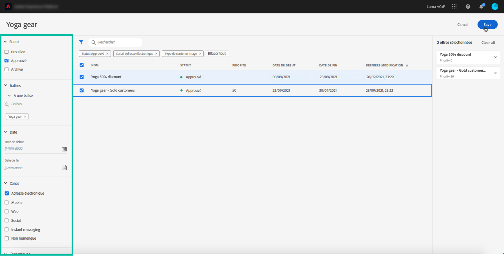
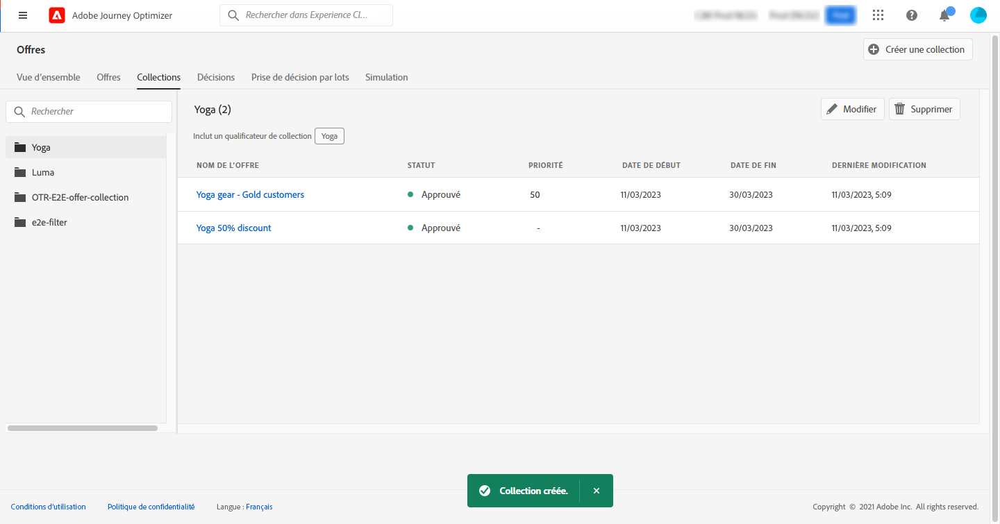

# Créer des collections {#create-collections}

>[!TIP]
>
>La prise de décision, la nouvelle fonctionnalité de prise de décision d’[!DNL Adobe Journey Optimizer], est désormais disponible via les canaux d’expérience basée sur du code et d’e-mail. [En savoir plus](../../experience-decisioning/gs-experience-decisioning.md)

>[!CONTEXTUALHELP]
>id="ajo_decisioning_decision_collection"
>title="À propos des collections d&#39;offres"
>abstract="Avec les collections d&#39;offres, vous pouvez organiser vos offres en les regroupant en catégories de votre choix."

>[!CONTEXTUALHELP]
>id="ajo_decisioning_collection_dynamic"
>title="Collection dynamique"
>abstract="Utilisez des qualificateurs de collection pour qualifier les offres d’une collection de manière dynamique."

>[!CONTEXTUALHELP]
>id="ajo_decisioning_collection_static"
>title="Collection statique"
>abstract="Sélectionnez et regroupez manuellement les offres à l’aide de critères tels que le statut, les qualificateurs de collection, la date et le canal."

>[!CONTEXTUALHELP]
>id="ajo_decisioning_collection_static_select"
>title="Prévisualisation de collection statique"
>abstract="Une collection statique est créée en sélectionnant manuellement des offres individuelles à inclure dans la collection. La collection ne peut être mise à jour qu’en y ajoutant manuellement d’autres offres."

>[!CONTEXTUALHELP]
>id="ajo_decisioning_collection_dynamic_select"
>title="Prévisualisation de collection dynamique"
>abstract="Les collections dynamiques collectent les offres en fonction de qualificateurs de collection. Ces collections sont mises à jour automatiquement. Par exemple, si une nouvelle offre est créée avec le qualificateur de collection « Sports », elle est automatiquement ajoutée à la collection correspondante."

Les collections permettent d&#39;organiser vos offres en les regroupant en catégories de votre choix. Vous pouvez, par exemple, créer une collection « sport » qui contiendra uniquement des offres liées au sport.

➡️ [Découvrez cette fonctionnalité en vidéo](#video)

La liste des collections d&#39;offres est accessible dans le menu **[!UICONTROL Offres]**.

Vous pouvez créer deux types de collections :

* Les **collections dynamiques** sont des collections d’offres basées sur des qualificateurs de collection (précédemment appelés « balises »). Ces collections sont mises à jour automatiquement. Par exemple, si une nouvelle offre est créée avec le qualificateur de collection sélectionné, elle est automatiquement ajoutée à la collection.

* Les **collections statiques** sont des collections créées en sélectionnant manuellement des offres individuelles à inclure dans la collection. La collection ne peut être mise à jour qu’en y ajoutant manuellement d’autres offres.

Pour créer une collection, procédez comme suit :

1. Accédez à l&#39;onglet **[!UICONTROL Collections]**, puis cliquez sur **[!UICONTROL Créer une collection]**.

1. Indiquez le nom et le type de la collection à créer.

   

1. Pour créer une collection dynamique, utilisez le volet de gauche pour sélectionner le qualificateur de collection des offres à ajouter à la collection, puis cliquez sur **[!UICONTROL Enregistrer]**. Toutes les offres avec le qualificateur de collection sélectionné seront enregistrées dans la collection.

   Pour plus d’informations sur la création de qualificateurs de collection, consultez la section [Créer des qualificateurs de collection](../offer-library/creating-tags.md).

   

1. Pour créer une collection statique, utilisez le volet de gauche pour filtrer la liste des offres (statut, qualificateur de collection, date, canal, type de contenu), puis sélectionnez les offres à ajouter à la collection.

   

   >[!NOTE]
   >
   >Les collections statiques ne sont pas mises à jour automatiquement. Pour ajouter des offres à une collection statique, vous devez les modifier et les ajouter manuellement.

1. Pour attribuer des libellés d’utilisation de données personnalisés ou de base à une collection statique, sélectionnez **[!UICONTROL Gérer l’accès]**. [En savoir plus sur le contrôle d’accès au niveau de l’objet (OLAC)](../../administration/object-based-access.md)

   >[!NOTE]
   >
   >OLAC n’est pas disponible pour les collections dynamiques. La gestion d’OLAC s’effectue au niveau de l’offre. Par conséquent, il est possible que vous ne voyiez aucune offre dans une collection dynamique si vous n’avez accès à aucune de ces offres.

1. Une fois la collection créée, elle s&#39;affiche dans la liste. Vous pouvez la sélectionner pour la modifier ou la supprimer.

   

## Vidéo pratique {#video}

>[!VIDEO](https://video.tv.adobe.com/v/329376?quality=12)

