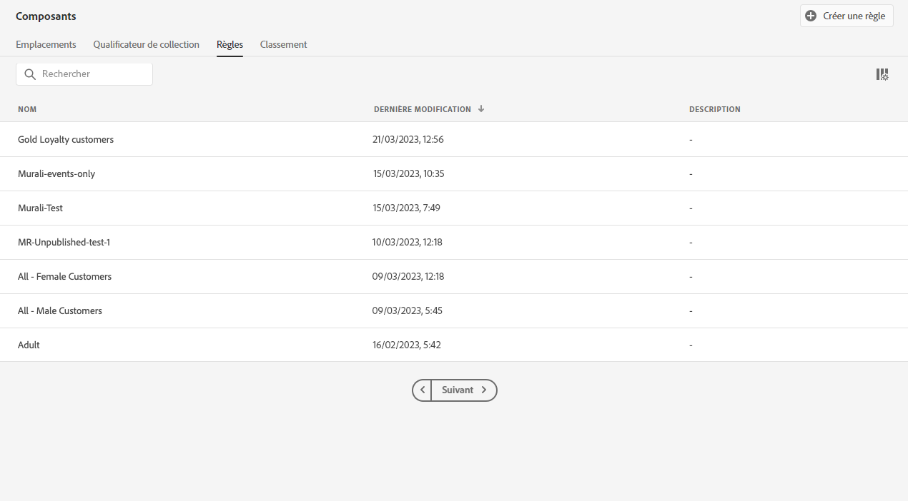
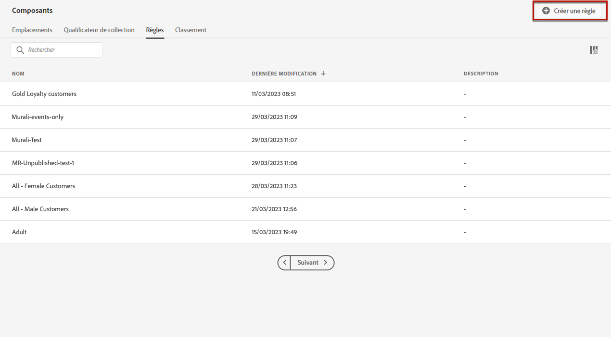
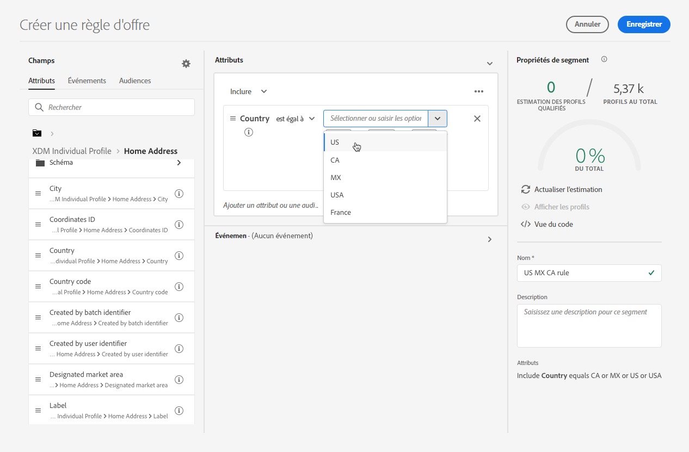
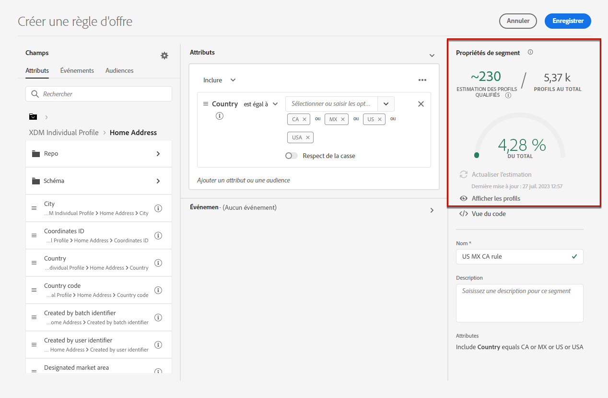
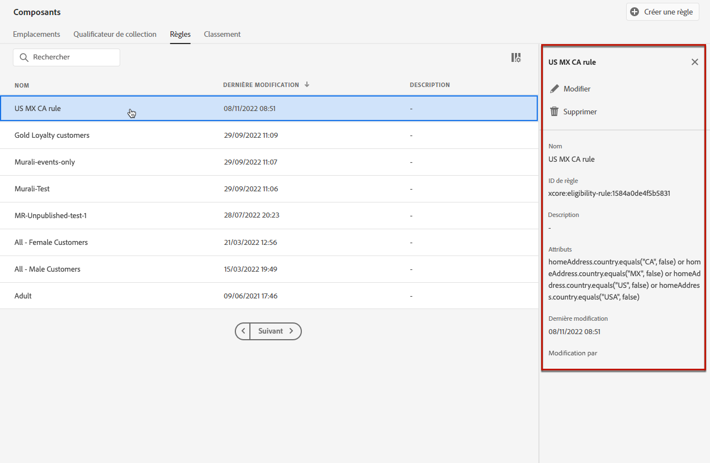

# Création de règles de décision {#create-decision-rules}

Vous pouvez créer des règles de décision d&#39;offre basées sur les données disponibles dans Adobe Experience Platform. Les règles de décision déterminent pour qui une offre peut être affichée.

Par exemple, vous pouvez indiquer que vous souhaitez qu&#39;une « offre vêtements d&#39;hiver pour femmes » s&#39;affiche lorsque (genre = « femme ») et (région = « nord-est »).

➡️ [Découvrez cette fonctionnalité en vidéo](#video)

La liste des règles de décision créées est accessible dans le menu **[!UICONTROL Composants]**.

Pour créer cette règle de décision, procédez comme suit :

1. Accédez à l&#39;onglet **[!UICONTROL Règles]**, puis cliquez sur **[!UICONTROL Créer une règle]**.

   

1. Nommez votre règle et fournissez une description, puis configurez-la en fonction de vos besoins.

   Pour ce faire, le **Créateur de segments** est disponible pour vous aider à créer les conditions de la règle. [En savoir plus](../../segment/about-segments.md)

   <!--In this example, the rule will target customers that have the "Gold" loyalty level.-->

   

   >[!NOTE]
   >
   >Le Créateur de segments fourni pour créer des règles de décision présente certaines spécificités par rapport à celui utilisé avec le service **[!UICONTROL Destinations d&#39;audience]**. Par exemple, l&#39;onglet **[!UICONTROL Segments]** n&#39;est pas disponible. Toutefois, le processus global décrit dans la section [Créateur de segments](../../segment/about-segments.md) La documentation est toujours valide pour créer des règles de décision d’offres. Pour en savoir plus, consultez la [documentation du service de segmentation d’Adobe Experience Platform](https://experienceleague.adobe.com/docs/experience-platform/segmentation/ui/segment-builder.html?lang=fr).

1. À mesure que vous ajoutez et configurez de nouveaux champs dans l’espace de travail, la variable **[!UICONTROL Propriétés du segment]** affiche des informations sur les profils estimés appartenant au segment. Cliquez sur **[!UICONTROL Actualiser l’estimation]** pour mettre à jour les données.

   

1. Cliquez sur **[!UICONTROL Enregistrer]** pour confirmer.

1. Une fois créée, la règle s’affiche dans la variable **[!UICONTROL Règles]** liste. Vous pouvez la sélectionner pour afficher ses propriétés, puis la modifier ou la supprimer.

   

>[!CAUTION]
>
>Les offres basées sur un événement ne sont actuellement pas prises en charge dans [!DNL Journey Optimizer]. Si vous créez une règle de décision basée sur un [événement](https://experienceleague.adobe.com/docs/experience-platform/segmentation/ui/segment-builder.html?lang=fr#events){target=&quot;_blank&quot;}, vous ne pourrez pas l&#39;exploiter dans une offre.

## Tutoriel vidéo {#video}

>[!VIDEO](https://video.tv.adobe.com/v/329373?quality=12)
