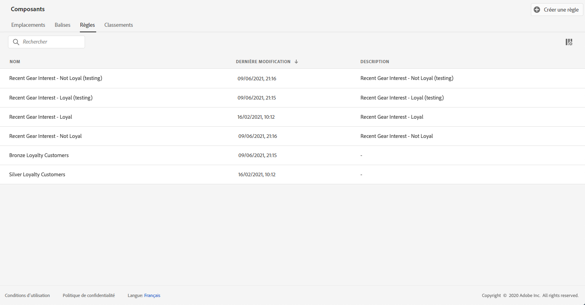
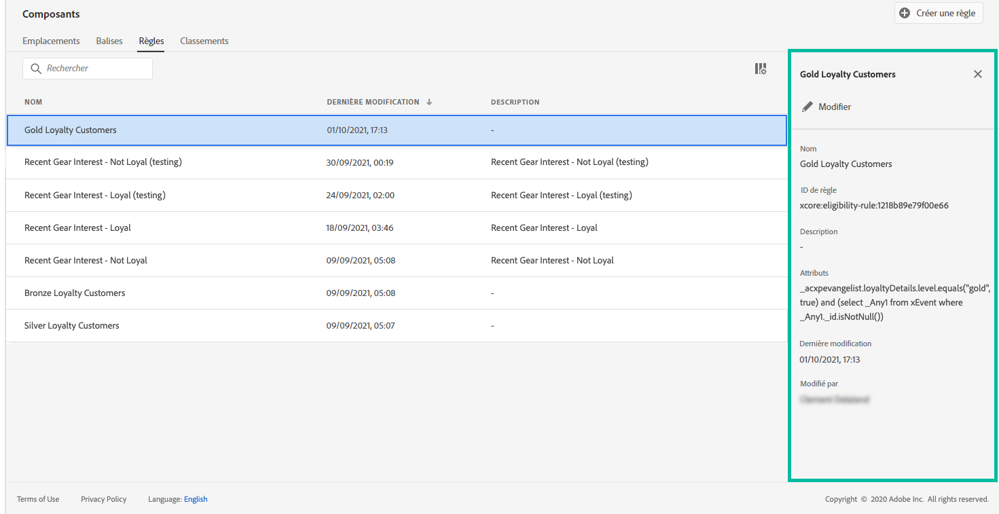

# Création de règles de décision {#creating-decision-rules}

Vous pouvez créer des règles de décision d&#39;offre basées sur les données disponibles dans Adobe Experience Platform. Les règles de décision déterminent pour qui une offre peut être affichée.

Par exemple, vous pouvez indiquer que vous souhaitez qu&#39;une « offre vêtements d&#39;hiver pour femmes » s&#39;affiche lorsque (genre = « femme ») et (région = « nord-est »).

 [Découvrez cette fonctionnalité en vidéo](#video)

La liste des règles de décision créées est accessible dans le menu **[!UICONTROL Composants]**.

Pour créer cette règle de décision, procédez comme suit :

1. Accédez à l&#39;onglet **[!UICONTROL Règles]**, puis cliquez sur **[!UICONTROL Créer une règle]**.

   

1. Nommez votre règle et fournissez une description, puis configurez-la en fonction de vos besoins.

   Pour ce faire, le **Créateur de segments** d&#39;Adobe Experience Platform est disponible pour vous aider à créer les conditions de la règle. Pour plus d&#39;informations sur son utilisation, reportez-vous à la [documentation dédiée](https://experienceleague.adobe.com/docs/experience-platform/segmentation/ui/segment-builder.html?lang=fr).

   Dans cet exemple, la règle cible les clients qui ont le niveau de fidélité « Or ».

   

   >[!NOTE]
   >
   >Le Créateur de segments fourni pour créer des règles de décision présente certaines spécificités par rapport à celui utilisé avec le service **[!UICONTROL Destinations d&#39;audience]**. Par exemple, l&#39;onglet **[!UICONTROL Segments]** n&#39;est pas disponible. Cependant, le processus global décrit dans la documentation du Créateur de segments est toujours valide pour créer des règles de prise de décision pour les offres.

1. Cliquez sur **[!UICONTROL Enregistrer]** pour valider.

1. Une fois la règle créée, elle s&#39;affiche dans la liste des règles. Vous pouvez la sélectionner pour afficher ses propriétés et la modifier ou la supprimer.

   

## Tutoriel vidéo {#video}

>[!NOTE]
>
>Cette vidéo s&#39;applique au service applicatif d&#39;Offer Decisioning basé sur Adobe Experience Platform. Elle fournit toutefois des orientations générales pour l&#39;utilisation d&#39;Offer dans le contexte de Journey Optimizer.

>[!VIDEO](https://video.tv.adobe.com/v/329373?quality=12)
