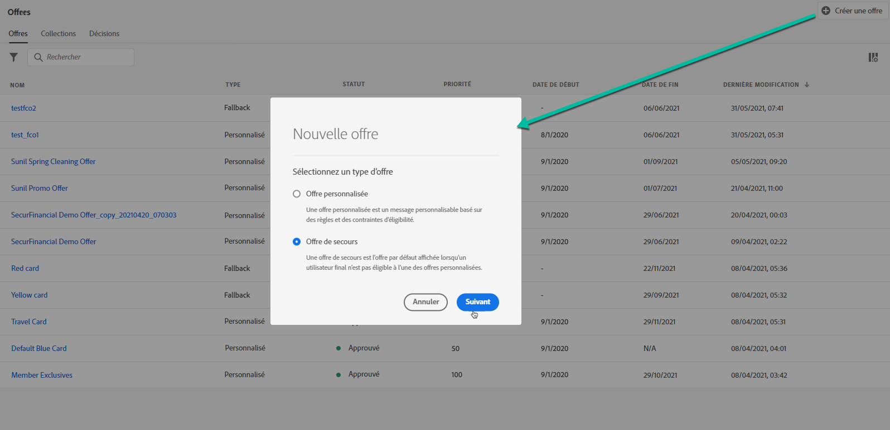
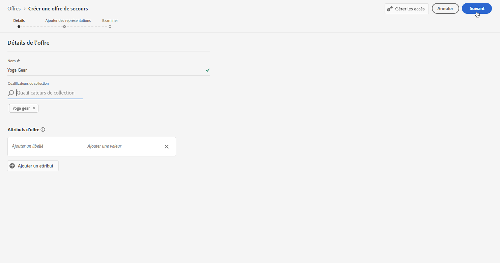
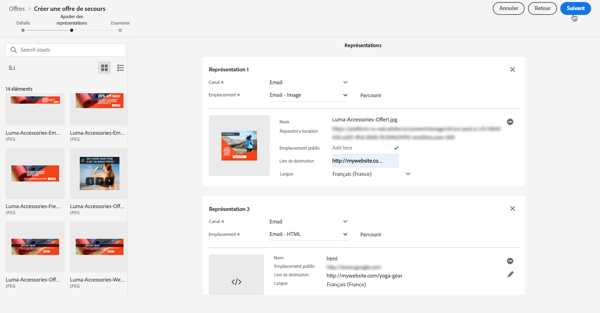
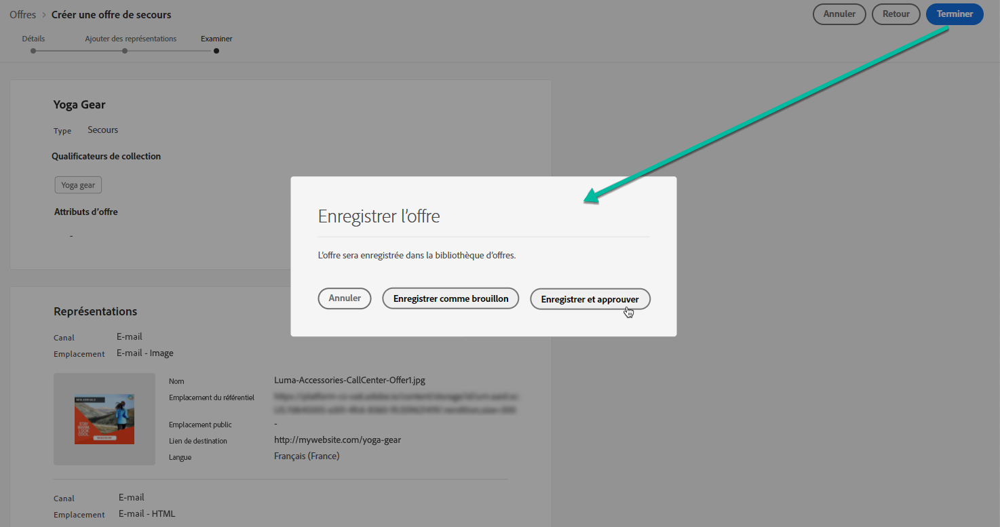
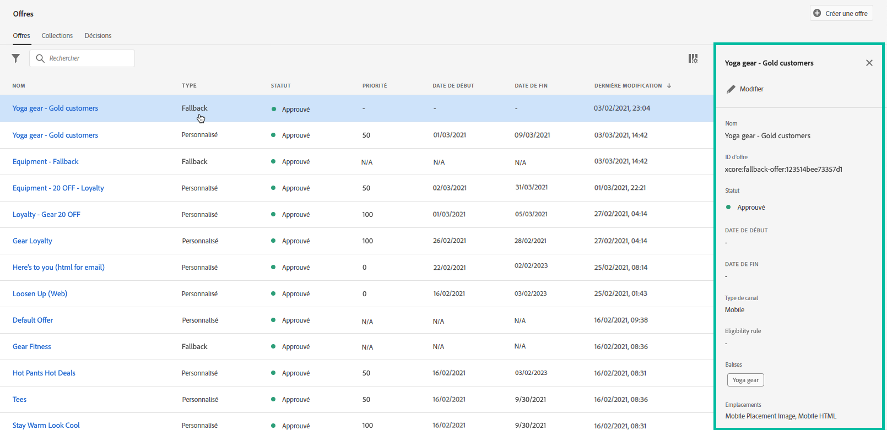

# Création d&#39;offres de secours {#create-fallback-offers}

L&#39;offre de secours est envoyée aux clients s&#39;ils ne sont pas éligibles pour d&#39;autres offres. Les étapes de création d&#39;une offre de secours consistent à créer une ou plusieurs représentations, comme lors de la création d&#39;une offre.

➡️ [Découvrez cette fonctionnalité en vidéo](#video)

La liste des offres de secours est accessible dans le menu **[!UICONTROL Offres]**.

Pour créer une offre de secours, procédez comme suit :

>[!NOTE]
>
>Notez que, contrairement aux offres personnalisées, les offres de secours n&#39;ont pas de règles d&#39;éligibilité ni de paramètres de contrainte, car elles sont présentées aux clients en dernier recours, sans condition.

1. Cliquez sur **[!UICONTROL Créer une offre]**, puis sélectionnez **[!UICONTROL Offre de secours]**.

   

1. Indiquez le nom de l&#39;offre de secours. Vous pouvez également y associer une ou plusieurs balise(s) existante(s), ce qui vous permet de rechercher et d&#39;organiser plus facilement la bibliothèque des offres.

   

1. Créez une ou plusieurs représentations pour l&#39;offre de secours. Pour ce faire, effectuez un glisser-déposer des emplacements depuis le volet de gauche, comme lors de la création d&#39;une offre personnalisée. Voir [Créer des offres personnalisées](../offer-library/creating-personalized-offers.md).

   

1. Une fois les représentations d&#39;offres de secours ajoutées, un résumé s&#39;affiche. Si tout est configuré correctement et que votre offre de secours est prête à être présentée aux clients, cliquez sur **[!UICONTROL Terminer]**, puis sélectionnez **[!UICONTROL Enregistrer et valider]**.

   Vous pouvez également enregistrer l&#39;offre de secours en tant que brouillon pour la modifier et l&#39;approuver ultérieurement.

   

1. L&#39;offre de secours s&#39;affiche dans la liste avec le statut **[!UICONTROL En ligne]** ou **[!UICONTROL Brouillon]**, selon que vous l&#39;avez approuvée ou non à l&#39;étape précédente.

   Elle est maintenant prête à être diffusée vers les clients. Vous pouvez la sélectionner pour afficher ses propriétés et la modifier. <!-- no suppression? -->

   

## Tutoriel vidéo {#video}

>[!NOTE]
>
>Cette vidéo s’applique au service applicatif Offer Decisioning intégré à Adobe Experience Platform. Toutefois, elle fournit des orientations générales pour l&#39;utilisation de l&#39;Offre dans le contexte de Journey Optimizer.

>[!VIDEO](https://video.tv.adobe.com/v/329383?quality=12)
