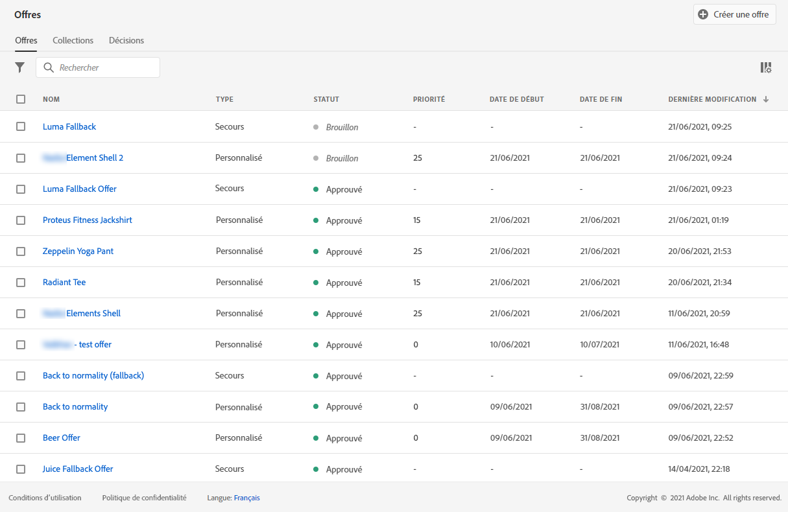

# Créer des offres de secours {#create-fallback-offers}

>[!CONTEXTUALHELP]
>id="ajo_decisioning_new_fallback"
>title="Offre de secours"
>abstract="Une offre de secours est l’offre par défaut affichée lorsqu’un utilisateur final n’est pas éligible à l’une des offres personnalisées."

>[!CONTEXTUALHELP]
>id="ajo_decisioning_fallback_offer_details "
>title="Détails de l&#39;offre de secours"
>abstract="Indiquez le nom de l&#39;offre de secours. Vous pouvez également y associer un ou plusieurs qualificateurs de collection existants, ce qui vous permet de rechercher et d’organiser plus facilement la bibliothèque des offres."

L&#39;offre de secours est envoyée aux clients s&#39;ils ne sont pas éligibles pour d&#39;autres offres. Les étapes de création d&#39;une offre de secours consistent à créer une ou plusieurs représentations, comme lors de la création d&#39;une offre.

➡️ [Découvrez cette fonctionnalité en vidéo](#video)

La liste des offres de secours est accessible dans le menu **[!UICONTROL Offres]**.

Pour créer une offre de secours, procédez comme suit :

>[!NOTE]
>
>Notez que, contrairement aux offres personnalisées, les offres de secours n&#39;ont pas de règles d&#39;éligibilité ni de paramètres de contrainte, car elles sont présentées aux clients en dernier recours, sans condition.

1. Cliquez sur **[!UICONTROL Créer une offre]**, puis sélectionnez **[!UICONTROL Offre de secours]**.

   

1. Indiquez le nom de l&#39;offre de secours. Vous pouvez également y associer un ou plusieurs qualificateurs de collection (auparavant appelés « balises ») existants pour une recherche et un classement plus faciles des offres dans la bibliothèque des offres.

   

1. Pour attribuer des libellés d’utilisation des données personnalisés ou de base à l’offre, sélectionnez **[!UICONTROL Gérer l’accès]**. [En savoir plus sur le contrôle d’accès au niveau de l’objet (OLAC)](../../administration/object-based-access.md)

1. Créez une ou plusieurs représentations pour l&#39;offre de secours. Pour ce faire, effectuez un glisser-déposer des emplacements depuis le volet de gauche, comme lors de la création d&#39;une offre personnalisée. Voir [Créer des offres personnalisées](../offer-library/creating-personalized-offers.md).

   

   >[!CAUTION]
   >
   >Les offres de secours doivent contenir toutes les représentations utilisées dans une [décision](../offer-activities/create-offer-activities.md). Par exemple, si une décision comporte 5 offres et que chacune d’elles a une représentation différente, 5 représentations doivent être incluses dans l’offre de secours.

1. Une fois les représentations d&#39;offres de secours ajoutées, un résumé s&#39;affiche. Si tout est configuré correctement et que votre offre de secours est prête à être présentée aux clients, cliquez sur **[!UICONTROL Terminer]**, puis sélectionnez **[!UICONTROL Enregistrer et valider]**.

   Vous pouvez également enregistrer l&#39;offre de secours en tant que brouillon pour la modifier et l&#39;approuver ultérieurement.

   

1. L&#39;offre de secours s&#39;affiche dans la liste avec le statut **[!UICONTROL En ligne]** ou **[!UICONTROL Brouillon]**, selon que vous l&#39;avez approuvée ou non à l&#39;étape précédente.

   Elle est maintenant prête à être diffusée vers les clients. Vous pouvez la sélectionner pour afficher ses propriétés et la modifier. <!-- no suppression? -->

   

## Vidéo pratique {#video}

>[!VIDEO](https://video.tv.adobe.com/v/341348?captions=fre_fr&quality=12)

